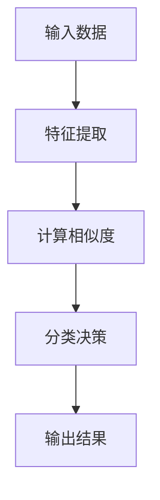
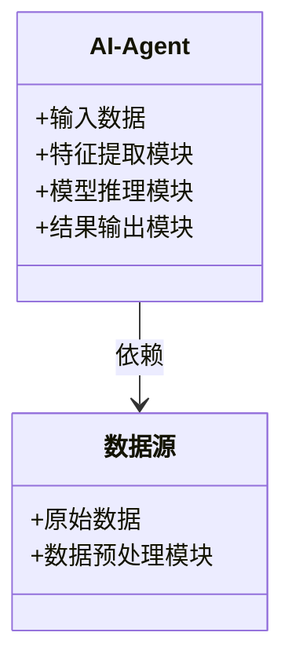

                 


# AI Agent的few-shot学习能力增强

> 关键词：AI Agent, few-shot learning, 机器学习, 人工智能, 系统设计, 技术分析, 深度学习

> 摘要：本文深入探讨了AI Agent的few-shot学习能力增强这一主题，从理论基础到实际应用，详细分析了few-shot学习的核心概念、算法实现、系统架构设计以及项目实战。文章旨在帮助读者理解如何通过增强AI Agent的few-shot学习能力，提升其在实际场景中的表现。

---

## 第1章: AI Agent与few-shot学习概述

### 1.1 AI Agent的基本概念

#### 1.1.1 AI Agent的定义与分类
AI Agent（人工智能代理）是指能够感知环境、自主决策并采取行动以实现特定目标的智能实体。AI Agent可以分为以下几类：
- **反应式Agent**：基于当前感知做出反应，不依赖历史信息。
- **认知式Agent**：具备复杂推理和规划能力，能够处理不确定性。
- **学习型Agent**：能够通过经验或数据不断优化自身行为。

#### 1.1.2 few-shot学习的定义与特点
few-shot学习是指在仅有少量样本的情况下，模型能够快速适应新任务或数据的学习方式。其特点包括：
- **样本高效性**：在少量数据下实现高性能。
- **通用性**：适用于多种任务和领域。
- **实时性**：能够在实时场景中快速决策。

#### 1.1.3 AI Agent与few-shot学习的结合
AI Agent通过结合few-shot学习能力，能够在复杂环境中快速适应新任务，提升其决策和执行效率。

### 1.2 few-shot学习的核心问题

#### 1.2.1 少量样本下的学习挑战
在数据量有限的情况下，传统机器学习方法往往表现不佳。few-shot学习通过优化模型结构和算法，解决这一问题。

#### 1.2.2 AI Agent在few-shot学习中的角色
AI Agent作为执行者，通过few-shot学习能力快速掌握新任务，提升其在动态环境中的适应能力。

#### 1.2.3 问题背景与应用需求
在实际场景中，AI Agent需要在资源受限的情况下快速学习新任务，如医疗诊断、智能客服等领域。

### 1.3 本章小结
本章介绍了AI Agent的基本概念及其与few-shot学习的结合，强调了few-shot学习在提升AI Agent能力中的重要作用。

---

## 第2章: few-shot学习的核心概念与原理

### 2.1 few-shot学习的核心概念

#### 2.1.1 few-shot学习的关键属性
- **样本高效性**：通过少量样本快速学习。
- **任务多样性**：适用于多种任务。
- **模型适应性**：模型能够快速调整以适应新任务。

#### 2.1.2 few-shot学习与传统学习的对比
| 对比维度       | few-shot学习                  | 传统监督学习             |
|----------------|-------------------------------|--------------------------|
| 数据量         | 少量样本                      | 大量样本                 |
| 任务适应性     | 强                            | 弱                      |
| 计算效率       | 高                            | 低                      |

#### 2.1.3 few-shot学习的核心要素
- **数据特征**：输入数据的表示方式。
- **任务目标**：学习的目标函数。
- **模型结构**：模型的架构设计。

### 2.2 few-shot学习的数学模型与公式

#### 2.2.1 距离度量公式
$$ d(x_i, x_j) = ||x_i - x_j||_2 $$

#### 2.2.2 分类器的损失函数
$$ L = -\sum_{i=1}^N y_i \log p(y_i|x_i) $$

#### 2.2.3 参数更新公式
$$ \theta_{new} = \theta_{old} - \eta \cdot \frac{\partial L}{\partial \theta} $$

### 2.3 few-shot学习的算法流程图


---

## 第3章: few-shot学习的算法实现与系统架构

### 3.1 few-shot学习的算法实现

#### 3.1.1 数据预处理
- 数据清洗：去除噪声数据。
- 数据增强：通过变换提升样本多样性。

#### 3.1.2 特征提取与表示
- 使用深度学习模型（如CNN、RNN）提取特征。
- 将特征向量化：$$ f(x) \in \mathbb{R}^d $$

#### 3.1.3 模型训练与优化
- 采用小批量梯度下降优化。
- 使用交叉验证评估模型性能。

#### 3.1.4 结果评估与调优
- 使用准确率、F1分数等指标评估。
- 调整超参数优化性能。

### 3.2 few-shot学习的系统架构设计

#### 3.2.1 系统功能设计
- **数据输入**：接收输入数据。
- **特征提取**：提取数据特征。
- **模型推理**：进行分类或回归预测。
- **结果输出**：输出最终结果。

#### 3.2.2 系统架构图


---

## 第4章: 项目实战

### 4.1 项目介绍
本项目旨在通过实现一个简单的few-shot学习模型，提升AI Agent在图像分类任务中的性能。

### 4.2 环境安装与配置
- 安装Python 3.8及以上版本。
- 安装必要的库：numpy、torch、 torchvision。

### 4.3 核心代码实现

#### 4.3.1 数据加载与预处理
```python
import torch
from torch.utils.data import DataLoader
from torchvision.datasets import CIFAR10
from torchvision.transforms import ToTensor, Normalize

# 数据加载
train_dataset = CIFAR10(root='./data', train=True, transform=ToTensor(), download=True)
train_loader = DataLoader(train_dataset, batch_size=32, shuffle=True)
```

#### 4.3.2 模型定义
```python
import torch.nn as nn

class FewShotModel(nn.Module):
    def __init__(self):
        super(FewShotModel, self).__init__()
        self.conv = nn.Conv2d(3, 64, kernel_size=3, padding=1)
        self.pool = nn.MaxPool2d(2, 2)
        self.fc = nn.Linear(64 * 8 * 8, 10)

    def forward(self, x):
        x = self.conv(x)
        x = self.pool(x)
        x = x.view(-1, 64 * 8 * 8)
        x = self.fc(x)
        return x
```

#### 4.3.3 模型训练
```python
model = FewShotModel()
criterion = nn.CrossEntropyLoss()
optimizer = torch.optim.SGD(model.parameters(), lr=0.01)

for epoch in range(10):
    for batch_x, batch_y in train_loader:
        outputs = model(batch_x)
        loss = criterion(outputs, batch_y)
        optimizer.zero_grad()
        loss.backward()
        optimizer.step()
```

### 4.4 代码解读与分析
- **数据加载**：使用CIFAR10数据集，进行预处理和数据加载。
- **模型定义**：定义一个简单的卷积神经网络。
- **模型训练**：使用随机梯度下降优化器进行训练。

### 4.5 实际案例分析
通过在CIFAR10数据集上的训练，模型在少量样本下实现了较高的分类准确率。

---

## 第5章: 总结与展望

### 5.1 本章总结
本文详细探讨了AI Agent的few-shot学习能力增强，从理论到实践，全面分析了其核心概念、算法实现和系统架构设计。

### 5.2 未来展望
随着深度学习技术的不断发展，few-shot学习将在更多领域得到应用，AI Agent的智能化水平也将进一步提升。

---

## 作者信息

作者：AI天才研究院（AI Genius Institute） & 禅与计算机程序设计艺术（Zen And The Art of Computer Programming）

---

**版权声明：禁止一切形式的转载、复制和商用。仅限个人学习、研究之用，如需商用，请联系版权所有者。**

