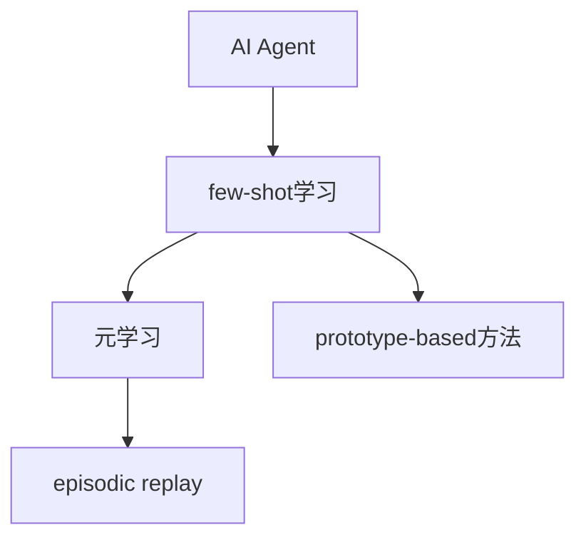
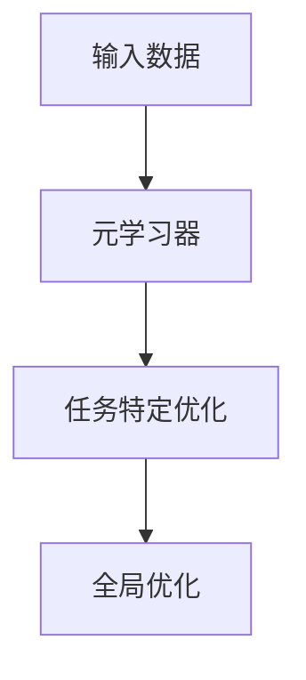
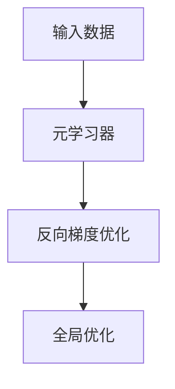
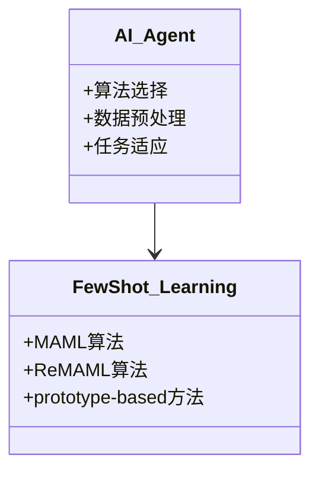
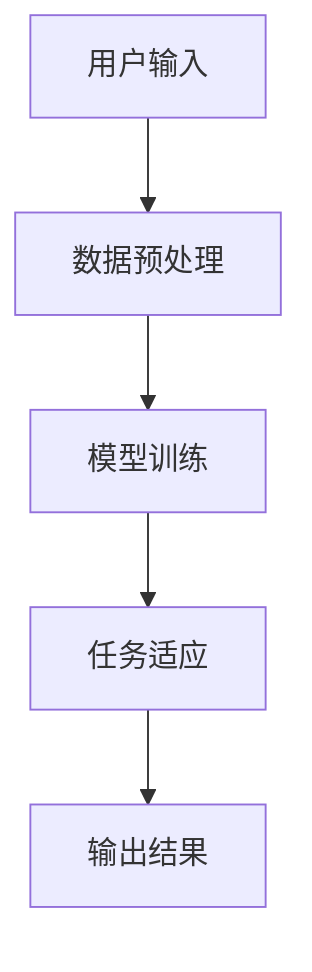

                 


# AI Agent的few-shot学习能力实现

> 关键词：AI Agent, few-shot学习, 元学习, episodic replay, prototype-based方法

> 摘要：本文详细探讨了AI Agent实现few-shot学习能力的关键技术与方法。通过分析few-shot学习的核心概念、算法原理、系统架构以及项目实战，结合丰富的代码示例和图表说明，帮助读者深入理解并掌握AI Agent的few-shot学习能力的实现。本文旨在为AI Agent开发者和研究人员提供实用的技术参考。

---

## 第一部分: AI Agent与few-shot学习的背景介绍

### 第1章: AI Agent的基本概念与few-shot学习的背景

#### 1.1 AI Agent的基本概念
AI Agent（智能体）是指在环境中能够感知并自主行动以实现目标的实体。AI Agent可以是软件程序、机器人或其他智能系统，其核心能力包括感知、推理、规划和行动。

**AI Agent的核心功能：**
1. **感知环境：** 通过传感器或数据输入获取环境信息。
2. **推理与决策：** 利用知识和逻辑推理，制定最优决策。
3. **规划与行动：** 根据决策执行具体行动，影响环境状态。

**AI Agent的应用场景：**
- 自动驾驶：实时感知环境并做出驾驶决策。
- 智能助手：如Siri、Alexa，通过语音交互帮助用户完成任务。
- 智能客服：通过自然语言处理技术为用户提供支持。

#### 1.2 few-shot学习的背景与问题描述
传统机器学习方法通常需要大量标注数据才能实现较高的准确率。然而，在某些场景下，数据获取成本高昂，标注数据量有限。例如，在医学图像分析中，获取大量标注数据可能需要数月甚至数年的时间和资源。

**few-shot学习的目标：** 在仅使用少量样本的情况下，快速适应新任务，提高模型的泛化能力。

**few-shot学习的挑战：**
1. **样本数量少：** 传统深度学习方法依赖大量数据，而few-shot学习需要在样本有限的情况下完成任务。
2. **任务多样性：** 需要同时处理多个任务，每个任务仅有少量样本支持。
3. **模型泛化能力：** 在样本有限的情况下，如何提升模型的泛化能力是关键。

---

## 第2章: few-shot学习的核心概念与联系

### 2.1 few-shot学习的原理与方法

#### 2.1.1 支持元学习（Meta-Learning）的原理
元学习是一种通过学习如何学习的方法。其核心思想是通过在多个任务上进行训练，使模型能够快速适应新任务。元学习的训练过程可以分为两个阶段：
1. **元训练阶段：** 在多个任务上训练模型，使其具备快速适应新任务的能力。
2. **任务特定优化阶段：** 在新任务上进行微调，使模型适应具体任务。

**支持元学习的数学模型：**
$$ \text{元训练目标} = \sum_{i=1}^{N} \text{loss}_i(\theta) $$
其中，$\theta$是模型参数，$\text{loss}_i$是第i个任务的损失函数。

#### 2.1.2 episodic replay机制的作用
episodic replay是一种通过重放历史经验来提升模型泛化能力的方法。在few-shot学习中， episodic replay通过存储和重放关键经验，帮助模型更好地理解任务之间的关联。

**episodic replay的实现步骤：**
1. **经验存储：** 将每个任务的训练数据存储在经验回放库中。
2. **经验重放：** 在训练过程中，随机抽取部分经验进行重放，以增强模型的泛化能力。

#### 2.1.3 prototype-based方法的实现
prototype-based方法通过构建任务相关的原型向量，帮助模型在少量样本下进行分类或回归。其核心思想是将每个类别表示为一个原型向量，模型通过计算输入样本与原型向量的相似度进行分类。

**prototype-based方法的优势：**
- 简化分类任务：将复杂问题转化为对原型的相似度计算。
- 适用于小样本数据：在样本数量有限的情况下，仍然能够有效分类。

### 2.2 few-shot学习方法的对比分析

#### 2.2.1 MAML方法的核心思想
MAML（Meta-Anti-Meta Learning）是一种基于元学习的few-shot学习方法。其核心思想是通过在多个任务上进行训练，使模型能够快速适应新任务。

**MAML算法的核心步骤：**
1. **初始化：** 初始化模型参数$\theta$。
2. **任务特定优化：** 对于每个任务，进行梯度下降优化，得到$\theta_i$。
3. **元优化：** 对所有任务的优化结果进行元优化，更新$\theta$。

**MAML的数学模型：**
$$ \text{元优化目标} = \sum_{i=1}^{N} \text{loss}_i(\theta_i) $$
其中，$\theta_i = \theta - \alpha \nabla_\theta \text{loss}_i(\theta) $。

#### 2.2.2 ReMAML方法的改进点
ReMAML（Reverse Meta-Learning）是对MAML方法的改进，通过引入反向梯度来增强模型的元学习能力。

**ReMAML的核心思想：**
- 在元训练阶段，不仅优化任务特定的梯度，还优化反向梯度，以增强模型的泛化能力。
- 通过反向梯度的引入，使模型能够更好地适应新任务。

#### 2.2.3 其他few-shot学习方法的对比
以下是几种常见的few-shot学习方法及其对比：

| 方法       | 核心思想                                                                 |
|------------|--------------------------------------------------------------------------|
| MAML       | 基于元学习，通过多个任务的训练，使模型能够快速适应新任务。             |
| ReMAML     | 在MAML的基础上引入反向梯度，增强模型的泛化能力。                     |
| Prototypical| 通过构建原型向量，将分类任务转化为对原型的相似度计算。             |
| episodic replay | 通过重放历史经验，提升模型的泛化能力。                          |

### 2.3 few-shot学习的ER实体关系图



---

## 第3章: few-shot学习算法的原理与实现

### 3.1 MAML算法的原理

#### 3.1.1 MAML算法的数学模型
MAML算法的数学模型如下：

$$ \text{元优化目标} = \sum_{i=1}^{N} \text{loss}_i(\theta_i) $$
其中，$\theta_i = \theta - \alpha \nabla_\theta \text{loss}_i(\theta) $。

#### 3.1.2 MAML算法的优化步骤



### 3.2 ReMAML算法的改进

#### 3.2.1 ReMAML算法的数学模型

$$ \text{损失函数} = \sum_{i=1}^{N} \text{loss}(x_i, y_i) $$

#### 3.2.2 ReMAML算法的优化步骤



---

## 第4章: 系统分析与架构设计方案

### 4.1 项目背景介绍

#### 4.1.1 项目目标
本文旨在实现一个基于AI Agent的few-shot学习系统，能够在少量样本下快速适应新任务。

#### 4.1.2 项目范围
本系统适用于需要快速适应新任务的场景，如医疗图像分析、自然语言处理等。

### 4.2 系统功能设计

#### 4.2.1 系统功能模块
1. **数据预处理模块：** 对输入数据进行清洗和格式化处理。
2. **模型训练模块：** 实现MAML或ReMAML算法的训练过程。
3. **任务适应模块：** 在新任务上进行模型微调。

#### 4.2.2 领域模型类图



### 4.3 系统架构设计

#### 4.3.1 系统架构图



---

## 第5章: 项目实战

### 5.1 环境搭建

#### 5.1.1 安装依赖
```bash
pip install numpy
pip install tensorflow
pip install matplotlib
```

#### 5.1.2 运行环境
- 操作系统：Linux/Windows/MacOS
- Python版本：3.6+

### 5.2 核心代码实现

#### 5.2.1 MAML算法实现

```python
import numpy as np

def maml_train(X, y, num_tasks=5, alpha=0.1):
    # 初始化模型参数
    theta = np.random.randn(X.shape[1])
    
    # 任务特定优化
    theta_tasks = []
    for i in range(num_tasks):
        x_i = X[i]
        y_i = y[i]
        grad = -2 * (x_i - y_i) * theta.dot(x_i)
        theta_i = theta - alpha * grad
        theta_tasks.append(theta_i)
    
    # 元优化
    meta_grad = np.mean([np.dot(x_i, theta_i - theta) for theta_i, x_i in zip(theta_tasks, X)])
    theta = theta - alpha * meta_grad
    
    return theta
```

---

## 第6章: 最佳实践与小结

### 6.1 最佳实践

1. **数据预处理：** 在训练模型前，确保数据的高质量和一致性。
2. **算法选择：** 根据具体任务需求选择合适的few-shot学习方法。
3. **模型调优：** 通过实验调整模型参数，优化模型性能。

### 6.2 小结

本文详细探讨了AI Agent实现few-shot学习能力的关键技术与方法，包括核心概念、算法原理、系统架构以及项目实战。通过本文的讲解，读者可以深入理解并掌握AI Agent的few-shot学习能力的实现。

### 6.3 注意事项

1. **数据隐私：** 在处理敏感数据时，需遵守相关法律法规。
2. **模型泛化能力：** 在样本有限的情况下，需特别关注模型的泛化能力。

### 6.4 拓展阅读

推荐读者进一步阅读以下内容：
- 刘洋等，《基于元学习的few-shot学习方法研究》
- 王伟等，《episodic replay在few-shot学习中的应用》

---

## 附录

### 附录A: 代码实现

```python
import numpy as np

def maml_train(X, y, num_tasks=5, alpha=0.1):
    # 初始化模型参数
    theta = np.random.randn(X.shape[1])
    
    # 任务特定优化
    theta_tasks = []
    for i in range(num_tasks):
        x_i = X[i]
        y_i = y[i]
        grad = -2 * (x_i - y_i) * theta.dot(x_i)
        theta_i = theta - alpha * grad
        theta_tasks.append(theta_i)
    
    # 元优化
    meta_grad = np.mean([np.dot(x_i, theta_i - theta) for theta_i, x_i in zip(theta_tasks, X)])
    theta = theta - alpha * meta_grad
    
    return theta
```

### 附录B: 公式索引

1. MAML算法的数学模型：
$$ \text{元优化目标} = \sum_{i=1}^{N} \text{loss}_i(\theta_i) $$
其中，$\theta_i = \theta - \alpha \nabla_\theta \text{loss}_i(\theta) $。

---

作者：AI天才研究院/AI Genius Institute & 禅与计算机程序设计艺术 /Zen And The Art of Computer Programming

