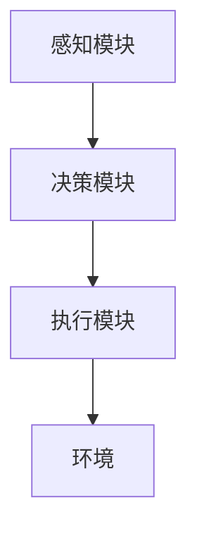
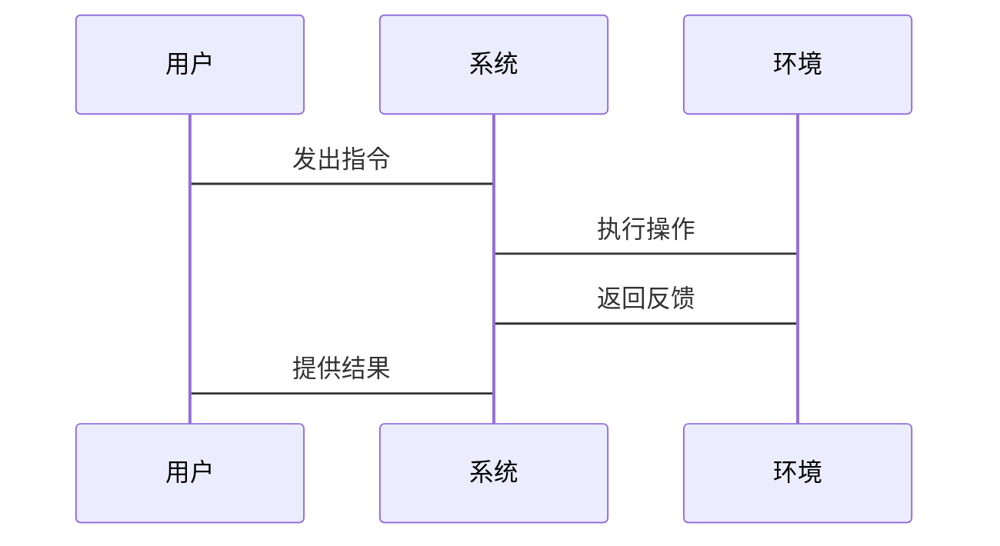

                 


# AI Agent的个性化与定制化实现

> **关键词**：AI Agent，个性化，定制化，算法，系统设计，项目实战

> **摘要**：  
> AI Agent（人工智能代理）作为一种能够自主感知环境并采取行动以实现目标的智能实体，在现代信息技术和人工智能领域发挥着越来越重要的作用。个性化与定制化实现是AI Agent区别于传统AI系统的核心优势之一，本文将从AI Agent的基本概念、核心原理、算法实现、系统设计、项目实战等多个维度，详细探讨如何实现AI Agent的个性化与定制化。通过理论分析与实践结合，本文旨在为读者提供一套完整的方法论，帮助其在实际项目中高效地构建和优化个性化AI Agent。

---

## 第一章：AI Agent的基本概念与背景

### 1.1 AI Agent的定义与分类

#### 1.1.1 什么是AI Agent  
AI Agent（人工智能代理）是指能够感知环境、自主决策并执行任务的智能实体。与传统的被动执行程序的计算机系统不同，AI Agent具备主动性和适应性，能够在动态环境中灵活应对各种挑战。

#### 1.1.2 AI Agent的分类  
AI Agent可以根据功能、智能水平和应用场景进行分类：  
1. **按功能分类**：  
   - **工具型Agent**：专注于完成特定任务，如自动化脚本。  
   - **社会型Agent**：具备社交能力，能够与人类或其他Agent进行交互。  
2. **按智能水平分类**：  
   - **反应式Agent**：基于当前感知做出反应，不具备记忆能力。  
   - **认知式Agent**：具备复杂推理和规划能力，能够处理复杂任务。  
3. **按应用场景分类**：  
   - **服务型Agent**：用于提供智能化服务，如智能客服。  
   - **控制型Agent**：用于自动化控制，如智能家居系统。  

#### 1.1.3 AI Agent的应用场景  
AI Agent广泛应用于多个领域：  
- **智能家居**：控制家电、管理能源。  
- **智能助手**：如Siri、Alexa等。  
- **自动驾驶**：处理车辆控制和环境感知。  
- **机器人**：应用于工业生产和服务机器人。  

### 1.2 个性化与定制化的需求

#### 1.2.1 个性化定制的必要性  
AI Agent的核心价值在于其智能化和个性化能力。通过个性化定制，AI Agent能够更好地适应不同用户的需求和场景，提升用户体验和效率。  

#### 1.2.2 用户需求的多样性  
不同用户对AI Agent的需求存在显著差异：  
- **普通用户**：追求简单易用和高效性。  
- **企业用户**：注重系统的可靠性和可扩展性。  
- **开发者**：需要灵活的接口和高度的可定制性。  

#### 1.2.3 个性化与定制化的区别  
个性化强调根据用户需求调整行为模式，而定制化则强调从底层架构到功能实现的深度调整。个性化是定制化的结果，而定制化是实现个性化的手段。  

### 1.3 当前AI Agent的发展现状

#### 1.3.1 传统AI Agent的特点  
传统AI Agent通常基于规则或简单的机器学习模型，缺乏灵活性和适应性。  

#### 1.3.2 当前AI Agent的技术趋势  
随着深度学习和强化学习的快速发展，现代AI Agent具备更强的自主性和智能性。  

#### 1.3.3 个性化定制在AI Agent中的应用  
个性化定制正在成为AI Agent的核心竞争力，尤其是在智能助手、推荐系统等领域。  

### 1.4 本章小结  
本章介绍了AI Agent的基本概念、分类和应用场景，重点分析了个性化与定制化的需求，并总结了当前AI Agent的发展现状。

---

## 第二章：AI Agent的核心概念与原理

### 2.1 AI Agent的核心原理

#### 2.1.1 感知机制  
AI Agent通过传感器或数据接口感知环境信息，例如图像识别、语音识别等。  

#### 2.1.2 决策机制  
基于感知信息，AI Agent通过算法选择最优行动方案，例如强化学习和决策树算法。  

#### 2.1.3 执行机制  
AI Agent根据决策结果执行具体操作，例如发送指令或触发物理设备。  

### 2.2 核心概念的联系

#### 2.2.1 感知、决策、执行的关系  
感知是决策的基础，决策是执行的指导，执行是最终目标的实现。  

#### 2.2.2 个性化定制的核心要素  
- 用户需求分析  
- 动态调整能力  
- 多模态交互能力  

#### 2.2.3 定制化实现的关键点  
- 灵活性：支持多种功能模块的组合与切换。  
- 可扩展性：便于新增功能和优化升级。  

### 2.3 核心概念的对比分析

#### 2.3.1 不同AI Agent模型的对比  
| 模型类型 | 感知方式 | 决策方式 | 执行方式 |  
|----------|----------|----------|----------|  
| 反应式   | 单一传感器 | 基于规则 | 简单动作 |  
| 认知式   | 多源传感器 | 基于推理 | 复杂动作 |  

#### 2.3.2 个性化与定制化的对比  
| 特性       | 个性化         | 定制化         |  
|------------|----------------|----------------|  
| 对象       | 用户需求        | 系统架构        |  
| 实现方式    | 行为模式调整     | 系统功能调整     |  
| 灵活性      | 较低           | 较高           |  

### 2.4 本章小结  
本章深入分析了AI Agent的核心原理和个性化定制的关键点，并通过对比分析明确了个性化与定制化的区别与联系。

---

## 第三章：AI Agent的算法实现

### 3.1 算法原理概述

#### 3.1.1 强化学习算法  
强化学习是一种通过试错机制优化决策策略的方法。其核心公式为：  
$$ Q(s, a) = r + \gamma \max_{a'} Q(s', a') $$  
其中，$Q(s, a)$表示状态-动作对的价值，$\gamma$是折扣因子。  

#### 3.1.2 遗传算法  
遗传算法通过模拟生物进化过程优化解空间。其主要步骤包括：  
1. 初始化种群。  
2. 计算适应度。  
3. 选择优秀个体。  
4. 进行交叉和变异。  

### 3.2 算法实现的步骤

#### 3.2.1 强化学习算法的实现步骤  
1. 初始化环境和状态空间。  
2. 选择动作并执行。  
3. 获取奖励并更新价值函数。  
4. 重复迭代直至收敛。  

#### 3.2.2 遗传算法的实现步骤  
1. 生成初始种群。  
2. 计算适应度。  
3. 选择父代个体。  
4. 进行交叉和变异操作。  
5. 重复迭代直至满足终止条件。  

### 3.3 算法实现的代码示例

#### 3.3.1 强化学习算法的代码示例  
```python
import numpy as np

class Agent:
    def __init__(self, state_space, action_space):
        self.state_space = state_space
        self.action_space = action_space
        self.Q = np.zeros((state_space, action_space))

    def take_action(self, state):
        return np.argmax(self.Q[state])

    def update_Q(self, state, action, reward):
        self.Q[state, action] += reward
```

#### 3.3.2 遗传算法的代码示例  
```python
def genetic_algorithm(population_size, fitness_func):
    population = [generate_random_individual() for _ in range(population_size)]
    while not is_converged():
        fitness = [fitness_func(individual) for individual in population]
        selected = select_best(population, fitness)
        new_population = crossover(selected)
        population = mutate(new_population)
    return population
```

### 3.4 算法实现的优化策略

#### 3.4.1 强化学习的优化策略  
- 使用更深的神经网络结构。  
- 增加经验回放机制。  

#### 3.4.2 遗传算法的优化策略  
- 调整交叉和变异概率。  
- 使用精英保留策略。  

### 3.5 本章小结  
本章详细介绍了强化学习和遗传算法的实现原理，并通过代码示例展示了具体的实现步骤。同时，还探讨了算法实现的优化策略。

---

## 第四章：AI Agent的系统设计

### 4.1 系统分析与需求提取

#### 4.1.1 系统需求分析  
通过用户访谈和需求调研，明确系统的核心功能和性能指标。  

#### 4.1.2 功能需求提取  
将用户需求转化为技术需求，例如：  
- 支持多模态输入（文本、语音、图像）。  
- 实现动态调整功能。  

### 4.2 系统架构设计

#### 4.2.1 系统功能模块设计  
- **感知模块**：负责环境数据的采集与处理。  
- **决策模块**：负责策略的选择与优化。  
- **执行模块**：负责具体操作的执行与反馈。  

#### 4.2.2 系统架构图  


### 4.3 系统接口设计

#### 4.3.1 接口定义  
- **输入接口**：接收用户指令或环境数据。  
- **输出接口**：输出执行结果或反馈信息。  

#### 4.3.2 接口规范  
- 使用RESTful API进行通信。  
- 支持JSON格式的数据交换。  

### 4.4 系统交互流程设计

#### 4.4.1 交互流程图  


### 4.5 本章小结  
本章从系统设计的角度，详细探讨了AI Agent的架构设计、接口设计和交互流程设计。

---

## 第五章：AI Agent的项目实战

### 5.1 项目背景与目标

#### 5.1.1 项目背景  
以智能客服系统为例，展示如何实现个性化AI Agent。  

#### 5.1.2 项目目标  
实现一个能够根据用户需求动态调整响应策略的智能客服系统。  

### 5.2 项目核心实现

#### 5.2.1 环境安装  
安装必要的依赖库：  
```bash
pip install numpy tensorflow matplotlib
```

#### 5.2.2 核心代码实现  
```python
class PersonalizedAgent:
    def __init__(self):
        self.model = self.build_model()

    def build_model(self):
        # 构建神经网络模型
        pass

    def train(self, data):
        # 训练模型
        pass

    def predict(self, input):
        # 预测输出
        return self.model.predict(input)
```

#### 5.2.3 功能实现与测试  
- 训练模型并测试其性能。  
- 验证系统的个性化调整能力。  

### 5.3 项目实战总结

#### 5.3.1 实验结果分析  
分析系统的性能指标，如准确率、响应时间等。  

#### 5.3.2 实验结论  
总结个性化定制对系统性能的提升效果。  

### 5.4 本章小结  
本章通过一个具体的项目案例，展示了AI Agent的个性化与定制化实现过程。

---

## 第六章：AI Agent的优化与拓展

### 6.1 优化策略

#### 6.1.1 算法优化  
- 使用更高效的算法，如深度强化学习。  
- 增加数据预处理步骤。  

#### 6.1.2 系统优化  
- 优化系统架构，提高可扩展性。  
- 采用分布式计算技术。  

### 6.2 拓展应用

#### 6.2.1 新功能开发  
- 支持更多模态的输入和输出。  
- 增加自适应学习能力。  

#### 6.2.2 新场景应用  
- 应用于教育、医疗、金融等领域。  

### 6.3 本章小结  
本章探讨了AI Agent的优化策略和拓展应用，为读者提供了进一步学习和实践的方向。

---

## 第七章：总结与展望

### 7.1 全文总结  
本文从AI Agent的基本概念出发，详细探讨了其个性化与定制化实现的关键技术与方法。通过理论分析与实践结合，为读者提供了一套完整的方法论。  

### 7.2 未来展望  
随着人工智能技术的不断发展，AI Agent的个性化与定制化实现将更加智能化和多样化。未来的研究方向包括更高效的算法设计和更灵活的系统架构。  

### 7.3 致谢  
感谢读者的关注与支持！

---

## 作者信息

**作者：AI天才研究院/AI Genius Institute & 禅与计算机程序设计艺术 /Zen And The Art of Computer Programming**  

---

以上是《AI Agent的个性化与定制化实现》的技术博客文章的完整目录和内容概要，希望对您有所帮助！如果需要进一步的扩展或细节补充，请随时告知。

