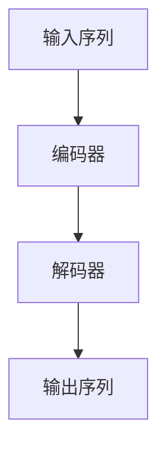
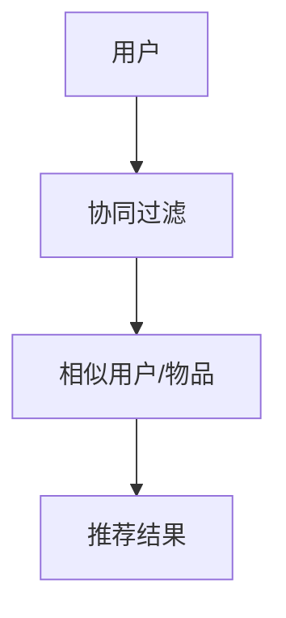
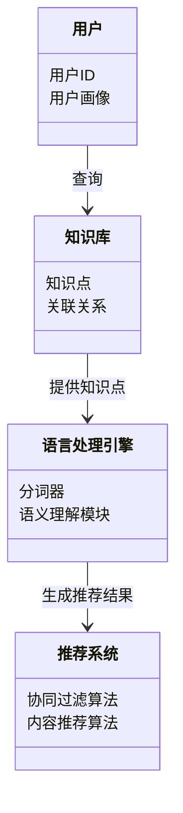
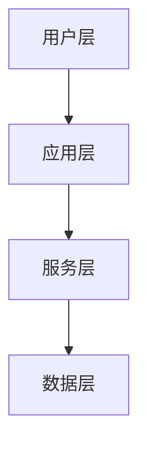
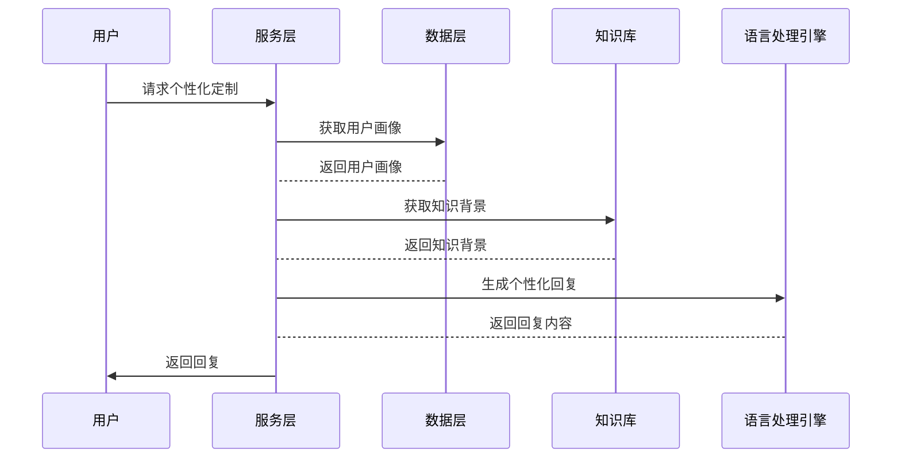

                 


# AI Agent的个性化定制：从语气到知识背景

> 关键词：AI Agent，个性化定制，语气，知识背景，自然语言处理，推荐算法，系统架构

> 摘要：本文深入探讨AI Agent的个性化定制，从其核心概念、实现方法到系统架构，详细分析了如何通过语气和知识背景的定制，实现高度个性化的交互体验。文章结合具体案例，详细讲解了文本生成模型和个性化推荐算法，并提供了系统的架构设计和项目实战指导，为读者提供了全面的技术视角和实践指南。

---

## 第四章: AI Agent的算法原理与数学模型

### 4.1 文本生成模型

#### 4.1.1 Transformer模型的原理

**文本生成模型**是AI Agent实现个性化交互的核心技术之一。目前，基于Transformer的模型（如GPT系列）在自然语言处理领域占据主导地位。以下是Transformer模型的基本原理：

**1. 基于自注意力机制的文本处理**

- **自注意力机制**：Transformer通过计算输入序列中每个词与其他词的相关性，生成上下文相关的表示。
- **公式表示**：
  $$\text{Attention}(Q, K, V) = \text{softmax}\left(\frac{QK^T}{\sqrt{d_k}}\right)V$$
  其中，$Q$、$K$、$V$分别表示查询、键和值向量，$d_k$是向量的维度。

**2. 层次化处理**

- Transformer由编码器和解码器组成，编码器负责将输入文本转换为上下文向量，解码器则根据这些向量生成输出文本。

#### 4.1.2 GPT系列模型的实现

- **GPT模型**：基于Transformer解码器的单向语言模型，通过自监督学习预训练语言模型。
- **GPT-2**：改进了模型结构，引入了更深的网络和更大的参数量，提升了生成文本的质量。
- **GPT-3**：采用了更大的参数规模（175B参数），支持多任务学习，具备更强的泛化能力。

#### 4.1.3 BERT模型的适应性调整

- **BERT模型**：基于Transformer编码器的预训练语言模型，通过掩码自监督任务进行训练。
- **适应性调整**：在个性化定制中，BERT可以通过微调特定领域的数据，生成符合用户需求的文本。

**图4-1: Transformer模型结构图**



---

### 4.2 个性化推荐算法

#### 4.2.1 基于协同过滤的推荐算法

**协同过滤**是一种经典的推荐算法，通过寻找具有相似偏好的用户或物品，进行推荐。

- **用户协同过滤**：
  - **步骤**：
    1. 计算用户之间的相似度（如余弦相似度）。
    2. 根据相似用户的偏好，推荐当前用户可能感兴趣的内容。
  - **公式**：
    $$\text{similarity}(u_i, u_j) = \frac{\sum_{k=1}^n r_{ijk}}{\sqrt{\sum_{k=1}^n r_{ik}^2} \cdot \sqrt{\sum_{k=1}^n r_{jk}^2}}}$$
    其中，$r_{ijk}$表示用户$i$对物品$j$的评分，$u_i$和$u_j$表示用户$i$和$j$。

- **物品协同过滤**：
  - **步骤**：
    1. 计算物品之间的相似度。
    2. 根据用户已有的评分，推荐相似物品。

#### 4.2.2 基于内容的推荐算法

**内容推荐**基于物品本身的属性进行推荐，适用于个性化定制中的知识背景分析。

- **文本特征提取**：
  - 使用TF-IDF、Word2Vec等方法提取文本特征。
  - 示例：假设物品A的特征向量为$v_A$，物品B的特征向量为$v_B$，计算余弦相似度：
    $$\text{similarity}(A, B) = \frac{v_A \cdot v_B}{\|v_A\| \cdot \|v_B\|}$$
  
- **基于知识图谱的推荐**：
  - 利用知识图谱中的实体关系，进行关联推荐。

#### 4.2.3 基于机器学习的推荐算法

**机器学习推荐**通过训练模型，捕捉用户与物品之间的复杂关系。

- **矩阵分解**：
  - 将用户-物品评分矩阵分解为用户因子和物品因子。
  - 示例：分解后，$r_{ui}$可以表示为：
    $$r_{ui} = \sum_{k=1}^K u_{uk} v_{ik}$$
    其中，$u_{uk}$和$v_{ik}$分别表示用户u和物品i在第k个因子上的表现。

- **深度学习推荐**：
  - 使用神经网络模型（如深度神经网络、卷积神经网络）进行推荐。

**图4-2: 基于协同过滤的推荐流程图**



---

### 4.3 算法实现的数学模型与代码示例

#### 4.3.1 文本生成模型的代码实现

**示例代码**：基于Keras实现一个简单的文本生成模型。

```python
import tensorflow as tf
from tensorflow.keras.layers import Dense, InputLayer, LSTM, Dropout, Input, Bidirectional

def build_model(vocab_size):
    model = tf.keras.Sequential([
        InputLayer(shape=(None,)),
        Bidirectional(LSTM(128, return_sequences=True)),
        Dropout(0.5),
        Dense(vocab_size, activation='softmax')
    ])
    return model
```

**解释**：
- 使用双向LSTM捕捉上下文信息。
- Dropout层用于防止过拟合。
- 最后一层为输出层，使用Softmax激活函数生成概率分布。

#### 4.3.2 个性化推荐算法的代码实现

**示例代码**：基于协同过滤的推荐系统。

```python
import numpy as np

def user_based_CF(ratings, user_id):
    # 计算用户相似度
    user_ratings = ratings[ratings['userId'] == user_id]
    other_users = ratings[~(ratings['userId'] == user_id)]
    similarity = np.zeros(len(other_users))
    
    for i, user in enumerate(other_users['userId'].values):
        user_ratings_i = ratings[ratings['userId'] == user]
        # 计算余弦相似度
        similarity[i] = np.dot(user_ratings[user_ratings['userId'] == user]['rating'].values,
                               user_ratings['rating'].values) / (np.linalg.norm(user_ratings['rating'].values) * np.linalg.norm(user_ratings_i['rating'].values))
    
    # 找出相似度最高的用户
    top_n = 5
    top_users = other_users.iloc[np.argsort(-similarity)[:top_n]]
    return top_users
```

**解释**：
- 计算用户之间的余弦相似度。
- 找出相似度最高的用户，推荐其喜欢的物品。

---

## 第五章: AI Agent的系统分析与架构设计

### 5.1 系统功能设计

**系统功能设计**包括以下几个方面：

- **知识库管理**：存储和管理个性化定制的知识背景。
- **语言处理引擎**：实现自然语言理解与生成。
- **推荐系统**：根据用户行为推荐个性化内容。
- **用户交互界面**：提供人机交互的界面。

**图5-1: 系统功能设计类图**



### 5.2 系统架构设计

**系统架构设计**采用分层架构：

- **数据层**：存储用户数据、知识库数据。
- **服务层**：提供API接口，处理用户请求。
- **应用层**：实现个性化定制功能。
- **用户层**：提供交互界面。

**图5-2: 系统架构图**



### 5.3 系统接口设计

**系统接口设计**包括以下几个接口：

- **用户认证接口**：验证用户身份。
- **知识库查询接口**：获取特定知识背景的信息。
- **交互记录接口**：记录用户的交互历史。

### 5.4 系统交互流程图

**系统交互流程图**展示了用户与系统之间的交互过程。

**图5-3: 系统交互序列图**



---

## 第六章: AI Agent的项目实战

### 6.1 环境配置与安装

**环境配置**：
- 安装Python、TensorFlow、Keras、Scikit-learn等库。
- 安装Jupyter Notebook用于开发和测试。

**示例代码**：
```bash
pip install numpy pandas scikit-learn tensorflow.keras
```

### 6.2 核心代码实现

**文本生成模型实现**：

```python
import tensorflow as tf
from tensorflow.keras.preprocessing.sequence import pad_sequences

def generate_response(prompt, model, tokenizer, max_length=50):
    # 编码输入
    encoded = tokenizer.encode(prompt)
    padded = pad_sequences([encoded], maxlen=max_length, truncating='post', padding='max')
    # 生成回复
    predictions = model.predict(padded)
    # 解码输出
    response_ids = tf.argmax(predictions, axis=-1)[0]
    response = tokenizer.decode(response_ids)
    return response
```

**个性化推荐实现**：

```python
from sklearn.metrics.pairwise import cosine_similarity

def get_similar_users(user_id, user_features):
    similarity_matrix = cosine_similarity(user_features)
    top_n = 5
    similar_users = np.argsort(similarity_matrix[user_id, :])[::-1][:top_n]
    return similar_users
```

### 6.3 案例分析与项目总结

**案例分析**：
- 实现一个简单的智能助手，支持基于知识背景的个性化对话。
- 使用GPT-2模型进行文本生成，结合协同过滤算法进行推荐。

**项目总结**：
- 个性化定制的关键在于数据的收集与处理，以及模型的训练与优化。
- 需要不断调整模型参数，优化交互体验。

---

## 第七章: 最佳实践与小结

### 7.1 小结

- 个性化定制是AI Agent实现人机交互的核心技术。
- 需要结合自然语言处理与推荐算法，提升用户体验。

### 7.2 注意事项

- 数据隐私与安全问题需高度重视。
- 模型训练需要大量计算资源，需优化算法效率。

### 7.3 拓展阅读

- 《Deep Learning》——Ian Goodfellow
- 《自然语言处理入门》——NLP引路人

---

## 作者

**作者**：AI天才研究院 & 禅与计算机程序设计艺术

---

以上是文章的完整目录结构，涵盖了从背景介绍到项目实战的各个方面，结合具体案例和详细的技术实现，为读者提供了全面的技术视角和实践指南。

