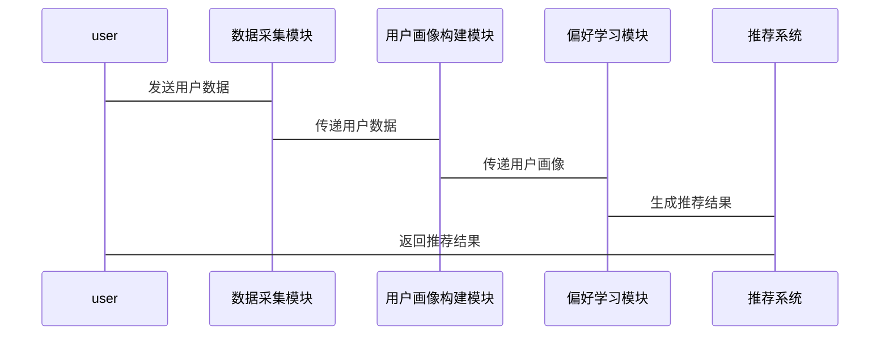

                 


# AI Agent的个性化：用户画像与偏好学习

## 关键词：
- AI Agent
- 用户画像
- 偏好学习
- 个性化服务
- 算法原理
- 系统架构

## 摘要：
AI Agent的个性化是实现智能化服务的核心，而用户画像与偏好学习是实现个性化的关键。本文将从背景、核心概念、算法原理、系统架构到项目实战，全面解析AI Agent的个性化设计，帮助读者掌握用户画像构建、偏好学习算法及系统实现的全过程。

---

# 第1章: AI Agent与个性化概述

## 1.1 AI Agent的基本概念
### 1.1.1 什么是AI Agent
AI Agent（人工智能代理）是一种能够感知环境、执行任务并做出决策的智能实体。它能够通过与用户交互或从环境中获取信息，自主完成目标。

### 1.1.2 AI Agent的核心特征
- **自主性**：能够在没有外部干预的情况下独立运作。
- **反应性**：能够感知环境并实时调整行为。
- **目标导向性**：基于目标驱动决策和行动。
- **学习能力**：通过数据和经验不断优化自身行为。

### 1.1.3 AI Agent的应用场景
- 智能助手（如Siri、Alexa）
- 推荐系统（如Netflix、Amazon）
- 自动驾驶
- 智能客服

---

## 1.2 用户画像与偏好学习的背景
### 1.2.1 用户画像的定义与作用
- **用户画像**：通过收集和分析用户数据，构建用户特征的数字化模型，用于描述用户的属性、行为和偏好。
- **作用**：帮助AI Agent更好地理解用户需求，提供个性化服务。

### 1.2.2 偏好学习的定义与意义
- **偏好学习**：通过学习用户的偏好信息，预测用户的喜好，从而提供更精准的服务。
- **意义**：提升用户体验，提高服务的满意度和效率。

### 1.2.3 个性化服务的需求驱动
- 用户对个性化服务的需求日益增长。
- 通过个性化服务提高用户粘性和满意度。
- 个性化服务是AI Agent实现智能化的关键。

---

# 第2章: 用户画像与偏好学习的核心概念

## 2.1 用户画像的构建原理
### 2.1.1 数据采集与特征提取
- 数据来源：用户行为数据、用户属性数据、用户反馈数据。
- 特征提取：从数据中提取有用的特征，如年龄、性别、兴趣爱好等。

### 2.1.2 用户画像的维度与层次
- **维度**：年龄、性别、职业、兴趣爱好。
- **层次**：基础特征、行为特征、偏好特征。

### 2.1.3 用户画像的更新与维护
- 定期更新用户数据。
- 根据新数据调整用户画像。

---

## 2.2 偏好学习的基本原理
### 2.2.1 偏好数据的获取与处理
- 数据来源：用户行为数据、用户反馈数据。
- 数据处理：清洗、归一化、特征提取。

### 2.2.2 偏好模型的构建与训练
- 基于机器学习算法（如协同过滤、深度学习）构建偏好模型。
- 模型训练：通过数据训练模型，使其能够预测用户的偏好。

### 2.2.3 偏好的动态变化与适应
- 偏好可能随时间变化。
- 模型需要动态更新以适应用户偏好的变化。

---

## 2.3 用户画像与偏好学习的关系
### 2.3.1 用户画像为偏好学习提供基础
- 用户画像提供用户的基本信息和特征，为偏好学习提供输入数据。

### 2.3.2 偏好学习提升用户画像的准确性
- 通过偏好学习，可以更准确地描述用户的兴趣和需求，优化用户画像。

### 2.3.3 两者的协同作用与应用
- 协同作用：用户画像是基础，偏好学习是提升。
- 应用：推荐系统、个性化服务、精准营销。

---

# 第3章: 用户画像与偏好学习的算法原理

## 3.1 协同过滤算法
### 3.1.1 基于用户的协同过滤
- 基于用户的相似性推荐。
- 使用余弦相似度或欧氏距离计算用户相似性。

### 3.1.2 基于物品的协同过滤
- 基于物品的相似性推荐。
- 使用余弦相似度或协同矩阵计算物品相似性。

### 3.1.3 混合协同过滤的优缺点
- 混合协同过滤结合了基于用户和基于物品的协同过滤的优点。
- 优点：准确性高、多样性好。
- 缺点：计算复杂度高。

---

## 3.2 偏好学习的深度学习模型
### 3.2.1 基于神经网络的偏好建模
- 使用神经网络模型（如DNN、CNN、RNN）建模用户偏好。
- 输入：用户特征和行为数据。
- 输出：用户偏好的预测结果。

### 3.2.2 注意力机制在偏好学习中的应用
- 注意力机制用于捕捉用户行为中的重要特征。
- 提高模型对用户偏好的理解和预测能力。

### 3.2.3 Transformer模型的改进与优化
- 使用改进的Transformer模型处理序列数据。
- 提高模型的并行计算能力和效率。

---

# 第4章: 用户画像与偏好学习的系统架构

## 4.1 系统功能设计
### 4.1.1 用户数据采集模块
- 功能：收集用户行为数据、属性数据和反馈数据。
- 实现：通过API接口或日志采集。

### 4.1.2 用户画像构建模块
- 功能：构建和更新用户画像。
- 实现：基于数据挖掘和机器学习算法。

### 4.1.3 偏好学习模块
- 功能：学习用户偏好，生成推荐结果。
- 实现：基于协同过滤或深度学习模型。

---

## 4.2 系统架构设计
### 4.2.1 分层架构设计
- **数据层**：存储用户数据。
- **服务层**：处理用户数据，构建用户画像。
- **应用层**：提供API接口，供前端调用。

### 4.2.2 微服务架构设计
- **数据服务**：提供用户数据接口。
- **画像服务**：构建和更新用户画像。
- **偏好学习服务**：处理用户偏好，生成推荐结果。

### 4.2.3 高可用性与扩展性设计
- 使用负载均衡和容灾备份提高可用性。
- 通过分布式架构提高扩展性。

---

## 4.3 系统接口设计
### 4.3.1 API接口设计
- `/api/users`：获取用户数据。
- `/api/profiles`：构建用户画像。
- `/api/preferences`：学习用户偏好。

### 4.3.2 系统交互序列图


---

## 4.4 系统交互序列图


---

# 第5章: 项目实战

## 5.1 环境安装与配置
### 5.1.1 Python环境的搭建
- 安装Python 3.8或更高版本。
- 安装必要的库：numpy、pandas、scikit-learn、tensorflow。

### 5.1.2 开发工具的安装
- 安装Jupyter Notebook用于数据处理和模型训练。
- 安装Flask或Django用于搭建Web应用。

---

## 5.2 核心代码实现
### 5.2.1 用户画像构建代码
```python
import pandas as pd
from sklearn.preprocessing import StandardScaler

# 数据加载
data = pd.read_csv('user_data.csv')

# 特征提取
features = data[['age', 'gender', 'interest']]
scaler = StandardScaler()
features_scaled = scaler.fit_transform(features)

# 用户画像构建
user_profiles = {}
for i in range(len(data)):
    user_id = data['user_id'][i]
    user_profiles[user_id] = features_scaled[i]
```

### 5.2.2 偏好学习代码
```python
import numpy as np
from sklearn.metrics.pairwise import cosine_similarity

# 协同过滤算法实现
def user_based_recommender(data, user_id):
    # 计算用户相似性
    user_idx = np.where(data['user_id'] == user_id)[0][0]
    similarities = cosine_similarity(data[user_id].values.reshape(1, -1))
    
    # 根据相似性生成推荐
    recommendations = []
    for i in range(len(similarities[0])):
        if i != user_idx and similarities[0][i] > 0.7:
            recommendations.append(data['item_id'][i])
    return recommendations

# 调用推荐系统
recommendations = user_based_recommender(data, user_id=123)
print(recommendations)
```

---

## 5.3 案例分析与代码解读
### 5.3.1 案例分析
- **案例背景**：某电商平台希望通过用户画像和偏好学习实现个性化推荐。
- **数据来源**：用户行为数据、用户属性数据。

### 5.3.2 代码解读
- 用户画像构建：通过标准化处理用户数据，构建用户画像。
- 偏好学习：基于协同过滤算法，计算用户相似性，生成推荐结果。

---

## 5.4 项目总结
- **项目目标**：实现用户画像构建和偏好学习，提供个性化推荐。
- **实现步骤**：数据采集、用户画像构建、偏好学习、推荐系统实现。
- **成果展示**：通过实际案例展示推荐结果。

---

# 第6章: 最佳实践与小结

## 6.1 最佳实践
### 6.1.1 数据质量的重要性
- 数据质量直接影响用户画像和推荐结果的准确性。
- 需要确保数据的完整性和准确性。

### 6.1.2 模型选择的注意事项
- 根据具体场景选择合适的算法。
- 不要一味追求复杂的模型，简单有效的模型更优。

### 6.1.3 模型优化的建议
- 使用交叉验证优化模型参数。
- 定期更新模型，适应用户偏好的变化。

---

## 6.2 小结
- 本文详细介绍了AI Agent的个性化设计，从用户画

