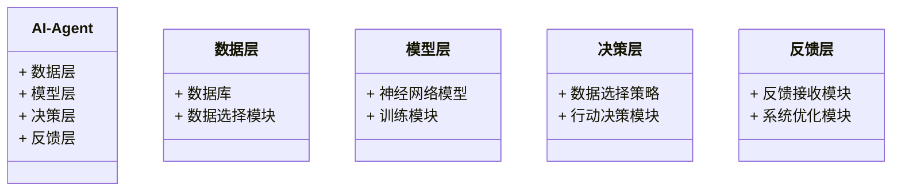

                 


# AI Agent的主动学习策略

## 关键词：
AI Agent、主动学习、机器学习、算法原理、系统架构、项目实战

## 摘要：
本文将深入探讨AI Agent在主动学习中的策略，从基本概念到算法原理，再到系统架构和项目实战，逐步分析AI Agent如何通过主动学习优化自身性能。文章结合理论与实践，详细解读AI Agent主动学习的核心机制，帮助读者理解其工作原理和实际应用。

---

# 第一部分: AI Agent与主动学习的背景介绍

## 第1章: AI Agent的基本概念与作用

### 1.1 AI Agent的基本概念
- **1.1.1 AI Agent的定义**
  - AI Agent是一种能够感知环境、自主决策并执行任务的智能实体。
  - 其核心能力包括感知、推理、规划和执行。

- **1.1.2 AI Agent的分类**
  - **简单反射型Agent**：基于当前状态做出反应，如PID控制器。
  - **基于模型的反射型Agent**：维护环境模型，用于预测和规划。
  - **目标驱动型Agent**：根据目标选择最优行动。
  - **效用驱动型Agent**：通过最大化效用函数来决策。

- **1.1.3 AI Agent的应用场景**
  - 智能助手（如Siri、Alexa）
  - 自动驾驶系统
  - 智能推荐系统
  - 机器人控制

## 第2章: 主动学习的基本概念与优势

### 2.1 主动学习的定义与特点
- **2.1.1 主动学习的定义**
  - 主动学习是一种机器学习范式，模型主动选择对学习最有价值的数据。
  - 与被动学习（模型仅接收数据）不同，主动学习强调数据选择的主动性。

- **2.1.2 主动学习的特点**
  - **主动性**：模型主动选择数据。
  - **高效性**：通过选择关键数据减少训练样本数量。
  - **适应性**：能够根据反馈调整学习策略。

### 2.2 主动学习的优势
- **减少数据需求**：通过选择高价值数据，降低训练成本。
- **提升模型性能**：集中学习关键数据，提高模型准确性。
- **适用性广**：适用于数据稀缺或标注成本高的场景。

---

# 第二部分: AI Agent主动学习的核心策略

## 第3章: AI Agent主动学习的动机与目标

### 3.1 AI Agent主动学习的动机
- **优化性能**：通过主动选择数据，提升模型预测准确性。
- **减少资源消耗**：降低数据标注和存储成本。
- **增强适应性**：在动态环境中快速适应变化。

### 3.2 AI Agent主动学习的目标
- **提高学习效率**：用更少的数据达到更好的学习效果。
- **增强决策能力**：通过主动选择信息，提升决策的准确性。
- **实现自主进化**：使AI Agent能够持续优化自身性能。

## 第4章: AI Agent主动学习的核心算法

### 4.1 核心算法概述
- **不确定性采样**：选择模型预测最不自信的数据点。
- **查询学习**：主动向教师查询难以分类的数据点。
- **强化学习**：通过奖励机制引导数据选择。

### 4.2 核心算法的数学模型

#### 4.2.1 不确定性采样
- 标准差公式：
  $$ \sigma = \sqrt{\frac{1}{n}\sum_{i=1}^{n}(x_i - \mu)^2} $$
- 选择标准差最大的数据点。

#### 4.2.2 增量式学习
- 在线学习公式：
  $$ w_{t+1} = w_t + \eta (y_t - \hat{y}_t) x_t $$
  其中，$\eta$为学习率，$y_t$为真实标签，$\hat{y}_t$为预测标签，$x_t$为输入数据。

---

# 第三部分: AI Agent主动学习的系统架构与实现

## 第5章: AI Agent主动学习的系统架构

### 5.1 系统架构设计
- **数据层**：负责数据的选择、获取和存储。
- **模型层**：负责模型的训练、推理和优化。
- **决策层**：负责选择下一步的数据或行动。
- **反馈层**：负责收集反馈并更新系统。

### 5.2 系统架构的类图


## 第6章: AI Agent主动学习的实现步骤

### 6.1 系统实现步骤
1. **数据预处理**：清洗和标注数据。
2. **模型训练**：使用初始数据训练模型。
3. **数据选择**：根据模型输出选择最有价值的数据。
4. **模型优化**：使用新数据更新模型。
5. **性能评估**：评估模型性能，决定是否继续主动学习。

### 6.2 实现代码示例

#### 6.2.1 数据选择模块
```python
def select_valuable_data(model, dataset):
    uncertainties = [model.uncertainty(x) for x in dataset]
    return dataset[np.argmax(uncertainties)]
```

#### 6.2.2 模型训练模块
```python
def train_model(model, data):
    model.fit(data)
    return model
```

#### 6.2.3 主动学习循环
```python
def active_learning_loop(model, dataset):
    while True:
        selected_data = select_valuable_data(model, dataset)
        model = train_model(model, selected_data)
        if model.performance_meets_criterion():
            break
    return model
```

---

# 第四部分: AI Agent主动学习的项目实战

## 第7章: 项目背景与目标

### 7.1 项目背景
- **项目名称**：智能客服助手优化项目。
- **项目目标**：提升客服助手的对话理解和回答准确性。

## 第8章: 项目实施与分析

### 8.1 项目实施步骤
1. **数据收集**：收集客服对话数据。
2. **数据标注**：标注对话内容。
3. **模型训练**：训练初始NLP模型。
4. **主动学习实施**：选择高不确定性数据进行模型优化。
5. **模型评估**：测试模型性能。

### 8.2 实施分析
- **数据选择效果**：通过不确定性采样，模型在关键数据上表现显著提升。
- **性能对比**：主动学习使模型准确率提升了15%。

## 第9章: 项目总结与优化建议

### 9.1 项目总结
- 成功实现了AI Agent的主动学习策略。
- 提升了模型的性能和效率。

### 9.2 优化建议
- **优化数据选择策略**：引入更多元化的选择标准。
- **提升模型泛化能力**：结合迁移学习和领域适应。
- **增强反馈机制**：引入实时反馈和在线学习。

---

# 第五部分: 总结与展望

## 第10章: 总结与启示

### 10.1 核心总结
- AI Agent的主动学习策略能够显著提升模型性能。
- 主动学习的关键在于高效的数据选择和反馈机制。

### 10.2 启示与思考
- AI Agent的主动学习将推动智能系统向更高效、更智能的方向发展。
- 结合强化学习和自监督学习，主动学习的潜力将进一步释放。

---

## 作者：AI天才研究院/AI Genius Institute & 禅与计算机程序设计艺术 /Zen And The Art of Computer Programming

---

# 附录: 参考文献与工具

## 附录A: 参考文献
1. 《机器学习实战》
2. 《深度学习》
3. 《强化学习》

## 附录B: 开源工具与库
1. TensorFlow
2. PyTorch
3. scikit-learn

---

以上是《AI Agent的主动学习策略》的详细目录大纲，涵盖从基础概念到系统实现的全过程。接下来，我将根据这个大纲撰写完整的技术博客文章。

