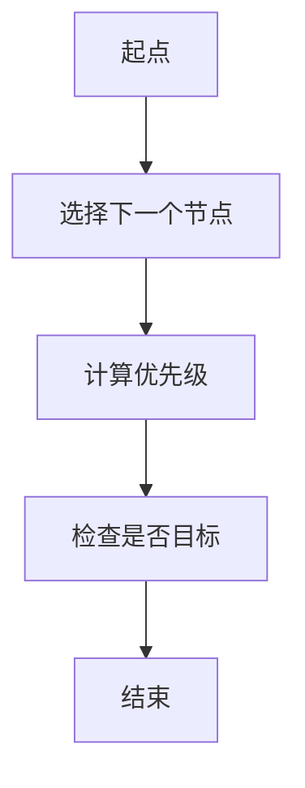
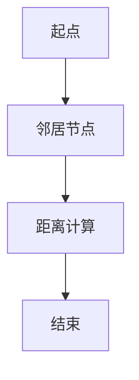
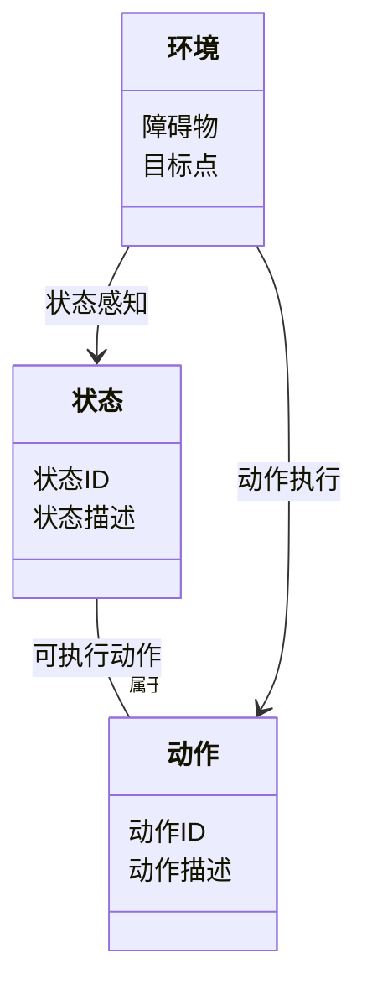
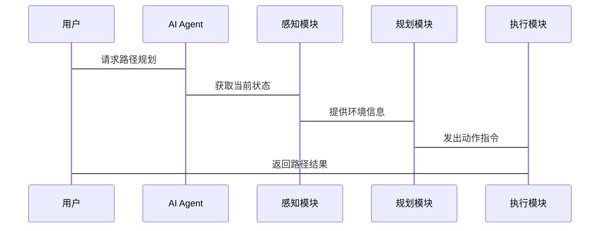

                 


# AI Agent的任务规划与执行框架

## 关键词
AI Agent, 任务规划, 执行框架, 算法原理, 系统架构, 项目实战, 最佳实践

## 摘要
AI Agent的任务规划与执行框架是实现智能系统自主行为的核心技术。本文从AI Agent的基本概念出发，详细探讨任务规划的核心原理、算法实现、系统架构设计以及实际应用案例。通过对比分析、流程图和代码示例，帮助读者全面理解任务规划与执行的框架，并掌握其在实际项目中的应用技巧。

---

# 第1章: AI Agent的基本概念

## 1.1 AI Agent的定义与特点

### 1.1.1 AI Agent的定义
AI Agent（人工智能代理）是指能够感知环境并采取行动以实现目标的智能实体。它可以自主决策，无需人工干预，广泛应用于自动驾驶、智能助手、机器人等领域。

### 1.1.2 AI Agent的核心特点
- **自主性**：AI Agent能够在没有外部干预的情况下自主决策。
- **反应性**：能够实时感知环境变化并做出反应。
- **目标导向**：所有行为均以实现特定目标为导向。
- **学习能力**：通过经验改进性能，增强适应性。

### 1.1.3 AI Agent与传统程序的区别
| 属性 | AI Agent | 传统程序 |
|------|-----------|-----------|
| 决策 | 自主决策 | 严格执行 |
| 感知 | 具备感知能力 | 无感知能力 |
| 学习 | 可以学习优化 | 无法优化改进 |

## 1.2 任务规划的背景与意义

### 1.2.1 任务规划的定义
任务规划是指AI Agent根据当前环境状态和目标，制定一系列行动步骤以实现目标的过程。

### 1.2.2 任务规划的重要性
- **提高效率**：通过优化行动路径，减少资源消耗。
- **增强适应性**：在动态环境中灵活调整计划。
- **提升智能化**：使AI Agent具备更复杂的决策能力。

### 1.2.3 任务规划的应用场景
- **自动驾驶**：路径规划和交通决策。
- **智能助手**：日程安排和任务分配。
- **机器人控制**：动作序列规划。

---

# 第2章: 任务规划的核心概念与联系

## 2.1 任务规划的核心原理

### 2.1.1 状态空间与动作空间
- **状态空间**：所有可能的环境状态集合。
- **动作空间**：AI Agent在每个状态下可执行的动作集合。

### 2.1.2 目标表示与约束条件
- **目标表示**：明确的终止条件或目标状态。
- **约束条件**：限制动作选择的条件，如时间、资源限制。

### 2.1.3 规划算法的基本原理
规划算法通过搜索状态空间，寻找从初始状态到目标状态的最短路径或最优路径。

## 2.2 核心概念对比表

### 2.2.1 状态与动作的对比
| 属性 | 状态 | 动作 |
|------|------|------|
| 定义 | 当前环境情况 | 可执行的行为 |
| 示例 | 在十字路口 | 向左转 |

### 2.2.2 目标与约束的对比
| 属性 | 目标 | 约束 |
|------|------|------|
| 定义 | 终止条件 | 限制条件 |
| 示例 | 到达目的地 | 不超过预算 |

### 2.2.3 规划与执行的对比
| 属性 | 规划 | 执行 |
|------|------|------|
| 定义 | 制定行动方案 | 执行具体动作 |
| 示例 | 制定路线 | 按路线行驶 |

## 2.3 ER实体关系图

```mermaid
erDiagram
    class 状态 {
        状态ID
        状态描述
    }
    class 动作 {
        动作ID
        动作描述
    }
    状态 -- "属于" 动作 : 可执行动作
    状态 -- "属于" 目标 : 目标状态
```

---

# 第3章: 任务规划的算法原理

## 3.1 常见的规划算法

### 3.1.1 A*算法
A*算法结合了广度优先搜索（BFS）和最佳优先搜索，使用启发函数估算到目标的距离。

### 3.1.2 Dijkstra算法
Dijkstra算法用于寻找图中单源最短路径，适用于所有边权非负的情况。

### 3.1.3 BFS与DFS算法
BFS适用于无权图的最短路径，DFS适用于有向图的路径寻找。

## 3.2 算法流程图

### 3.2.1 A*算法流程图



### 3.2.2 Dijkstra算法流程图



## 3.3 算法实现代码

### 3.3.1 A*算法的Python实现

```python
import heapq

def a_star_search(graph, start, goal):
    open_set = set([start])
    closed_set = set()
    came_from = {}
    g_score = {node: float('inf') for node in graph}
    g_score[start] = 0
    f_score = {node: float('inf') for node in graph}
    f_score[start] = heuristic(start, goal)
    
    while open_set:
        current = heapq.heappop(open_set)
        if current == goal:
            return reconstruct_path(came_from, current)
        open_set.remove(current)
        closed_set.add(current)
        
        for neighbor in graph[current]:
            tentative_g_score = g_score[current] + graph[current][neighbor]
            if tentative_g_score < g_score[neighbor]:
                came_from[neighbor] = current
                g_score[neighbor] = tentative_g_score
                f_score[neighbor] = g_score[neighbor] + heuristic(neighbor, goal)
                if neighbor not in closed_set and neighbor not in open_set:
                    heapq.heappush(open_set, neighbor)
    return None

def heuristic(a, b):
    return abs(a[0] - b[0]) + abs(a[1] - b[1])

def reconstruct_path(came_from, current):
    path = [current]
    while current in came_from:
        current = came_from[current]
        path.append(current)
    return path[::-1]
```

---

# 第4章: 系统分析与架构设计

## 4.1 问题场景介绍

### 4.1.1 场景描述
以自动驾驶为例，AI Agent需要规划车辆的行驶路径，避开障碍物，到达目的地。

## 4.2 系统功能设计

### 4.2.1 领域模型



### 4.2.2 系统架构图


## 4.3 接口设计与交互

### 4.3.1 序列图



---

# 第5章: 项目实战

## 5.1 环境安装

### 5.1.1 安装Python
确保安装Python 3.x版本，以及必要的库如`networkx`和`mermaid`.

## 5.2 系统核心实现源代码

### 5.2.1 规划算法实现

```python
import networkx as nx

def plan_route(graph, start, goal):
    visited = {}
    queue = [start]
    visited[start] = True
    while queue:
        current = queue.pop(0)
        if current == goal:
            return reconstruct_path(visited, graph, start, goal)
        for neighbor in graph[current]:
            if neighbor not in visited:
                visited[neighbor] = True
                queue.append(neighbor)
    return None

def reconstruct_path(visited, graph, start, goal):
    path = [goal]
    current = goal
    while current != start:
        for neighbor in graph[current]:
            if visited[neighbor]:
                current = neighbor
                path.append(current)
                break
    return path[::-1]
```

### 5.2.2 代码解读与分析
代码实现了一个简单的BFS算法，用于无权图的路径规划。`plan_route`函数遍历图中的节点，寻找从起点到目标的路径，`reconstruct_path`函数用于回溯路径。

## 5.3 实际案例分析

### 5.3.1 案例分析
以迷宫导航为例，AI Agent通过任务规划算法找到出口路径。

---

# 第6章: 最佳实践

## 6.1 经验总结

### 6.1.1 规划算法选择
根据具体应用场景选择合适的算法，复杂场景推荐A*算法。

### 6.1.2 系统设计注意事项
确保系统模块化设计，便于维护和扩展。

## 6.2 小结

### 6.2.1 任务规划的重要性
任务规划是AI Agent实现自主行为的核心技术，决定了系统的智能水平和执行效率。

### 6.2.2 未来发展方向
结合强化学习和深度学习，提升任务规划的智能性和适应性。

## 6.3 注意事项

### 6.3.1 算法优化
在实际应用中，考虑动态环境和多目标优化，采用启发式搜索和分布式计算。

### 6.3.2 系统集成
任务规划模块需要与感知和执行模块无缝集成，确保实时性和可靠性。

## 6.4 拓展阅读

### 6.4.1 推荐书籍
- 《算法导论》
- 《人工智能：现代方法》

### 6.4.2 在线资源
- AI Agent相关论文和开源项目。

---

# 结语

通过本文的详细讲解，读者可以全面理解AI Agent的任务规划与执行框架，掌握其核心算法和系统设计方法，并能够在实际项目中灵活应用。未来，随着技术的发展，任务规划将在更多领域发挥重要作用。

---

# 作者

作者：AI天才研究院/AI Genius Institute & 禅与计算机程序设计艺术 /Zen And The Art of Computer Programming

