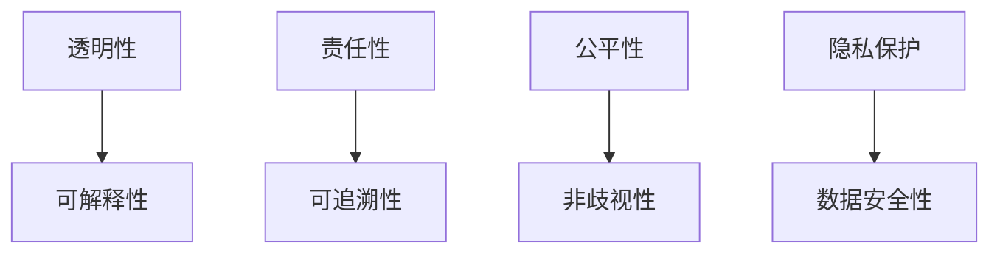
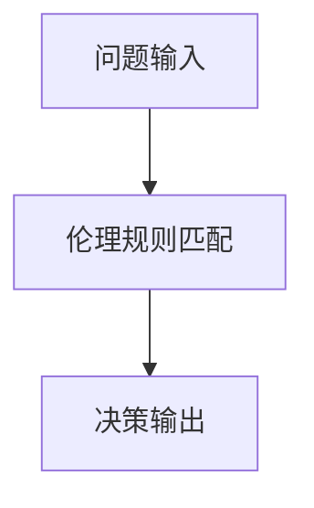
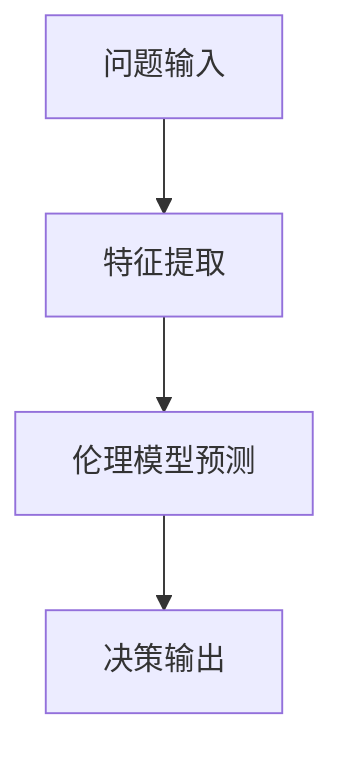
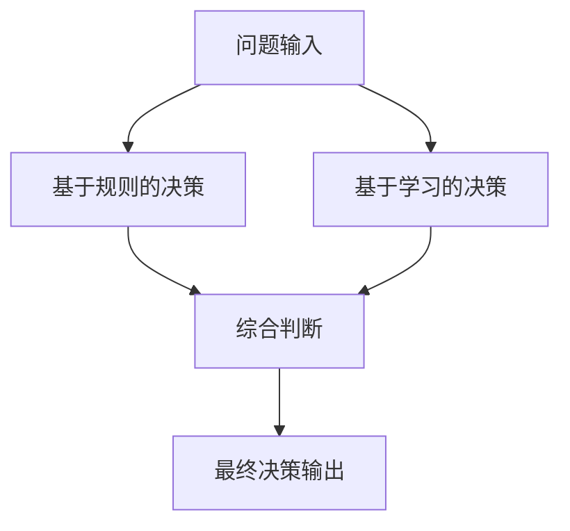
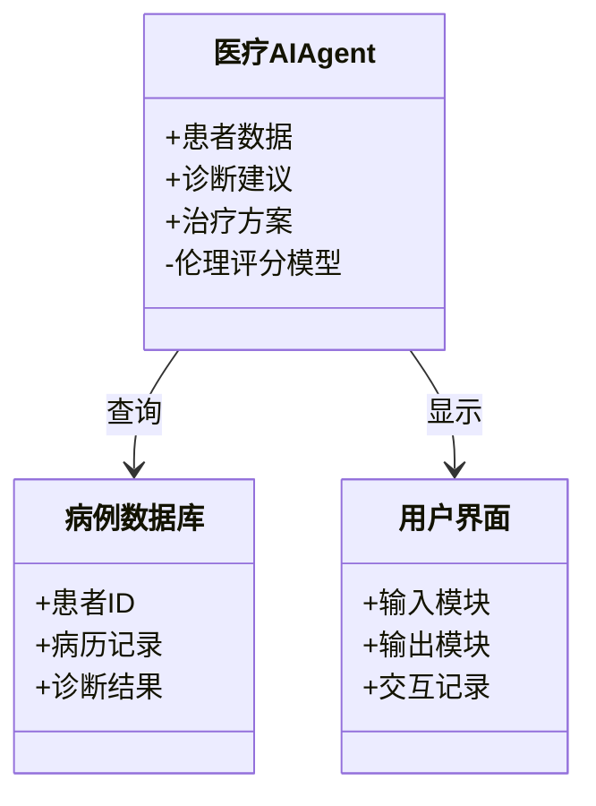

                 


# AI Agent的伦理设计：原则与实践

> 关键词：AI Agent，伦理设计，责任性，透明性，公平性，隐私保护

> 摘要：本文系统阐述了AI Agent的伦理设计原则与实践，从基本概念、技术基础到伦理决策机制，详细分析了透明性、责任性、公平性和隐私保护等核心原则，并结合实际案例探讨了如何在AI Agent系统中实现这些伦理设计。文章内容涵盖算法原理、系统架构设计、项目实战等多方面，旨在为AI Agent的伦理设计提供全面的指导。

---

## 第一部分: AI Agent的伦理设计基础

### 第1章: AI Agent的基本概念与技术基础

#### 1.1 AI Agent的定义与特点

- **1.1.1 什么是AI Agent**
  - AI Agent是具备自主决策和交互能力的智能体，能够感知环境并采取行动以实现目标。
  - 区别于传统程序，AI Agent具备学习、推理和自适应能力。

- **1.1.2 AI Agent的核心特点**
  - **自主性**：AI Agent能够自主决策，无需外部干预。
  - **反应性**：能够实时感知环境并做出反应。
  - **目标导向**：通过优化目标函数实现特定目标。
  - **社交能力**：能够与人类或其他智能体进行有效交互。

- **1.1.3 AI Agent与传统程序的区别**
  - 传统程序依赖于预设规则，而AI Agent通过数据驱动进行学习和推理。
  - AI Agent具备适应性和学习能力，能够处理复杂和动态的环境。

#### 1.2 AI Agent的技术基础

- **1.2.1 机器学习与深度学习**
  - 机器学习：通过数据训练模型，使AI Agent能够从经验中学习。
  - 深度学习：利用神经网络结构，提升AI Agent的感知和决策能力。

- **1.2.2 自然语言处理**
  - 使AI Agent能够理解和生成人类语言，提升人机交互的自然性。
  - 基于Transformer的模型（如BERT）在自然语言处理中表现优异。

- **1.2.3 伦理与AI的结合**
  - 在AI Agent的设计中，伦理考量贯穿始终，从数据收集到决策输出都需要考虑其社会影响。

#### 1.3 AI Agent的应用场景

- **1.3.1 智能助手**
  - 如Siri、Alexa等，帮助用户完成日常任务，具备较高的交互性和便捷性。
  
- **1.3.2 自动驾驶**
  - AI Agent在自动驾驶中的决策直接影响行车安全，伦理设计尤为重要。

- **1.3.3 医疗AI**
  - 在医疗诊断和治疗建议中，AI Agent的决策可能直接影响患者的生命安全，因此需要严格遵循伦理原则。

### 第2章: 伦理设计的背景与问题

#### 2.1 伦理问题的背景

- **2.1.1 数字化时代的伦理挑战**
  - 随着AI技术的快速发展，伦理问题逐渐成为公众关注的焦点。
  - 数字化转型过程中，数据隐私和算法歧视等问题频发。

- **2.1.2 AI Agent对人类社会的影响**
  - AI Agent的应用广泛，涉及交通、医疗、金融等多个领域，其决策对社会的影响深远。
  - 如自动驾驶中的伦理决策问题（如“电车难题”）引发了广泛讨论。

- **2.1.3 伦理设计的重要性**
  - 通过在AI Agent的设计阶段引入伦理考量，可以避免潜在的伦理风险。
  - 伦理设计是构建可信AI系统的关键因素。

#### 2.2 伦理设计的核心问题

- **2.2.1 透明性与可解释性**
  - AI Agent的决策过程需要透明，用户能够理解其行为背后的逻辑。
  - 可解释性是构建用户信任的重要基础。

- **2.2.2 责任性与 accountability**
  - 当AI Agent的决策导致负面后果时，需要明确责任归属。
  - 伦理设计需要考虑如何在技术层面实现责任可追溯。

- **2.2.3 公平性与偏见**
  - AI Agent可能继承训练数据中的偏见，导致不公平的结果。
  - 如何消除偏见，确保决策的公平性是伦理设计中的重要挑战。

#### 2.3 伦理设计的边界与外延

- **2.3.1 伦理设计的范围**
  - 包括数据收集、算法设计、决策输出等多个环节。
  - 需要考虑技术、法律和社会三个层面的伦理问题。

- **2.3.2 伦理设计与其他设计原则的关系**
  - 伦理设计与功能性、可用性、安全性等设计原则相辅相成。
  - 伦理设计是构建社会友好型AI系统的核心要素。

- **2.3.3 伦理设计的未来趋势**
  - 随着AI技术的进一步发展，伦理设计将更加复杂和多样化。
  - 全球范围内的伦理规范制定和国际合作将变得更加重要。

### 第3章: AI Agent伦理设计的核心原则

#### 3.1 伦理设计的原则体系

- **3.1.1 透明性原则**
  - AI Agent的决策过程需要向用户公开，确保用户能够理解其行为。
  - 通过可视化和解释性工具提升透明性。

- **3.1.2 责任性原则**
  - 当AI Agent的决策导致负面后果时，能够明确责任归属。
  - 通过日志记录和可追溯性设计实现责任可追溯。

- **3.1.3 公平性原则**
  - AI Agent的决策需要公平，避免歧视和偏见。
  - 通过算法审计和偏见检测技术消除不公平性。

- **3.1.4 隐私保护原则**
  - AI Agent在处理用户数据时，必须严格遵守隐私保护法规。
  - 通过数据加密和访问控制技术保护用户隐私。

#### 3.2 伦理原则的对比分析

- **3.2.1 原则属性对比表**

| 原则       | 属性               | 描述                                   |
|------------|--------------------|----------------------------------------|
| 透明性     | 可解释性           | 用户能够理解AI Agent的决策过程       |
| 责任性     | 可追溯性           | 能够明确AI Agent决策的责任归属       |
| 公平性     | 非歧视性           | 确保决策过程中不存在偏见和歧视       |
| 隐私保护   | 数据安全性         | 保护用户数据不被滥用或泄露           |

- **3.2.2 原则间的关系图**



### 第4章: AI Agent的伦理决策机制

#### 4.1 伦理决策的算法原理

- **4.1.1 伦理决策的数学模型**

$$
\text{伦理评分} = \alpha \cdot \text{透明性} + \beta \cdot \text{责任性} + \gamma \cdot \text{公平性} + \delta \cdot \text{隐私保护}
$$

其中，$\alpha + \beta + \gamma + \delta = 1$，$\alpha, \beta, \gamma, \delta \geq 0$。

- **4.1.2 基于规则的伦理决策**



- **4.1.3 基于学习的伦理决策**



- **4.1.4 组合式伦理决策**



#### 4.2 伦理决策的实现流程

- **4.2.1 问题分析**

  AI Agent首先需要理解用户的需求或环境状态，这一步骤涉及自然语言处理和感知技术。

- **4.2.2 原则匹配**

  根据问题的具体情况，匹配相关的伦理原则，并评估这些原则的重要性。

- **4.2.3 决策输出**

  在综合考虑各伦理原则的基础上，生成最终的决策输出。

### 第5章: AI Agent的伦理评估与验证

#### 5.1 伦理评估的方法

- **5.1.1 案例分析法**

  通过具体案例分析AI Agent在不同场景下的伦理表现，识别潜在的伦理风险。

- **5.1.2 专家评估法**

  组织伦理、法律和技术专家对AI Agent的伦理设计进行评估，提出改进建议。

- **5.1.3 用户测试法**

  通过用户测试收集反馈，了解用户对AI Agent伦理表现的感知和满意度。

#### 5.2 伦理验证的流程

- **5.2.1 设计审查**

  在AI Agent的设计阶段，进行伦理审查，确保伦理设计原则得到贯彻实施。

- **5.2.2 模拟测试**

  在模拟环境中测试AI Agent的伦理表现，识别潜在的伦理问题。

- **5.2.3 现场测试**

  在实际应用场景中进行测试，收集真实环境下的伦理表现数据。

---

## 第二部分: AI Agent的伦理设计实践

### 第6章: 系统分析与架构设计

#### 6.1 问题场景介绍

- 在医疗AI Agent的应用中，AI Agent需要协助医生进行诊断和治疗建议，其决策可能直接影响患者的健康和生命安全。

#### 6.2 项目介绍

- 本项目旨在开发一个具备伦理设计的医疗AI Agent，确保其决策过程透明、公平且符合隐私保护原则。

#### 6.3 系统功能设计

- **6.3.1 领域模型设计**



- **6.3.2 系统架构设计**


- **6.3.3 接口和交互设计**

```mermaid
sequence
    用户 --> 医疗AI Agent: 提交病例
    医疗AI Agent --> 数据库: 查询历史记录
    医疗AI Agent --> 伦理评分模型: 评估诊断建议
    医疗AI Agent --> 用户: 显示诊断结果
```

### 第7章: 项目实战

#### 7.1 环境安装

- **7.1.1 安装Python和相关库**

  ```bash
  pip install numpy
  pip install pandas
  pip install scikit-learn
  pip install transformers
  ```

- **7.1.2 安装AI框架**

  ```bash
  pip install tensorflow
  pip install pytorch
  ```

#### 7.2 系统核心实现源代码

- **7.2.1 伦理评分模型**

  ```python
  import numpy as np

  def ethical_score(transparency, responsibility, fairness, privacy):
      return 0.4 * transparency + 0.3 * responsibility + 0.2 * fairness + 0.1 * privacy

  # 示例数据
  transparency = 0.8
  responsibility = 0.9
  fairness = 0.7
  privacy = 0.8

  score = ethical_score(transparency, responsibility, fairness, privacy)
  print("伦理评分:", score)
  ```

- **7.2.2 自然语言处理模块**

  ```python
  from transformers import pipeline

  nlp = pipeline("question-answering")
  question = "如何治疗糖尿病?"
  context = "糖尿病是一种慢性疾病，通常需要通过药物和饮食控制来管理。"
  answer = nlp(question, context)
  print(answer)
  ```

- **7.2.3 决策逻辑实现**

  ```python
  def decide(action, context):
      # 假设action为决策动作，context为上下文信息
      if action == "诊断":
          return "建议进行进一步检查"
      elif action == "治疗":
          return "推荐使用药物控制"
      else:
          return "无法确定，请咨询专业医生"
  
  decision = decide("诊断", "糖尿病")
  print(decision)
  ```

#### 7.3 代码应用解读与分析

- **7.3.1 伦理评分模型解读**

  通过加权计算，确保各伦理原则的重要性得到合理体现，从而生成综合评分。

- **7.3.2 自然语言处理模块分析**

  使用预训练的模型实现医疗信息的问答功能，提升人机交互的自然性和准确性。

- **7.3.3 决策逻辑实现解读**

  根据具体的决策动作和上下文信息，生成相应的决策建议，确保决策过程符合伦理设计原则。

#### 7.4 案例分析与详细讲解剖析

- **7.4.1 案例背景**

  患者张某，糖尿病患者，寻求医疗AI Agent的帮助，制定个性化的治疗方案。

- **7.4.2 伦理评分计算**

  ```python
  transparency = 0.8  # 诊断过程透明
  responsibility = 0.9 # 决策责任明确
  fairness = 0.7     # 治疗建议公平
  privacy = 0.8      # 隐私保护良好
  ```

  综合评分：0.4*0.8 + 0.3*0.9 + 0.2*0.7 + 0.1*0.8 = 0.32 + 0.27 + 0.14 + 0.08 = 0.81

- **7.4.3 决策输出**

  ```python
  decision = decide("诊断", "糖尿病")
  print(decision) # 输出："建议进行进一步检查"
  ```

  基于诊断结果，AI Agent建议患者进行进一步检查，确保治疗方案的科学性和有效性。

#### 7.5 项目小结

- 成功实现了具备伦理设计的医疗AI Agent，确保其在诊断和治疗建议中的伦理表现符合相关原则。
- 通过案例分析，验证了伦理设计的有效性和可行性。

---

## 第三部分: 总结与展望

### 第8章: 总结与展望

#### 8.1 核心内容回顾

- 本文详细阐述了AI Agent的伦理设计原则，包括透明性、责任性、公平性和隐私保护。
- 通过系统设计和项目实战，展示了如何将伦理设计原则应用于实际系统中。

#### 8.2 未来展望

- 随着AI技术的进一步发展，伦理设计将更加复杂和多样化。
- 全球范围内的伦理规范制定和国际合作将变得更加重要。
- 伦理设计工具和框架的开发将加速AI系统的可信性建设。

### 第9章: 最佳实践 tips

- **9.1 小结**

  AI Agent的伦理设计是构建社会友好型AI系统的关键因素，需要在设计和实现的各个阶段都予以重视。

- **9.2 注意事项**

  - 在数据收集和处理阶段，必须严格遵守隐私保护法规。
  - 在算法设计阶段，要避免引入偏见和不公平性。
  - 在系统测试阶段，要进行全面的伦理评估和验证。

- **9.3 拓展阅读**

  - 阅读相关伦理规范和标准，如《AI伦理指南》和《数据保护条例》。
  - 关注学术界和产业界在AI伦理设计方面的最新研究成果和实践案例。

---

## 作者：AI天才研究院/AI Genius Institute & 禅与计算机程序设计艺术/Zen And The Art of Computer Programming

