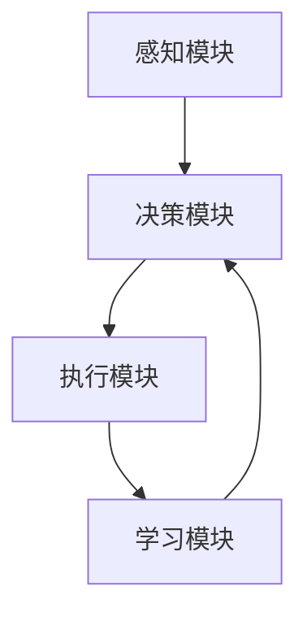

                 


# AI Agent的元学习能力开发实践

**关键词**: AI Agent, 元学习, 深度学习, 强化学习, 模型优化

**摘要**:  
AI Agent的元学习能力是指AI代理能够从经验中快速学习新任务的能力，这种能力使得AI代理能够更高效地适应动态变化的环境。本文将深入探讨AI Agent的元学习能力开发的实践，从元学习的基本概念到具体的算法实现，再到系统架构设计，最后结合实际项目案例进行分析。通过本文的学习，读者将能够理解元学习的核心原理，掌握其在AI Agent开发中的应用技巧，并能够将其应用于实际项目中。

---

# 第1章: AI Agent与元学习概述

## 1.1 AI Agent的基本概念

AI Agent（人工智能代理）是指在计算机系统中，能够感知环境、自主决策并执行任务的智能实体。AI Agent可以是软件程序、机器人或其他智能系统，其核心目标是通过感知和行动与环境交互，以实现特定的目标。

### 1.1.1 AI Agent的定义与分类

AI Agent的定义可以概括为：一个智能系统，能够通过感知环境、执行动作，并根据反馈来优化其行为，以达到预定目标。根据功能和应用场景的不同，AI Agent可以分为多种类型，例如：

1. **反应式AI Agent**：基于当前感知做出反应，不依赖历史信息。
2. **认知式AI Agent**：具备复杂推理和规划能力，能够处理不确定性。
3. **强化学习AI Agent**：通过与环境交互，基于奖励机制优化行为策略。
4. **监督学习AI Agent**：基于标记数据进行训练，适用于特定任务。

### 1.1.2 元学习的定义与意义

元学习（Meta-Learning）是一种机器学习范式，旨在使模型能够快速适应新任务，而无需大量特定任务的数据。元学习的核心思想是“学会如何学习”，通过在多个任务上的训练，模型能够掌握通用的学习策略，从而在新任务上快速泛化。

### 1.1.3 元学习在AI Agent中的应用

AI Agent需要在动态变化的环境中执行任务，元学习能力能够帮助AI Agent快速适应新任务，减少对新任务数据的依赖。例如，在游戏中，AI Agent可以通过元学习快速掌握新规则；在机器人控制中，元学习可以帮助机器人快速适应新环境。

---

## 1.2 元学习的核心价值

### 1.2.1 元学习的意义与应用场景

元学习的意义在于其能够显著减少新任务的训练数据需求，提高模型的泛化能力。在AI Agent开发中，元学习的应用场景包括：

- **多任务学习**：在多个相关任务上训练模型，使其能够快速适应新任务。
- **零样本学习**：在没有训练数据的情况下，通过元学习模型的泛化能力进行推理。
- **在线学习**：在动态变化的环境中，实时更新模型参数，适应新任务。

### 1.2.2 元学习在AI Agent中的作用

元学习能够显著提升AI Agent的学习效率和适应能力。通过元学习，AI Agent可以在新任务上线时快速调整其行为策略，而无需重新进行大规模训练。

### 1.2.3 元学习的未来发展趋势

随着AI Agent应用场景的扩展，元学习将在更多领域得到应用。未来，元学习将结合强化学习、图神经网络等技术，进一步提升AI Agent的智能水平。

---

## 1.3 本章小结

本章介绍了AI Agent的基本概念和分类，并重点阐述了元学习的定义、意义及其在AI Agent中的应用。通过本章的学习，读者可以理解元学习在AI Agent开发中的重要性。

---

# 第2章: 元学习的原理与方法

## 2.1 元学习的原理

### 2.1.1 元学习的基本原理

元学习的核心思想是通过在多个任务上的训练，学习一种通用的学习策略。这种策略使得模型能够快速适应新任务，而无需大量特定任务的数据。元学习的关键在于“元任务”的设计，即通过训练模型在多个任务上表现出色，从而使其具备快速适应新任务的能力。

### 2.1.2 元学习的数学模型

元学习的数学模型可以表示为：对于多个任务，模型在每个任务上进行优化，同时通过共享参数的方式，使得模型能够快速适应新任务。

### 2.1.3 元学习的算法框架

元学习的算法框架通常包括两个阶段：元训练阶段和任务训练阶段。在元训练阶段，模型通过多个任务的训练，学习通用的学习策略；在任务训练阶段，模型利用元学习得到的策略快速适应新任务。

## 2.2 元学习的核心方法

### 2.2.1 Model-Agnostic Meta-Learning (MAML)

MAML是一种经典的元学习算法，其核心思想是通过优化模型的参数，使得模型能够在多个任务上快速收敛。MAML的优化过程包括两个阶段：内层优化和外层优化。

#### MAML的优化过程

1. **内层优化**：对于每个任务，优化模型在该任务上的损失函数。
2. **外层优化**：优化模型的共享参数，使得模型在多个任务上具有良好的表现。

### 2.2.2 Reptile Method

Reptile是一种基于强化学习的元学习算法，其核心思想是通过不断更新模型参数，使得模型能够快速适应新任务。

#### Reptile的优化过程

1. **随机选择任务**：从所有任务中随机选择一个任务。
2. **更新模型参数**：在选择的任务上优化模型参数。
3. **全局参数更新**：将所有任务的优化结果进行平均，更新全局模型参数。

### 2.2.3 其他元学习方法

除了MAML和Reptile，还有许多其他的元学习方法，例如：

- **Meta-SGD**：基于随机梯度下降的元学习方法。
- **ANIL**：基于参数分离的元学习方法。

## 2.3 元学习方法的对比分析

### 2.3.1 不同元学习方法的优缺点对比

| 方法名称   | 优点                                | 缺点                                |
|------------|-------------------------------------|-------------------------------------|
| MAML       | 具备良好的理论基础，收敛性好         | 计算复杂度较高，训练时间较长         |
| Reptile     | 计算复杂度较低，适用于大规模任务     | 理论基础较弱，收敛性较差             |
| Meta-SGD    | 计算效率高，易于实现               | 收敛性较差，适用于简单任务           |
| ANIL        | 参数更新简单，适用于小样本任务     | 适用于复杂任务时表现不佳             |

### 2.3.2 元学习方法的适用场景分析

不同的元学习方法适用于不同的场景。例如，MAML适用于需要高精度和稳定性的任务，而Reptile适用于需要快速训练和大规模数据的任务。

## 2.4 本章小结

本章详细讲解了元学习的原理和核心方法，并通过对比分析，帮助读者选择适合具体应用场景的元学习方法。

---

# 第3章: 元学习算法的数学模型与实现

## 3.1 MAML算法的数学推导

### 3.1.1 MAML的基本公式

MAML的核心公式可以表示为：

$$
\theta_{t+1} = \theta_t - \eta \nabla_{\theta} \mathcal{L}_{task}(f_{\theta}(\mathbf{x}_i), y_i)
$$

其中，$\theta_t$ 表示模型参数，$\eta$ 表示学习率，$\mathcal{L}_{task}$ 表示任务损失函数。

### 3.1.2 MAML的优化过程

1. **内层优化**：对于每个任务，优化模型在该任务上的损失函数。
2. **外层优化**：优化模型的共享参数，使得模型在多个任务上具有良好的表现。

## 3.2 Reptile算法的数学推导

### 3.2.1 Reptile的基本公式

Reptile的核心公式可以表示为：

$$
\theta_{t+1} = \theta_t - \eta \nabla_{\theta} \mathcal{L}_{task}(f_{\theta}(\mathbf{x}_i), y_i)
$$

其中，$\theta_t$ 表示模型参数，$\eta$ 表示学习率，$\mathcal{L}_{task}$ 表示任务损失函数。

### 3.2.2 Reptile的优化过程

1. **随机选择任务**：从所有任务中随机选择一个任务。
2. **更新模型参数**：在选择的任务上优化模型参数。
3. **全局参数更新**：将所有任务的优化结果进行平均，更新全局模型参数。

## 3.3 元学习算法的代码实现

### 3.3.1 MAML的Python代码实现

```python
import torch
import torch.nn as nn
import torch.optim as optim

class MetaLearner(nn.Module):
    def __init__(self, feature_dim, hidden_dim, output_dim):
        super(MetaLearner, self).__init__()
        self.fc1 = nn.Linear(feature_dim, hidden_dim)
        self.fc2 = nn.Linear(hidden_dim, output_dim)
    
    def forward(self, x):
        x = self.fc1(x)
        x = self.fc2(x)
        return x

def maml_update(model, optimizer, task_loss_fn, x, y):
    loss = task_loss_fn(model(x), y)
    optimizer.zero_grad()
    loss.backward()
    optimizer.step()

# 示例用法
model = MetaLearner(feature_dim=10, hidden_dim=20, output_dim=5)
optimizer = optim.Adam(model.parameters(), lr=0.1)

# 内层优化
for task in tasks:
    maml_update(model, optimizer, task_loss_fn, task.x, task.y)

# 外层优化
outer_loss = compute_outer_loss(model)
optimizer.zero_grad()
outer_loss.backward()
optimizer.step()
```

### 3.3.2 Reptile的Python代码实现

```python
import torch
import torch.nn as nn
import torch.optim as optim

class ReptileLearner(nn.Module):
    def __init__(self, feature_dim, hidden_dim, output_dim):
        super(ReptileLearner, self).__init__()
        self.fc1 = nn.Linear(feature_dim, hidden_dim)
        self.fc2 = nn.Linear(hidden_dim, output_dim)
    
    def forward(self, x):
        x = self.fc1(x)
        x = self.fc2(x)
        return x

def reptile_update(model, optimizer, task_loss_fn, x, y):
    loss = task_loss_fn(model(x), y)
    optimizer.zero_grad()
    loss.backward()
    optimizer.step()

# 示例用法
model = ReptileLearner(feature_dim=10, hidden_dim=20, output_dim=5)
optimizer = optim.Adam(model.parameters(), lr=0.1)

# 随机选择任务
selected_task = tasks[random.randint(0, len(tasks)-1)]

# 更新模型参数
reptile_update(model, optimizer, task_loss_fn, selected_task.x, selected_task.y)

# 全局参数更新
outer_loss = compute_outer_loss(model)
optimizer.zero_grad()
outer_loss.backward()
optimizer.step()
```

---

# 第4章: 元学习在AI Agent系统中的应用

## 4.1 AI Agent系统的架构设计

### 4.1.1 系统功能模块

AI Agent系统通常包括以下几个功能模块：

1. **感知模块**：负责感知环境信息。
2. **决策模块**：基于感知信息进行决策。
3. **执行模块**：执行决策动作。
4. **学习模块**：通过元学习快速适应新任务。

### 4.1.2 系统架构图



### 4.1.3 系统交互流程

1. **感知环境**：AI Agent通过传感器或其他方式感知环境信息。
2. **决策推理**：基于感知信息和元学习能力，AI Agent进行决策推理。
3. **执行动作**：根据决策结果，AI Agent执行相应的动作。
4. **学习优化**：通过元学习能力，AI Agent不断优化其决策策略。

## 4.2 元学习在AI Agent中的具体应用

### 4.2.1 多任务学习场景

在多任务学习场景中，AI Agent需要在多个任务上进行训练，从而具备快速适应新任务的能力。

### 4.2.2 零样本学习场景

在零样本学习场景中，AI Agent需要在没有训练数据的情况下，通过元学习的泛化能力进行推理。

### 4.2.3 在线学习场景

在在线学习场景中，AI Agent需要实时更新其模型参数，以适应动态变化的环境。

---

## 4.3 本章小结

本章详细讲解了元学习在AI Agent系统中的应用，包括系统架构设计和具体应用场景。通过本章的学习，读者可以理解元学习在AI Agent开发中的重要性。

---

# 第5章: 元学习能力开发的项目实战

## 5.1 项目背景与目标

### 5.1.1 项目背景

本项目旨在开发一个具备元学习能力的AI Agent，使其能够在多个任务上快速适应新任务。

### 5.1.2 项目目标

通过本项目，读者将能够掌握元学习的核心原理，并能够将其应用于实际项目中。

## 5.2 项目实现

### 5.2.1 环境安装与配置

```bash
pip install torch matplotlib numpy
```

### 5.2.2 核心代码实现

```python
import torch
import torch.nn as nn
import torch.optim as optim

class MetaLearner(nn.Module):
    def __init__(self, feature_dim, hidden_dim, output_dim):
        super(MetaLearner, self).__init__()
        self.fc1 = nn.Linear(feature_dim, hidden_dim)
        self.fc2 = nn.Linear(hidden_dim, output_dim)
    
    def forward(self, x):
        x = self.fc1(x)
        x = self.fc2(x)
        return x

def train(model, optimizer, task_loss_fn, tasks, num_epochs=100):
    for epoch in range(num_epochs):
        for task in tasks:
            maml_update(model, optimizer, task_loss_fn, task.x, task.y)
        outer_loss = compute_outer_loss(model)
        optimizer.zero_grad()
        outer_loss.backward()
        optimizer.step()
```

### 5.2.3 代码应用解读

1. **模型定义**：定义一个包含两个全连接层的神经网络模型。
2. **优化器配置**：使用Adam优化器进行模型参数优化。
3. **训练过程**：在多个任务上进行训练，优化模型参数。

---

## 5.3 项目小结

通过本项目，读者可以掌握元学习的核心原理，并能够将其应用于实际项目中。通过代码实现，读者可以理解元学习在AI Agent开发中的具体应用。

---

# 第6章: 元学习能力开发的总结与展望

## 6.1 本章总结

本章总结了元学习在AI Agent开发中的重要性，并通过实际项目案例，帮助读者理解元学习的核心原理。

## 6.2 未来展望

未来，元学习将在更多领域得到应用。元学习将结合强化学习、图神经网络等技术，进一步提升AI Agent的智能水平。

---

# 作者：AI天才研究院/AI Genius Institute & 禅与计算机程序设计艺术 /Zen And The Art of Computer Programming

---

通过本文的系统学习，读者将能够理解元学习的核心原理，并能够将其应用于实际项目中。希望本文能够为AI Agent的开发实践提供有价值的参考。

