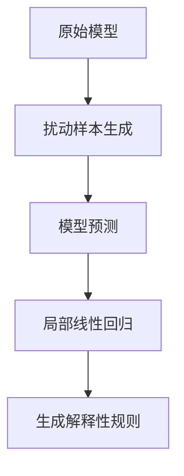
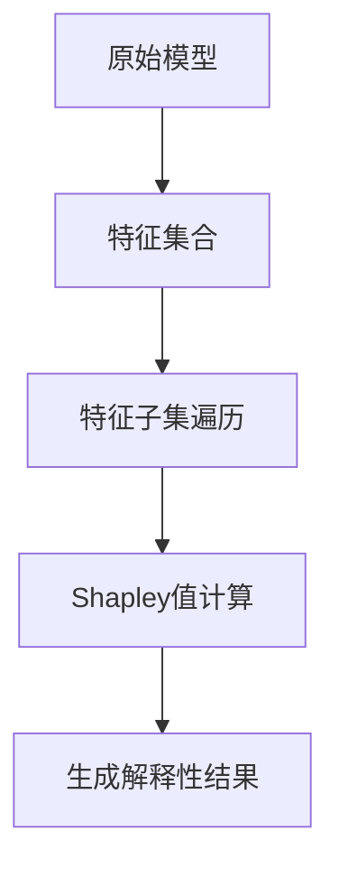
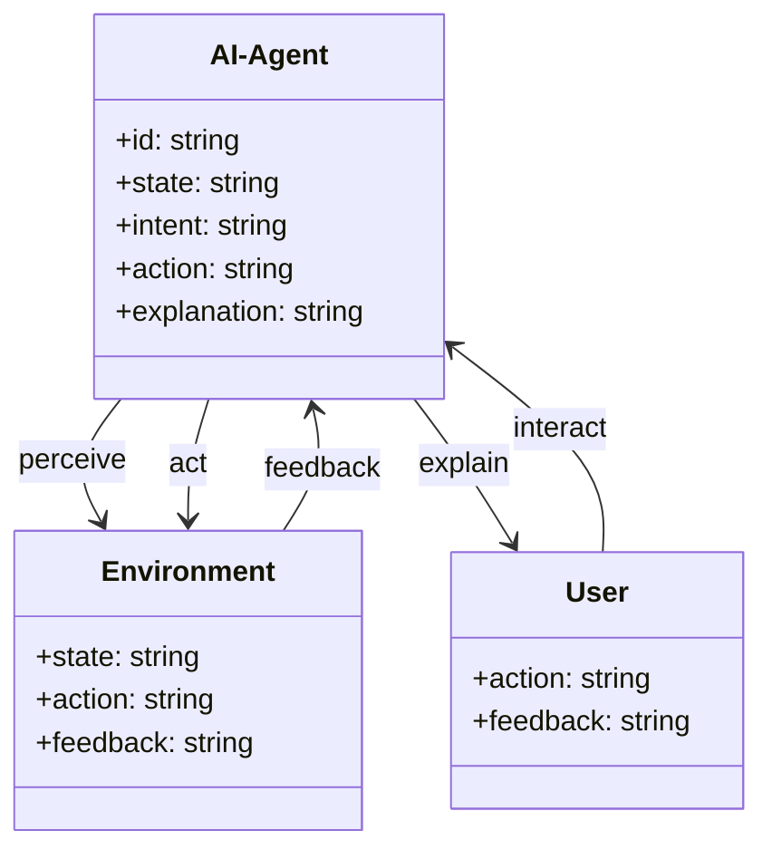

                 


# AI Agent的可解释性设计原则

> 关键词：AI Agent, 可解释性设计, 解释性算法, 系统架构, 项目实战

> 摘要：  
本文探讨了AI Agent的可解释性设计原则，从理论基础到实际应用，全面分析了如何在AI Agent的设计与实现中融入可解释性。文章首先介绍了AI Agent的基本概念及其可解释性的重要性，随后深入探讨了可解释性设计的核心原理、相关算法原理、系统架构设计以及实际项目中的应用。通过理论与实践相结合的方式，本文为AI Agent的可解释性设计提供了系统的指导和参考。

---

# 第一部分: AI Agent的可解释性设计背景

## 第1章: AI Agent与可解释性概述

### 1.1 AI Agent的基本概念

#### 1.1.1 什么是AI Agent
AI Agent（人工智能代理）是指能够感知环境、自主决策并采取行动以实现目标的智能实体。它可以是一个软件程序、一个机器人，或者任何能够执行智能任务的实体。AI Agent的核心特征包括自主性、反应性、目标导向性和社会性。

#### 1.1.2 AI Agent的分类
AI Agent可以根据功能、智能水平和应用场景进行分类：

- **按功能分类**：
  - **简单反射型Agent**：基于当前输入做出简单反应，不涉及复杂推理。
  - **基于模型的反射型Agent**：使用内部模型对环境进行建模，并基于模型做出决策。
  - **目标驱动型Agent**：以明确的目标为导向，优化决策以实现目标。
  - **效用驱动型Agent**：通过最大化效用函数来优化决策。

- **按智能水平分类**：
  - **反应式AI Agent**：基于当前感知做出实时反应，通常用于实时环境。
  - **认知式AI Agent**：具备复杂推理、规划和学习能力，适用于复杂任务。

- **按应用场景分类**：
  - **服务型Agent**：用于提供特定服务，如智能助手。
  - **协作型Agent**：用于多Agent协作环境，如分布式系统。

#### 1.1.3 AI Agent的核心特征
AI Agent的核心特征包括：

1. **自主性**：能够在没有外部干预的情况下自主运行。
2. **反应性**：能够感知环境并实时调整行为。
3. **目标导向性**：具有明确的目标，并通过决策优化目标的实现。
4. **社会性**：能够与其他Agent或人类进行交互和协作。

### 1.2 可解释性在AI Agent中的重要性

#### 1.2.1 可解释性定义
可解释性是指AI Agent的行为、决策和结果能够以人类可理解的方式进行解释和验证。可解释性是确保AI Agent的信任度、可靠性和透明性的重要基础。

#### 1.2.2 可解释性的重要性
在AI Agent的实际应用中，可解释性具有重要意义：

1. **信任与接受度**：用户需要理解AI Agent的行为，才能信任并接受其决策。
2. **责任与追溯**：在出现错误或争议时，可解释性能够帮助追溯决策过程并明确责任。
3. **优化与改进**：通过可解释性，可以发现和修正AI Agent的决策错误，优化其性能。

#### 1.2.3 可解释性与AI Agent的结合
可解释性与AI Agent的结合体现在以下几个方面：

1. **决策过程透明**：AI Agent的决策过程需要能够被人类理解和验证。
2. **行为可追溯**：AI Agent的行为需要能够被记录和追溯。
3. **交互性增强**：通过可解释性，AI Agent能够与人类进行更有效的交互和协作。

### 1.3 AI Agent可解释性设计的背景与挑战

#### 1.3.1 当前AI Agent的应用场景
AI Agent目前广泛应用于以下几个领域：

1. **智能助手**：如Siri、Alexa等，帮助用户完成日常任务。
2. **自动驾驶**：如特斯拉、Waymo等，实现车辆的自主驾驶。
3. **推荐系统**：如Netflix、Amazon等，为用户提供个性化推荐。
4. **机器人协作**：在工业自动化、物流等领域，AI Agent用于多机器人协作。

#### 1.3.2 可解释性在实际应用中的需求
在实际应用中，可解释性需求主要体现在以下几个方面：

1. **用户信任**：用户需要理解AI Agent的决策过程，才能信任其结果。
2. **法律与伦理合规**：在医疗、金融等领域，AI Agent的决策需要符合法律法规和伦理标准。
3. **技术优化**：通过可解释性，可以发现和改进AI Agent的算法和决策逻辑。

#### 1.3.3 设计中的主要挑战
设计AI Agent的可解释性面临以下主要挑战：

1. **复杂性**：AI Agent的决策过程可能涉及复杂的算法和数据，导致可解释性难以实现。
2. **实时性**：在实时环境中，AI Agent需要快速做出决策，同时保持可解释性。
3. **多样性**：不同应用场景对可解释性的需求和标准可能不同。

### 1.4 本章小结
本章介绍了AI Agent的基本概念、分类及其核心特征，并重点讨论了可解释性在AI Agent中的重要性。同时，分析了当前AI Agent的应用场景及其可解释性设计的主要挑战。

---

# 第二部分: AI Agent可解释性设计的核心概念

## 第2章: 可解释性设计的核心原理

### 2.1 可解释性设计的原理

#### 2.1.1 解释性模型的构建
解释性模型的构建需要遵循以下原则：

1. **简洁性**：模型需要简洁明了，避免过于复杂的逻辑。
2. **直观性**：模型的逻辑需要直观，能够被人类理解和验证。
3. **可追溯性**：模型的决策过程需要能够被追溯和解释。

#### 2.1.2 解释性特征的提取
解释性特征的提取需要关注以下几个方面：

1. **关键特征识别**：识别对决策起关键作用的特征。
2. **特征重要性排序**：对特征的重要性进行排序，以便理解和验证。
3. **特征交互分析**：分析特征之间的交互作用对决策的影响。

#### 2.1.3 解释性规则的制定
解释性规则的制定需要遵循以下原则：

1. **明确性**：规则需要明确，避免模糊和歧义。
2. **一致性**：规则需要一致，确保不同情况下规则的应用一致。
3. **可验证性**：规则需要能够被验证和测试。

### 2.2 AI Agent可解释性设计的关键要素

#### 2.2.1 透明性
透明性是指AI Agent的决策过程和逻辑需要能够被用户理解和验证。透明性是可解释性的基础，它确保用户能够了解AI Agent是如何做出决策的。

#### 2.2.2 可理解性
可理解性是指AI Agent的决策结果和逻辑能够被人类理解和接受。可理解性是可解释性的核心，它确保用户能够接受AI Agent的决策。

#### 2.2.3 可追溯性
可追溯性是指AI Agent的决策过程和结果能够被追溯和验证。可追溯性是可解释性的保障，它确保在出现问题时能够追溯决策过程并明确责任。

### 2.3 核心概念对比分析

#### 2.3.1 可解释性与可预测性的对比
可解释性与可预测性在AI Agent设计中的对比：

| 特性       | 可解释性                         | 可预测性                         |
|------------|----------------------------------|----------------------------------|
| 定义       | 能够解释和验证决策过程           | 能够预测和估计结果               |
| 作用       | 确保决策过程透明和可理解         | 确保结果的准确性和可靠性         |
| 实现方式   | 通过解释性模型和规则实现         | 通过预测模型和算法实现           |

#### 2.3.2 可解释性与可扩展性的对比
可解释性与可扩展性的对比：

| 特性       | 可解释性                         | 可扩展性                         |
|------------|----------------------------------|----------------------------------|
| 定义       | 能够解释和验证决策过程           | 系统能够扩展和适应新的需求     |
| 作用       | 确保决策过程透明和可理解         | 确保系统能够适应变化和扩展       |
| 实现方式   | 通过解释性模型和规则实现         | 通过模块化设计和灵活的架构实现   |

#### 2.3.3 可解释性与可维护性的对比
可解释性与可维护性的对比：

| 特性       | 可解释性                         | 可维护性                         |
|------------|----------------------------------|----------------------------------|
| 定义       | 能够解释和验证决策过程           | 系统能够方便地维护和更新         |
| 作用       | 确保决策过程透明和可理解         | 确保系统能够方便地维护和更新       |
| 实现方式   | 通过解释性模型和规则实现         | 通过模块化设计和清晰的架构实现   |

### 2.4 本章小结
本章重点讨论了可解释性设计的核心原理，包括解释性模型的构建、解释性特征的提取和解释性规则的制定。同时，对比分析了可解释性与其他相关概念，如可预测性、可扩展性和可维护性的异同。

---

## 第3章: 可解释性算法的核心原理

### 3.1 模型解释性算法概述

#### 3.1.1 LIME算法
LIME（Local Interpretable Model-agnostic Explanations）是一种模型无关的解释性算法。它通过局部近似的方式，为每个预测结果生成可解释的规则。

**LIME算法的步骤：**
1. 对于一个给定的输入样本，生成多个扰动样本。
2. 使用原始模型对扰动样本进行预测。
3. 使用解释性模型（如线性回归）对扰动样本进行拟合。
4. 通过权重系数，生成可解释的规则。

**LIME算法的优点：**
- 模型无关，适用于各种机器学习模型。
- 解释性规则简单明了，易于理解。

**LIME算法的局限性：**
- 解释性规则仅适用于局部，无法反映全局规律。

#### 3.1.2 SHAP值
SHAP（Shapley Additive exPlanations）是一种基于Shapley值的解释性方法。它通过将每个特征对预测结果的贡献度进行加权，生成可解释的解释。

**SHAP值的计算公式：**
$$ \text{SHAP值} = \phi_i = \sum_{S \subseteq \{1,2,...,n\}} \frac{1}{2^{k}} \cdot \left( f(S \cup \{i\}) - f(S) \right) $$

**SHAP值的优点：**
- 具有理论基础，符合博弈论的Shapley值。
- 能够反映特征的全局贡献。

**SHAP值的局限性：**
- 计算复杂度较高，适用于小规模数据集。

#### 3.1.3 其他解释性算法
除了LIME和SHAP，还有其他解释性算法，如：
- **特征重要性分析**：通过特征重要性排序，识别对决策起关键作用的特征。
- **决策树解释**：通过决策树的结构，直观地展示决策过程。
- **规则提取**：通过规则提取算法，将复杂的模型转换为简单的规则集。

### 3.2 解释性算法的数学模型

#### 3.2.1 LIME算法的数学模型
LIME算法通过局部线性回归模型对原始模型的预测结果进行近似。其数学模型如下：

$$ f(x) = w \cdot x + b $$

其中，$w$是特征权重，$b$是截距项。

#### 3.2.2 SHAP值的数学模型
SHAP值的数学模型基于Shapley值，其计算公式如下：

$$ \phi_i = \sum_{S \subseteq \{1,2,...,n\}} \frac{1}{2^{k}} \cdot \left( f(S \cup \{i\}) - f(S) \right) $$

其中，$k$是集合$S$的大小，$f(S)$是集合$S$的特征对预测结果的贡献。

#### 3.2.3 其他解释性算法的数学模型
其他解释性算法的数学模型可以根据具体算法进行描述，例如特征重要性分析可以通过特征系数的大小来反映特征的重要性。

### 3.3 算法流程图
以下是LIME算法和SHAP值的流程图：





### 3.4 本章小结
本章详细介绍了几种常用的模型解释性算法，包括LIME和SHAP值，并给出了它们的数学模型和流程图。通过这些算法，可以为AI Agent的决策过程提供可解释性的支持。

---

## 第4章: AI Agent可解释性设计的系统架构

### 4.1 问题场景介绍
在设计AI Agent的可解释性系统时，需要考虑以下问题场景：

1. **实时决策**：AI Agent需要在实时环境中做出决策，同时需要保持可解释性。
2. **复杂环境**：AI Agent需要在复杂的环境中感知和交互，同时需要解释其行为。
3. **多Agent协作**：在多Agent协作环境中，AI Agent需要与其他Agent进行交互，同时需要解释其决策过程。

### 4.2 系统功能设计

#### 4.2.1 领域模型设计
领域模型是系统功能设计的核心，以下是领域模型的Mermaid类图：



#### 4.2.2 系统架构设计
以下是系统架构的Mermaid架构图：


### 4.3 系统接口设计

#### 4.3.1 系统接口设计
系统接口设计需要考虑以下几个方面：

1. **输入接口**：AI Agent需要感知环境和用户输入。
2. **输出接口**：AI Agent需要输出决策和解释。
3. **交互接口**：AI Agent需要与用户和其他Agent进行交互。

#### 4.3.2 接口设计的注意事项
接口设计需要注意以下几点：

1. **简洁性**：接口设计需要简洁明了，避免过于复杂的接口。
2. **一致性**：接口设计需要一致，确保不同情况下接口的应用一致。
3. **可扩展性**：接口设计需要具有可扩展性，确保系统能够适应新的需求。

### 4.4 本章小结
本章介绍了AI Agent可解释性设计的系统架构，包括领域模型设计、系统架构设计和系统接口设计。通过这些设计，可以实现AI Agent的可解释性。

---

## 第5章: 项目实战

### 5.1 环境安装

#### 5.1.1 系统需求
- 操作系统：Windows/Mac/Linux
- Python版本：3.6+
- 依赖库：numpy, pandas, scikit-learn, lime, shap

#### 5.1.2 安装步骤
```bash
pip install numpy pandas scikit-learn lime shap
```

### 5.2 核心实现

#### 5.2.1 LIME算法实现
```python
import lime
from lime import lime_explainer

# 初始化解释器
explainer = lime_explainer.LimeExplainer()

# 生成解释
explanation = explainer.explain_instance(X_sample, model.predict, num_features=5)
```

#### 5.2.2 SHAP值实现
```python
import shap

# 初始化解释器
explainer = shap.Explorer()

# 生成解释
shap_values = explainer.shap_values(X, model.predict)
```

#### 5.2.3 解释性规则生成
```python
# 基于LIME的解释性规则生成
rules = explanation.as_list()

# 基于SHAP的解释性规则生成
rules = explainer.get_rules()
```

### 5.3 代码应用解读与分析

#### 5.3.1 LIME算法解读
LIME算法通过局部线性回归模型对原始模型的预测结果进行近似。通过扰动样本生成和局部模型拟合，生成可解释的解释规则。

#### 5.3.2 SHAP值解读
SHAP值通过Shapley值的计算，反映每个特征对预测结果的贡献。通过特征权重的加权，生成可解释的解释结果。

### 5.4 实际案例分析

#### 5.4.1 案例背景
假设我们有一个AI Agent用于信用评分，我们需要解释其决策过程。

#### 5.4.2 数据准备
```python
import pandas as pd

data = pd.read_csv('credit.csv')
X = data.drop('score', axis=1)
y = data['score']
```

#### 5.4.3 模型训练
```python
from sklearn.ensemble import RandomForestClassifier
model = RandomForestClassifier().fit(X, y)
```

#### 5.4.4 解释性分析
```python
# 使用LIME解释
explainer = lime_explainer.LimeExplainer()
explanation = explainer.explain_instance(X.iloc[0], model.predict, num_features=5)

# 使用SHAP解释
shap_values = explainer.shap_values(X, model.predict)
```

### 5.5 项目小结
本章通过一个实际案例，展示了如何在AI Agent的可解释性设计中应用LIME和SHAP算法。通过代码实现和案例分析，进一步验证了可解释性设计的有效性。

---

# 第三部分: 总结与展望

## 第6章: 总结与展望

### 6.1 本章总结
本文详细探讨了AI Agent的可解释性设计原则，从理论到实践，全面分析了如何在AI Agent的设计与实现中融入可解释性。通过理论分析和实际案例，验证了可解释性设计的有效性和重要性。

### 6.2 未来研究方向
未来的研究可以关注以下几个方面：

1. **可解释性算法的优化**：进一步优化LIME和SHAP等解释性算法，提高其解释能力和计算效率。
2. **多Agent协作中的可解释性**：研究在多Agent协作环境中，如何实现可解释性设计。
3. **实时环境中的可解释性**：研究在实时环境中，如何实现可解释性设计。

### 6.3 最佳实践 Tips
1. 在设计AI Agent时，始终关注其可解释性。
2. 选择合适的解释性算法，根据具体需求进行优化。
3. 在系统设计中，充分考虑可解释性需求，确保系统架构的支持。

### 6.4 注意事项
1. 可解释性设计需要在系统设计阶段就加以考虑，避免后期补救。
2. 在实际应用中，需要根据具体场景选择合适的解释性算法。

### 6.5 拓展阅读
1. [《Interpretable Machine Learning》](https://christophm.github.io/interpretable-ml-book/)
2. [《Explainable AI: A survey》](https://dl.acm.org/doi/10.1145/3404765)

---

# 作者：AI天才研究院/AI Genius Institute & 禅与计算机程序设计艺术 /Zen And The Art of Computer Programming

