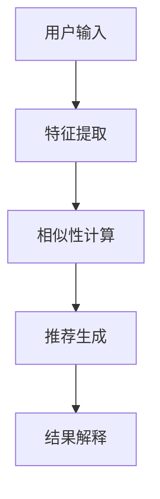
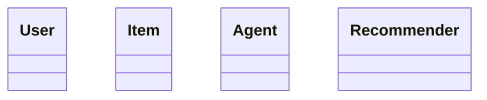
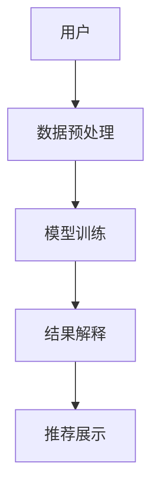

                 


# AI Agent的可解释推荐：提高LLM决策的透明度

## 关键词：
- AI Agent
- 可解释推荐
- LLM决策透明度
- 协同过滤
- 机器学习模型
- 透明度设计

## 摘要：
本文系统地探讨了AI Agent在推荐系统中的应用，特别是如何提高大语言模型（LLM）决策的透明度。通过分析可解释推荐的核心概念、算法原理、数学模型以及系统架构，本文详细介绍了如何实现AI Agent的可解释推荐，并通过实际案例和代码示例展示了具体实现方法。文章还探讨了提高LLM决策透明度的挑战与解决方案，并提出了优化建议和未来研究方向。

---

# 第一部分: AI Agent的可解释推荐概述

## 第1章: AI Agent与可解释推荐的背景

### 1.1 问题背景
#### 1.1.1 AI Agent的定义与特点
- **AI Agent**：智能体，能够感知环境并采取行动以实现目标。
- **特点**：自主性、反应性、主动性、社会性。

#### 1.1.2 可解释推荐的必要性
- 用户信任：推荐结果需易于理解和验证。
- 合规性：尤其在金融、医疗等领域，透明度是合规要求。
- 可优化性：通过解释结果改进模型。

#### 1.1.3 LLM决策透明度的重要性
- 提高用户信任：解释推荐依据。
- 支持调试与优化：识别模型错误。
- 促进人机协作：帮助用户与AI Agent有效互动。

### 1.2 问题描述
#### 1.2.1 AI Agent在推荐系统中的应用
- **推荐场景**：个性化推荐、实时推荐、情境感知推荐。
- **挑战**：推荐结果需具备可解释性，同时满足实时性和高效性。

#### 1.2.2 当前推荐系统中的可解释性问题
- **问题**：黑箱模型，推荐原因不明确。
- **影响**：用户不信任，难以优化模型。

#### 1.2.3 提高LLM决策透明度的挑战与目标
- **挑战**：平衡透明度与模型复杂性。
- **目标**：设计可解释的推荐算法，提高用户信任和系统优化能力。

---

## 第2章: 可解释推荐的核心概念

### 2.1 核心概念与联系
#### 2.1.1 可解释推荐的定义
- 推荐系统需提供可理解的解释，帮助用户理解推荐结果的原因。

#### 2.1.2 AI Agent与推荐系统的关联
- AI Agent作为推荐系统的核心，负责决策和执行。

#### 2.1.3 可解释性与透明度的对比分析
- **可解释性**：推荐结果的原因清晰。
- **透明度**：推荐过程和决策机制公开。

### 2.2 核心概念原理
#### 2.2.1 可解释推荐的属性特征对比表
| 属性 | 不可解释推荐 | 可解释推荐 |
|------|-------------|------------|
| 用户信任 | 低          | 高         |
| 调试优化 | 困难        | 容易        |
| 适用场景 | 个性化推荐   | 高风险场景 |

#### 2.2.2 AI Agent的实体关系图（ER图）
```mermaid
erd
actor 用户;
actor 管理员;
actor AI Agent;
database 推荐系统数据库;
object 用户表;
object 物品表;
object 推荐记录表;

用户 --> 用户表
管理员 --> 用户表
管理员 --> 物品表
AI Agent --> 推荐记录表
用户 --> 推荐记录表
```

---

## 第3章: 可解释推荐的算法原理

### 3.1 算法原理讲解
#### 3.1.1 基于规则的推荐算法
- **规则设定**：如“如果用户购买了X，推荐Y”。
- **优点**：简单、透明。
- **缺点**：灵活性差，难以处理复杂场景。

#### 3.1.2 基于协同过滤的推荐算法
- **协同过滤**：基于用户相似性或物品相似性推荐。
- **优点**：考虑用户行为数据，推荐相关性高。
- **缺点**：计算复杂，难以实时处理。

#### 3.1.3 基于内容的推荐算法
- **内容分析**：基于物品本身的特征进行推荐。
- **优点**：内容相关性高。
- **缺点**：对用户偏好理解有限。

### 3.2 算法流程图


---

## 第4章: 数学模型与公式

### 4.1 数学模型
#### 4.1.1 协同过滤模型
$$相似度 = \frac{\sum_{i}(x_i - \bar{x})(y_i - \bar{y})}{\sqrt{\sum_{i}(x_i - \bar{x})^2} \sqrt{\sum_{i}(y_i - \bar{y})^2}}$$

#### 4.1.2 基于内容的推荐模型
$$概率 = \sum_{i} w_i \cdot x_i$$

### 4.2 举例说明
#### 4.2.1 协同过滤示例
用户A和用户B的相似度计算

#### 4.2.2 基于内容的推荐示例
基于商品描述的相似性计算

---

## 第5章: 系统分析与架构设计

### 5.1 问题场景介绍
#### 5.1.1 AI Agent推荐系统的应用场景
- 个性化推荐、实时推荐、情境感知推荐。

#### 5.1.2 可解释推荐的系统目标
- 提供透明的推荐理由，支持用户验证和优化。

### 5.2 系统功能设计
#### 5.2.1 领域模型类图


### 5.3 系统架构设计


---

## 第6章: 项目实战

### 6.1 环境安装
- **Python**：安装必要的库如`numpy`、`scikit-learn`。
- **代码示例**：
  ```python
  import numpy as np
  from sklearn.metrics.pairwise import cosine_similarity

  # 示例数据
  user_profiles = np.array([[1, 0, 1], [0, 1, 1], [1, 1, 0]])
  item_profiles = np.array([[1, 0, 1], [0, 1, 1], [1, 1, 0]])

  # 计算相似度
  similarity_matrix = cosine_similarity(user_profiles, item_profiles)
  print(similarity_matrix)
  ```

### 6.2 系统实现
- **数据预处理**：特征提取和标准化。
- **模型训练**：协同过滤或基于内容的推荐模型。
- **结果解释**：生成可理解的解释文本。

### 6.3 实际案例分析
- **案例背景**：电商推荐系统。
- **模型实现**：基于用户行为的协同过滤推荐。
- **结果分析**：用户A推荐商品X的原因是基于购买历史相似的用户B也购买了X。

---

## 第7章: 最佳实践与总结

### 7.1 最佳实践
- **选择合适的模型**：根据场景选择可解释性要求高的模型。
- **提供直观解释**：使用可视化或简洁的语言解释推荐结果。
- **持续优化**：定期更新模型并验证解释的有效性。

### 7.2 小结
通过本文的分析，我们了解了AI Agent在可解释推荐中的重要作用，以及如何设计和实现透明的推荐系统。提高LLM决策透明度的关键在于平衡模型复杂性和解释能力。

### 7.3 注意事项
- 避免过度简化模型，导致推荐质量下降。
- 确保解释准确，避免误导用户。

### 7.4 拓展阅读
- 《Explainable AI: The Model-Agnostic Methodology》
- 《透明推荐系统：算法与实践》

---

## 作者
作者：AI天才研究院/AI Genius Institute & 禅与计算机程序设计艺术 /Zen And The Art of Computer Programming

---

通过以上目录结构和内容概述，我们可以系统地探讨AI Agent的可解释推荐问题，从理论到实践，逐步深入分析，为提高LLM决策的透明度提供全面的解决方案。

