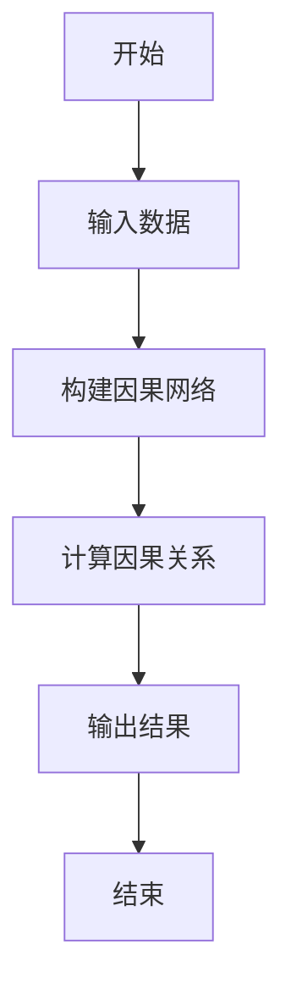
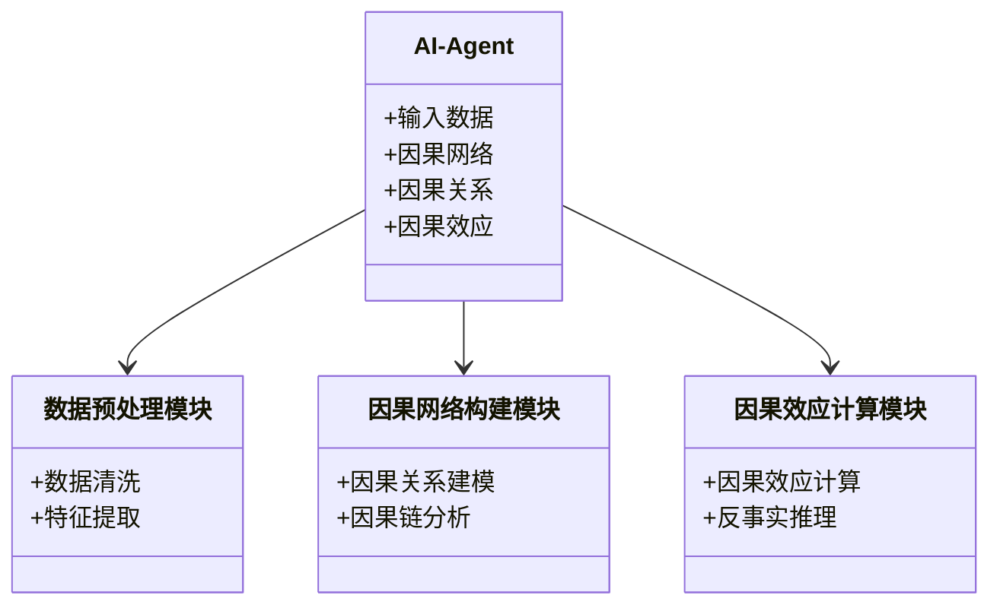
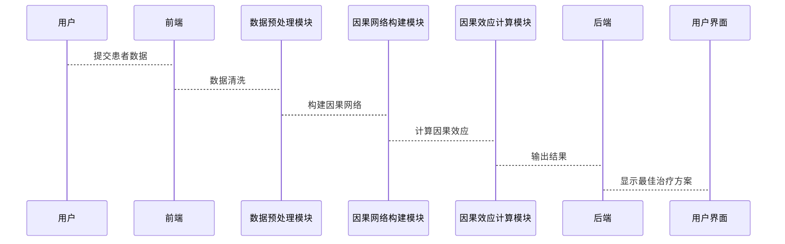

                 


# AI Agent的因果推理能力构建

## 关键词：AI Agent, 因果推理, 系统架构, 算法原理, 项目实战

## 摘要：  
本文详细探讨了AI Agent的因果推理能力构建，从背景介绍、核心概念、算法原理、系统架构到项目实战，层层深入，系统性地分析了如何在AI Agent中实现因果推理能力。通过实际案例分析和代码实现，帮助读者理解并掌握因果推理的核心原理及其在AI Agent中的应用。

---

# 第一部分: AI Agent的因果推理能力构建背景介绍

# 第1章: 背景与问题定义

## 1.1 问题背景

### 1.1.1 AI Agent的定义与特点
AI Agent（人工智能代理）是指能够感知环境、自主决策并执行任务的智能实体。AI Agent具有以下特点：
- **自主性**：能够自主决策，无需外部干预。
- **反应性**：能够实时感知环境并做出响应。
- **目标导向性**：基于目标驱动行为。
- **学习能力**：通过数据和经验提升能力。

### 1.1.2 因果推理的定义与特点
因果推理是指从因果关系中推导出因果效应的能力。其特点包括：
- **因果关系**：研究变量之间的因果关系。
- **因果效应**：推断干预或处理对结果的影响。
- **反事实推理**：考虑“如果...会怎样”的假设。

### 1.1.3 AI Agent与因果推理的关系
AI Agent需要因果推理能力来处理复杂的决策问题，例如在多变量影响的情况下，准确识别因果关系以做出最优决策。

## 1.2 问题描述

### 1.2.1 当前AI Agent的局限性
- **因果关系误解**：传统统计方法难以区分相关关系与因果关系。
- **决策错误**：在复杂场景中，错误的因果推理可能导致错误决策。
- **可解释性不足**：因果推理的复杂性影响AI Agent的可解释性。

### 1.2.2 因果推理在AI Agent中的作用
- **提升决策准确性**：通过因果推理，AI Agent能够做出更准确的决策。
- **增强可解释性**：因果推理使决策过程更具透明性。
- **支持复杂场景处理**：在多变量影响的场景中，因果推理能力使AI Agent能够更好地应对复杂问题。

### 1.2.3 问题解决的目标与意义
目标是构建具备因果推理能力的AI Agent，使其在复杂场景中能够准确识别因果关系并做出最优决策。意义在于提升AI Agent的智能水平，使其在实际应用中更具实用价值。

## 1.3 问题解决

### 1.3.1 因果推理的核心作用
- **因果关系识别**：通过因果推理，AI Agent能够识别变量之间的因果关系。
- **因果效应计算**：通过因果推理，AI Agent能够计算干预或处理的因果效应。

### 1.3.2 AI Agent因果推理能力的构建目标
- **准确识别因果关系**：通过因果推理算法，准确识别变量之间的因果关系。
- **计算因果效应**：基于因果关系，计算干预或处理的因果效应。
- **提升决策能力**：通过因果推理能力，提升AI Agent的决策能力。

### 1.3.3 构建过程中的关键问题
- **因果关系建模**：如何准确建模因果关系？
- **因果效应计算**：如何高效计算因果效应？
- **因果推理的可解释性**：如何提升因果推理的可解释性？

## 1.4 边界与外延

### 1.4.1 因果推理的边界
- **因果关系的复杂性**：因果关系的复杂性可能超出当前算法的处理能力。
- **数据质量**：因果推理依赖高质量的数据，数据不足或不准确会影响推理结果。

### 1.4.2 AI Agent能力的边界
- **计算能力限制**：AI Agent的计算能力限制可能影响因果推理的效率和准确性。
- **知识表示**：因果推理依赖于知识的表示和存储，知识表示的复杂性可能限制推理能力。

### 1.4.3 相关领域与外延
- **统计推断**：因果推理与统计推断密切相关。
- **机器学习**：因果推理与机器学习在某些方面有交叉。
- **知识图谱**：因果推理可以与知识图谱结合，提升推理能力。

## 1.5 概念结构与核心要素

### 1.5.1 因果推理的基本结构
因果推理的基本结构包括：
- **原因（Cause）**：引起结果的变量。
- **结果（Effect）**：原因引起的变化。
- **因果关系（Causal Relation）**：原因与结果之间的关系。

### 1.5.2 AI Agent能力的核心要素
AI Agent因果推理能力的核心要素包括：
- **因果关系识别**：识别变量之间的因果关系。
- **因果效应计算**：计算干预或处理的因果效应。
- **决策优化**：基于因果效应优化决策。

### 1.5.3 核心要素之间的关系
- **因果关系识别与因果效应计算**：因果关系识别是因果效应计算的基础。
- **因果效应计算与决策优化**：因果效应计算为决策优化提供依据。

---

# 第二部分: 核心概念与联系

# 第2章: 因果推理的核心原理

## 2.1 核心概念原理

### 2.1.1 因果关系的定义
因果关系是指一个事件（原因）导致另一个事件（结果）的发生。例如，下雨（原因）导致地面湿（结果）。

### 2.1.2 因果推理的基本原理
因果推理的基本原理包括：
- **因果链**：因果关系可以通过因果链传递。
- **因果网络**：因果关系可以通过有向图表示。

### 2.1.3 因果链与因果网络
- **因果链**：因果关系的传递路径，例如A→B→C。
- **因果网络**：有向图，表示变量之间的因果关系。

## 2.2 概念属性特征对比

### 2.2.1 因果关系与相关关系对比

| 属性         | 因果关系                 | 相关关系                 |
|--------------|--------------------------|--------------------------|
| 定义         | 一个事件导致另一个事件   | 变量之间的统计关联性     |
| 独立性       | 受干预影响               | 不受干预影响             |
| 可控性       | 可控                     | 不可控                   |

### 2.2.2 独立因果与依赖因果对比

| 属性         | 独立因果                 | 依赖因果                 |
|--------------|--------------------------|--------------------------|
| 独立性       | 独立                     | 依赖                     |
| 干预影响     | 干预不影响其他变量       | 干预影响其他变量         |

### 2.2.3 因果推理与统计推断对比

| 属性         | 因果推理                 | 统计推断                 |
|--------------|--------------------------|--------------------------|
| 目标         | 推导因果关系             | 描述数据分布             |
| 干预分析     | 分析干预效果             | 不分析干预效果           |

## 2.3 ER实体关系图架构

```mermaid
er
    Customer: id, name
    Order: order_id, customer_id, order_date
    Product: product_id, product_name, price
    Order_Item: order_id, product_id, quantity
    Customer --> Order
    Customer --> Order_Item
    Order_Item --> Product
```

---

# 第三部分: 算法原理讲解

# 第3章: 因果推理算法原理

## 3.1 算法原理概述

### 3.1.1 因果推理的基本算法
- **反事实推理（Counterfactual Reasoning）**：通过假设相反事实来推导因果效应。
- **潜在结果框架（Potential Outcomes Framework）**：通过潜在结果分析因果效应。

### 3.1.2 算法的数学模型
潜在结果模型定义了每个单元在不同处理下的潜在结果：
$$ Y_i(z) $$
其中，$Y_i(z)$ 表示单元 $i$ 在处理 $z$ 下的潜在结果。

### 3.1.3 算法的实现步骤
1. **数据收集**：收集相关变量的数据。
2. **因果关系建模**：构建因果网络。
3. **因果效应计算**：计算干预或处理的因果效应。
4. **验证与评估**：验证因果推理的正确性并评估效果。

## 3.2 算法实现流程



## 3.3 Python源代码实现

```python
def causal_inference(data):
    # 数据预处理
    processed_data = preprocess(data)
    # 构建因果网络
    causal_graph = build_causal_graph(processed_data)
    # 计算因果关系
    causal_effect = compute_causal_effect(causal_graph)
    return causal_effect
```

## 3.4 算法的数学模型和公式

### 3.4.1 潜在结果模型
$$ Y_i(z) $$
其中，$Y_i(z)$ 表示单元 $i$ 在处理 $z$ 下的潜在结果。

### 3.4.2 平均处理效应（ATE）
$$ ATE = E[Y_i(1) - Y_i(0)] $$

### 3.4.3 因子分解
$$ P(Y|X) = P(Y|do(X))P(X) $$

---

# 第四部分: 系统分析与架构设计

# 第4章: 系统分析与架构设计

## 4.1 问题场景介绍
在医疗领域，AI Agent需要根据患者的症状、病史和治疗方案，推断不同治疗方案的因果效应，以制定最佳治疗方案。

## 4.2 系统功能设计



## 4.3 系统架构设计


## 4.4 系统接口设计
- **输入接口**：接收患者数据和治疗方案。
- **输出接口**：输出不同治疗方案的因果效应和最佳治疗方案。

## 4.5 系统交互流程



---

# 第五部分: 项目实战

# 第5章: 项目实战

## 5.1 环境安装
- **Python 3.8及以上**
- **Jupyter Notebook**
- **Pip安装依赖库**：`pip install pandas numpy networkx`

## 5.2 核心代码实现

```python
import pandas as pd
import numpy as np
import networkx as nx

def preprocess(data):
    # 数据清洗
    processed_data = data.dropna()
    return processed_data

def build_causal_graph(data):
    # 构建因果网络
    G = nx.DiGraph()
    G.add_edges_from([('X', 'Y'), ('Z', 'Y')])
    return G

def compute_causal_effect(causal_graph):
    # 计算因果效应
    causal_effect = nx.transitive_closure(causal_graph)
    return causal_effect

# 示例数据
data = pd.DataFrame({
    'X': [1, 2, 3],
    'Y': [4, 5, 6],
    'Z': [7, 8, 9]
})

processed_data = preprocess(data)
causal_graph = build_causal_graph(processed_data)
causal_effect = compute_causal_effect(causal_graph)

print(causal_effect)
```

## 5.3 代码应用解读与分析
- **数据预处理**：对输入数据进行清洗和特征提取，确保数据质量。
- **因果网络构建**：基于预处理后的数据，构建因果网络，表示变量之间的因果关系。
- **因果效应计算**：基于因果网络，计算干预或处理的因果效应，为决策提供依据。

## 5.4 实际案例分析
假设在医疗领域，AI Agent需要分析不同治疗方案对患者康复的影响。通过因果推理，AI Agent可以识别哪些治疗方案对患者康复有显著影响，从而制定最佳治疗方案。

## 5.5 项目小结
通过本项目，读者可以掌握因果推理的基本原理和实现方法，能够将因果推理应用于实际场景中，提升AI Agent的决策能力。

---

# 第六部分: 总结与扩展

# 第6章: 总结与扩展

## 6.1 最佳实践 tips
- **数据质量**：因果推理依赖高质量的数据，确保数据准确性和完整性。
- **模型选择**：根据具体场景选择合适的因果推理算法。
- **可解释性**：注重因果推理的可解释性，提升用户信任度。

## 6.2 小结
本文系统性地探讨了AI Agent的因果推理能力构建，从背景介绍、核心概念、算法原理、系统架构到项目实战，全面分析了如何在AI Agent中实现因果推理能力。

## 6.3 注意事项
- **算法的局限性**：当前因果推理算法在处理复杂因果关系时可能存在局限性。
- **数据的依赖性**：因果推理依赖高质量的数据，数据不足或不准确会影响推理结果。
- **计算能力限制**：复杂因果网络的处理可能需要强大的计算能力。

## 6.4 拓展阅读
- **《因果的发现与推断》**：深入探讨因果关系的发现与推断。
- **《AI Agent的决策理论》**：系统性地分析AI Agent的决策理论。
- **《因果推理在机器学习中的应用》**：探讨因果推理在机器学习中的应用。

---

# 作者：AI天才研究院/AI Genius Institute & 禅与计算机程序设计艺术 /Zen And The Art of Computer Programming

