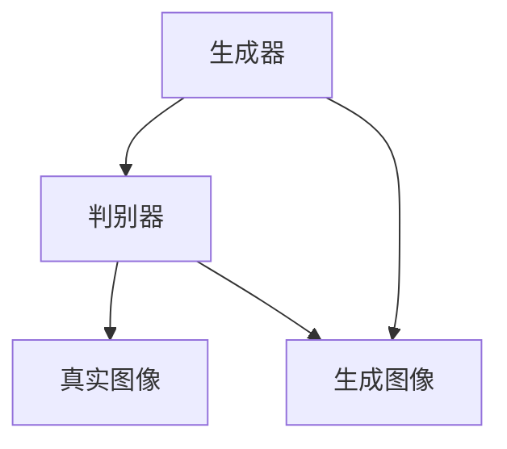
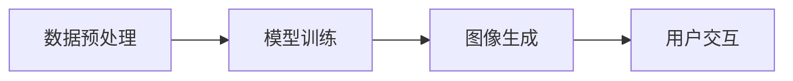
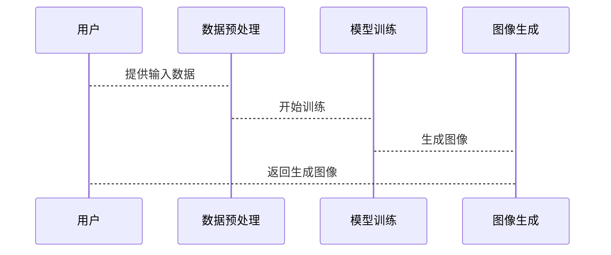

                 


# AI Agent的图像生成与编辑能力实现

> 关键词：AI Agent，图像生成，生成式AI，GAN，VAE，图像编辑

> 摘要：本文详细探讨了AI Agent在图像生成与编辑领域的实现方法，从生成式AI的基本原理到具体算法的实现，再到系统架构的设计，结合实际案例，深入剖析了AI Agent在图像生成与编辑中的应用。

---

## 第1章: AI Agent与图像生成概述

### 1.1 AI Agent的基本概念
AI Agent（人工智能代理）是指能够感知环境、自主决策并执行任务的智能实体。AI Agent的核心特征包括自主性、反应性、目标导向和学习能力。它广泛应用于图像生成、自然语言处理、推荐系统等领域。

### 1.2 图像生成与编辑的背景
图像生成技术经历了从传统图像处理到基于深度学习的生成式AI的演变。生成式AI能够通过学习大量数据，生成高质量的图像，而图像编辑技术则允许对图像进行精确的修改和增强。

### 1.3 生成式AI的基本原理
生成式AI通过数学模型学习数据的分布，并利用这些模型生成新的数据。常见的生成式模型包括GAN（生成对抗网络）和VAE（变分自编码器）。这些模型能够生成逼真的图像，为AI Agent的图像生成能力提供了基础。

### 1.4 图像生成与编辑的挑战
图像生成的质量、编辑的精准性以及算法的计算效率是当前面临的主要挑战。解决这些问题需要结合先进的算法优化技术和硬件加速方法。

---

## 第2章: 生成式AI的核心概念与联系

### 2.1 生成式AI的原理
生成式AI通过生成器和判别器的对抗训练，不断优化生成图像的质量。生成器的目标是生成逼真的图像，而判别器则试图区分生成图像和真实图像。

### 2.2 生成式AI的核心算法
- **GAN（生成对抗网络）**：由生成器和判别器组成，通过对抗训练生成图像。
- **VAE（变分自编码器）**：通过编码器将图像压缩为隐变量，解码器再将其还原为图像。
- **其他模型**：如深度信念网络和深度玻尔兹曼机，各有其独特的优缺点。

### 2.3 不同生成式模型的对比
| 模型 | 优点 | 缺点 |
|------|------|------|
| GAN | 生成质量高 | 易发模式崩塌 |
| VAE | 稳定性好 | 生成多样性不足 |
| 其他模型 | 各自有其适用场景 | 通常不如GAN和VAE效果好 |

### 2.4 生成式AI的实体关系图


---

## 第3章: 图像生成与编辑的算法原理

### 3.1 GAN算法的原理
GAN由生成器和判别器组成，训练目标是使生成器生成的图像尽可能接近真实图像。生成器和判别器的损失函数如下：
$$\text{生成器损失} = -\log(D(G(x)))$$
$$\text{判别器损失} = -(\log(D(x)) + \log(1 - D(G(x))))$$
其中，$x$是输入数据，$G$是生成器，$D$是判别器。

### 3.2 VAE算法的原理
VAE通过编码器将图像编码为隐变量$z$，然后通过解码器将$z$还原为图像。VAE的目标是最小化重建损失和KL散度：
$$\mathcal{L} = \mathbb{E}[||x - G(z)||^2] + \mathbb{E}[KL(q(z|x)||p(z))]$$

### 3.3 其他生成式模型的算法
深度信念网络和深度玻尔兹曼机通过无监督学习生成图像，但其效果通常不如GAN和VAE。

---

## 第4章: 系统分析与架构设计

### 4.1 项目背景
本文旨在实现一个基于GAN的AI Agent图像生成系统，用于生成高质量的图像。

### 4.2 系统功能设计
系统功能模块包括数据预处理、模型训练、图像生成和用户交互。

### 4.3 系统架构设计


### 4.4 系统接口设计
系统通过API接口接收输入数据，并返回生成的图像。

### 4.5 系统交互流程


---

## 第5章: 项目实战

### 5.1 环境安装
安装Python、TensorFlow和Keras等依赖库。

### 5.2 核心实现代码
```python
import tensorflow as tf
from tensorflow.keras import layers

class Generator:
    def __init__(self):
        self.model = self.build_model()

    def build_model(self):
        model = tf.keras.Sequential([
            layers.Dense(256, activation='relu'),
            layers.Dense(784, activation='sigmoid')
        ])
        return model

class Discriminator:
    def __init__(self):
        self.model = self.build_model()

    def build_model(self):
        model = tf.keras.Sequential([
            layers.Dense(256, activation='relu'),
            layers.Dense(1, activation='sigmoid')
        ])
        return model
```

### 5.3 案例分析
通过训练GAN模型，生成高质量的图像，并分析生成效果。

### 5.4 项目总结
本项目展示了AI Agent在图像生成中的应用潜力，未来可以进一步优化算法和提升生成质量。

---

## 第6章: 最佳实践

### 6.1 小结
本文详细探讨了AI Agent在图像生成与编辑中的实现方法，从理论到实践，全面分析了相关技术和应用。

### 6.2 注意事项
在实现过程中，需注意模型的训练效率和生成图像的质量。

### 6.3 拓展阅读
建议阅读深度学习相关的书籍，如《Deep Learning》。

---

## 作者：AI天才研究院 & 禅与计算机程序设计艺术

---

以上是关于《AI Agent的图像生成与编辑能力实现》的技术博客文章的完整内容，涵盖了从理论到实践的各个方面，旨在为读者提供全面而深入的指导。

