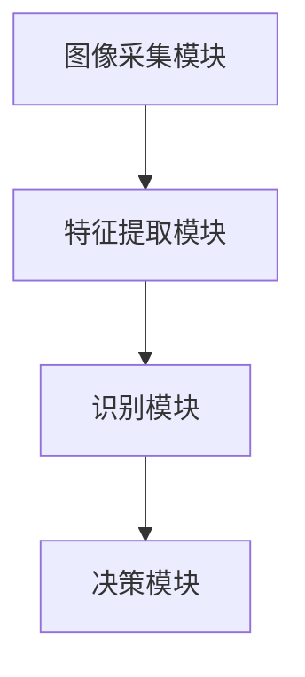
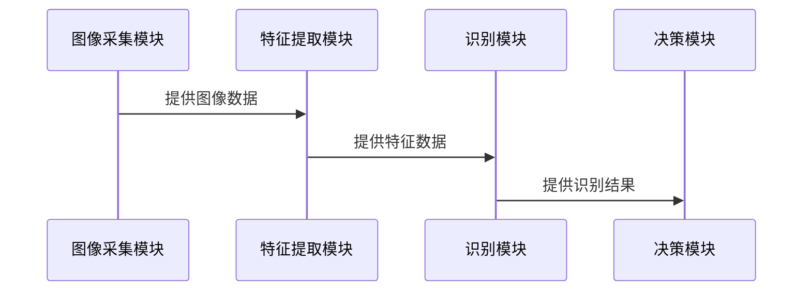

                 

# AI Agent的图像识别与处理技术

> 关键词：AI Agent、图像识别、图像处理、深度学习、计算机视觉

> 摘要：AI Agent通过图像识别技术实现对视觉信息的感知与处理，本文详细探讨了AI Agent在图像识别与处理中的应用，从算法原理到系统架构设计，再到项目实战，全面解析了AI Agent如何利用图像识别技术实现智能化处理。

---

## 第一部分：AI Agent的图像识别与处理技术基础

### 第1章：图像识别与AI Agent概述

#### 1.1 图像识别的基本概念

##### 1.1.1 图像识别的定义与核心问题
图像识别是计算机视觉领域的重要技术，旨在通过算法分析图像内容，识别出图像中的物体、场景或文字等信息。其核心问题是如何让计算机像人类一样理解和识别图像中的内容。

##### 1.1.2 AI Agent的定义与特点
AI Agent（人工智能代理）是一种智能实体，能够感知环境、执行任务并做出决策。AI Agent的特点包括自主性、反应性、目标导向性和社会性。

##### 1.1.3 图像识别在AI Agent中的应用价值
图像识别技术为AI Agent提供了视觉感知能力，使其能够处理图像数据，从而在多个领域（如自动驾驶、智能安防、医疗影像分析等）中实现智能化应用。

#### 1.2 AI Agent与图像处理的关系

##### 1.2.1 AI Agent的基本工作原理
AI Agent通过感知环境输入数据，利用算法处理数据并做出决策。图像处理是其感知环境的重要方式之一。

##### 1.2.2 图像处理在AI Agent中的角色
图像处理为AI Agent提供视觉信息，帮助其理解环境、识别目标并做出相应的决策。

##### 1.2.3 图像识别技术的核心挑战
图像识别技术面临数据多样性、光照变化、目标遮挡等挑战，如何提高算法的鲁棒性和准确性是核心问题。

#### 1.3 图像识别技术的发展与现状

##### 1.3.1 图像识别技术的历史演变
从传统的基于特征的图像识别到现代的深度学习方法，图像识别技术经历了从简单到复杂的演变过程。

##### 1.3.2 当前主流图像识别技术的对比
目前主流的图像识别技术包括基于传统特征的识别方法（如SIFT、HOG）和基于深度学习的识别方法（如CNN、YOLO）。

##### 1.3.3 AI Agent在图像识别领域的应用前景
随着深度学习技术的不断发展，AI Agent在图像识别领域的应用前景广阔，尤其是在自动驾驶、智能安防等领域具有巨大的潜力。

---

### 第2章：AI Agent图像识别的核心概念与原理

#### 2.1 图像识别的核心概念

##### 2.1.1 图像的特征提取
特征提取是图像识别的关键步骤，通过提取图像中的关键特征，为后续的识别任务提供基础。

##### 2.1.2 图像分类与目标检测
图像分类是将图像分类到预定义的类别中，目标检测是在图像中定位和识别目标物体。

##### 2.1.3 图像分割与语义理解
图像分割将图像划分为多个区域，语义理解则是对图像内容进行高层次的理解。

#### 2.2 AI Agent中的图像处理流程

##### 2.2.1 图像采集与预处理
图像采集是获取图像数据的初始步骤，预处理包括图像增强、去噪等操作，以提高后续处理的准确性。

##### 2.2.2 图像特征提取与表示
特征提取是通过算法提取图像中的关键特征，常见的特征表示方法包括SIFT、HOG等。

##### 2.2.3 图像识别与决策
AI Agent通过图像识别技术对图像进行分析，结合其他传感器数据，做出最终的决策。

#### 2.3 图像识别的关键技术对比

##### 2.3.1 基于传统特征的图像识别
基于传统特征的图像识别方法通过提取图像的几何特征或纹理特征，进行图像分类或目标检测。

##### 2.3.2 基于深度学习的图像识别
基于深度学习的图像识别方法利用卷积神经网络（CNN）等模型，自动提取图像特征并进行分类。

##### 2.3.3 基于模型的图像识别
基于模型的图像识别方法结合领域知识，构建特定模型进行图像分析，如医学影像分析中的模型驱动方法。

---

### 第3章：AI Agent图像识别的算法原理

#### 3.1 基于CNN的图像识别算法

##### 3.1.1 卷积神经网络（CNN）的结构
CNN由卷积层、池化层、全连接层等组成，通过逐层提取图像特征，实现图像分类。

##### 3.1.2 池化操作与网络层数
池化操作用于降低计算复杂度和过拟合风险，网络层数决定了模型的复杂度和表达能力。

##### 3.1.3 CNN的前向传播与反向传播
前向传播通过卷积操作提取特征，反向传播通过梯度下降优化模型参数。

#### 3.2 目标检测算法（以YOLO为例）

##### 3.2.1 YOLO算法的基本原理
YOLO将图像划分为网格，每个网格负责检测特定的目标，通过回归预测目标的位置和类别。

##### 3.2.2 YOLO的网络结构与损失函数
YOLO的网络结构包括特征提取层和预测层，损失函数包括分类损失和定位损失。

##### 3.2.3 YOLO的图像处理流程
YOLO通过单个网络完成目标检测，具有速度快、精度高的特点。

#### 3.3 图像分割算法（以U-Net为例）

##### 3.3.1 U-Net的网络结构
U-Net由编码器和解码器组成，编码器提取图像特征，解码器通过跳跃连接恢复图像细节。

##### 3.3.2 图像分割的损失函数
常用的损失函数包括交叉熵损失和Dice损失，用于优化分割结果。

##### 3.3.3 U-Net的图像分割流程
U-Net通过编码器提取特征，解码器逐步恢复图像分割结果。

---

### 第4章：AI Agent图像识别的系统架构与设计

#### 4.1 系统架构设计

##### 4.1.1 系统功能模块
AI Agent图像识别系统包括图像采集模块、特征提取模块、识别模块和决策模块。

##### 4.1.2 系统架构图

#### 4.2 接口设计

##### 4.2.1 系统接口
系统接口包括图像输入接口、特征提取接口、识别结果接口和决策结果接口。

##### 4.2.2 接口交互序列图

---

## 第五部分：总结与展望

### 5.1 总结
本文详细探讨了AI Agent在图像识别与处理技术中的应用，从算法原理到系统架构设计，再到项目实战，全面解析了AI Agent如何利用图像识别技术实现智能化处理。

### 5.2 展望
随着深度学习技术的不断发展，AI Agent在图像识别领域的应用前景广阔。未来的研究方向包括提高算法的鲁棒性和准确性，优化系统的实时性，以及拓展在更多领域的应用。

---

作者：AI天才研究院/AI Genius Institute & 禅与计算机程序设计艺术 /Zen And The Art of Computer Programming

