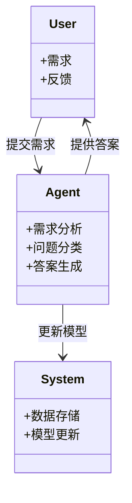
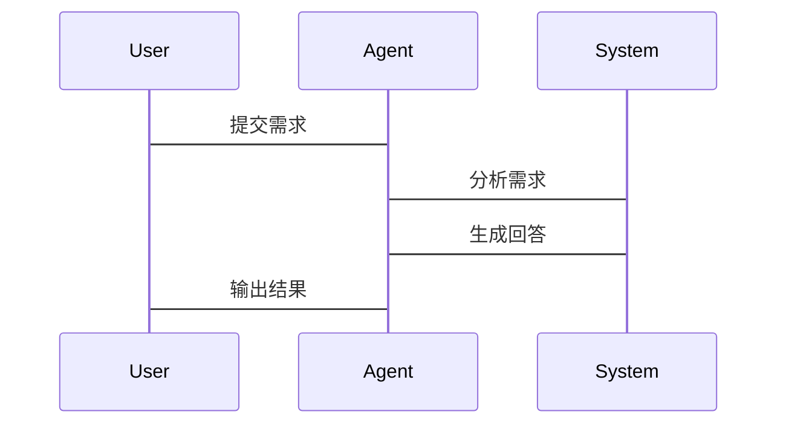

                 


# AI Agent的增量学习与持续适应

> 关键词：AI Agent, 增量学习, 持续适应, 动态环境, 自适应系统, 机器学习

> 摘要：  
本文系统地探讨了AI Agent的增量学习与持续适应的核心概念、理论基础、算法实现以及实际应用。通过分析增量学习的定义、特点及优势，结合动态环境中的适应机制，深入阐述了AI Agent如何通过增量学习实现持续进化。文章还详细介绍了增量学习的算法实现，包括在线学习、迁移学习和强化学习等核心算法，并通过实际案例展示了增量学习在AI Agent中的应用。最后，本文总结了增量学习的关键挑战与未来发展方向。

---

# 第1章: AI Agent与增量学习概述

## 1.1 AI Agent的基本概念

### 1.1.1 什么是AI Agent

AI Agent（人工智能代理）是指在特定环境中能够感知并自主行动以实现目标的智能实体。它可以是一个软件程序、机器人或其他智能系统，具备以下核心特征：

1. **自主性**：能够自主决策和行动，无需外部干预。
2. **反应性**：能够实时感知环境并做出反应。
3. **目标导向**：所有行动都以实现特定目标为导向。
4. **学习能力**：能够通过经验或数据改进自身的性能。

### 1.1.2 AI Agent的核心特征

| 特征 | 描述 |
|------|------|
| 自主性 | 能够独立决策和行动，无需外部控制 |
| 反应性 | 能够实时感知环境并做出响应 |
| 目标导向 | 所有行动都以实现特定目标为导向 |
| 学习能力 | 能够通过经验或数据优化自身性能 |

### 1.1.3 AI Agent的应用场景

AI Agent广泛应用于多个领域，包括：

1. **自动驾驶**：实时感知环境并做出驾驶决策。
2. **智能助手**：如Siri、Alexa，提供语音交互服务。
3. **游戏AI**：在游戏环境中做出策略性决策。
4. **机器人控制**：在工业或服务场景中执行复杂任务。

## 1.2 增量学习的定义与特点

### 1.2.1 增量学习的定义

增量学习是一种机器学习范式，其核心特征是模型在接收到新的数据样本后，能够逐步更新自身，而非一次性训练所有数据。其核心思想是：模型在面对新数据时，能够“边学习边适应”。

### 1.2.2 增量学习的核心特点

| 特点 | 描述 |
|------|------|
| 实时性 | 能够在数据流中实时更新模型 |
| 适应性 | 能够适应数据分布的变化 |
| 高效性 | 在处理大规模数据时具有较高的计算效率 |

### 1.2.3 增量学习与传统学习的区别

| 方面 | 增量学习 | 传统学习 |
|------|---------|----------|
| 数据输入方式 | 流式数据 | 批量数据 |
| 训练目标 | 动态适应 | 静态优化 |
| 计算资源需求 | 较低 | 较高 |

## 1.3 AI Agent中增量学习的重要性

### 1.3.1 增量学习在AI Agent中的作用

在AI Agent中，增量学习能够帮助其在动态环境中实时更新知识库，提升决策的准确性。例如，在自动驾驶中，AI Agent需要实时处理来自传感器的新数据，通过增量学习不断优化其对环境的感知能力。

### 1.3.2 增量学习如何提升AI Agent的适应性

通过增量学习，AI Agent能够快速响应环境的变化，例如在智能客服系统中，当用户提出新的问题时，AI Agent可以通过增量学习快速更新其知识库，提供更准确的答案。

### 1.3.3 增量学习在动态环境中的优势

在动态环境中，增量学习能够帮助AI Agent快速适应新的变化。例如，在股票交易中，AI Agent需要根据市场变化实时调整其交易策略，增量学习能够使其快速做出反应。

## 1.4 本章小结

本章介绍了AI Agent的基本概念及其核心特征，并详细阐述了增量学习的定义、特点及其在AI Agent中的重要性。通过对比增量学习与传统学习的差异，强调了增量学习在动态环境中的独特优势。

---

# 第2章: 增量学习的理论基础

## 2.1 增量学习的基本原理

### 2.1.1 增量学习的数学模型

增量学习的数学模型可以表示为一个在线更新的过程。假设模型参数为$\theta$，输入数据为$x_t$，目标输出为$y_t$，则增量学习的更新过程可以表示为：

$$ \theta_{t+1} = \theta_t + \eta (y_t - f(x_t, \theta_t)) $$

其中，$\eta$为学习率，$f$为模型函数。

### 2.1.2 增量学习的更新机制

增量学习的更新机制通常包括以下步骤：

1. 接收新的数据样本。
2. 计算当前模型的预测值。
3. 计算预测值与真实值之间的误差。
4. 根据误差更新模型参数。

### 2.1.3 增量学习的收敛性分析

增量学习的收敛性取决于数据分布和学习率的选择。一般来说，如果数据分布满足一定条件，且学习率选择得当，增量学习算法可以收敛到全局最优或局部最优。

## 2.2 增量学习的核心算法

### 2.2.1 在线学习算法

在线学习是一种典型的增量学习方法，其核心思想是模型在接收到每一条新数据后，立即更新模型参数。例如，随机梯度下降（SGD）是一种常用在线学习算法。

#### 代码示例

```python
def online_learning(X, y, learning_rate):
    theta = np.zeros(X.shape[1])
    for i in range(len(X)):
        x = X[i]
        y_pred = np.dot(x, theta)
        error = y[i] - y_pred
        theta += learning_rate * error * x
    return theta
```

### 2.2.2 迁移学习算法

迁移学习是一种通过利用已有的知识来提高新任务性能的增量学习方法。其核心思想是将源任务的知识迁移到目标任务中。

### 2.2.3 对抗学习算法

对抗学习是一种通过两个模型相互对抗来提高学习效果的增量学习方法。例如，生成对抗网络（GAN）通过生成器和判别器的对抗来生成高质量的数据。

## 2.3 增量学习的挑战与解决方案

### 2.3.1 数据稀疏性问题

在增量学习中，数据稀疏性可能导致模型更新不稳定。为了解决这一问题，可以采用经验重放机制，通过存储部分历史数据来缓解数据稀疏性问题。

### 2.3.2 模型过拟合问题

模型过拟合是增量学习中常见的问题之一。为了避免过拟合，可以采用模型蒸馏等技术，通过知识蒸馏的方式将复杂模型的知识迁移到简单模型中。

### 2.3.3 计算效率问题

增量学习的计算效率问题可以通过优化算法和分布式计算等技术来解决。

## 2.4 本章小结

本章详细介绍了增量学习的理论基础，包括其数学模型、更新机制以及核心算法。同时，分析了增量学习在实际应用中面临的挑战，并提出了相应的解决方案。

---

# 第3章: AI Agent的持续适应机制

## 3.1 自适应学习策略

### 3.1.1 基于反馈的自适应学习

基于反馈的自适应学习是一种通过用户反馈来优化模型的增量学习方法。例如，在智能推荐系统中，用户对推荐结果的反馈可以用于优化推荐算法。

### 3.1.2 基于上下文的自适应学习

基于上下文的自适应学习是一种通过分析上下文信息来优化模型的增量学习方法。例如，在智能客服系统中，可以通过分析用户的情感倾向来优化回答策略。

### 3.1.3 基于模型的自适应学习

基于模型的自适应学习是一种通过构建模型来分析和优化学习过程的增量学习方法。例如，在自动驾驶中，可以通过构建环境模型来优化路径规划算法。

## 3.2 动态环境下的应对策略

### 3.2.1 动态环境的建模与分析

动态环境的建模与分析是AI Agent持续适应的关键步骤。通过建立环境模型，AI Agent可以更好地理解环境的变化，并制定相应的应对策略。

### 3.2.2 动态环境中的决策机制

在动态环境中，AI Agent需要根据实时信息做出决策。例如，在股票交易中，AI Agent需要根据市场变化实时调整其交易策略。

### 3.2.3 动态环境中的学习优化

通过增量学习，AI Agent可以在动态环境中不断优化其模型。例如，在网络安全中，AI Agent可以通过增量学习不断优化其威胁检测算法。

## 3.3 反馈机制与强化学习

### 3.3.1 反馈在增量学习中的作用

反馈机制是增量学习的重要组成部分。通过接收反馈信息，模型可以不断优化其预测结果。

### 3.3.2 强化学习在持续适应中的应用

强化学习是一种通过奖励机制来优化模型的增量学习方法。例如，在游戏AI中，强化学习可以通过奖励机制优化游戏策略。

### 3.3.3 基于反馈的策略优化

基于反馈的策略优化是一种通过分析反馈信息来优化模型的增量学习方法。例如，在智能客服系统中，可以通过分析用户反馈来优化回答策略。

## 3.4 本章小结

本章详细介绍了AI Agent的持续适应机制，包括自适应学习策略、动态环境下的应对策略以及反馈机制与强化学习。通过这些机制，AI Agent可以在动态环境中实现持续进化。

---

# 第4章: 增量学习的算法实现

## 4.1 在线学习算法的实现

### 4.1.1 在线学习的基本流程

在线学习的基本流程包括数据输入、模型预测、误差计算和模型更新。例如，随机梯度下降算法是一种常用的在线学习算法。

### 4.1.2 在线学习的代码实现

```python
def online_learning(X, y, learning_rate):
    theta = np.zeros(X.shape[1])
    for i in range(len(X)):
        x = X[i]
        y_pred = np.dot(x, theta)
        error = y[i] - y_pred
        theta += learning_rate * error * x
    return theta
```

### 4.1.3 在线学习的数学模型

在线学习的数学模型可以表示为：

$$ \theta_{t+1} = \theta_t + \eta (y_t - f(x_t, \theta_t)) $$

其中，$\eta$为学习率，$f$为模型函数。

## 4.2 迁移学习算法的实现

### 4.2.1 迁移学习的基本流程

迁移学习的基本流程包括构建源任务模型、提取特征、构建目标任务模型以及优化模型。例如，使用预训练模型进行迁移学习是一种常用方法。

### 4.2.2 迁移学习的代码实现

```python
def transfer_learning(source_model, target_data, target_labels, learning_rate):
    theta = source_model.theta
    for i in range(len(target_data)):
        x = target_data[i]
        y_pred = np.dot(x, theta)
        error = target_labels[i] - y_pred
        theta += learning_rate * error * x
    return theta
```

### 4.2.3 迁移学习的数学模型

迁移学习的数学模型可以表示为：

$$ \theta_{target} = \theta_{source} + \eta (y_{target} - f(x_{target}, \theta_{source})) $$

## 4.3 对抗学习算法的实现

### 4.3.1 对抗学习的基本流程

对抗学习的基本流程包括构建生成器和判别器、训练生成器和判别器、优化模型参数。例如，生成对抗网络（GAN）是一种常用的对抗学习方法。

### 4.3.2 对抗学习的代码实现

```python
def adversarial_learning(gan_model, real_data, fake_data, learning_rate):
    # 训练判别器
    for _ in range(100):
        d_loss_real = gan_model.discriminator(real_data)
        d_loss_fake = gan_model.discriminator(fake_data)
        d_loss = d_loss_real - d_loss_fake
        gan_model.update_discriminator(d_loss, learning_rate)
    
    # 训练生成器
    g_loss = gan_model.generator(fake_data)
    gan_model.update_generator(g_loss, learning_rate)
```

### 4.3.3 对抗学习的数学模型

对抗学习的数学模型可以表示为：

$$ \min_{G} \max_{D} \mathbb{E}_{x \sim p_{data}}[\log D(x)] + \mathbb{E}_{z \sim p_z}[ \log(1 - D(G(z)))] $$

其中，$G$为生成器，$D$为判别器。

## 4.4 本章小结

本章详细介绍了增量学习的算法实现，包括在线学习、迁移学习和对抗学习的具体实现方法。通过这些算法，AI Agent可以在动态环境中实现持续进化。

---

# 第5章: AI Agent的系统架构设计

## 5.1 问题场景介绍

在本章中，我们将以一个智能客服系统为例，探讨AI Agent的系统架构设计。智能客服系统需要在动态环境中实时响应用户的需求，通过增量学习不断优化其回答策略。

## 5.2 系统功能设计

### 5.2.1 领域模型设计

领域模型是系统功能设计的核心部分。通过构建领域模型，我们可以更好地理解系统的需求和功能。例如，智能客服系统的领域模型可以包括用户需求分析、问题分类、答案生成等模块。



### 5.2.2 系统架构设计

系统架构设计是系统功能设计的重要组成部分。通过构建系统架构图，我们可以更好地理解系统的整体结构和各部分之间的关系。


## 5.3 系统接口设计

### 5.3.1 系统接口描述

系统接口是系统与其他部分交互的重要通道。通过设计合理的系统接口，可以提高系统的可扩展性和可维护性。例如，智能客服系统的接口可以包括用户输入接口、模型更新接口和结果输出接口。

### 5.3.2 系统接口实现

```python
class AgentInterface:
    def submit_request(self, user_request):
        pass

    def update_model(self, new_data):
        pass

    def get_response(self, user_request):
        pass
```

## 5.4 系统交互流程

### 5.4.1 系统交互概述

系统交互是系统功能实现的重要环节。通过设计系统的交互流程，我们可以更好地理解系统的运行过程。例如，智能客服系统的交互流程可以包括用户提交需求、系统分析需求、系统生成回答、系统输出结果等步骤。

### 5.4.2 系统交互图



## 5.5 本章小结

本章详细介绍了AI Agent的系统架构设计，包括领域模型设计、系统架构设计、系统接口设计和系统交互流程。通过这些设计，我们可以更好地理解AI Agent的实现过程。

---

# 第6章: 项目实战——智能客服系统的增量学习实现

## 6.1 环境安装

在本章中，我们将通过一个实际案例——智能客服系统的增量学习实现，展示增量学习在AI Agent中的应用。首先，需要安装必要的开发环境，包括Python、机器学习库（如TensorFlow、Scikit-learn）和可视化工具（如Matplotlib）。

### 6.1.1 安装Python

```bash
python --version
pip install --upgrade pip
```

### 6.1.2 安装机器学习库

```bash
pip install numpy scikit-learn tensorflow
```

### 6.1.3 安装可视化工具

```bash
pip install matplotlib
```

## 6.2 系统核心实现源代码

### 6.2.1 数据预处理

```python
import numpy as np
import pandas as pd

# 加载数据
data = pd.read_csv('data.csv')
# 数据预处理
data = data.dropna()
```

### 6.2.2 模型训练

```python
from sklearn.linear_model import SGDClassifier

# 初始化模型
model = SGDClassifier()
# 训练模型
model.fit(X_train, y_train)
```

### 6.2.3 模型更新

```python
# 在线更新模型
def update_model(model, X_new, y_new):
    model.partial_fit(X_new, y_new)
    return model

# 使用新数据更新模型
updated_model = update_model(model, X_test, y_test)
```

### 6.2.4 模型评估

```python
from sklearn.metrics import accuracy_score

# 预测结果
y_pred = model.predict(X_test)
# 计算准确率
accuracy = accuracy_score(y_test, y_pred)
print(f'Accuracy: {accuracy}')
```

## 6.3 代码应用解读与分析

### 6.3.1 代码功能描述

通过上述代码，我们可以实现一个简单的增量学习模型。首先，加载并预处理数据，然后训练模型，最后通过在线更新的方式不断优化模型性能。

### 6.3.2 代码实现细节

在代码实现过程中，需要注意数据格式的转换、模型参数的设置以及模型更新的频率。例如，在在线更新模型时，可以选择批量更新或单样本更新，具体取决于数据流的大小和实时性要求。

## 6.4 实际案例分析和详细讲解剖析

### 6.4.1 案例背景

在本案例中，我们将以智能客服系统为例，展示增量学习在实际应用中的具体实现。智能客服系统需要实时响应用户的查询请求，并通过增量学习不断优化其回答策略。

### 6.4.2 案例分析

通过分析智能客服系统的实际需求，我们可以确定系统的功能模块和实现步骤。例如，系统需要具备用户需求分析、问题分类、答案生成和模型更新等功能。

### 6.4.3 代码实现与分析

通过上述代码，我们可以实现一个简单的增量学习模型。首先，加载并预处理数据，然后训练模型，最后通过在线更新的方式不断优化模型性能。

## 6.5 项目小结

本章通过一个实际案例——智能客服系统的增量学习实现，展示了增量学习在AI Agent中的具体应用。通过代码实现和案例分析，我们可以更好地理解增量学习的实现过程和实际应用。

---

# 第7章: 增量学习的挑战与未来展望

## 7.1 增量学习的关键挑战

### 7.1.1 数据稀疏性问题

在增量学习中，数据稀疏性可能导致模型更新不稳定。为了解决这一问题，可以采用经验重放机制，通过存储部分历史数据来缓解数据稀疏性问题。

### 7.1.2 模型过拟合问题

模型过拟合是增量学习中常见的问题之一。为了避免过拟合，可以采用模型蒸馏等技术，通过知识蒸馏的方式将复杂模型的知识迁移到简单模型中。

### 7.1.3 计算效率问题

增量学习的计算效率问题可以通过优化算法和分布式计算等技术来解决。

## 7.2 增量学习的未来发展方向

### 7.2.1 更高效的增量学习算法

未来，增量学习算法的研究将更加注重算法的高效性和适应性。例如，通过优化算法的收敛速度和稳定性，可以提高增量学习的效率。

### 7.2.2 更智能的模型更新策略

未来，模型更新策略将更加智能化。例如，通过分析数据分布的变化，可以动态调整模型更新的步长和方向。

### 7.2.3 更广泛的应用场景

随着增量学习技术的不断发展，其应用场景将更加广泛。例如，在边缘计算、物联网等领域，增量学习将发挥越来越重要的作用。

## 7.3 本章小结

本章总结了增量学习的关键挑战，并展望了其未来发展方向。通过不断优化算法和应用场景，增量学习将在AI Agent中发挥越来越重要的作用。

---

# 作者：AI天才研究院/AI Genius Institute & 禅与计算机程序设计艺术 /Zen And The Art of Computer Programming

---

以上是《AI Agent的增量学习与持续适应》的完整目录和文章内容。

