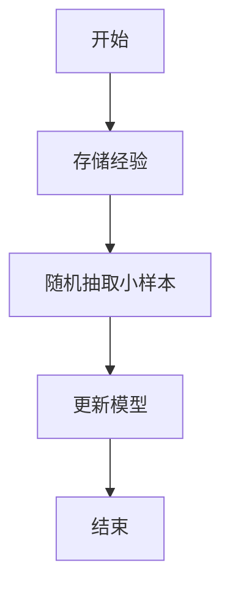
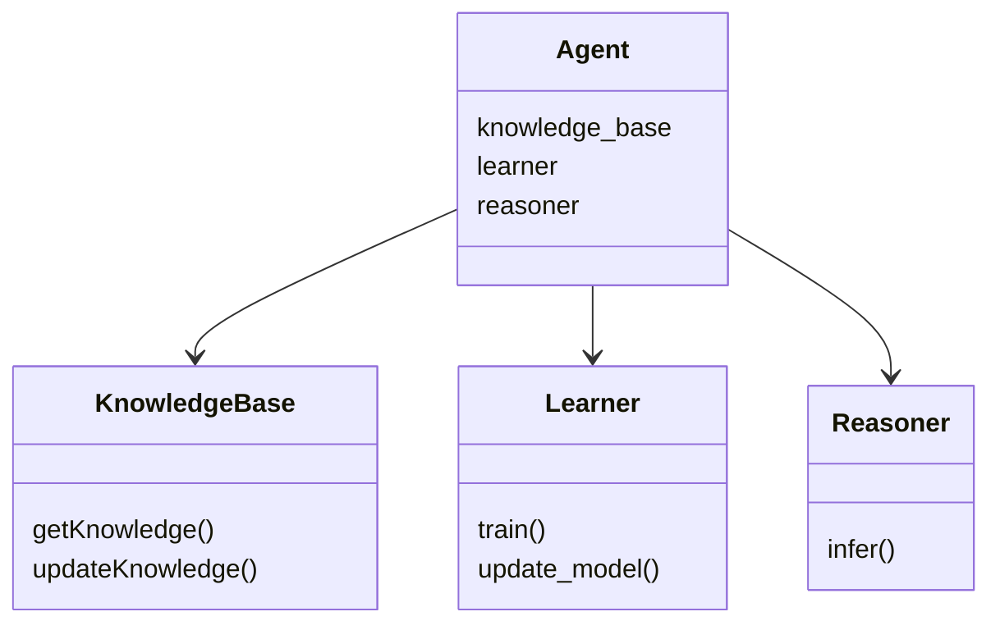

                 


# AI Agent的增量学习与知识更新

> 关键词：AI Agent，增量学习，知识更新，经验重放，知识图谱，动态环境

> 摘要：本文深入探讨AI Agent在动态环境中的增量学习与知识更新问题，分析其核心概念、算法原理、系统架构，并通过实战案例展示其应用。文章旨在为AI Agent的持续进化提供理论与实践指导。

---

## 第1章：AI Agent概述

### 1.1 AI Agent的基本概念

AI Agent（人工智能代理）是能够感知环境并采取行动以实现目标的智能实体。与传统AI系统相比，AI Agent具备主动性、反应性和社会性，需在动态环境中持续学习和更新知识。

**增量学习**是指AI Agent在新数据流下逐步学习新知识的能力，避免重新训练整个模型，提升效率和实时性。

**知识更新**是AI Agent保持知识库准确性的过程，涉及识别过时信息并整合新数据，确保决策的可靠性。

---

### 1.2 AI Agent的核心概念

**增量学习**强调实时性和连续性，适用于数据流场景，避免停机重训，降低计算成本。

**知识更新**涉及知识表示、验证和修正，需高效处理信息变化，保持知识库的有效性。

**AI Agent与传统机器学习的区别**在于其动态适应能力，传统方法依赖静态数据，而AI Agent能实时更新模型。

---

## 第2章：增量学习与知识更新的背景

### 2.1 问题背景

动态环境中，AI Agent面临数据分布变化，需实时更新模型以保持性能。数据流场景中，增量学习能处理连续数据，适应实时需求。

### 2.2 问题描述

知识过时导致决策错误，数据稀疏性增加学习难度。增量学习需解决遗忘旧知识和适应新知识的双重挑战。

### 2.3 问题解决

采用经验重放机制和策略梯度方法，平衡新旧知识，提升学习效果。知识更新通过验证机制确保准确性。

### 2.4 边界与外延

增量学习适用于在线场景，但需处理数据依赖性和模型收敛性。知识更新需权衡效率与准确性，避免过度更新。

---

## 第3章：核心概念与联系

### 3.1 核心概念原理

**增量学习**通过经验重放缓解遗忘问题，策略梯度优化新旧知识的平衡。

**知识更新**利用知识图谱和符号逻辑，实现高效的知识表示与推理。

### 3.2 概念属性特征对比

| 特性 | 增量学习 | 知识更新 |
|------|----------|----------|
| 数据 | 流式数据 | 离散数据 |
| 目标 | 更新模型 | 更新知识库 |
| 方法 | 经验重放 | 知识图谱 |

### 3.3 ER实体关系图

```mermaid
erDiagram
    agent {
        id : int
        knowledge_base : string
        action : string
    }
    environment {
        state : string
        action : string
    }
    agent --> environment : interacts with
    knowledge_base --> agent : contains
```

---

## 第4章：增量学习的数学模型

### 4.1 增量学习的数学模型

增量学习通过更新参数 $\theta$ 实现模型优化：

$$ \theta_{t+1} = \theta_t + \alpha (y_t - f(x_t; \theta_t)) $$

其中，$\alpha$ 是学习率，$y_t$ 是目标值，$f$ 是模型函数。

### 4.2 算法原理

经验重放通过存储历史数据，随机抽取样本训练，避免灾难性遗忘：



代码实现：

```python
import numpy as np

class IncrementalLearner:
    def __init__(self, model, memory_size=100):
        self.model = model
        self.memory = []
        self.memory_size = memory_size

    def remember(self, state, action, reward, next_state):
        self.memory.append((state, action, reward, next_state))
        if len(self.memory) > self.memory_size:
            self.memory.pop(0)

    def replay(self, batch_size=32):
        if len(self.memory) < batch_size:
            return
        mini_batch = np.random.choice(self.memory, batch_size)
        # 训练模型...
```

---

## 第5章：知识表示与更新机制

### 5.1 知识表示方法

知识图谱使用图结构表示实体间关系，支持高效推理。符号逻辑通过形式化规则，增强知识的可解释性。

### 5.2 知识更新机制

任务无关更新定期清理过时知识，任务相关更新动态调整模型参数，确保知识的准确性和相关性。

---

## 第6章：系统架构与实现

### 6.1 系统架构设计

AI Agent系统由知识库、学习模块和推理引擎组成：



### 6.2 系统功能设计

知识库存储结构化知识，学习模块负责增量训练，推理引擎执行逻辑推理，确保系统实时响应。

---

## 第7章：项目实战

### 7.1 环境安装

安装必要的库：

```bash
pip install numpy tensorflow keras
```

### 7.2 核心实现

定义增量学习模型：

```python
import tensorflow as tf
from tensorflow.keras import layers

class IncrementalModel:
    def __init__(self, input_shape):
        self.model = tf.keras.Sequential([
            layers.Dense(64, activation='relu', input_shape=input_shape),
            layers.Dense(1, activation='sigmoid')
        ])
        self.model.compile(optimizer='adam', loss='binary_crossentropy')

    def train(self, x, y, epochs=1):
        self.model.fit(x, y, epochs=epochs)
```

---

## 第8章：总结

AI Agent的增量学习与知识更新是实现智能系统动态适应的关键。通过经验重放、知识图谱等技术，AI Agent能高效更新知识，提升性能。未来研究将探索更高效的更新机制和更广泛的应用场景。

---

作者：AI天才研究院 & 禅与计算机程序设计艺术

