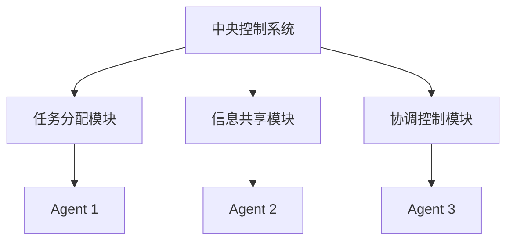
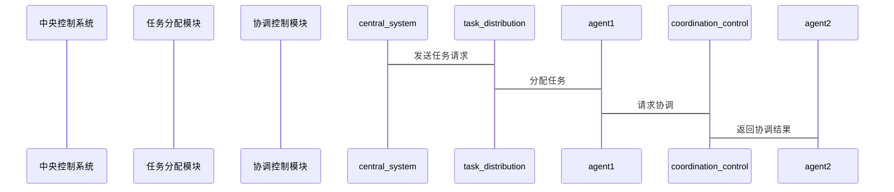

                 


# AI Agent的多Agent协作与竞争框架

---

## 关键词：
AI Agent、多Agent系统、协作、竞争、框架、算法、数学模型

---

## 摘要：
本文深入探讨了AI Agent在多Agent协作与竞争框架中的核心原理、算法实现和系统设计。通过分析协作与竞争的动态平衡，结合具体案例，展示了如何构建高效且智能的多Agent系统。文章内容涵盖背景介绍、核心概念、算法原理、数学模型、系统架构设计和项目实战，为读者提供全面的技术指导。

---

## 第1章：AI Agent的基本概念

### 1.1 AI Agent的定义与特点
AI Agent（人工智能代理）是指能够感知环境、自主决策并执行任务的智能实体。其核心特点包括：
- **自主性**：能够独立决策和行动。
- **反应性**：能实时感知环境变化并做出反应。
- **社会性**：能与其他Agent或人类进行交互协作。
- **学习性**：具备学习和适应新环境的能力。

### 1.2 多Agent系统概述
多Agent系统由多个AI Agent组成，通过协作与竞争完成复杂任务。其分类如下：
- **分布式计算架构**：Agent分布在不同节点，通过通信完成任务。
- **集中式架构**：所有Agent通过中央控制系统协同工作。
- **混合式架构**：结合分布式和集中式的特点。

### 1.3 协作与竞争的背景
协作与竞争是多Agent系统中常见的两种互动模式：
- **协作**：Agent之间相互配合，共同完成任务。
- **竞争**：Agent之间争夺资源或目标，推动系统优化。

---

## 第2章：多Agent协作与竞争的核心框架

### 2.1 多Agent协作与竞争的框架
协作与竞争的框架包括以下核心要素：
- **协作框架**：定义Agent之间的协作方式，如任务分配、信息共享。
- **竞争框架**：定义Agent之间的竞争规则，如资源分配、优先级排序。

### 2.2 协作与竞争的核心原理
协作与竞争的动态平衡是多Agent系统的关键：
- **协作原理**：通过信息共享和任务分配，实现资源优化利用。
- **竞争原理**：通过资源争夺和优先级排序，推动系统效率提升。

---

## 第3章：协作与竞争算法的实现

### 3.1 分布式协作算法
分布式协作算法通过通信协议实现Agent之间的协作：
1. **任务分配**：根据Agent的能力分配任务。
2. **信息共享**：通过通信模块共享状态和信息。
3. **协调控制**：通过协调机制确保协作顺利进行。

**流程图示例：**
```mermaid
graph TD
A[Start] -> B[任务分配]
B -> C[信息共享]
C -> D[协调控制]
D -> E[完成任务]
E -> F[End]
```

### 3.2 竞争算法的实现
竞争算法通过博弈论实现资源优化：
1. **资源争夺**：Agent之间竞争有限资源。
2. **优先级排序**：根据优先级分配资源。
3. **动态调整**：根据环境变化实时调整策略。

**流程图示例：**
```mermaid
graph TD
A[资源争夺] -> B[优先级排序]
B -> C[动态调整]
C -> D[资源分配]
D -> E[End]
```

---

## 第4章：协作与竞争的数学模型

### 4.1 协作模型的数学表达
协作模型的数学表达式如下：
$$
\text{协作效率} = \frac{\sum_{i=1}^{n} \text{Agent}_i \text{贡献}}{\text{总任务量}}
$$

### 4.2 竞争模型的数学表达
竞争模型的数学表达式如下：
$$
\text{竞争结果} = \arg \max_{i=1}^{n} \text{Agent}_i \text{资源获取量}
$$

### 4.3 博弈论中的纳什均衡
纳什均衡是协作与竞争框架中的重要概念：
$$
\text{纳什均衡} \iff \forall i, \text{Agent}_i \text{策略} \text{是最佳反应}
$$

---

## 第5章：系统分析与架构设计

### 5.1 问题场景介绍
我们设计了一个多Agent系统，用于优化资源分配和任务调度。

### 5.2 系统功能设计
- **任务分配模块**：根据Agent能力分配任务。
- **信息共享模块**：实现Agent之间的信息交互。
- **协调控制模块**：确保协作与竞争的动态平衡。

### 5.3 系统架构设计


### 5.4 系统交互设计


---

## 第6章：项目实战

### 6.1 环境安装
安装Python和必要的库（如numpy、matplotlib）。

### 6.2 核心代码实现
```python
class Agent:
    def __init__(self, id):
        self.id = id
        self.resources = 0

    def compete(self, other_agents):
        total_resources = sum(agent.resources for agent in other_agents)
        self.resources += total_resources * 0.1

    def collaborate(self, other_agents):
        total_resources = sum(agent.resources for agent in other_agents)
        self.resources += total_resources * 0.1

# 初始化Agent
agent1 = Agent(1)
agent2 = Agent(2)
agent3 = Agent(3)

# 竞争阶段
agent1.compete([agent2, agent3])
agent2.compete([agent1, agent3])
agent3.compete([agent1, agent2])

# 协作阶段
agent1.collaborate([agent2, agent3])
agent2.collaborate([agent1, agent3])
agent3.collaborate([agent1, agent2])

print(f"最终资源分配：{agent1.resources}, {agent2.resources}, {agent3.resources}")
```

### 6.3 案例分析
通过代码运行，可以看到协作与竞争对资源分配的影响。最终结果展示了动态平衡的重要性。

---

## 第7章：总结与展望

### 7.1 内容总结
本文详细探讨了AI Agent的多Agent协作与竞争框架，从理论到实践，为读者提供了全面的技术指导。

### 7.2 未来展望
未来研究方向包括更复杂的博弈论模型和边缘计算中的多Agent系统应用。

### 7.3 最佳实践Tips
- 定期更新策略以适应环境变化。
- 使用监控工具实时优化系统性能。
- 加强Agent之间的通信机制。

---

## 作者：AI天才研究院（AI Genius Institute）

---

感谢您的阅读！希望本文能为您提供有价值的技术见解。

