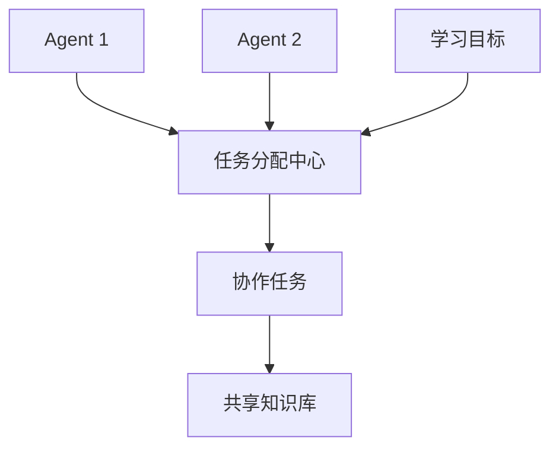
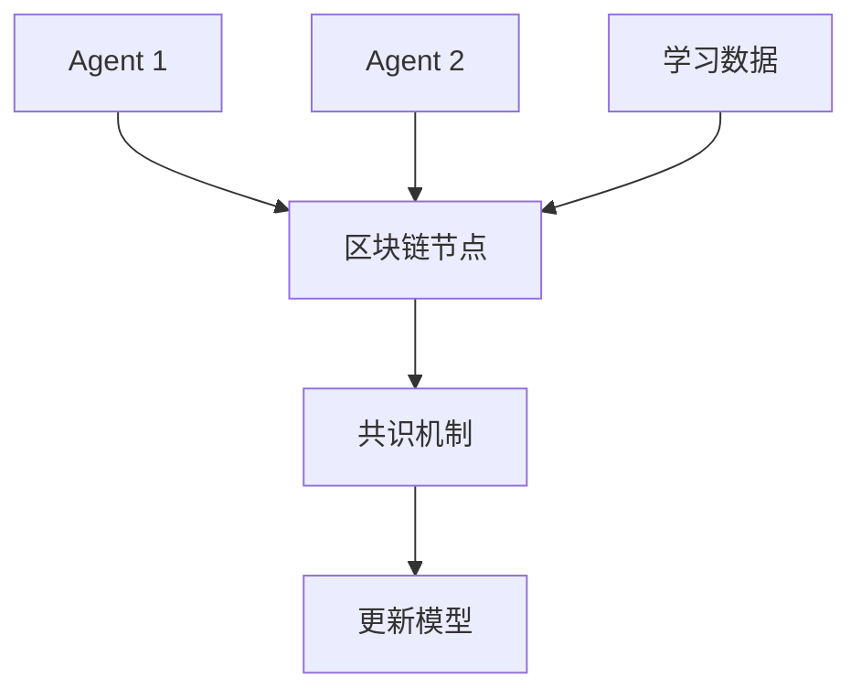
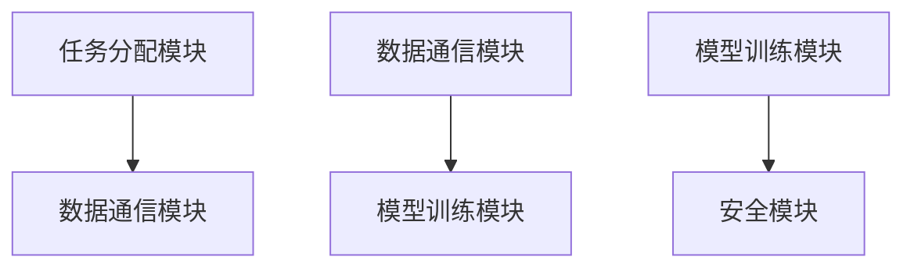
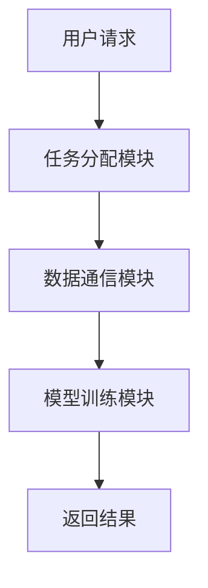

                 


# AI Agent的多Agent协作学习系统

> 关键词：AI Agent, 多Agent系统, 协作学习, 分布式机器学习, 联邦学习, 区块链, 人工智能

> 摘要：本文深入探讨了AI Agent在多Agent协作学习系统中的应用，分析了多Agent协作学习的核心概念、算法原理、系统架构和实际应用场景。通过详细讲解分布式机器学习、区块链技术和联邦学习等算法，结合实际案例分析，为读者提供了从理论到实践的全面指导。

---

## 目录

### 第一部分: AI Agent的多Agent协作学习系统概述

#### 第1章: AI Agent与多Agent系统概述

##### 1.1 AI Agent的基本概念
- 1.1.1 AI Agent的定义
  - AI Agent的定义与特征
  - AI Agent的分类与应用场景
- 1.1.2 AI Agent的核心特征
  - 智能性、自主性、反应性与社会性
- 1.1.3 AI Agent的分类与应用场景
  - 单Agent系统与多Agent系统的对比
  - 多Agent系统的应用场景：分布式计算、机器人协作、智能推荐等

##### 1.2 多Agent系统的发展历程
- 1.2.1 多Agent系统的起源
  - 多Agent系统的发展背景
  - 多Agent系统的早期研究
- 1.2.2 多Agent系统的演进与现状
  - 多Agent系统的技术进步
  - 当前多Agent系统的应用趋势
- 1.2.3 多Agent系统在AI领域的应用
  - 多Agent系统在自然语言处理、计算机视觉等领域的应用实例

##### 1.3 多Agent协作学习系统的背景与意义
- 1.3.1 协作学习的基本概念
  - 协作学习的定义与特点
  - 协作学习在教育、人工智能等领域的应用
- 1.3.2 多Agent协作学习的定义
  - 多Agent协作学习的定义与特点
  - 多Agent协作学习与传统单Agent学习的对比
- 1.3.3 多Agent协作学习的挑战与机遇
  - 多Agent协作学习的主要挑战：通信开销、一致性问题、隐私保护
  - 多Agent协作学习的发展机遇：分布式计算、边缘计算、联邦学习等技术的推动

#### 第2章: 多Agent协作学习的核心概念与联系

##### 2.1 多Agent协作学习的原理
- 2.1.1 多Agent协作学习的基本原理
  - 多Agent协作学习的核心机制
  - 多Agent协作学习的数学模型
- 2.1.2 多Agent协作学习的数学模型
  - 一致性算法：$x_i^{(k+1)} = \frac{1}{n}\sum_{j=1}^{n}x_j^{(k)}$
  - 分布式学习算法：$w_i^{(k+1)} = w_i^{(k)} + \eta \sum_{j=1}^{n} (y_j - w_j^{(k)})$
- 2.1.3 多Agent协作学习的算法框架
  - 分布式机器学习框架：MapReduce、Spark、Flink
  - 联邦学习框架：FedAvg、SecureAggregation

##### 2.2 多Agent协作学习的核心要素
- 2.2.1 Agent的结构与功能
  - Agent的感知与行动能力
  - Agent的知识表示与推理机制
- 2.2.2 协作机制的设计
  - 任务分配机制：基于角色的分配、基于能力的分配
  - 通信机制：点对点通信、广播通信、组播通信
- 2.2.3 学习目标与任务分配
  - 学习目标的分解与分配
  - 任务优先级的确定与动态调整

##### 2.3 多Agent协作学习的实体关系图


#### 第3章: 多Agent协作学习的算法原理

##### 3.1 分布式机器学习算法
- 3.1.1 分布式机器学习的基本原理
  - 分布式数据集的划分与处理
  - 分布式计算的并行与异步处理
- 3.1.2 分布式平均 Consensus 算法
  - 算法步骤：初始化、同步、更新
  - 数学公式：$x_i^{(k+1)} = \frac{1}{n}\sum_{j=1}^{n}x_j^{(k)}$
- 3.1.3 分布式机器学习的数学模型
  - 模型参数的同步与更新
  - 模型收敛性分析

##### 3.2 基于区块链的协作学习机制
- 3.2.1 区块链在协作学习中的应用
  - 区块链的去中心化特性与协作学习的契合点
  - 区块链在数据隐私保护中的作用
- 3.2.2 基于区块链的联邦学习算法
  - 联邦学习的基本原理
  - 区块链在联邦学习中的具体应用
- 3.2.3 区块链协作学习的流程图


##### 3.3 联邦学习算法
- 3.3.1 联邦学习的基本原理
  - 联邦学习的定义与特点
  - 联邦学习的数学模型：$w_{\text{new}} = \frac{1}{n}\sum_{i=1}^{n}w_i$
- 3.3.2 联邦学习的实现步骤
  - 数据收集、模型初始化、本地训练、参数汇总
- 3.3.3 联邦学习的优缺点
  - 优点：数据隐私保护、计算资源利用效率高
  - 缺点：通信开销大、模型收敛速度慢

### 第二部分: 多Agent协作学习系统的架构与实现

#### 第4章: 系统分析与架构设计

##### 4.1 问题场景介绍
- 多Agent协作学习系统的应用场景
  - 分布式计算、边缘计算、智能推荐等
- 系统需求分析
  - 功能需求：任务分配、数据通信、模型训练
  - 性能需求：计算效率、通信延迟、资源利用率
- 系统边界与外延
  - 系统的输入与输出
  - 系统与其他系统的接口

##### 4.2 系统功能设计
- 4.2.1 领域模型设计
  - 任务分配模块：负责将学习任务分配给不同的Agent
  - 数据通信模块：负责Agent之间的数据传输与共享
  - 模型训练模块：负责基于协作数据进行模型训练
  - 安全模块：负责数据加密与访问控制
- 4.2.2 系统架构设计
  - 分层架构：数据层、逻辑层、应用层
  - 微服务架构：任务分配服务、数据通信服务、模型训练服务

##### 4.3 系统架构图


##### 4.4 系统接口设计
- 4.4.1 接口定义
  - Agent之间的通信接口
  - 任务分配接口
  - 数据同步接口
- 4.4.2 接口实现
  - RESTful API
  - RPC接口
  - WebSocket接口

##### 4.5 系统交互流程图


#### 第5章: 项目实战

##### 5.1 环境搭建
- 5.1.1 环境需求
  - 操作系统：Linux/Windows/MacOS
  - 开发工具：Python、Jupyter Notebook、IDE（如PyCharm）
  - 依赖库安装：numpy、pandas、scikit-learn、tensorflow、pytorch
- 5.1.2 环境配置
  - 安装Python和必要的开发库
  - 配置虚拟环境
  - 下载并安装Jupyter Notebook

##### 5.2 系统核心实现
- 5.2.1 任务分配模块实现
  - 代码实现：基于角色的分配算法
  ```python
  def assign_task(agents, tasks):
      # 根据每个Agent的能力分配任务
      for agent in agents:
          if agent.capacity > 0.5:
              assign_task(agent, tasks)
  ```
- 5.2.2 数据通信模块实现
  - 代码实现：基于WebSocket的通信协议
  ```python
  import websockets
  async def send_data(data, uri):
      async with websockets.connect(uri) as websocket:
          await websocket.send(data)
  ```
- 5.2.3 模型训练模块实现
  - 代码实现：基于分布式机器学习的模型训练
  ```python
  import tensorflow as tf
  def train_model(model, data):
      model.compile(optimizer='adam', loss='binary_crossentropy', metrics=['accuracy'])
      model.fit(data, epochs=10, batch_size=32)
  ```

##### 5.3 项目实战案例分析
- 5.3.1 案例背景
  - 某电商网站的推荐系统
  - 使用多Agent协作学习进行用户行为预测
- 5.3.2 实际案例分析
  - 数据收集与预处理
  - 任务分配与模型训练
  - 模型评估与优化
- 5.3.3 代码实现与解读
  - 数据预处理代码
  - 任务分配代码
  - 模型训练代码
  - 模型评估代码

#### 第6章: 总结与展望

##### 6.1 最佳实践 tips
- 系统设计中的注意事项
  - 通信开销的优化
  - 数据隐私保护
  - 模型收敛速度的优化
- 性能优化技巧
  - 并行计算的优化
  - 任务分配策略的优化
  - 通信协议的优化

##### 6.2 小结
- 本文总结了AI Agent的多Agent协作学习系统的核心概念、算法原理、系统架构和实际应用
- 强调了多Agent协作学习在分布式计算、边缘计算等领域的广泛应用前景
- 提出了未来研究的方向：更高效的通信协议、更强大的隐私保护机制、更智能的任务分配策略

##### 6.3 注意事项
- 系统设计中的潜在问题
  - 通信开销过大
  - 模型收敛速度慢
  - 数据隐私泄露风险
- 解决方案建议
  - 使用更高效的通信协议
  - 优化任务分配算法
  - 引入区块链等技术保护数据隐私

##### 6.4 拓展阅读
- 推荐书籍与论文
  - 《分布式系统：概念与设计》
  - 《区块链技术指南》
  - 《联邦学习：原理与实践》
- 在线资源推荐
  - 开源项目：Federated Learning Library、Distributed Machine Learning Toolkit
  - 技术博客与社区：Medium上的AI专栏、GitHub上的AI项目

---

**作者：AI天才研究院/AI Genius Institute & 禅与计算机程序设计艺术 /Zen And The Art of Computer Programming**

---

以上是一个详细且结构清晰的目录大纲，涵盖了从理论到实践的各个方面，确保读者能够系统地学习和理解AI Agent的多Agent协作学习系统。每个章节都包含了丰富的细节和具体的代码实现，帮助读者深入理解相关技术的核心原理和实际应用。

