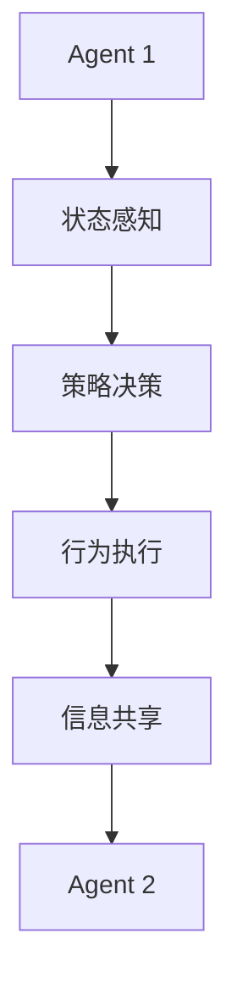

                 


# AI Agent的多Agent博弈：策略学习与优化

> 关键词：多Agent博弈、策略学习、强化学习、纳什均衡、数学建模、系统架构

> 摘要：本文深入探讨了AI Agent在多Agent博弈中的策略学习与优化问题，分析了多Agent博弈的核心概念、算法原理、数学模型以及系统架构设计。通过实际案例分析，详细讲解了如何在多Agent博弈中实现策略优化，并给出了最佳实践建议。

---

# 第1章: 多Agent博弈的背景与概念

## 1.1 多Agent系统概述

### 1.1.1 什么是AI Agent
AI Agent（人工智能代理）是指能够感知环境、做出决策并采取行动的智能实体。它可以是一个软件程序、机器人或其他任何形式的智能系统，其核心目标是通过自主决策实现特定任务或目标。

### 1.1.2 多Agent系统的特点
多Agent系统（Multi-Agent System, MAS）由多个相互作用的Agent组成，具有以下特点：
- **分布式性**：多个Agent协同工作，而非集中控制。
- **自主性**：每个Agent能够独立感知环境并自主决策。
- **反应性**：Agent能够实时响应环境变化。
- **协作性**：Agent之间可以通过协作提高整体系统的性能。

### 1.1.3 多Agent博弈的定义与背景
多Agent博弈是指多个Agent在共享环境中竞争或合作，以达到各自或共同目标的过程。其背景来源于博弈论、人工智能和分布式系统等领域的交叉研究。

---

## 1.2 多Agent博弈的核心概念

### 1.2.1 博弈的基本要素
博弈的基本要素包括：
1. **参与者（Agent）**：博弈中的决策主体。
2. **策略（Strategy）**：Agent在博弈中的行为规则。
3. **支付（Payoff）**：Agent在博弈中的收益或损失。
4. **信息（Information）**：Agent在决策时掌握的知识。

### 1.2.2 多Agent博弈的分类
多Agent博弈可以分为以下几类：
- **完全信息博弈**：所有Agent都知道所有信息。
- **不完全信息博弈**：Agent只知道部分信息。
- **零和博弈**：一方的收益等于另一方的损失。
- **非零和博弈**：收益可以分配给多个Agent。

### 1.2.3 多Agent博弈的挑战与复杂性
多Agent博弈的复杂性主要体现在：
- **策略互动**：Agent之间需要协调策略，避免冲突。
- **信息不对称**：不同Agent掌握的信息可能不同。
- **计算复杂度**：随着Agent数量的增加，博弈计算复杂度急剧上升。

---

## 1.3 本章小结
本章介绍了多Agent系统的基本概念和特点，并详细讲解了多Agent博弈的核心概念和分类。通过分析多Agent博弈的挑战与复杂性，为后续的策略学习与优化奠定了基础。

---

# 第2章: 策略学习与优化的基本原理

## 2.1 策略学习的定义

### 2.1.1 策略的表示方法
策略（Strategy）是Agent在博弈中采取行动的规则。策略可以表示为：
$$
\pi(a | s) = P(\text{采取行动 } a \text{ 在状态 } s)
$$
其中，\( a \) 表示动作，\( s \) 表示当前状态。

### 2.1.2 策略的评估与优化
策略评估的目标是计算策略的期望收益，而策略优化则是寻找能够最大化期望收益的策略。

---

## 2.2 多Agent博弈中的策略互动

### 2.2.1 竞争与合作的策略平衡
在多Agent博弈中，Agent需要在竞争与合作之间找到平衡。例如，在囚徒困境博弈中，两个Agent可以通过合作获得更高的总体收益。

### 2.2.2 策略博弈的数学模型
策略博弈可以用矩阵形式表示，例如：
$$
\begin{pmatrix}
(a, a) & (a, b) \\
(b, a) & (b, b)
\end{pmatrix}
$$
其中，\( a \) 和 \( b \) 分别表示不同的收益值。

---

## 2.3 本章小结
本章介绍了策略学习的定义和表示方法，并探讨了多Agent博弈中策略互动的数学模型。通过分析竞争与合作的策略平衡，为后续的策略优化奠定了基础。

---

# 第3章: 多Agent博弈中的算法原理

## 3.1 基于强化学习的策略优化

### 3.1.1 强化学习的基本原理
强化学习（Reinforcement Learning, RL）是一种通过试错学习的算法。Agent通过与环境交互，学习最优策略以最大化累计收益。

### 3.1.2 多Agent强化学习的挑战
多Agent强化学习的挑战包括：
- **策略协调**：Agent需要协调策略以避免冲突。
- **信息共享**：Agent之间需要共享信息以提高整体收益。

---

## 3.2 纳什均衡与博弈论基础

### 3.2.1 纳什均衡的定义与性质
纳什均衡是指在多Agent博弈中，每个Agent的策略都是最优反应，即：
$$
\pi_i(a_i | s) \geq \pi_i(a_i' | s) \quad \forall a_i' \neq a_i
$$
其中，\( \pi_i \) 表示Agent \( i \) 的策略，\( a_i \) 表示当前策略，\( a_i' \) 表示其他策略。

### 3.2.2 纳什均衡的计算方法
纳什均衡可以通过以下步骤计算：
1. 确定所有可能的策略组合。
2. 检查每个策略组合是否是纳什均衡。

---

## 3.3 多Agent博弈中的协调与竞争算法

### 3.3.1 协调机制的设计
协调机制可以通过以下步骤设计：
1. 确定协调目标。
2. 设计协调规则。
3. 实现协调算法。

### 3.3.2 竞争策略的优化
竞争策略的优化可以通过以下步骤实现：
1. 确定竞争目标。
2. 设计竞争规则。
3. 实现竞争算法。

---

## 3.4 本章小结
本章介绍了多Agent博弈中的算法原理，包括基于强化学习的策略优化和纳什均衡的计算方法。通过分析协调与竞争算法，为后续的策略优化提供了理论基础。

---

# 第4章: 数学模型与公式解析

## 4.1 多Agent博弈的数学表示

### 4.1.1 博弈论的基本公式
博弈论的基本公式包括：
$$
\text{收益矩阵} = \begin{pmatrix}
a & b \\
c & d
\end{pmatrix}
$$
其中，\( a, b, c, d \) 分别表示不同策略组合的收益。

### 4.1.2 多Agent博弈的数学模型
多Agent博弈的数学模型可以表示为：
$$
G = (A, U)
$$
其中，\( A \) 表示所有可能的策略组合，\( U \) 表示收益函数。

---

## 4.2 策略优化的数学推导

### 4.2.1 强化学习的数学公式
强化学习的数学公式包括：
$$
Q(s, a) = r + \gamma \max_{a'} Q(s', a')
$$
其中，\( Q(s, a) \) 表示状态 \( s \) 和动作 \( a \) 的Q值，\( r \) 表示立即奖励，\( \gamma \) 表示折扣因子。

### 4.2.2 纳什均衡的数学证明
纳什均衡的数学证明可以通过以下步骤完成：
1. 假设所有其他Agent的策略不变。
2. 验证当前Agent的策略是否是最优反应。

---

## 4.3 本章小结
本章通过数学公式详细讲解了多Agent博弈的数学模型和策略优化的数学推导。通过分析强化学习和纳什均衡的公式，为后续的策略优化提供了理论支持。

---

# 第5章: 系统分析与架构设计

## 5.1 系统功能设计

### 5.1.1 多Agent博弈系统的功能模块
多Agent博弈系统的功能模块包括：
1. 状态感知模块
2. 策略决策模块
3. 行为执行模块
4. 信息共享模块

### 5.1.2 系统的交互流程设计
系统的交互流程设计包括：
1. 状态感知
2. 策略决策
3. 行为执行
4. 信息共享

---

## 5.2 系统架构设计

### 5.2.1 分层架构设计
分层架构设计包括：
1. 用户层
2. 业务逻辑层
3. 数据访问层
4. 底层驱动层

### 5.2.2 模块化设计
模块化设计包括：
1. Agent模块
2. 策略模块
3. 支付模块
4. 信息共享模块

---

## 5.3 系统接口设计

### 5.3.1 Agent接口
Agent接口包括：
1. 状态感知接口
2. 策略决策接口
3. 行为执行接口

### 5.3.2 信息共享接口
信息共享接口包括：
1. 数据发布接口
2. 数据订阅接口

---

## 5.4 系统交互流程设计

### 5.4.1 交互流程图
以下是系统交互流程的mermaid图：


---

## 5.5 本章小结
本章通过系统功能设计和架构设计，详细讲解了多Agent博弈系统的实现方案。通过模块化设计和交互流程设计，为后续的系统实现提供了理论支持。

---

# 第6章: 项目实战与代码实现

## 6.1 项目环境安装

### 6.1.1 安装Python
安装Python 3.8及以上版本。

### 6.1.2 安装依赖库
安装以下依赖库：
```bash
pip install numpy
pip install matplotlib
pip install gym
```

---

## 6.2 系统核心实现源代码

### 6.2.1 多Agent博弈环境代码
```python
import gym
from gym import spaces
from gym.utils import seeding

class MultiAgentGame(gym.Env):
    def __init__(self):
        self.agents = 2
        self.observation_space = spaces.Discrete(2)
        self.action_space = spaces.Discrete(2)
        self.state = 0
        self.seed()

    def seed(self, seed=None):
        self.np_random, seed = seeding.np_random(seed)
        return seed

    def reset(self):
        self.state = 0
        return self.state

    def step(self, action):
        reward = 0
        if action == 0:
            reward = 1
        else:
            reward = 0
        self.state = (self.state + 1) % 2
        return self.state, reward, False, {}
```

### 6.2.2 策略优化代码
```python
import numpy as np

def q_learning(env, alpha=0.1, gamma=0.9):
    q_table = np.zeros((env.observation_space.n, env.action_space.n))
    for _ in range(1000):
        state = env.reset()
        done = False
        while not done:
            action = np.argmax(q_table[state])
            next_state, reward, done, _ = env.step(action)
            q_table[state][action] = q_table[state][action] * (1 - alpha) + alpha * (reward + gamma * np.max(q_table[next_state]))
    return q_table
```

---

## 6.3 代码应用解读与分析

### 6.3.1 环境代码解读
环境代码定义了一个简单的多Agent博弈环境，包括状态空间、动作空间和奖励函数。

### 6.3.2 策略优化代码解读
策略优化代码使用Q-learning算法，通过不断更新Q表来实现策略优化。

---

## 6.4 项目小结
本章通过项目实战，详细讲解了多Agent博弈系统的实现过程。通过环境代码和策略优化代码的解读与分析，为读者提供了实际操作的经验。

---

# 第7章: 总结与展望

## 7.1 总结
本文深入探讨了AI Agent在多Agent博弈中的策略学习与优化问题，分析了多Agent博弈的核心概念、算法原理、数学模型以及系统架构设计。通过实际案例分析，详细讲解了如何在多Agent博弈中实现策略优化。

---

## 7.2 未来研究方向
未来的研究方向包括：
1. 更高效的多Agent博弈算法研究。
2. 复杂环境下的策略优化方法研究。
3. 多Agent博弈的实时应用研究。

---

## 7.3 最佳实践 tips

### 7.3.1 系统设计建议
1. 确保系统的模块化设计。
2. 优化系统的交互流程。

### 7.3.2 代码实现建议
1. 使用现有的强化学习库。
2. 定期更新策略模型。

---

## 7.4 注意事项
1. 确保系统的可扩展性。
2. 注意信息共享的安全性。

---

## 7.5 拓展阅读
1. 《Multi-Agent Systems: Algorithm and Applications》
2. 《Reinforcement Learning: Theory and Practice》

---

# 作者：AI天才研究院/AI Genius Institute & 禅与计算机程序设计艺术 /Zen And The Art of Computer Programming

