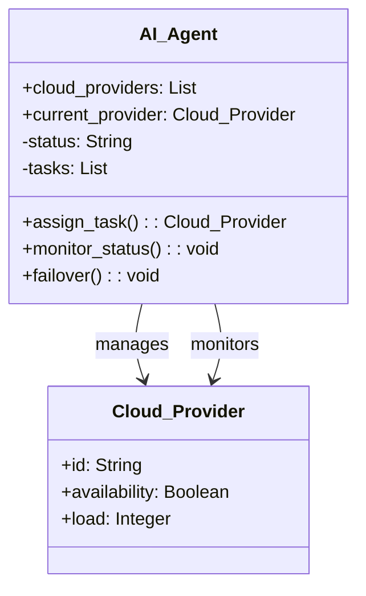

                 


# AI Agent的多云部署策略：提高可用性与灵活性

> **关键词**：AI Agent、多云部署、可用性、灵活性、负载均衡、故障转移、分布式系统

> **摘要**：  
> 本文详细探讨了AI Agent在多云环境中的部署策略，分析了多云部署的核心概念、优势与挑战，重点介绍了负载均衡与故障转移的算法原理，并通过实际案例展示了如何通过多云部署提高系统的可用性和灵活性。文章还提供了系统的架构设计、项目实战指导以及最佳实践建议，帮助读者全面理解AI Agent的多云部署策略。

---

## 第1章: AI Agent与多云部署的背景介绍

### 1.1 AI Agent的基本概念

#### 1.1.1 AI Agent的定义与特点  
AI Agent（人工智能代理）是一种能够感知环境、自主决策并执行任务的智能实体。它通常具备以下特点：  
- **自主性**：能够在没有人工干预的情况下自主运行。  
- **反应性**：能够实时感知环境并做出响应。  
- **目标导向**：通过设定目标来驱动行为。  
- **学习能力**：能够通过数据和经验不断优化自身的决策能力。  

#### 1.1.2 AI Agent的核心功能与应用场景  
AI Agent的核心功能包括：数据采集、分析、决策和执行。其应用场景广泛，如自动驾驶、智能客服、智能家居、金融交易等领域。  

#### 1.1.3 多云部署的背景与必要性  
随着AI Agent的应用场景越来越复杂，单云部署逐渐暴露出资源利用率低、依赖性高、扩展性差等问题。多云部署通过将资源分散在多个云服务提供商，能够提高系统的可用性、可靠性和灵活性。

---

### 1.2 多云部署的核心概念

#### 1.2.1 多云部署的定义与特点  
多云部署是指将应用部署在多个云平台上的策略。其特点包括：  
- **资源分散**：避免单点故障，提高系统的容错能力。  
- **灵活性高**：可以根据业务需求灵活选择云服务提供商。  
- **成本优化**：通过竞争性定价降低成本。  

#### 1.2.2 多云部署的优势与挑战  
**优势**：  
- 提高系统的可用性和可靠性。  
- 降低单点故障风险。  
- 通过多供应商竞争优化成本。  

**挑战**：  
- 数据一致性难以保证。  
- 跨云通信复杂。  
- 管理和运维难度增加。  

#### 1.2.3 AI Agent在多云环境中的角色与作用  
AI Agent在多云环境中充当协调者和执行者，负责任务分配、资源调度、状态监控和故障处理。

---

## 第2章: 多云部署策略的核心要素对比

### 2.1 多云部署策略的对比分析

#### 2.1.1 不同多云部署策略的特点对比  
- **全复制策略**：在多个云平台上部署相同的AI Agent实例，提供高可用性。  
- **主从策略**：主实例负责主要任务，从实例作为备用。  
- **负载均衡策略**：通过负载均衡将任务分配到多个云平台。  

#### 2.1.2 各种策略的优缺点分析  
| 策略 | 优点 | 缺点 |  
|------|------|------|  
| 全复制 | 高可用性，无单点故障 | 成本高，资源利用率低 |  
| 主从 | 简单可靠，成本较低 | 主实例故障时切换时间长 |  
| 负载均衡 | 资源利用率高，成本低 | 实现复杂，需要协调多个云平台 |  

#### 2.1.3 AI Agent在不同策略中的表现  
AI Agent在全复制策略中表现出色，但在主从策略中可能面临切换延迟问题。

---

## 第3章: 多云部署的算法原理讲解

### 3.1 多云部署中的负载均衡算法

#### 3.1.1 负载均衡算法的实现  
负载均衡算法包括轮询、随机、加权等多种策略。以下是一个简单的轮询算法实现：

```python
class LoadBalancer:
    def __init__(self, cloud_providers):
        self.cloud_providers = cloud_providers
        self.index = 0

    def select_provider(self):
        self.index = (self.index + 1) % len(self.cloud_providers)
        return self.cloud_providers[self.index]
```

#### 3.1.2 负载均衡算法的优缺点分析  
- **优点**：提高资源利用率，降低单点压力。  
- **缺点**：实现复杂，需要协调多个云平台。  

#### 3.1.3 AI Agent在负载均衡中的应用  
AI Agent可以根据当前负载情况动态调整任务分配策略。

---

## 第4章: 多云部署的系统架构设计

### 4.1 系统功能设计

#### 4.1.1 领域模型类图  


#### 4.1.2 系统架构图  


---

## 第5章: 多云部署的项目实战

### 5.1 环境搭建

```bash
pip install requests
pip install python-dotenv
pip install cloudpickle
```

### 5.2 核心代码实现

```python
import random
from typing import List

class CloudProvider:
    def __init__(self, id: str):
        self.id = id
        self.available = True
        self.load = 0

class LoadBalancer:
    def __init__(self, providers: List[CloudProvider]):
        self.providers = providers
        self.current_index = 0

    def get_available_provider(self) -> CloudProvider:
        while True:
            provider = self.providers[self.current_index]
            self.current_index = (self.current_index + 1) % len(self.providers)
            if provider.available:
                return provider

    def update_load(self, provider_id: str, new_load: int):
        for p in self.providers:
            if p.id == provider_id:
                p.load = new_load
                break

class AIAgent:
    def __init__(self, providers: List[CloudProvider]):
        self.providers = providers
        self.load_balancer = LoadBalancer(providers)

    def assign_task(self, task_type: str) -> CloudProvider:
        # 根据任务类型选择合适的云提供商
        if task_type == 'high_load':
            return self._select_high_load_provider()
        else:
            return self.load_balancer.get_available_provider()

    def _select_high_load_provider(self) -> CloudProvider:
        # 假设高负载任务选择负载最低的云提供商
        min_load = float('inf')
        selected = None
        for p in self.providers:
            if p.load < min_load:
                min_load = p.load
                selected = p
        return selected

    def monitor_status(self):
        # 监控云提供商的状态
        for p in self.providers:
            if p.load > 80:
                p.available = False
```

---

## 第6章: 最佳实践与注意事项

### 6.1 最佳实践

#### 1. **选择合适的云服务提供商**  
根据业务需求选择多个云服务提供商，确保它们的可靠性和性能。

#### 2. **合理配置资源**  
根据负载情况动态调整资源分配，避免资源浪费。

#### 3. **定期测试故障转移机制**  
确保故障转移机制能够正常工作，减少故障发生时的 downtime。

#### 4. **监控与日志**  
实时监控系统状态，及时发现和处理问题。

### 6.2 注意事项

#### 1. **数据一致性问题**  
多云环境下数据一致性难以保证，需要通过数据库同步等技术解决。

#### 2. **网络延迟问题**  
多云部署可能导致网络延迟增加，需要优化网络架构。

#### 3. **安全问题**  
多云环境下需要加强安全防护，防止数据泄露和攻击。

---

## 结语

通过本文的详细讲解，我们可以看到，AI Agent的多云部署策略能够显著提高系统的可用性和灵活性。然而，实现多云部署需要克服许多技术挑战，如负载均衡、故障转移、数据一致性等问题。未来，随着技术的进步，多云部署将变得更加高效和可靠。

---

**作者**：AI天才研究院/AI Genius Institute & 禅与计算机程序设计艺术 /Zen And The Art of Computer Programming

