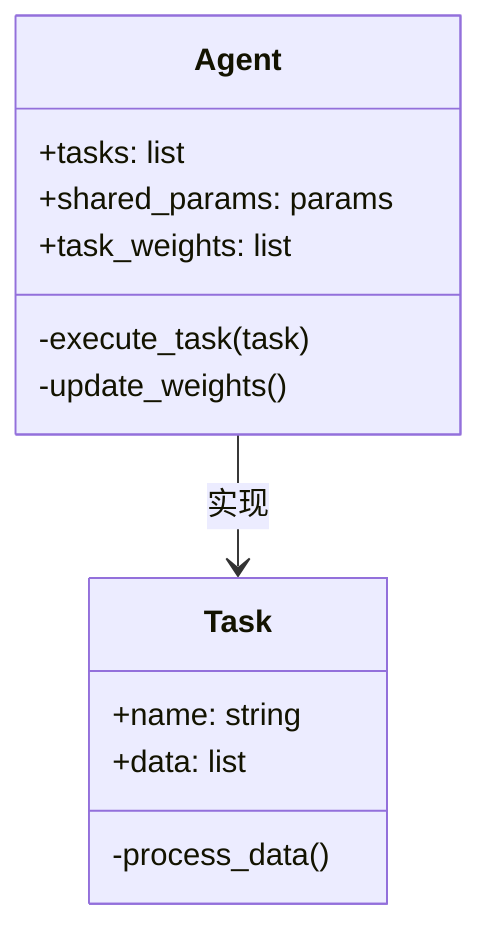
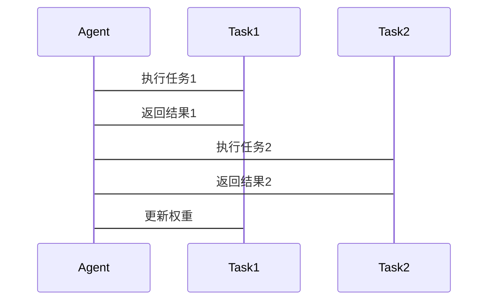

                 


# AI Agent的多任务学习架构实现

## 关键词：AI Agent、多任务学习、深度学习、强化学习、联合学习

## 摘要：  
本文深入探讨AI Agent在多任务学习（Multi-Task Learning, MTL）架构中的实现方法。通过分析多任务学习的核心原理、算法实现及系统架构，结合实际案例，详细讲解如何构建高效、智能的AI Agent系统。文章内容涵盖从基础概念到高级算法，再到系统设计的全链条，旨在为AI Agent的多任务学习实现提供理论与实践的双重指导。

---

## 第1章 AI Agent与多任务学习概述

### 1.1 AI Agent的基本概念
#### 1.1.1 AI Agent的定义与特点
AI Agent（人工智能代理）是指能够感知环境、自主决策并执行任务的智能体。它具有以下特点：
1. **自主性**：能够独立决策，无需外部干预。
2. **反应性**：能实时感知环境并做出响应。
3. **目标导向性**：基于目标驱动行为。
4. **学习能力**：通过数据和经验优化自身性能。

#### 1.1.2 AI Agent的应用场景
AI Agent广泛应用于多个领域，例如：
1. 智能助手（如Siri、Alexa）。
2. 自动驾驶系统。
3. 机器人控制。
4. 游戏AI。

#### 1.1.3 多任务学习的背景与意义
多任务学习（MTL）是指同时学习多个任务，共享知识以提高性能。MTL在AI Agent中的意义在于：
1. 提升泛化能力。
2. 减少数据需求。
3. 提高效率。

---

### 1.2 多任务学习的基本概念
#### 1.2.1 多任务学习的定义
多任务学习是指同时学习多个相关任务，通过共享参数或经验来提升模型的性能和效率。

#### 1.2.2 多任务学习的核心目标
1. 提高模型的泛化能力。
2. 减少数据需求。
3. 提高学习效率。

#### 1.2.3 多任务学习与单任务学习的区别
| 特性 | 单任务学习 | 多任务学习 |
|------|------------|------------|
| 数据需求 | 单一任务数据 | 多任务共享数据 |
| 知识共享 | 无 | 有 |
| 泛化能力 | 低 | 高 |

---

## 第2章 多任务学习在AI Agent中的核心概念与联系

### 2.1 多任务学习的原理
#### 2.1.1 任务之间的关系
任务之间可能存在相关性，例如：
1. **正相关**：任务A的成功有助于任务B。
2. **负相关**：任务A的成功可能损害任务B。

#### 2.1.2 多任务学习的挑战与解决方案
1. **任务权重分配**：不同任务的重要性不同，需合理分配权重。
2. **梯度干扰**：不同任务的梯度更新可能互相干扰，需引入梯度平衡方法。

---

### 2.2 多任务学习的核心概念对比
#### 2.2.1 任务相关性对比表格
| 任务类型 | 任务1 | 任务2 |
|----------|-------|-------|
| 相关性   | 高    | 低    |

#### 2.2.2 多任务学习的ER实体关系图
```mermaid
er
  agent: AI Agent
  task1: 任务1
  task2: 任务2
  relationship: 实现
  agent --> task1
  agent --> task2
```

---

## 第3章 多任务学习的算法原理讲解

### 3.1 多任务学习的主流算法
#### 3.1.1 基于共享参数的多任务学习（MTL）
MTL通过共享参数实现多任务学习，公式为：
$$ y_i = f(x_i; \theta) $$
其中，$\theta$是共享参数。

#### 3.1.2 基于任务分解的多任务学习
该方法将多个任务分解为子任务，分别优化。

#### 3.1.3 基于任务权重分配的多任务学习
通过为每个任务分配权重，平衡任务之间的冲突，公式为：
$$ L = \sum_{i=1}^n \lambda_i L_i $$

---

### 3.2 算法原理的数学模型与公式
#### 3.2.1 共享参数模型的数学公式
$$ y_i = f(x_i; \theta) $$
其中，$\theta$是共享参数。

#### 3.2.2 任务权重分配模型的数学公式
$$ L = \sum_{i=1}^n \lambda_i L_i $$

---

## 第4章 系统分析与架构设计

### 4.1 问题场景介绍
AI Agent需要同时处理多个任务，例如信息检索、自然语言理解、推荐系统等。

### 4.2 系统功能设计
#### 4.2.1 领域模型（Mermaid类图）


#### 4.2.2 系统架构设计（Mermaid架构图）


#### 4.2.3 系统接口设计
接口设计包括：
1. 任务执行接口。
2. 权重更新接口。
3. 数据交互接口。

#### 4.2.4 系统交互流程图（Mermaid序列图）


---

## 第5章 项目实战

### 5.1 环境安装
安装必要的Python库，例如：
- PyTorch
- Transformers
- Scikit-learn

### 5.2 系统核心实现源代码
```python
class Agent:
    def __init__(self, tasks):
        self.tasks = tasks
        self.shared_params = {}  # 共享参数
        self.task_weights = {}   # 任务权重

    def execute_task(self, task):
        # 执行任务
        pass

    def update_weights(self, gradients):
        # 更新共享参数
        pass

def multi_task_loss(tasks):
    total_loss = 0
    for task in tasks:
        total_loss += task.loss * task.weight
    return total_loss
```

### 5.3 代码应用解读与分析
代码实现包括：
1. Agent类的初始化和方法定义。
2. 多任务损失函数的计算。

### 5.4 实际案例分析
以智能助手为例，展示如何实现多任务学习。

---

## 第6章 最佳实践与小结

### 6.1 总结
多任务学习在AI Agent中的应用可以显著提升性能和效率，但需要合理处理任务权重和梯度平衡问题。

### 6.2 实践中的注意事项
1. 合理分配任务权重。
2. 注意任务间的相关性。
3. 避免梯度干扰。

### 6.3 拓展阅读
推荐学习分布式计算和强化学习的相关知识。

---

## 作者：AI天才研究院/AI Genius Institute & 禅与计算机程序设计艺术 /Zen And The Art of Computer Programming

