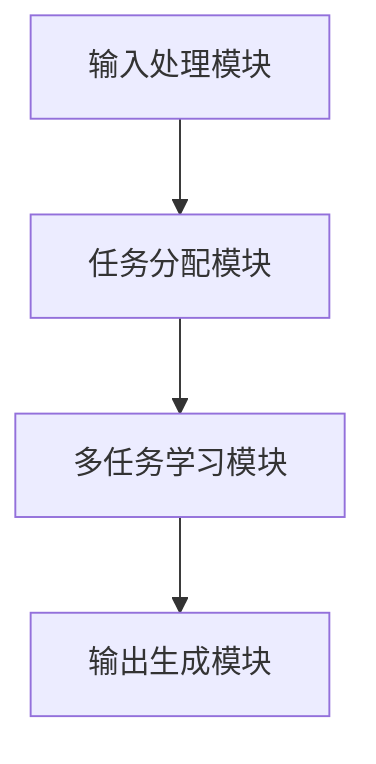
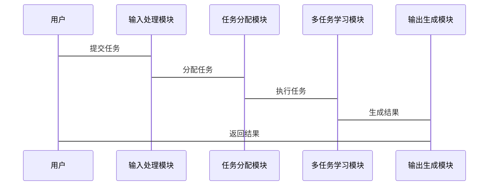

                 


# AI Agent的多任务学习：构建通用智能助手

> 关键词：AI Agent，多任务学习，通用智能助手，深度学习，智能决策

> 摘要：本文深入探讨AI Agent的多任务学习方法，分析如何通过多任务学习构建通用智能助手。文章从多任务学习的核心概念出发，结合具体算法原理和系统架构设计，详细讲解如何实现AI Agent的多任务学习。最后通过项目实战和最佳实践，为读者提供完整的解决方案。

---

## 第1章 AI Agent与多任务学习概述

### 1.1 AI Agent的基本概念

#### 1.1.1 AI Agent的定义与特点
AI Agent（人工智能代理）是一种能够感知环境、自主决策并执行任务的智能实体。它可以是一个软件程序或物理设备，具备以下特点：
- **自主性**：能够在没有外部干预的情况下自主运行。
- **反应性**：能够感知环境并实时调整行为。
- **目标导向**：具备明确的目标，能够为实现目标采取最优行动。

#### 1.1.2 多任务学习的背景与意义
多任务学习（Multi-Task Learning, MTL）是一种机器学习方法，旨在通过同时学习多个相关任务来提升模型的泛化能力和性能。与单任务学习相比，MTL能够有效利用任务之间的关联性，减少数据需求，提高学习效率。

#### 1.1.3 通用智能助手的目标与挑战
通用智能助手（如Siri、Alexa）需要能够处理多种任务，包括自然语言理解、语音识别、信息检索等。多任务学习为构建通用智能助手提供了理论基础和技术支持，但同时也面临任务间干扰、数据稀缺性等挑战。

### 1.2 多任务学习的核心概念

#### 1.2.1 多任务学习的定义
多任务学习是指同时学习多个任务，共享模型参数以提高学习效率和性能。核心思想是通过参数共享，使模型能够从多个任务中提取通用特征。

#### 1.2.2 多任务学习与单任务学习的对比
| 对比维度 | 单任务学习 | 多任务学习 |
|----------|------------|------------|
| 数据需求 | 数据量大，任务单一 | 数据量小，任务多样 |
| 模型复杂度 | 模型独立，参数多 | 参数共享，模型简洁 |
| 性能提升 | 任务单一，泛化能力弱 | 任务相关，泛化能力强 |

#### 1.2.3 多任务学习的分类与应用场景
多任务学习可以分为基于参数共享、基于任务分解和基于排序的三类。应用场景包括自然语言处理、计算机视觉、机器人控制等。

---

## 第2章 多任务学习的核心概念与联系

### 2.1 多任务学习的核心原理

#### 2.1.1 任务之间的关联性分析
任务之间的关联性可以通过相关性矩阵或相似性度量来分析。例如，使用余弦相似性计算任务之间的相似程度。

#### 2.1.2 参数共享机制
参数共享是多任务学习的核心机制。通过共享某些参数，模型可以同时优化多个任务，减少过拟合的风险。

#### 2.1.3 任务权重的动态分配
任务权重的动态分配可以根据任务的重要性进行调整，确保每个任务在学习过程中得到合理的关注。

### 2.2 多任务学习的挑战与解决方案

#### 2.2.1 任务间干扰的问题
任务间干扰可能导致模型在某些任务上表现不佳。解决方案包括任务分离策略和任务权重调整。

#### 2.2.2 任务不平衡的处理方法
任务不平衡问题可以通过数据采样、损失函数调整等方法解决，确保模型在所有任务上均衡发展。

#### 2.2.3 任务遗忘的缓解策略
任务遗忘可以通过经验重放、渐近式学习等方法缓解，保持模型对多个任务的记忆能力。

### 2.3 多任务学习与AI Agent的结合

#### 2.3.1 AI Agent中的多任务学习框架
AI Agent可以通过多任务学习框架同时处理感知、决策、执行等任务，提升整体智能水平。

#### 2.3.2 多任务学习如何提升AI Agent的智能性
通过多任务学习，AI Agent能够更好地理解和处理复杂场景，提升任务执行效率和准确性。

#### 2.3.3 多任务学习在通用智能助手中的应用
多任务学习使通用智能助手能够处理多种任务，如自然语言理解、信息检索、语音识别等，提供更全面的服务。

---

## 第3章 多任务学习的算法原理

### 3.1 多任务学习的主流算法

#### 3.1.1 多任务学习的典型算法概述
- **MIL（Multi-Task Learning）**：经典的多任务学习算法，通过共享参数优化多个任务。
- **MTL（Multi-Task Learning）**：基于参数共享的多任务学习框架。
- **HAT（Hierarchical Attention Network）**：通过层次化注意力机制处理多任务。

#### 3.1.2 基于参数共享的多任务学习算法
- **参数共享网络**：多个任务共享部分参数，降低模型复杂度。
- **任务特定网络**：每个任务有独立的参数，共享部分参数。

#### 3.1.3 基于任务分解的多任务学习算法
- **任务分解**：将复杂任务分解为子任务，分别优化。
- **子任务网络**：每个子任务有独立的网络，共享部分参数。

### 3.2 基于深度学习的多任务学习算法

#### 3.2.1 多任务网络结构设计
使用深度神经网络构建多任务学习模型，通过共享层优化多个任务。

#### 3.2.2 多任务损失函数的设计
- **加权损失函数**：根据任务重要性动态调整损失权重。
- **联合损失函数**：将多个任务的损失函数联合优化。

#### 3.2.3 深度学习中的任务交互机制
- **注意力机制**：通过注意力权重分配任务重要性。
- **门控机制**：根据任务需求动态调整特征重要性。

### 3.3 多任务学习算法的数学模型

#### 3.3.1 多任务学习的数学表达
$$ L = \sum_{i=1}^n \lambda_i L_i $$
其中，$L_i$ 是第i个任务的损失函数，$\lambda_i$ 是任务权重。

#### 3.3.2 参数共享的数学模型
共享参数用$\theta$表示，每个任务的损失函数共享$\theta$。

#### 3.3.3 任务权重的动态调整公式
$$ \lambda_i = \alpha \lambda_{i-1} + (1-\alpha) \beta_i $$
其中，$\alpha$是权重衰减系数，$\beta_i$是当前任务的重要性系数。

---

## 第4章 系统架构设计与实现

### 4.1 问题场景介绍
构建通用智能助手需要考虑多任务学习、实时交互、系统架构设计等多个方面。

### 4.2 系统功能设计

#### 4.2.1 领域模型设计
使用领域模型（如自然语言处理、语音识别）构建任务模块。

#### 4.2.2 功能模块设计
- **输入处理模块**：接收用户输入并解析任务。
- **任务分配模块**：根据输入分配合适的任务。
- **多任务学习模块**：执行多任务学习优化模型。
- **输出生成模块**：生成最终的输出结果。

### 4.3 系统架构设计

#### 4.3.1 系统架构图


#### 4.3.2 系统接口设计
- 输入接口：接收用户输入，解析任务类型。
- 输出接口：生成任务执行结果，返回给用户。

#### 4.3.3 系统交互流程


---

## 第5章 项目实战：构建通用智能助手

### 5.1 环境安装与配置
- 安装Python、TensorFlow、Keras等工具。
- 配置开发环境，如Jupyter Notebook。

### 5.2 核心实现代码

#### 5.2.1 多任务学习模型实现
```python
import tensorflow as tf
from tensorflow import keras

# 定义多任务学习模型
class MultiTaskModel(keras.Model):
    def __init__(self):
        super(MultiTaskModel, self).__init__()
        self.shared_layer = keras.layers.Dense(64, activation='relu')
        self.task1_layer = keras.layers.Dense(32, activation='relu')
        self.task2_layer = keras.layers.Dense(32, activation='relu')
        self.task1_output = keras.layers.Dense(1)
        self.task2_output = keras.layers.Dense(1)

    def call(self, inputs):
        x = self.shared_layer(inputs)
        x1 = self.task1_layer(x)
        x2 = self.task2_layer(x)
        output1 = self.task1_output(x1)
        output2 = self.task2_output(x2)
        return output1, output2

model = MultiTaskModel()
```

#### 5.2.2 训练与优化
```python
# 编译模型
model.compile(optimizer='adam', loss={'task1_output': 'mse', 'task2_output': 'mse'}, loss_weights=[0.5, 0.5])

# 训练模型
model.fit(x_train, (y_train_task1, y_train_task2), epochs=10, batch_size=32)
```

### 5.3 案例分析与结果解读
通过具体案例分析，展示多任务学习在通用智能助手中的应用效果，解读模型的优化过程和结果。

---

## 第6章 最佳实践与总结

### 6.1 最佳实践
- **任务选择**：选择相关性强的任务，避免任务干扰。
- **数据处理**：确保数据质量，平衡任务数据分布。
- **模型优化**：合理设置任务权重，动态调整模型参数。

### 6.2 小结与展望
多任务学习为AI Agent的构建提供了重要技术支持，未来可以进一步研究任务动态分配、模型轻量化等方向。

### 6.3 注意事项
- 注意任务之间的依赖关系，避免任务干扰。
- 定期监控模型性能，及时调整优化策略。

### 6.4 拓展阅读
推荐相关书籍和论文，供读者深入学习多任务学习和AI Agent技术。

---

## 附录

### 附录A 数据集推荐
推荐常用的多任务学习数据集，如Multi-Task Hate Speech Detection Dataset。

### 附录B 工具库推荐
推荐TensorFlow、Keras、PyTorch等深度学习框架。

### 附录C 相关论文推荐
推荐几篇经典的多任务学习论文，供读者参考。

### 附录D 术语表
列出文章中涉及的专业术语及其简要解释。

---

## 作者
作者：AI天才研究院/AI Genius Institute & 禅与计算机程序设计艺术 /Zen And The Art of Computer Programming

---

通过以上目录和内容的详细设计，确保文章结构清晰，内容丰富，满足读者的需求。

