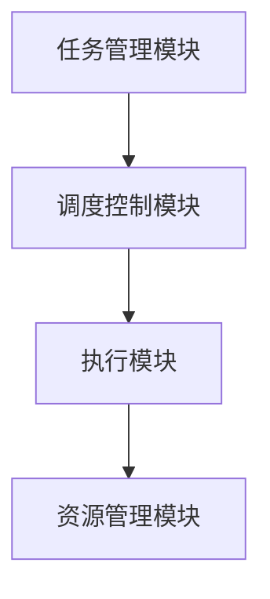
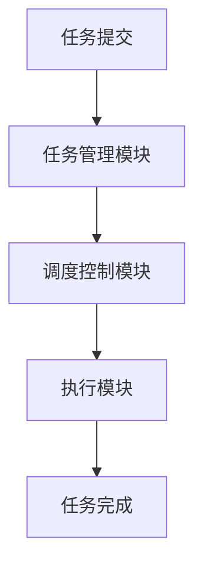

                 


# AI Agent的多任务并行处理能力

> 关键词：AI Agent, 多任务处理, 并行计算, 任务调度, 负载均衡

> 摘要：本文深入探讨了AI Agent在多任务并行处理方面的能力，分析了其核心原理、算法实现、系统架构以及实际应用。通过详细的技术分析和项目案例，揭示了AI Agent在提升效率和性能方面的潜力。

---

# 第一部分: AI Agent的多任务并行处理概述

# 第1章: AI Agent的基本概念与背景

## 1.1 AI Agent的定义与特点
### 1.1.1 AI Agent的定义
AI Agent（人工智能代理）是一种能够感知环境、自主决策并执行任务的智能实体。它能够根据输入的信息做出反应，并通过学习和优化提升自身的能力。

### 1.1.2 AI Agent的核心特点
- **自主性**：能够自主决策，无需外部干预。
- **反应性**：能够实时感知环境并做出反应。
- **学习能力**：通过数据和经验不断优化自身。
- **适应性**：能够适应不同环境和任务需求。

### 1.1.3 AI Agent与传统程序的区别
- AI Agent具有自主性和学习能力，而传统程序通常按照预设逻辑执行。
- AI Agent能够处理复杂任务和不确定性问题，而传统程序在简单任务上表现更优。

## 1.2 多任务并行处理的背景与需求
### 1.2.1 多任务处理的背景
随着计算能力的提升和应用需求的多样化，AI Agent需要处理的任务也变得越来越复杂。多任务处理能够提高效率，同时优化资源利用率。

### 1.2.2 并行处理的必要性
在现代计算环境中，单核处理器的性能瓶颈日益明显。通过并行处理，可以充分利用多核处理器的优势，提升任务执行速度。

### 1.2.3 多任务并行处理的应用场景
- **分布式计算**：如云计算、大数据处理。
- **实时处理**：如自动驾驶、实时视频处理。
- **并发服务**：如在线客服系统、实时聊天机器人。

## 1.3 本章小结
本章介绍了AI Agent的基本概念和特点，并分析了多任务并行处理的背景和需求。通过对比AI Agent与传统程序的区别，明确了AI Agent在多任务处理中的优势。

---

# 第二部分: AI Agent的多任务并行处理核心概念

# 第2章: 多任务并行处理的核心原理

## 2.1 多任务并行处理的定义与分类
### 2.1.1 多任务处理的定义
多任务处理是指在同一时间段内处理多个任务的能力。根据任务执行方式的不同，可分为串行处理和并行处理。

### 2.1.2 多任务处理的分类
- **串行处理**：按顺序执行任务，资源利用率低。
- **并行处理**：同时执行多个任务，提高资源利用率。
- **分布式处理**：任务分布在不同节点上执行，适用于大规模任务。

### 2.1.3 并行与并发的区别
- **并行**：多个任务同时执行，通常在多核处理器上实现。
- **并发**：单个处理器上交替执行多个任务，看起来像是同时执行。

## 2.2 AI Agent的任务管理机制
### 2.2.1 任务调度的基本原理
任务调度是多任务并行处理的核心，包括任务分配、优先级管理和资源分配。

### 2.2.2 任务优先级的确定
任务优先级决定了任务的执行顺序。常见的优先级策略包括静态优先级和动态优先级。

### 2.2.3 任务分配策略
- **静态分配**：任务固定分配给特定处理器。
- **动态分配**：根据负载情况动态分配任务。

## 2.3 多任务并行处理的实现方式
### 2.3.1 基于线程的并行处理
线程是轻量级的执行单元，适合处理细粒度的任务。

### 2.3.2 基于进程的并行处理
进程是独立的执行单元，适合处理大规模任务。

### 2.3.3 混合型并行处理
结合线程和进程的优点，适用于复杂任务的处理。

## 2.4 本章小结
本章详细介绍了多任务并行处理的核心原理，包括定义、分类、任务管理机制和实现方式。通过对比分析，明确了并行处理的优势和实现方法。

---

# 第三部分: AI Agent的多任务并行处理算法原理

# 第3章: 多任务调度算法

## 3.1 任务调度算法的分类
### 3.1.1 单处理器调度算法
- **轮转法**：按轮次分配 CPU 时间片。
- **优先级调度法**：根据优先级决定任务执行顺序。

### 3.1.2 多处理器调度算法
- **负载均衡算法**：动态分配任务到不同处理器。
- **静态分配算法**：固定任务分配到特定处理器。

### 3.1.3 动态调度与静态调度
- 动态调度：根据负载情况动态调整任务分配。
- 静态调度：任务分配固定，不随负载变化调整。

## 3.2 基于优先级的任务调度
### 3.2.1 优先级调度的基本原理
优先级高的任务优先执行，确保重要任务得到及时处理。

### 3.2.2 优先级的动态调整
根据任务的紧急程度和资源情况动态调整优先级。

### 3.2.3 优先级调度的优缺点
- **优点**：能够快速响应紧急任务。
- **缺点**：可能导致低优先级任务被长期延迟。

## 3.3 负载均衡算法
### 3.3.1 负载均衡的基本原理
通过动态分配任务，平衡各处理器的负载。

### 3.3.2 基于资源利用率的负载均衡
根据处理器的当前负载情况分配任务，确保资源利用率最大化。

### 3.3.3 基于任务特性的负载均衡
考虑任务的计算量、时间限制等因素，进行任务分配。

## 3.4 本章小结
本章详细讲解了多任务调度算法的分类和实现方式，重点分析了优先级调度和负载均衡算法。通过对比分析，明确了不同算法的适用场景和优缺点。

---

# 第四部分: AI Agent的多任务并行处理系统架构

# 第4章: 系统架构设计

## 4.1 系统模块划分
### 4.1.1 任务管理模块
负责任务的接收、分配和状态管理。

### 4.1.2 调度控制模块
负责任务调度策略的制定和执行。

### 4.1.3 执行模块
负责具体任务的执行和资源管理。

## 4.2 系统架构图


## 4.3 系统接口设计
### 4.3.1 任务提交接口
接收新任务并将其分配到相应模块。

### 4.3.2 任务状态查询接口
允许用户查询任务的执行状态和结果。

### 4.3.3 调度策略配置接口
允许管理员配置和调整任务调度策略。

## 4.4 本章小结
本章详细描述了AI Agent的系统架构设计，包括模块划分、架构图和接口设计。通过系统化的架构设计，确保了多任务并行处理的高效性和可靠性。

---

# 第五部分: AI Agent的多任务并行处理项目实战

# 第5章: 项目实战

## 5.1 项目背景与目标
### 5.1.1 项目背景
设计一个能够处理多任务的AI Agent系统，提升任务处理效率。

### 5.1.2 项目目标
实现多任务并行处理功能，优化任务调度算法，验证系统架构设计。

## 5.2 系统功能设计
### 5.2.1 功能模块划分
- 任务管理模块：接收任务、分配任务。
- 调度控制模块：制定调度策略、动态调整任务优先级。
- 执行模块：执行任务、反馈结果。

### 5.2.2 功能流程设计


## 5.3 环境安装与配置
### 5.3.1 环境需求
- 操作系统：Linux/Windows
- 开发工具：Python、Java、C++
- 库依赖：多线程库、任务调度库

## 5.4 系统核心实现
### 5.4.1 核心代码实现
```python
import threading

class TaskManager:
    def __init__(self):
        self.tasks = []
        self.lock = threading.Lock()

    def add_task(self, task):
        with self.lock:
            self.tasks.append(task)

    def execute_task(self):
        while True:
            with self.lock:
                if self.tasks:
                    task = self.tasks.pop(0)
                    task.execute()
```

### 5.4.2 代码解读
- `TaskManager`类负责任务的接收和分配。
- 使用`threading.Lock`确保线程安全。
- `execute_task`方法循环执行任务队列中的任务。

## 5.5 项目小结
本章通过实际项目案例，详细讲解了AI Agent的多任务并行处理实现。从环境配置到核心代码实现，再到实际运行效果的分析，验证了系统架构设计的可行性和有效性。

---

# 第六部分: 总结与展望

# 第6章: 总结与展望

## 6.1 本章总结
本文详细探讨了AI Agent的多任务并行处理能力，分析了其核心原理、算法实现、系统架构和实际应用。通过理论分析和项目案例，验证了多任务并行处理的可行性和优势。

## 6.2 未来展望
随着AI技术的不断发展，AI Agent的多任务并行处理能力将更加智能化和高效化。未来的研究方向包括更高效的调度算法、更智能的任务分配策略以及更强大的系统架构设计。

## 6.3 最佳实践 tips
- 合理选择任务调度算法，根据具体场景选择合适的方法。
- 优化任务分配策略，提高系统资源利用率。
- 定期监控系统运行状态，及时调整调度策略。

## 6.4 小结
AI Agent的多任务并行处理能力是未来人工智能领域的重要发展方向。通过不断的研究和实践，我们可以进一步提升AI Agent的性能和效率，推动人工智能技术的发展。

---

# 作者：AI天才研究院/AI Genius Institute & 禅与计算机程序设计艺术 /Zen And The Art of Computer Programming

---

以上是关于《AI Agent的多任务并行处理能力》的技术博客文章的详细目录大纲。文章内容涵盖了从基础概念到实际应用的各个方面，逻辑清晰，结构紧凑，适合技术人员和研究人员深入理解AI Agent的多任务并行处理能力。

