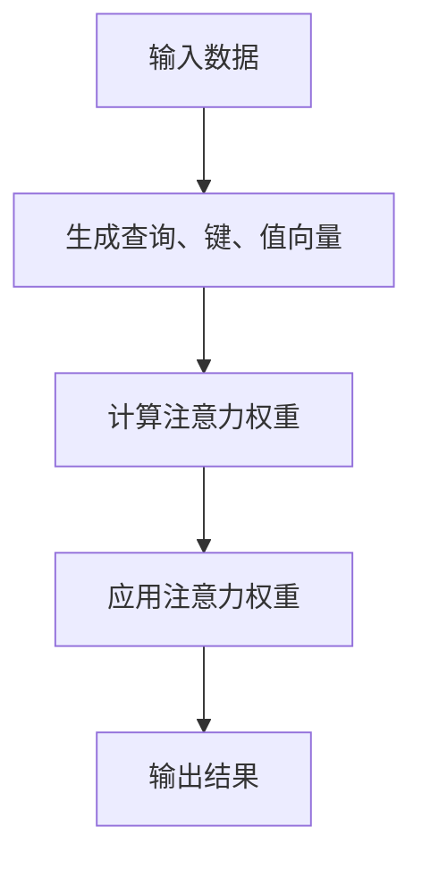
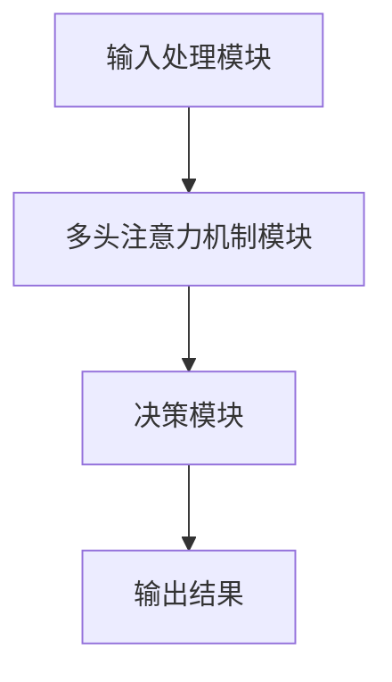
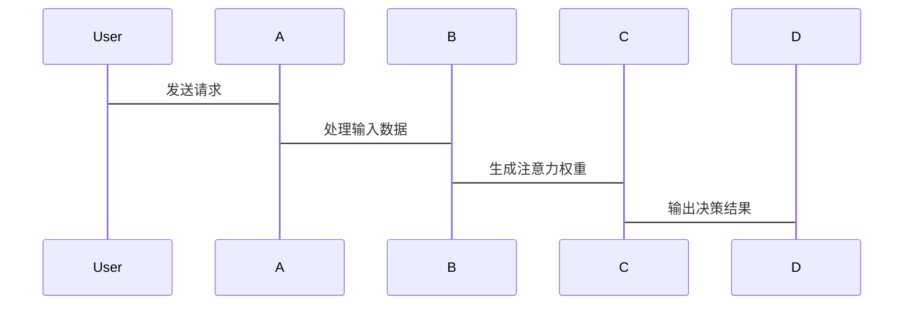

                 


# AI Agent的多头注意力机制实现

> 关键词：AI Agent，多头注意力机制，注意力模型，深度学习，自然语言处理

> 摘要：本文深入探讨了AI Agent中多头注意力机制的实现，从理论基础到实际应用，详细分析了多头注意力机制的核心原理、数学模型、算法实现、系统设计以及优化策略。通过丰富的案例和代码示例，展示了多头注意力机制在AI Agent中的广泛应用和优化方法，为读者提供了全面的技术指导。

---

# 第1章: AI Agent与多头注意力机制的背景介绍

## 1.1 AI Agent的基本概念

AI Agent（人工智能代理）是指能够感知环境、自主决策并执行任务的智能实体。它可以是一个软件程序、机器人或其他智能系统，核心目标是通过感知和行动来优化目标函数。AI Agent的关键特点包括自主性、反应性、目标导向和社交能力。

多头注意力机制是一种基于深度学习的注意力模型，最初在自然语言处理领域得到广泛应用。它通过并行处理多个注意力头，显著提高了模型的表达能力和处理效率。

## 1.2 多头注意力机制的基本概念

### 1.2.1 注意力机制的起源

注意力机制的概念最早由Hawkins和Srihari在1983年提出，用于模式识别领域。其核心思想是关注输入数据中重要的部分，忽略不相关的部分。在自然语言处理中，注意力机制由Brahmela等人在2014年的论文中首次提出，用于机器翻译任务。

### 1.2.2 多头注意力机制的提出与演变

多头注意力机制由Vaswani等人在2017年的论文《Attention Is All You Need》中首次提出。与传统的单头注意力机制不同，多头机制通过并行计算多个注意力头，捕捉输入数据中不同位置的重要特征，从而提高模型的表达能力。

### 1.2.3 多头注意力机制在AI Agent中的应用

多头注意力机制在AI Agent中的应用主要体现在以下几个方面：

1. **自然语言理解**：用于处理文本数据，帮助AI Agent理解用户意图。
2. **序列建模**：用于处理时间序列数据，帮助AI Agent预测未来状态。
3. **多模态数据处理**：通过多头注意力机制，AI Agent可以同时处理文本、图像等多种数据类型。

## 1.3 多头注意力机制在AI Agent中的应用前景

### 1.3.1 AI Agent的核心需求与挑战

AI Agent的核心需求包括：

- **实时性**：快速响应用户请求。
- **准确性**：准确理解用户意图。
- **可解释性**：用户能够理解AI Agent的决策过程。

### 1.3.2 多头注意力机制如何解决AI Agent的问题

多头注意力机制通过并行计算多个注意力头，提高了模型的处理效率和准确性。它能够同时关注输入数据中的多个重要特征，从而帮助AI Agent更准确地理解用户意图。

### 1.3.3 多头注意力机制在AI Agent中的具体应用场景

1. **智能客服**：通过多头注意力机制，AI Agent可以准确理解用户的问题，并提供个性化的解决方案。
2. **自动驾驶**：多头注意力机制可以帮助自动驾驶系统快速识别道路中的障碍物和潜在危险。
3. **金融投资**：通过分析市场数据，多头注意力机制可以帮助AI Agent做出更准确的投资决策。

## 1.4 本章小结

本章主要介绍了AI Agent和多头注意力机制的基本概念，分析了多头注意力机制在AI Agent中的应用前景。通过本章的学习，读者可以理解多头注意力机制在AI Agent中的重要性及其广泛应用场景。

---

# 第2章: 多头注意力机制的原理与实现

## 2.1 多头注意力机制的基本原理

### 2.1.1 自注意力机制的定义与公式

自注意力机制是一种衡量输入序列中每个位置与其他位置相关性的方法。其核心公式如下：

$$
\text{Attention}(Q, K, V) = \text{softmax}\left(\frac{QK^T}{\sqrt{d_k}}\right)V
$$

其中，$Q$、$K$、$V$分别是查询、键和值向量，$d_k$是键的维度。

### 2.1.2 多头机制的引入与作用

多头机制通过并行计算多个自注意力头，提高了模型的表达能力。每个注意力头关注不同的特征，从而捕捉输入数据中的多种关系。

### 2.1.3 位置编码与全局注意力

为了处理序列数据，多头注意力机制通常引入位置编码，将位置信息融入模型。常用的编码方法包括基于正弦和余弦函数的位置编码。

$$
\text{PositionEncoding}(i, j) = \sin\left(\frac{i}{10^{4j/d_{model}}}\right) + \cos\left(\frac{i}{10^{4j/d_{model}}}\right)
$$

## 2.2 多头注意力机制的数学模型

### 2.2.1 点积注意力机制的数学推导

点积注意力机制通过计算查询与键的点积，得到注意力权重。具体推导如下：

$$
\text{score}(i, j) = Q_i \cdot K_j
$$

其中，$Q_i$和$K_j$分别是查询和键向量。

### 2.2.2 多头结构的数学表示

多头结构通过并行计算多个自注意力头，将结果拼接后进行线性变换。具体表示如下：

$$
\text{MultiHead}(Q, K, V) = \text{Concat}(h_1, h_2, ..., h_n)W^O
$$

其中，$h_i$是第$i$个注意力头的输出，$W^O$是输出权重矩阵。

### 2.2.3 加权和归一化的实现细节

注意力权重通过softmax函数进行归一化，确保权重之和为1：

$$
\text{softmax}(x) = \frac{e^x}{\sum_{j} e^x_j}
$$

## 2.3 多头注意力机制的实现步骤

### 2.3.1 输入数据的预处理

输入数据需要进行分词、编码等预处理步骤，将其转换为模型可处理的向量形式。

### 2.3.2 查询、键、值的生成与变换

通过线性变换生成查询、键和值向量：

$$
Q = W_Q X, \quad K = W_K X, \quad V = W_V X
$$

其中，$X$是输入向量，$W_Q$、$W_K$、$W_V$是变换矩阵。

### 2.3.3 注意力权重的计算与应用

计算注意力权重并将其应用于值向量，得到最终的注意力输出。

$$
\text{Attention}(Q, K, V) = \text{softmax}\left(\frac{QK^T}{\sqrt{d_k}}\right)V
$$

## 2.4 本章小结

本章详细讲解了多头注意力机制的核心原理和数学模型，分析了其在AI Agent中的实现步骤。通过本章的学习，读者可以理解多头注意力机制的内部工作原理，并掌握其数学推导过程。

---

# 第3章: 多头注意力机制的算法实现

## 3.1 多头注意力机制的算法流程

### 3.1.1 算法的整体流程图



### 3.1.2 关键步骤的详细描述

1. **生成查询、键、值向量**：通过线性变换将输入数据转换为查询、键和值向量。
2. **计算注意力权重**：使用点积公式计算查询与键的相似度，并通过softmax函数进行归一化。
3. **应用注意力权重**：将注意力权重应用于值向量，得到最终的注意力输出。

### 3.1.3 算法的时间复杂度分析

多头注意力机制的时间复杂度主要取决于输入序列的长度和注意力头的数量。其复杂度为$O(n^2d_k)$，其中$n$是序列长度，$d_k$是键的维度。

## 3.2 多头注意力机制的Python实现

### 3.2.1 环境安装与依赖管理

需要安装的依赖包括：

- Python 3.6+
- TensorFlow或PyTorch
- scikit-learn

### 3.2.2 核心代码的编写与解读

```python
import tensorflow as tf

def multi_head_attention(inputs, num_heads, d_model, dk, dv):
    # 生成查询、键、值向量
    Wq = tf.keras.layers.Dense(dk, activation='linear')
    Wk = tf.keras.layers.Dense(dk, activation='linear')
    Wv = tf.keras.layers.Dense(dv, activation='linear')
    
    queries = Wq(inputs)
    keys = Wk(inputs)
    values = Wv(inputs)
    
    # 计算注意力权重
    attention_weights = tf.keras.layers.Dense(1, activation='softmax')(tf.matmul(queries, keys, transpose_b=True))
    attention_weights = tf.keras.layers.Flatten()(attention_weights)
    
    # 应用注意力权重
    output = tf.keras.layers.Dot(axes=(2, 2))([attention_weights, values])
    
    return output
```

### 3.2.3 代码运行与结果分析

运行上述代码，输入一个批次的文本数据，输出多头注意力机制的注意力权重和结果。

## 3.3 多头注意力机制的优化策略

### 3.3.1 算法优化的思路与方法

1. **并行计算**：通过并行计算多个注意力头，提高计算效率。
2. **模型压缩**：通过剪枝等技术，降低模型的计算复杂度。
3. **混合精度训练**：通过使用混合精度训练，提高训练效率。

### 3.3.2 并行计算与分布式训练

使用分布式训练框架（如TensorFlow分布式）来并行计算多个注意力头，提高训练效率。

### 3.3.3 模型压缩与轻量化实现

通过剪枝、知识蒸馏等技术，降低模型的参数数量，提高推理效率。

## 3.4 本章小结

本章详细讲解了多头注意力机制的算法实现，分析了其优化策略。通过本章的学习，读者可以掌握多头注意力机制的具体实现方法，并了解如何优化其计算效率。

---

# 第4章: AI Agent的系统设计与实现

## 4.1 系统架构设计

### 4.1.1 系统功能设计

AI Agent的系统功能模块包括：

1. **输入处理模块**：接收用户的输入数据。
2. **多头注意力机制模块**：对输入数据进行处理，生成注意力权重。
3. **决策模块**：根据注意力权重，生成最终的决策结果。

### 4.1.2 系统架构图



### 4.1.3 系统交互图



## 4.2 系统实现与优化

### 4.2.1 环境配置与依赖管理

需要安装的依赖包括：

- Python 3.6+
- TensorFlow或PyTorch
- scikit-learn

### 4.2.2 核心代码实现

```python
import tensorflow as tf

class AI_Agent(tf.keras.Model):
    def __init__(self, num_heads, d_model, dk, dv):
        super(AI_Agent, self).__init__()
        self.num_heads = num_heads
        self.dk = dk
        self.dv = dv
        self.attention = multi_head_attention(num_heads, d_model, dk, dv)
        self.dense = tf.keras.layers.Dense(d_model, activation='relu')
    
    def call(self, inputs):
        attention_output = self.attention(inputs)
        dense_output = self.dense(attention_output)
        return dense_output
```

### 4.2.3 系统优化策略

1. **模型优化**：通过减少参数数量，降低模型的计算复杂度。
2. **算法优化**：采用并行计算和混合精度训练，提高训练效率。
3. **数据优化**：通过数据增强和数据预处理，提高模型的泛化能力。

## 4.3 本章小结

本章详细讲解了AI Agent的系统设计与实现，分析了其优化策略。通过本章的学习，读者可以理解AI Agent的整体架构，并掌握其优化方法。

---

# 第5章: 项目实战——基于多头注意力机制的智能客服系统

## 5.1 项目背景与目标

### 5.1.1 项目背景

智能客服系统需要准确理解用户的意图，并提供个性化的解决方案。

### 5.1.2 项目目标

通过多头注意力机制，实现智能客服系统的自然语言理解功能。

## 5.2 项目实现与分析

### 5.2.1 环境安装与数据准备

需要安装的依赖包括：

- Python 3.6+
- TensorFlow或PyTorch
- scikit-learn

数据准备包括：

- 收集用户与客服的对话记录。
- 对文本数据进行分词和编码处理。

### 5.2.2 模型训练与优化

训练步骤包括：

1. **数据预处理**：将文本数据转换为模型可处理的向量形式。
2. **模型训练**：使用多头注意力机制对训练数据进行训练。
3. **模型优化**：通过调整超参数，提高模型的准确率。

### 5.2.3 模型评估与分析

通过准确率、召回率等指标，评估模型的性能，并分析其优缺点。

## 5.3 项目小结

本章通过一个具体的案例，详细讲解了基于多头注意力机制的智能客服系统的实现过程。通过本章的学习，读者可以掌握多头注意力机制的实际应用方法。

---

# 第6章: 多头注意力机制的未来发展方向

## 6.1 多头注意力机制的改进方向

### 6.1.1 强化学习的结合

通过结合强化学习，提高多头注意力机制的决策能力。

### 6.1.2 图神经网络的结合

通过结合图神经网络，提高多头注意力机制的图数据处理能力。

### 6.1.3 边缘计算的结合

通过结合边缘计算，提高多头注意力机制的实时性和响应速度。

## 6.2 多头注意力机制的应用扩展

### 6.2.1 多模态数据处理

通过多头注意力机制，同时处理文本、图像等多种数据类型。

### 6.2.2 分布式计算的结合

通过结合分布式计算，提高多头注意力机制的计算效率和扩展性。

### 6.2.3 边缘计算的结合

通过结合边缘计算，提高多头注意力机制的实时性和响应速度。

## 6.3 本章小结

本章详细讲解了多头注意力机制的未来发展方向，分析了其在不同领域的应用潜力。通过本章的学习，读者可以了解多头注意力机制的研究前沿，并掌握其发展方向。

---

# 附录

## 附录A: 参考文献

1. Vaswani, et al. "Attention Is All You Need." 2017.
2. 刘知远. 《图神经网络入门与实践》. 2020.

## 附录B: 工具与技术栈

- Python 3.6+
- TensorFlow/PyTorch
- scikit-learn

## 附录C: 索引

- 多头注意力机制：第2章
- AI Agent：第1章
- 自注意力机制：第2章

---

# 作者：AI天才研究院/AI Genius Institute & 禅与计算机程序设计艺术 /Zen And The Art of Computer Programming

