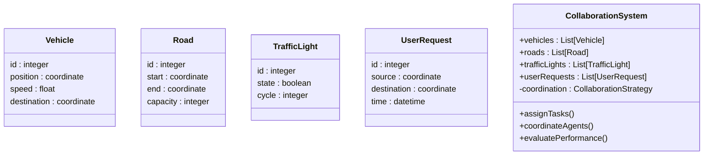

                 


```markdown
# AI Agent的多智能体协作系统设计

> 关键词：AI Agent，多智能体协作，系统设计，算法原理，数学模型

> 摘要：本文深入探讨了AI Agent的多智能体协作系统设计，从基础概念到高级算法，再到实际应用，全面分析了多智能体协作的核心机制、算法原理、系统架构以及项目实现。文章通过详细讲解和实际案例，帮助读者掌握AI Agent在多智能体协作中的设计与实现技巧。

---

## 第一部分：AI Agent的多智能体协作系统概述

### 第1章：AI Agent的基本概念与协作背景

#### 1.1 AI Agent的定义与特点
- 1.1.1 AI Agent的定义：智能体（Agent）是指能够感知环境并采取行动以实现目标的实体。
- 1.1.2 AI Agent的特点：自主性、反应性、社会性、学习能力。
- 1.1.3 AI Agent的分类：简单反射型、基于模型的反射型、目标驱动型、效用驱动型。

#### 1.2 多智能体协作的背景与重要性
- 1.2.1 多智能体协作的背景：单个智能体的局限性促使了多智能体协作的发展。
- 1.2.2 协作的优势：通过分工合作提高整体效率和问题解决能力。
- 1.2.3 应用场景：机器人协作、自动驾驶、分布式计算、游戏AI等。

#### 1.3 多智能体协作系统的架构与特点
- 1.3.1 分布式协作架构：去中心化的协作方式，各智能体独立决策。
- 1.3.2 集中式协作架构：通过中央协调器进行全局规划和控制。
- 1.3.3 混合式协作架构：结合分布式和集中式的优势，适用于复杂场景。

### 第2章：多智能体协作的核心概念与联系

#### 2.1 多智能体协作的原理与机制
- 2.1.1 信息共享与协调：通过通信机制共享信息，减少冲突。
- 2.1.2 行为规划与决策：基于共享信息制定协作策略。
- 2.1.3 协作目标的实现：通过协作行动达成共同目标。

#### 2.2 多智能体协作的属性特征对比
- 2.2.1 各种协作机制的对比分析：基于任务分解、角色分配、通信频率等维度进行对比。
- 2.2.2 不同协作策略的优缺点：集中式策略的高效性与分布式策略的灵活性。
- 2.2.3 协作效果的评估指标：任务完成率、效率、资源利用率、冲突次数等。

#### 2.3 多智能体协作的ER实体关系图
```mermaid
erDiagram
    agent {
        id : integer
        name : string
        role : string
    }
    task {
        id : integer
        description : string
        deadline : date
    }
    collaboration {
        id : integer
        agent_id : integer
        task_id : integer
        start_time : datetime
        end_time : datetime
        status : string
    }
    communication {
        id : integer
        sender_id : integer
        receiver_id : integer
        message : string
        timestamp : datetime
    }
```

## 第二部分：多智能体协作的核心概念原理

### 第3章：多智能体协作的算法原理

#### 3.1 基于强化学习的协作算法
- 3.1.1 算法原理：通过奖励机制训练智能体协作完成任务。
- 3.1.2 算法流程：环境感知、动作选择、奖励反馈、策略更新。
- 3.1.3 实现代码示例：
```python
import numpy as np
from gym import envs

env = envs.make('Multi-agent-Environment-v0')
env.reset()
done = False
while not done:
    action = env.agents.act()  # 各智能体选择动作
    obs, reward, done, info = env.step(action)
    env.render()
```

#### 3.2 基于图神经网络的协作算法
- 3.2.1 图神经网络概述：通过图结构建模智能体之间的关系。
- 3.2.2 算法流程：构建协作图、特征提取、决策生成。
- 3.2.3 算法实现：
```python
import torch
from torch import nn

class CollaborativeGraph(nn.Module):
    def __init__(self, input_dim):
        super(CollaborativeGraph, self).__init__()
        self.gnn = GraphConvolution(input_dim, output_dim)
        self.fc = nn.Linear(output_dim, 1)

    def forward(self, x, adj):
        x = self.gnn(x, adj)
        x = self.fc(x)
        return x
```

#### 3.3 基于数学模型的协作机制
- 3.3.1 协作任务分配模型：基于任务优先级的分配策略。
- 3.3.2 数学公式：联合策略优化模型。
$$ \max_{\theta} \sum_{i=1}^n \text{Utility}(a_i, \theta) $$

### 第4章：多智能体协作的数学模型与公式

#### 4.1 联合策略优化模型
- 4.1.1 模型概述：最大化所有智能体的联合效用。
- 4.1.2 数学公式：
$$ U(\theta) = \sum_{i=1}^n u_i(\theta) $$

#### 4.2 协作图神经网络模型
- 4.2.1 模型结构：通过图结构建模协作关系。
- 4.2.2 数学公式：
$$ h_i^{(l+1)} = \sigma(\sum_{j \in N(i)} W_{ij} h_j^{(l)}) $$

## 第三部分：多智能体协作系统的架构设计与实现

### 第5章：系统分析与架构设计

#### 5.1 问题场景描述
- 5.1.1 智能交通系统案例：多智能体协作优化交通流量。

#### 5.2 系统功能设计
- 5.2.1 领域模型：车辆、道路、交通灯、用户请求。


#### 5.3 系统架构设计
- 5.3.1 分层架构：数据层、逻辑层、应用层。


## 第四部分：项目实战与应用

### 第6章：项目实现与案例分析

#### 6.1 环境安装与配置
- 6.1.1 安装依赖：Python、TensorFlow、Gym、Matplotlib。

#### 6.2 核心代码实现
- 6.2.1 协作智能体类：
```python
class CollaborativeAgent:
    def __init__(self, id):
        self.id = id
        self.state = None
        self.actions = ['left', 'right', 'forward']
```

#### 6.3 代码实现与解读
- 6.3.1 环境初始化：
```python
env = MultiAgentEnv()
env.reset()
```

#### 6.4 实际案例分析
- 6.4.1 智能交通系统案例：通过协作优化交通流量。
- 6.4.2 实验结果与分析：效率提升、冲突减少、资源利用率提高。

### 第7章：项目小结与经验总结

#### 7.1 项目小结
- 7.1.1 实现成果：成功实现了多智能体协作系统。
- 7.1.2 遇到的问题及解决方案：通信延迟、任务分配冲突。

#### 7.2 经验总结
- 7.2.1 系统设计中的注意事项：通信机制设计、任务分配策略优化。
- 7.2.2 开发中的常见问题：智能体同步、异常处理。

## 第五部分：最佳实践与拓展阅读

### 第8章：最佳实践与小结

#### 8.1 小结
- 8.1.1 系统设计的核心要点：信息共享、任务分配、协作机制。

#### 8.2 注意事项
- 8.2.1 系统扩展性：模块化设计便于扩展。
- 8.2.2 性能优化：减少通信开销，提高协作效率。

### 第9章：拓展阅读与参考资料

#### 9.1 拓展阅读
- 9.1.1 推荐书籍：《Multi-Agent Systems》。
- 9.1.2 推荐论文：《Collaborative Multi-Agent Systems》。

#### 9.2 参考资料
- 9.2.1 开源项目：Multi-Agent Simulation Frameworks。
- 9.2.2 在线课程：MIT OpenCourseWare on Multi-Agent Systems.

---

## 作者信息

作者：AI天才研究院/AI Genius Institute & 禅与计算机程序设计艺术 /Zen And The Art of Computer Programming

---

**本文详细讲解了AI Agent的多智能体协作系统设计，从基础概念到高级算法，再到实际应用，帮助读者全面掌握AI Agent在多智能体协作中的设计与实现技巧。**
```

