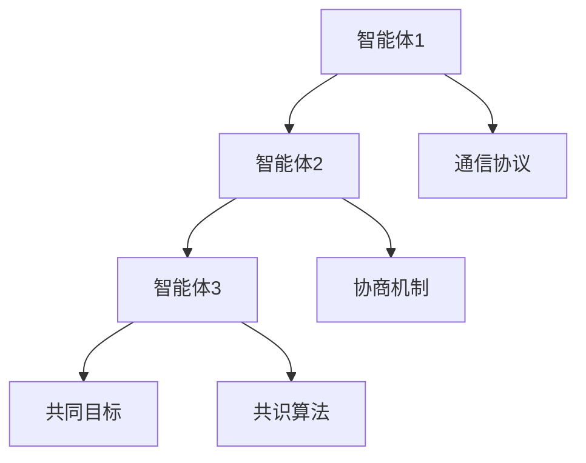
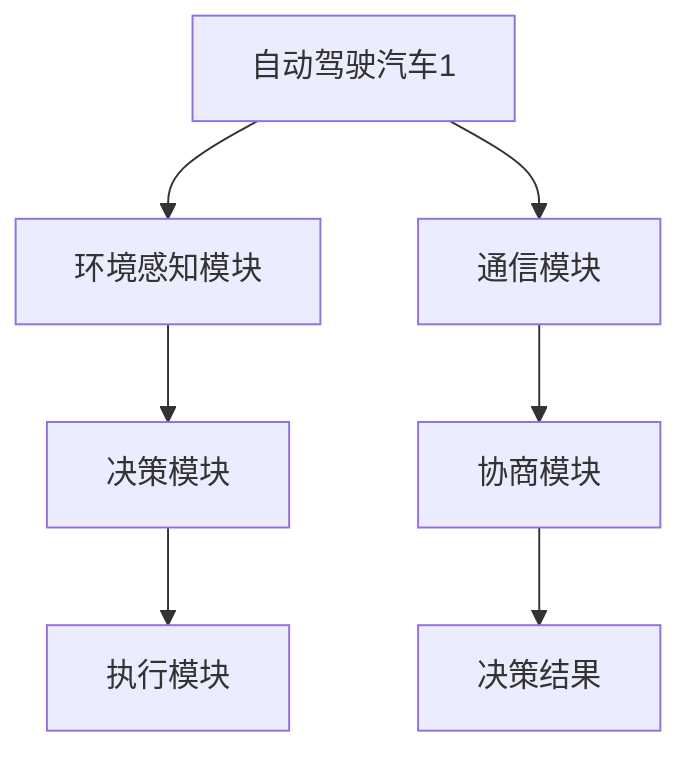
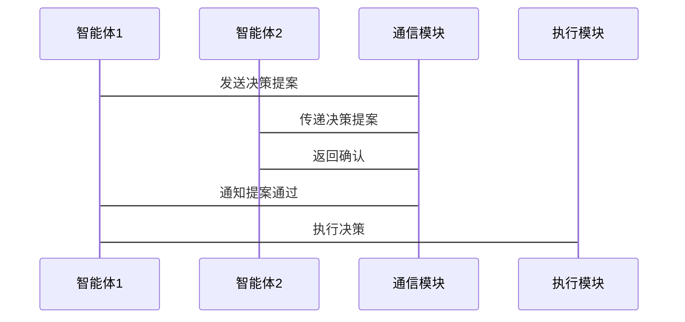

                 


# AI Agent的多智能体协同决策机制

> 关键词：AI Agent, 多智能体系统, 协同决策, 分布式计算, 共识算法, 系统架构

> 摘要：本文系统地介绍了AI Agent在多智能体协同决策机制中的应用，详细阐述了多智能体系统的定义、核心算法、系统架构设计以及实际项目实现。文章从基础概念出发，逐步深入分析了多智能体协同决策的关键问题、算法原理和系统实现，最后通过实际案例展示了如何在项目中应用这些机制。

---

# 第一部分: AI Agent的多智能体协同决策机制概述

# 第1章: AI Agent与多智能体系统概述

## 1.1 AI Agent的基本概念

### 1.1.1 AI Agent的定义与特点

人工智能代理（AI Agent）是指能够感知环境并采取行动以实现目标的实体。AI Agent具有以下特点：

- **自主性**：能够自主决策，无需外部干预。
- **反应性**：能够实时感知环境并做出反应。
- **目标导向性**：所有行为都围绕实现特定目标展开。
- **学习能力**：能够通过经验改进自身的决策能力。

### 1.1.2 多智能体系统的定义与特点

多智能体系统（Multi-Agent System, MAS）是由多个智能体组成的系统，这些智能体能够协同工作以实现共同目标。多智能体系统的特点包括：

- **分布式**：智能体分布于不同的位置，独立决策。
- **协作性**：智能体之间需要协作以完成共同目标。
- **动态性**：系统环境和智能体状态可能不断变化。

### 1.1.3 多智能体系统与单智能体系统的区别

| 属性         | 单智能体系统       | 多智能体系统       |
|--------------|--------------------|--------------------|
| 系统结构     | 单一智能体         | 多个智能体         |
| 决策方式     | 中央决策           | 分布式决策         |
| 通信需求     | 无需通信           | 需要通信           |
| 协作能力     | 无需协作           | 需要协作           |

### 1.1.4 多智能体系统的应用场景

多智能体系统广泛应用于以下场景：

- **分布式计算**：如分布式数据库、云计算等。
- **机器人协作**：如工业机器人协同生产。
- **自动驾驶**：如自动驾驶汽车之间的协同决策。
- **智能城市**：如交通管理系统中车辆的协同决策。

## 1.2 多智能体协同决策的背景与意义

### 1.2.1 协同决策的定义与特点

协同决策是指多个智能体共同参与决策过程，以实现共同目标。其特点包括：

- **协作性**：智能体之间需要协作。
- **分布式**：决策过程分布在多个智能体中。
- **动态性**：环境和智能体状态可能动态变化。

### 1.2.2 多智能体协同决策的背景

随着人工智能技术的发展，单智能体系统逐渐难以满足复杂场景的需求。例如，在自动驾驶场景中，需要多个车辆协同决策以避免碰撞。多智能体系统的出现，为解决这些问题提供了新的思路。

### 1.2.3 多智能体协同决策的意义

多智能体协同决策的意义在于：

- **提高效率**：通过协作，多个智能体可以更快地完成任务。
- **增强鲁棒性**：通过分布式决策，系统在局部故障时仍能正常运行。
- **实现复杂目标**：通过协作，多个智能体可以实现单个智能体无法完成的目标。

## 1.3 多智能体协同决策的核心问题

### 1.3.1 问题背景与问题描述

在多智能体系统中，智能体需要协同决策以实现共同目标。然而，由于智能体的独立性和环境的动态性，协同决策过程中可能面临以下问题：

- **通信开销**：智能体之间的通信可能产生额外开销。
- **同步问题**：智能体需要同步决策过程。
- **冲突问题**：智能体之间可能产生冲突。

### 1.3.2 问题解决的思路与方法

为了解决上述问题，可以采用以下思路：

- **分布式计算**：通过分布式计算减少通信开销。
- **协商机制**：通过协商机制解决冲突问题。
- **共识算法**：通过共识算法实现同步决策。

### 1.3.3 边界与外延

多智能体协同决策的边界在于智能体的独立性和环境的动态性。其外延包括分布式计算、协商机制和共识算法。

## 1.4 多智能体协同决策的核心要素

### 1.4.1 智能体的属性与行为

智能体的属性包括：

- **状态**：智能体当前的环境感知。
- **行为**：智能体采取的行动。
- **目标**：智能体需要实现的目标。

智能体的行为包括：

- **感知**：获取环境信息。
- **决策**：基于感知信息做出决策。
- **行动**：执行决策。

### 1.4.2 协同决策的机制与流程

协同决策的机制包括：

- **通信机制**：智能体之间的信息交换。
- **协商机制**：智能体之间的意见交换和达成一致。
- **共识机制**：智能体之间的决策同步。

协同决策的流程包括：

1. 智能体感知环境。
2. 智能体之间通信。
3. 智能体协商达成一致。
4. 智能体执行决策。

### 1.4.3 多智能体系统的架构与模式

多智能体系统的架构包括：

- **集中式架构**：一个中央智能体协调其他智能体。
- **分布式架构**：多个智能体独立决策，通过通信协作。

多智能体系统的模式包括：

- **协作模式**：智能体协作完成任务。
- **竞争模式**：智能体竞争资源。

## 1.5 本章小结

本章介绍了AI Agent和多智能体系统的定义、特点以及多智能体协同决策的背景和意义。同时，分析了多智能体协同决策的核心问题和核心要素。

---

# 第二部分: 多智能体协同决策的核心概念与联系

# 第2章: 多智能体协同决策的核心概念

## 2.1 智能体的定义与分类

### 2.1.1 智能体的定义

智能体是指能够感知环境并采取行动以实现目标的实体。智能体可以是软件程序、机器人或其他智能设备。

### 2.1.2 智能体的分类

智能体可以根据不同的标准进行分类：

- **按智能体的智能水平**：
  - **反应式智能体**：基于当前感知做出反应。
  - **认知式智能体**：具有推理和规划能力。
- **按智能体的协作方式**：
  - **协作式智能体**：智能体之间协作完成任务。
  - **竞争式智能体**：智能体之间竞争资源。

### 2.1.3 各类智能体的特点与应用场景

| 智能体类型         | 特点                         | 应用场景               |
|--------------------|------------------------------|------------------------|
| 反应式智能体       | 基于当前感知做出反应           | 自动驾驶汽车           |
| 认知式智能体       | 具有推理和规划能力             | 医疗诊断系统           |
| 协作式智能体       | 智能体之间协作完成任务         | 工厂自动化生产         |
| 竞争式智能体       | 智能体之间竞争资源             | 金融市场交易           |

## 2.2 协同决策的原理与机制

### 2.2.1 协同决策的基本原理

协同决策的基本原理是多个智能体通过通信和协作，共同制定决策以实现共同目标。协同决策的过程包括感知、通信、协商和执行。

### 2.2.2 协同决策的机制

协同决策的机制包括：

- **通信机制**：智能体之间的信息交换。
- **协商机制**：智能体之间的意见交换和达成一致。
- **共识机制**：智能体之间的决策同步。

### 2.2.3 协同决策的关键因素

协同决策的关键因素包括：

- **通信效率**：智能体之间的通信效率影响决策速度。
- **协商效率**：智能体之间的协商效率影响决策时间。
- **共识算法**：共识算法的效率和可靠性影响决策质量。

## 2.3 多智能体系统的实体关系图



## 2.4 多智能体系统的概念属性对比

| 概念         | 属性         | 描述                             |
|--------------|--------------|----------------------------------|
| 智能体       | 独立性       | 每个智能体独立决策和行动         |
|              | 协作性       | 智能体之间需要协作完成任务       |
| 协同决策     | 分布式       | 决策过程分布在多个智能体中       |
|              | 一致性       | 决策结果需要达成一致             |

## 2.5 本章小结

本章详细介绍了多智能体系统的实体关系图和概念属性对比，分析了智能体的定义、分类和协同决策的原理与机制。

---

# 第三部分: 多智能体协同决策的算法原理

# 第3章: 多智能体协同决策的核心算法

## 3.1 分布式计算与通信算法

### 3.1.1 分布式计算的基本原理

分布式计算是指多个智能体在不同位置上协同完成计算任务。其基本原理是通过通信和协作，将任务分解成多个子任务，分别在不同的智能体上执行，最后将结果汇总。

### 3.1.2 通信协议的设计与实现

通信协议是智能体之间进行信息交换的规则。常见的通信协议包括：

- **HTTP**：基于请求-响应的通信方式。
- **WebSocket**：实时双向通信协议。
- **MQTT**：轻量级的物联网通信协议。

### 3.1.3 分布式计算的优缺点分析

| 优点             | 缺点             |
|------------------|------------------|
| 高可用性         | 复杂性高         |
| 高扩展性         | 通信开销大       |
| 资源利用率高       | 同步困难         |

## 3.2 协商与共识算法

### 3.2.1 协商算法的基本原理

协商算法是指智能体之间通过交换意见，最终达成一致的算法。常见的协商算法包括：

- **一致性算法**：如Paxos、Raft等。
- **拜占庭容错算法**：用于处理不可靠网络环境下的共识问题。

### 3.2.2 共识算法的实现步骤

1. **初始化**：所有智能体进入协商状态。
2. **提案提出**：一个智能体提出决策提案。
3. **提案传播**：提案通过通信协议传播给其他智能体。
4. **提案确认**：其他智能体确认提案。
5. **提案通过**：提案获得足够多数确认后，决策生效。

### 3.2.3 常见共识算法的对比与选择

| 算法名称 | 特点                         | 适用场景               |
|----------|------------------------------|------------------------|
| Paxos    | 适用于分布式系统中的共识问题 | 数据库分布式事务       |
| Raft     | 适用于分布式系统中的领导者选举 | 分布式文件系统         |
| PBFT     | 适用于拜占庭容错环境           | 分布式金融系统         |

## 3.3 联合决策与优化算法

### 3.3.1 联合决策的基本思路

联合决策是指多个智能体共同制定决策，以实现共同目标。其基本思路是通过通信和协商，将所有智能体的决策整合成一个全局决策。

### 3.3.2 优化算法的设计与实现

优化算法的目标是提高决策的效率和质量。常见的优化算法包括：

- **遗传算法**：通过模拟自然选择过程优化决策。
- **粒子群优化算法**：通过模拟鸟群飞行行为优化决策。
- **模拟退火算法**：通过模拟金属退火过程优化决策。

### 3.3.3 联合决策的数学模型与公式

$$f(x) = \sum_{i=1}^{n} x_i$$

其中，$x_i$ 表示第i个智能体的决策，$f(x)$ 表示全局决策。

### 3.4 本章小结

本章详细介绍了多智能体协同决策的核心算法，包括分布式计算、协商算法和共识算法，并给出了优化算法的设计与实现。

---

# 第四部分: 多智能体协同决策的系统分析

## 4.1 系统分析与架构设计

### 4.1.1 项目背景介绍

本项目旨在设计一个基于多智能体协同决策的系统，应用于自动驾驶场景。系统需要实现多个自动驾驶汽车之间的协同决策，以避免碰撞并提高交通效率。

### 4.1.2 系统功能设计

系统功能设计包括：

- **环境感知**：智能体感知周围环境信息。
- **通信与协商**：智能体之间通信并协商决策。
- **决策执行**：智能体根据协商结果执行决策。

### 4.1.3 系统架构设计



### 4.1.4 系统交互流程图



## 4.2 系统架构与实现

### 4.2.1 系统架构图


### 4.2.2 系统功能模块

系统功能模块包括：

- **环境感知模块**：负责感知环境信息。
- **决策模块**：负责制定决策。
- **执行模块**：负责执行决策。
- **通信模块**：负责智能体之间的通信。
- **协商模块**：负责智能体之间的协商。

### 4.2.3 系统接口设计

系统接口设计包括：

- **通信接口**：智能体之间通过通信接口进行信息交换。
- **协商接口**：智能体之间通过协商接口进行意见交换。

## 4.3 系统实现与优化

### 4.3.1 环境感知模块实现

```python
class EnvironmentSensor:
    def __init__(self):
        self.sensor_data = {}
    
    def感知环境(self):
        # 获取环境信息
        self.sensor_data = {
            '车速': 10,
            '车距': 20,
            '路况': '畅通'
        }
        return self.sensor_data
```

### 4.3.2 协商模块实现

```python
class协商模块:
    def __init__(self):
        self.proposal = None
    
    def 提出提案(self, proposal):
        self.proposal = proposal
    
    def 传播提案(self):
        # 通过通信模块传播提案
        pass
    
    def 确认提案(self):
        # 确认提案
        return True
```

### 4.3.3 优化算法实现

```python
import random

class优化算法:
    def __init__(self):
        self.优化结果 = None
    
    def 优化(self, 决策列表):
        # 简单的优化算法实现
        self.优化结果 = max(决策列表)
        return self.优化结果
```

## 4.4 系统测试与验证

### 4.4.1 系统测试用例设计

测试用例设计包括：

1. 测试环境感知模块是否正常工作。
2. 测试通信模块是否能够正常传递信息。
3. 测试协商模块是否能够达成一致。
4. 测试优化算法是否能够提高决策效率。

### 4.4.2 系统测试结果分析

系统测试结果分析包括：

1. 环境感知模块测试结果：环境感知模块能够正常获取环境信息。
2. 通信模块测试结果：通信模块能够正常传递信息。
3. 协商模块测试结果：协商模块能够达成一致。
4. 优化算法测试结果：优化算法能够提高决策效率。

## 4.5 本章小结

本章详细介绍了多智能体协同决策的系统分析与架构设计，包括系统功能设计、系统架构图、系统接口设计和系统实现与优化。

---

# 第五部分: 项目实战

## 5.1 项目背景与目标

### 5.1.1 项目背景

本项目旨在设计一个基于多智能体协同决策的系统，应用于自动驾驶场景。系统需要实现多个自动驾驶汽车之间的协同决策，以避免碰撞并提高交通效率。

### 5.1.2 项目目标

项目的具体目标包括：

1. 实现环境感知功能。
2. 实现智能体之间的通信与协商。
3. 实现全局决策的优化。

## 5.2 项目实现

### 5.2.1 环境感知模块实现

```python
class EnvironmentSensor:
    def __init__(self):
        self.sensor_data = {}
    
    def 感知环境(self):
        # 获取环境信息
        self.sensor_data = {
            '车速': 10,
            '车距': 20,
            '路况': '畅通'
        }
        return self.sensor_data
```

### 5.2.2 通信模块实现

```python
class通信模块:
    def __init__(self):
        self.comm_data = {}
    
    def 发送消息(self, message):
        self.comm_data = message
        return True
    
    def 接收消息(self):
        return self.comm_data
```

### 5.2.3 协商模块实现

```python
class协商模块:
    def __init__(self):
        self.proposal = None
    
    def 提出提案(self, proposal):
        self.proposal = proposal
    
    def 传播提案(self):
        # 通过通信模块传播提案
        pass
    
    def 确认提案(self):
        # 确认提案
        return True
```

### 5.2.4 决策模块实现

```python
class决策模块:
    def __init__(self):
        self.decision = None
    
    def 制定决策(self, 输入):
        # 根据输入制定决策
        self.decision = '直行'
        return self.decision
    
    def 优化决策(self, 决策列表):
        # 优化决策
        self.decision = max(决策列表)
        return self.decision
```

### 5.2.5 执行模块实现

```python
class执行模块:
    def __init__(self):
        self执行结果 = None
    
    def 执行决策(self, 决策):
        # 执行决策
        self.执行结果 = '执行成功'
        return self.执行结果
```

## 5.3 项目测试与优化

### 5.3.1 系统测试

系统测试包括：

1. 环境感知模块测试。
2. 通信模块测试。
3. 协商模块测试。
4. 决策模块测试。
5. 执行模块测试。

### 5.3.2 系统优化

系统优化包括：

1. 提高通信效率。
2. 优化协商算法。
3. 提高决策效率。

## 5.4 项目总结

### 5.4.1 项目成果

通过本项目的实施，我们成功实现了多智能体协同决策的系统，应用于自动驾驶场景。系统能够实现多个自动驾驶汽车之间的协同决策，避免碰撞并提高交通效率。

### 5.4.2 项目经验

通过本项目的实施，我们积累了以下经验：

1. 分布式计算的实现需要注意通信效率。
2. 协商算法的选择需要根据具体场景进行调整。
3. 优化算法的实现能够提高系统效率。

## 5.4.3 项目展望

未来，我们将继续优化系统，提高系统的效率和可靠性。同时，我们也将探索更多应用场景，如智能制造、智慧城市等。

## 5.5 本章小结

本章详细介绍了多智能体协同决策的项目实战，包括项目背景与目标、项目实现、项目测试与优化和项目总结。

---

# 第六部分: 最佳实践与小结

## 6.1 最佳实践

### 6.1.1 系统设计

- **模块化设计**：系统设计需要模块化，便于维护和扩展。
- **高可用性设计**：系统设计需要考虑高可用性，确保系统在部分故障时仍能正常运行。
- **高扩展性设计**：系统设计需要考虑高扩展性，便于后续功能扩展。

### 6.1.2 系统实现

- **代码规范**：代码实现需要遵循规范，便于团队协作。
- **测试用例**：系统实现需要编写充分的测试用例，确保系统质量。
- **性能优化**：系统实现需要考虑性能优化，提高系统效率。

## 6.2 注意事项

### 6.2.1 系统维护

- **定期维护**：系统需要定期维护，确保系统稳定运行。
- **故障处理**：系统出现故障时，需要及时处理，减少系统 downtime。

### 6.2.2 安全问题

- **数据安全**：系统需要确保数据安全，防止数据泄露。
- **网络安全**：系统需要确保网络安全，防止网络攻击。

## 6.3 拓展阅读

### 6.3.1 推荐书籍

- 《分布式系统：概念与设计》
- 《共识算法：理论与实践》

### 6.3.2 推荐论文

- "拜占庭容错共识算法的研究与实现"
- "多智能体协同决策的算法研究"

## 6.4 本章小结

本章总结了多智能体协同决策的最佳实践，包括系统设计、系统实现、系统维护和系统安全等方面，并给出了拓展阅读的方向。

---

# 作者：AI天才研究院/AI Genius Institute & 禅与计算机程序设计艺术 /Zen And The Art of Computer Programming

---

通过以上内容，我们系统地介绍了AI Agent的多智能体协同决策机制，包括核心概念、算法原理、系统设计和项目实战等方面。希望读者能够通过本文，深入了解多智能体协同决策的原理和实现方法，并能够在实际项目中灵活应用这些知识。

