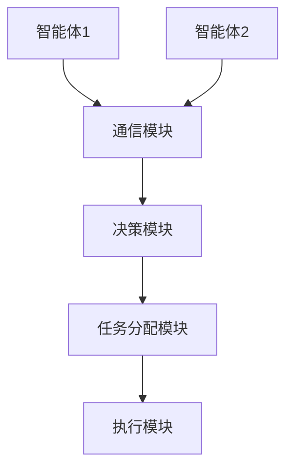
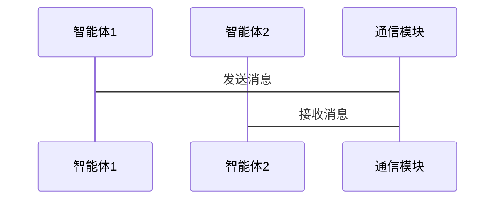

                 


# AI Agent的多智能体协同学习机制

> 关键词：AI Agent, 多智能体, 协同学习, 分布式系统, 机器学习, 强化学习

> 摘要：本文深入探讨AI Agent在多智能体协同学习中的机制，从背景、核心概念到算法原理、系统架构，再到项目实战，全面解析多智能体协同学习的实现与应用。

---

## 第一部分: 多智能体协同学习的背景与概念

### 第1章: 多智能体协同学习的背景与概念

#### 1.1 AI Agent的基本概念

##### 1.1.1 AI Agent的定义与特点

AI Agent（人工智能代理）是指在计算机系统中，能够感知环境并采取行动以实现目标的智能实体。AI Agent可以是软件程序、机器人或其他智能设备。其特点包括：

- **自主性**：能够自主决策，无需外部干预。
- **反应性**：能够实时感知环境并做出反应。
- **目标导向**：所有行动都是为了实现特定目标。

##### 1.1.2 多智能体系统的概念

多智能体系统（Multi-Agent System, MAS）是指由多个相互作用的智能体组成的系统。这些智能体可以协作或竞争，共同完成复杂任务。多智能体系统的优点包括：

- **分布式计算**：任务分布在多个智能体上，提高效率。
- **鲁棒性**：单个智能体故障不会导致整个系统崩溃。
- **适应性**：智能体可以动态调整策略以应对环境变化。

##### 1.1.3 协同学习的核心思想

协同学习是指多个智能体通过合作与交流，共同提升学习效率和效果的过程。其核心思想包括：

- **知识共享**：智能体之间共享知识和经验，避免重复学习。
- **分布式决策**：通过协作，智能体能够做出更优的集体决策。
- **任务分配**：根据智能体的能力和环境需求，动态分配任务。

#### 1.2 多智能体系统的类型与应用场景

##### 1.2.1 分散式与集中式多智能体系统

- **分散式系统**：智能体之间无中心节点，每个智能体独立决策。
- **集中式系统**：有一个中心节点负责协调和决策。

##### 1.2.2 协作式与竞争式多智能体系统

- **协作式系统**：智能体之间合作完成共同目标。
- **竞争式系统**：智能体之间存在竞争关系，例如在游戏中的对战。

##### 1.2.3 实际应用场景分析

- **机器人协作**：工业机器人协同完成复杂任务。
- **自动驾驶**：车辆之间协同行驶，避免交通事故。
- **分布式计算**：多个AI Agent协作完成大数据处理。

#### 1.3 多智能体协同学习的挑战与机遇

##### 1.3.1 协同学习中的主要挑战

- **通信延迟**：智能体之间的通信可能带来延迟，影响决策效率。
- **同步问题**：多个智能体需要同步状态，避免冲突。
- **安全问题**：数据共享可能带来隐私泄露风险。

##### 1.3.2 技术进步带来的新机遇

- **5G技术**：低延迟、高带宽的通信能力，支持实时协作。
- **边缘计算**：将计算能力分布到边缘，减少通信依赖。
- **区块链**：支持智能合约，增强协作的安全性。

##### 1.3.3 当前研究热点与未来趋势

- **联邦学习**：在保护数据隐私的前提下，进行协作学习。
- **自适应算法**：智能体能够动态调整策略，适应环境变化。
- **人机协作**：人与智能体协同工作，提升效率。

---

### 第2章: 多智能体协同学习的核心机制

#### 2.1 多智能体通信机制

##### 2.1.1 通信协议的基本概念

通信协议是智能体之间交换信息的规则。常见的通信协议包括：

- **HTTP**：基于请求-响应的通信方式。
- **WebSocket**：支持双向通信，适合实时协作。
- **gRPC**：高性能的RPC通信协议。

##### 2.1.2 基于消息传递的通信方式

消息传递是一种常见的通信方式，智能体通过发送消息进行交流。消息传递的特点：

- **异步通信**：发送方不需要等待接收方的响应。
- **可靠传输**：确保消息能够到达目标智能体。
- **队列管理**：智能体之间通过队列管理消息。

##### 2.1.3 基于共享内存的通信方式

共享内存是一种高效的通信方式，多个智能体通过共享内存交换数据。其优点：

- **低延迟**：数据访问速度快。
- **高效性**：适合需要实时协作的场景。

#### 2.2 多智能体决策机制

##### 2.2.1 分布式决策的基本原理

分布式决策是指每个智能体独立做出决策，但通过协作实现全局最优。其核心步骤：

1. **感知环境**：智能体感知当前环境状态。
2. **制定策略**：基于感知信息，制定决策策略。
3. **协作调整**：通过通信，调整策略以达到最优。

##### 2.2.2 基于博弈论的决策模型

博弈论是研究智能体之间互动的数学理论。常用模型包括：

- **纳什均衡**：所有智能体策略的最优均衡点。
- **囚徒困境**：两个智能体在无信任的情况下做出决策的经典案例。

##### 2.2.3 联合决策的实现方法

联合决策是多个智能体共同制定决策的过程。实现方法包括：

- **投票机制**：每个智能体投票，多数票决定最终决策。
- **协商机制**：智能体通过协商，达成一致的决策。

#### 2.3 多智能体任务分配机制

##### 2.3.1 任务分配的基本问题

任务分配的核心问题是将任务分配给最合适的智能体。需要考虑的因素：

- **智能体能力**：每个智能体的擅长领域。
- **任务需求**：任务的复杂度和时间要求。

##### 2.3.2 基于角色的分配策略

基于角色的分配策略将智能体分为不同的角色，每个角色负责特定任务。例如：

- **协调者**：负责整体协调和决策。
- **执行者**：负责具体任务的执行。

##### 2.3.3 基于性能的分配策略

基于性能的分配策略根据智能体的当前性能动态分配任务。例如：

- **负载均衡**：根据智能体的负载情况分配任务。
- **效率优先**：优先分配给效率更高的智能体。

---

### 第3章: 多智能体协同学习的算法原理

#### 3.1 多智能体强化学习算法

##### 3.1.1 分散式Q-learning算法

分散式Q-learning是一种经典的多智能体强化学习算法。每个智能体独立学习，通过通信共享经验。算法步骤：

1. **初始化**：每个智能体初始化Q表。
2. **感知环境**：智能体感知当前状态。
3. **选择动作**：基于Q表选择动作。
4. **执行动作**：执行动作，观察奖励。
5. **更新Q表**：根据奖励更新Q表。
6. **通信**：智能体之间共享Q表经验。

##### 3.1.2 集中式价值函数方法

集中式价值函数方法将多个智能体的决策集中到一个中心节点，通过集中优化实现协同学习。算法步骤：

1. **收集数据**：所有智能体收集环境数据。
2. **集中优化**：中心节点优化价值函数。
3. **分配策略**：将优化后的策略分发给智能体。

##### 3.1.3 基于纳什均衡的策略优化

纳什均衡是博弈论中的一个概念，表示所有智能体策略的最优均衡点。通过纳什均衡优化策略，可以实现全局最优。

#### 3.2 分布式优化算法

##### 3.2.1 基于一致性约束的优化方法

一致性约束优化确保所有智能体的策略一致。通过一致性约束，实现全局最优。

##### 3.2.2 基于异步更新的优化方法

异步更新优化算法允许智能体在不同时间点更新策略，减少通信开销。

##### 3.2.3 基于强化学习的分布式优化

通过强化学习实现分布式优化，智能体通过协作和竞争，动态调整策略。

#### 3.3 协同学习的数学模型与公式

##### 3.3.1 多智能体协同的基本数学模型

数学模型：

$$ V(s) = \max_{a} [ r + V(s') ] $$

其中，$s$是当前状态，$a$是动作，$s'$是下一个状态，$r$是奖励。

##### 3.3.2 基于博弈论的数学表达

博弈论中，纳什均衡的数学表达为：

$$ \forall i, u_i(a_i, a_{-i}) \geq u_i(a_i', a_{-i}) $$

其中，$u_i$表示智能体i的效用函数，$a_i$是智能体i的策略，$a_{-i}$是其他智能体的策略。

##### 3.3.3 分布式优化的数学推导

分布式优化的目标是最小化全局目标函数：

$$ \min_{x_i} \sum_{i=1}^n f_i(x_i, x_{-i}) $$

其中，$f_i$是智能体i的局部目标函数。

---

### 第4章: 多智能体协同学习的系统架构

#### 4.1 系统架构的设计原则

##### 4.1.1 可扩展性与可扩展性设计

系统架构需要具备良好的扩展性，能够支持大量智能体的接入和协作。

##### 4.1.2 高可用性与容错设计

系统需要具备高可用性，能够在部分智能体故障的情况下继续运行。

##### 4.1.3 分布式架构的优缺点分析

分布式架构的优点包括高可用性和可扩展性，缺点包括复杂性和通信开销。

#### 4.2 系统功能设计

##### 4.2.1 通信模块的设计与实现

通信模块负责智能体之间的信息传递。设计要点：

- **消息队列**：使用消息队列实现异步通信。
- **序列号**：通过序列号确保消息的有序性。

##### 4.2.2 决策模块的设计与实现

决策模块负责智能体的决策过程。设计要点：

- **状态感知**：智能体感知当前环境状态。
- **策略选择**：基于状态选择最优动作。

##### 4.2.3 任务分配模块的设计与实现

任务分配模块负责任务的动态分配。设计要点：

- **角色分配**：根据智能体的能力分配角色。
- **负载均衡**：根据智能体的负载情况分配任务。

#### 4.3 系统架构图

使用Mermaid绘制系统架构图：



#### 4.4 系统交互图

使用Mermaid绘制系统交互图：



---

## 第五章: 项目实战

### 5.1 环境安装

#### 5.1.1 安装Python

安装Python 3.8或更高版本。

#### 5.1.2 安装依赖库

安装以下依赖库：

- `numpy`
- `pandas`
- `scikit-learn`

#### 5.1.3 安装额外库

安装以下额外库：

- `tensorflow`

### 5.2 系统核心实现源代码

#### 5.2.1 通信模块实现

```python
import queue

class Communicator:
    def __init__(self):
        self.queue = queue.Queue()
    
    def send(self, message, recipient):
        self.queue.put((message, recipient))
    
    def receive(self):
        while True:
            if not self.queue.empty():
                message, recipient = self.queue.get()
                return message
```

#### 5.2.2 决策模块实现

```python
class DecisionModule:
    def __init__(self):
        self.state = None
    
    def perceive(self):
        # 感知环境，更新状态
        pass
    
    def decide(self):
        # 基于状态做出决策
        return action
```

#### 5.2.3 任务分配模块实现

```python
class TaskAllocator:
    def __init__(self):
        self.agents = []
    
    def allocate_task(self, task, agent):
        # 根据策略分配任务
        pass
```

### 5.3 代码应用解读与分析

#### 5.3.1 通信模块解读

通信模块通过队列实现智能体之间的消息传递。发送方将消息放入队列，接收方从队列中取出消息。

#### 5.3.2 决策模块解读

决策模块通过感知环境，更新状态，并基于状态做出决策。感知环境可以是通过传感器或其他数据源。

#### 5.3.3 任务分配模块解读

任务分配模块根据智能体的能力和当前负载，动态分配任务。可以使用基于角色或基于性能的分配策略。

### 5.4 实际案例分析和详细讲解剖析

#### 5.4.1 案例背景

假设我们有三个智能体，需要协作完成一个复杂任务。任务需要分成三个子任务，每个子任务由一个智能体负责。

#### 5.4.2 案例实现

1. **通信模块**：智能体之间通过通信模块传递消息。
2. **决策模块**：每个智能体感知环境，做出决策。
3. **任务分配模块**：根据智能体的能力和负载，分配任务。

#### 5.4.3 案例分析

通过案例分析，可以验证多智能体协同学习机制的有效性和可行性。

### 5.5 项目小结

通过项目实战，我们可以深入理解多智能体协同学习机制的实现过程。从环境安装到代码实现，再到案例分析，整个过程帮助我们掌握多智能体协作的核心技术。

---

## 第六章: 最佳实践、小结、注意事项、拓展阅读

### 6.1 最佳实践

- **通信机制**：选择合适的通信协议，确保高效可靠。
- **决策机制**：根据具体场景选择合适的决策算法。
- **任务分配**：动态调整任务分配策略，提高效率。

### 6.2 小结

本文从背景、核心概念到算法原理、系统架构，再到项目实战，全面解析了AI Agent的多智能体协同学习机制。通过本文的学习，读者可以掌握多智能体协作的核心技术。

### 6.3 注意事项

- **安全性**：注意数据共享的安全性，防止隐私泄露。
- **延迟问题**：考虑通信延迟对决策的影响。
- **系统容错**：设计容错机制，确保系统高可用性。

### 6.4 拓展阅读

- **多智能体强化学习**：深入研究多智能体强化学习算法。
- **分布式系统设计**：学习分布式系统设计的理论和实践。
- **边缘计算**：研究边缘计算在多智能体协作中的应用。

---

## 作者

作者：AI天才研究院/AI Genius Institute & 禅与计算机程序设计艺术 /Zen And The Art of Computer Programming

