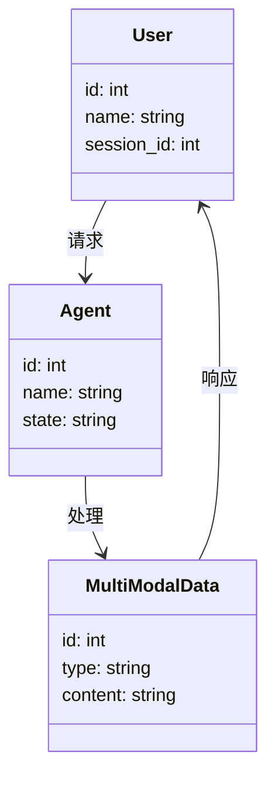
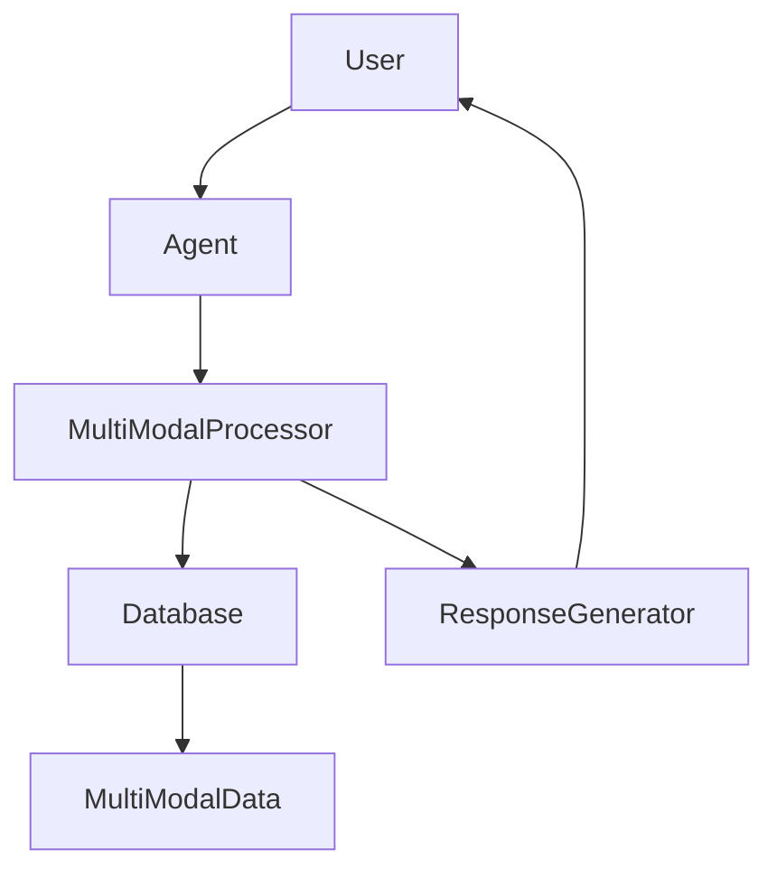
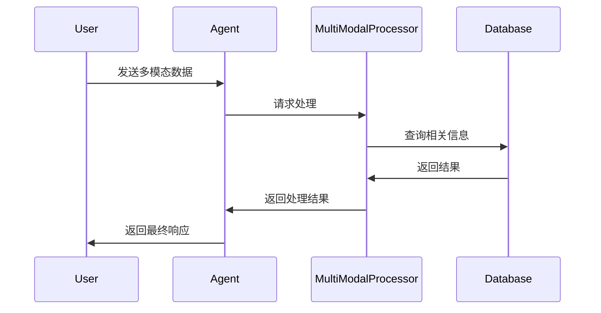

                 


# AI Agent的多模态交互设计

---

## 关键词：
AI Agent, 多模态交互, 智能交互设计, 多模态融合, 交互系统架构

---

## 摘要：
AI Agent的多模态交互设计是当前人工智能领域的重要研究方向。本文从AI Agent的基本概念出发，详细探讨了多模态交互的核心概念、算法原理、系统架构以及实际应用。通过理论与实践相结合的方式，深入分析了多模态数据融合、模型构建、系统设计等关键问题，并通过具体案例展示了如何实现一个多模态交互系统。本文旨在为AI Agent的设计者和开发者提供一份全面的指南，帮助他们更好地理解和应用多模态交互技术。

---

# 第1章: AI Agent与多模态交互概述

## 1.1 AI Agent的基本概念
### 1.1.1 什么是AI Agent
- AI Agent的定义
- AI Agent的核心特征：自主性、反应性、目标导向性
- AI Agent的应用场景：智能助手、推荐系统、自动驾驶

## 1.2 多模态交互的背景与意义
### 1.2.1 多模态交互的背景
- 传统单模态交互的局限性
- 多模态交互的兴起与技术进步

### 1.2.2 多模态交互的应用场景
- 聊天机器人：结合文本、语音、表情
- 智能家居：整合语音、触控、传感器数据
- 增强现实：融合视觉、听觉、触觉

## 1.3 本书的核心内容与目标
### 1.3.1 核心内容
- 多模态交互的理论基础
- 多模态数据的融合方法
- 多模态交互系统的实现技术

### 1.3.2 目标
- 提供AI Agent多模态交互的设计思路
- 分析多模态交互的技术挑战与解决方案
- 展示实际项目中的应用案例

---

# 第2章: 多模态交互的核心概念与技术

## 2.1 多模态交互的核心概念
### 2.1.1 多模态数据的定义
- 文本、语音、图像、视频、传感器数据等
- 各种模态数据的特点与优势

### 2.1.2 多模态交互的模式
- 单向交互与双向交互
- 同步交互与异步交互
- 主动交互与被动交互

## 2.2 多模态交互的关键技术
### 2.2.1 多模态数据融合
- 模态编码与特征提取
- 跨模态注意力机制
- 多模态数据的协同优化

### 2.2.2 多模态模型的构建
- 多模态神经网络架构
- 跨模态学习策略
- 模型的可解释性与鲁棒性

## 2.3 多模态交互的系统架构
### 2.3.1 系统的输入输出流程
- 数据采集与预处理
- 多模态数据的整合与分析
- 系统的响应与反馈

### 2.3.2 系统模块划分
- 数据采集模块
- 数据融合模块
- 交互逻辑模块
- 响应生成模块

---

# 第3章: 多模态交互的算法原理

## 3.1 多模态数据融合算法
### 3.1.1 模态编码与特征提取
- 文本：词嵌入、句嵌入
- 语音：频域与时域特征提取
- 图像：CNN与GAN的应用

### 3.1.2 跨模态注意力机制
- 自适应注意力分配
- 多模态信息的权重计算
- 注意力机制的数学模型

## 3.2 多模态交互的模型构建
### 3.2.1 多模态神经网络架构
- 图像-文本联合学习
- 语音-视觉协同优化
- 多模态Transformer架构

### 3.2.2 模型的训练与优化
- 多任务学习策略
- 模型的损失函数设计
- 超参数优化与模型调优

## 3.3 多模态交互的数学模型
### 3.3.1 多模态数据表示
- 文本向量表示：$$v_t = f(text)$$
- 语音特征表示：$$f(v) = g(voice)$$
- 图像特征表示：$$f(i) = h(image)$$

### 3.3.2 跨模态注意力机制
- 注意力权重计算：$$\alpha_{t,v} = \frac{\exp(score(t,v))}{\sum_{j} \exp(score(t,j))}$$
- 融合策略：$$f_{\text{融合}}(t,v) = \sum_{i=1}^{n} \alpha_i t_i + \sum_{j=1}^{m} \beta_j v_j$$

---

# 第4章: 多模态交互系统的分析与设计

## 4.1 系统分析
### 4.1.1 问题场景分析
- 用户需求分析：用户希望实现一个多模态交互系统
- 系统边界与外延
- 核心功能与非功能性需求

### 4.1.2 领域模型设计（Mermaid类图）


## 4.2 系统架构设计
### 4.2.1 系统架构图


### 4.2.2 系统接口设计
- 输入接口：文本输入、语音输入、图像输入
- 输出接口：文本输出、语音输出、图像输出
- API设计：RESTful API

### 4.2.3 交互流程图（Mermaid序列图）


---

# 第5章: 多模态交互系统的实现与实战

## 5.1 环境安装与配置
### 5.1.1 开发环境
- Python 3.8+
- PyTorch 1.9+
- Transformers库
- 其他依赖库的安装

## 5.2 核心代码实现
### 5.2.1 多模态数据融合代码
```python
import torch
from transformers import BertTokenizer, BertModel

# 文本编码
tokenizer = BertTokenizer.from_pretrained('bert-base-uncased')
model = BertModel.from_pretrained('bert-base-uncased')

text = "Hello, how are you?"
inputs = tokenizer(text, return_tensors='pt')
text_embedding = model(inputs.input_ids, inputs.attention_mask=inputs.attention_mask).last_hidden_state

# 语音编码（示例）
# 语音特征提取与编码类似，这里简化为随机数
import numpy as np
voice_embedding = np.random.randn(100)

# 图像编码（示例）
# 使用预训练的CNN模型提取特征
import torch.nn as nn
image_embedding = nn.Sequential(
    nn.Conv2d(3, 64, kernel_size=3, stride=2),
    nn.ReLU(),
    nn.Conv2d(64, 128, kernel_size=3, stride=2),
)(torch.randn(1, 3, 224, 224))
```

## 5.3 代码解读与分析
### 5.3.1 多模态注意力机制实现
```python
def multi_modal_attention(text_emb, voice_emb, image_emb):
    # 融合多模态特征
    combined_emb = torch.cat([text_emb, voice_emb, image_emb], dim=-1)
    # 注意力权重计算
    attention_weights = torch.softmax(torch.matmul(combined_emb, torch.randn(combined_emb.size(-1), 1)), dim=-1)
    # 加权求和
    fused_emb = torch.sum(combined_emb * attention_weights, dim=-1)
    return fused_emb
```

### 5.3.2 交互逻辑实现
```python
def process_request(user_request):
    # 文本解析
    text_part = parse_text(user_request)
    # 语音解析
    voice_part = parse_voice(user_request)
    # 图像解析
    image_part = parse_image(user_request)
    
    # 融合特征
    fused_emb = multi_modal_attention(text_part, voice_part, image_part)
    
    # 生成响应
    response = generate_response(fused_emb)
    return response
```

## 5.4 实际案例分析
### 5.4.1 案例背景
- 用户输入：文本、语音、图像的多模态输入
- 系统响应：结合多种模态信息生成个性化回复

### 5.4.2 案例实现
```python
# 示例输入
user_input = {
    'text': "今天天气不错",
    'voice': "语音文件路径",
    'image': "图像文件路径"
}

# 调用处理函数
response = process_request(user_input)
print(response)
```

## 5.5 项目小结
- 项目实现的关键点
- 系统的优缺点分析
- 实际应用中的注意事项

---

# 第6章: 多模态交互设计的最佳实践与总结

## 6.1 设计总结
### 6.1.1 核心知识点回顾
- 多模态数据的融合方法
- 多模态模型的构建与优化
- 系统架构的设计与实现

### 6.1.2 设计中的注意事项
- 数据质量的重要性
- 模型的可解释性与鲁棒性
- 系统的实时性与响应速度

## 6.2 最佳实践 tips
### 6.2.1 数据处理
- 数据清洗与预处理
- 数据增强与平衡
- 数据隐私与安全

### 6.2.2 模型优化
- 参数调节与超参数优化
- 模型的可扩展性设计
- 模型的性能监控与调优

## 6.3 未来展望
- 多模态交互技术的发展趋势
- 新兴技术对多模态交互的影响
- 未来可能的应用场景

---

## 作者：AI天才研究院/AI Genius Institute & 禅与计算机程序设计艺术 /Zen And The Art of Computer Programming

---

**注意**：本文是基于多模态交互设计的系统性思考与实践总结，旨在为AI Agent的开发者提供理论与实践的双重指导。

