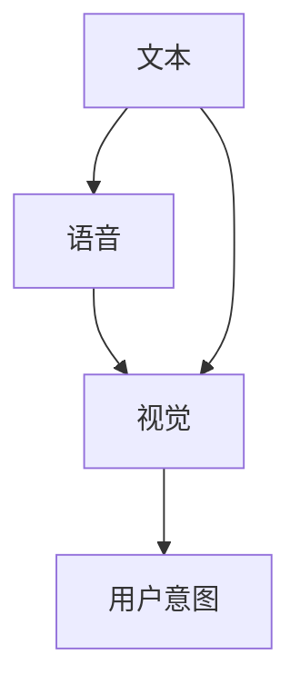
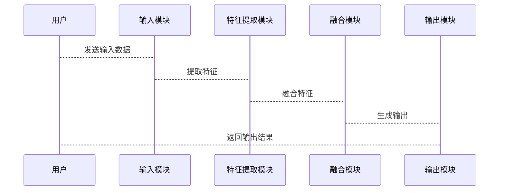

                 


# AI Agent的多模态交互：整合文本、语音和视觉

## 关键词：AI Agent，多模态交互，文本，语音，视觉，整合，技术

## 摘要：AI Agent通过整合文本、语音和视觉三种模态的数据，实现更加智能化和人性化的交互方式。本文将深入探讨多模态交互的核心概念、算法原理、系统架构以及实际应用，帮助读者全面理解并掌握这一前沿技术。

---

## 第一部分：AI Agent与多模态交互的基础

### 第1章：AI Agent的基本概念与多模态交互的重要性

#### 1.1 AI Agent的定义与特点
AI Agent（人工智能代理）是指能够感知环境、执行任务并做出决策的智能实体。它可以是一个软件程序、机器人或任何具备智能交互能力的系统。AI Agent的核心特点包括：
- **自主性**：能够在没有外部干预的情况下自主运行。
- **反应性**：能够实时感知环境并做出反应。
- **学习能力**：通过数据和经验不断优化自身的性能。

#### 1.2 多模态交互的定义与重要性
多模态交互是指通过多种信息载体（如文本、语音、视觉等）进行交互的方式。与单一模态交互相比，多模态交互能够更全面地理解用户意图，提供更自然和个性化的用户体验。例如：
- **文本**：通过自然语言处理技术理解用户的输入。
- **语音**：通过语音识别和合成技术实现语音交互。
- **视觉**：通过计算机视觉技术处理图像和视频信息。

#### 1.3 整合文本、语音和视觉的意义
整合三种模态的数据可以使AI Agent具备更强的感知和理解能力，从而在更多场景中提供更高效的服务。例如：
- **智能音箱**：结合语音识别和文本理解技术，提供更精准的指令识别。
- **虚拟助手**：通过视觉识别用户的情绪和意图，提供更个性化的服务。

---

## 第二部分：多模态交互的核心概念与联系

### 第2章：文本、语音和视觉的特征对比

#### 2.1 文本模态的特征分析
文本模态主要依赖自然语言处理技术，其特点包括：
- **结构化**：文本数据通常具有明确的语法结构。
- **语义丰富**：文本可以表达复杂的语义信息。

#### 2.2 语音模态的特征分析
语音模态主要依赖语音识别和语音合成技术，其特点包括：
- **实时性**：语音交互通常需要实时处理。
- **情感表达**：语音可以传达说话者的情感和语气。

#### 2.3 视觉模态的特征分析
视觉模态主要依赖计算机视觉技术，其特点包括：
- **直观性**：视觉信息可以直接被人类感知。
- **多样性**：视觉数据可以包含丰富的空间和颜色信息。

#### 2.4 多模态数据的整合方式
多模态数据的整合方式可以分为以下几种：
- **并行处理**：同时处理多种模态的数据。
- **序列处理**：按照一定的顺序处理多种模态的数据。
- **混合处理**：将多种模态的数据进行融合后再进行处理。

### 第2章：多模态交互的实体关系图



---

## 第三部分：多模态交互的算法原理

### 第3章：多模态数据融合的算法框架

#### 3.1 多模态数据融合的分类
多模态数据融合可以分为以下几种：
- **早期融合**：在特征提取阶段进行融合。
- **晚期融合**：在分类或预测阶段进行融合。

#### 3.2 多模态模型的通用架构
多模态模型的通用架构可以分为以下几层：
- **输入层**：接收多种模态的数据。
- **特征提取层**：对每种模态的数据进行特征提取。
- **融合层**：将不同模态的特征进行融合。
- **输出层**：生成最终的输出结果。

#### 3.3 多模态数据融合的挑战
多模态数据融合的主要挑战包括：
- **模态不平衡**：不同模态的数据量可能不均衡。
- **模态异构**：不同模态的数据形式可能不同。

### 第3章：多模态融合的数学模型

#### 3.1 多模态数据的表示方法
多模态数据可以表示为以下形式：
$$ x = (x_1, x_2, x_3) $$
其中，$x_1$、$x_2$、$x_3$分别表示文本、语音和视觉数据。

#### 3.2 多模态融合的数学公式
多模态融合的数学公式可以表示为：
$$ y = f(x_1, x_2, x_3) $$
其中，$f$表示融合函数。

### 第3章：基于Transformer的多模态模型

#### 3.1 Transformer的基本原理
Transformer是一种基于自注意力机制的神经网络模型，其核心思想是通过计算输入序列中每个位置的重要性来生成输出。

#### 3.2 多模态Transformer的改进方法
多模态Transformer的改进方法包括：
- **跨模态注意力**：在不同模态之间引入注意力机制。
- **模态嵌入**：对每种模态的数据进行嵌入处理。

---

## 第四部分：多模态交互系统的架构设计

### 第4章：问题场景介绍
多模态交互系统通常应用于以下场景：
- **智能客服**：通过文本、语音和视觉等多种模态进行用户交互。
- **智能家居**：通过语音和视觉等多种模态实现家居设备的智能控制。

### 第4章：系统功能设计
#### 4.1 系统功能模块
- **输入模块**：接收用户的输入数据。
- **特征提取模块**：对输入数据进行特征提取。
- **融合模块**：将不同模态的特征进行融合。
- **输出模块**：生成最终的输出结果。

#### 4.2 领域模型设计
```mermaid
classDiagram
    class TextInputModule {
        function processText(input) {
            // 文本处理逻辑
        }
    }
    class VoiceInputModule {
        function processVoice(input) {
            // 语音处理逻辑
        }
    }
    class VisionInputModule {
        function processVision(input) {
            // 视觉处理逻辑
        }
    }
    class FusionModule {
        function fuseFeatures(textFeature, voiceFeature, visionFeature) {
            // 融合特征逻辑
        }
    }
    class OutputModule {
        function generateOutput(fusedFeature) {
            // 输出生成逻辑
        }
    }
    TextInputModule --> FusionModule
    VoiceInputModule --> FusionModule
    VisionInputModule --> FusionModule
    FusionModule --> OutputModule
```

### 第4章：系统架构设计
#### 4.1 系统架构图


### 第4章：系统接口设计
- **输入接口**：提供文本、语音和视觉数据的输入接口。
- **输出接口**：提供最终输出结果的输出接口。

### 第4章：系统交互流程图


---

## 第五部分：多模态交互系统的项目实战

### 第5章：环境安装
- **Python**：安装Python 3.8及以上版本。
- **深度学习框架**：安装TensorFlow或PyTorch。
- **NLP库**：安装spaCy或NLTK。
- **语音处理库**：安装Librosa或Soundfile。
- **计算机视觉库**：安装OpenCV或TensorFlow Hub。

### 第5章：系统核心实现源代码

#### 5.1 文本处理代码
```python
import spacy

nlp = spacy.load("en_core_web_sm")
text = "Hello, how are you?"
doc = nlp(text)
for token in doc:
    print(token.text)
```

#### 5.2 语音处理代码
```python
import librosa

audio_path = "audio.wav"
audio_data, sample_rate = librosa.load(audio_path, sr=None, duration=5)
print("Sample Rate:", sample_rate)
print("Audio Data Shape:", audio_data.shape)
```

#### 5.3 视觉处理代码
```python
import cv2

image_path = "image.jpg"
img = cv2.imread(image_path)
cv2.imshow("Image", img)
cv2.waitKey(0)
cv2.destroyAllWindows()
```

### 第5章：实际案例分析
- **案例1**：智能音箱的语音交互。
- **案例2**：虚拟助手的多模态交互。

### 第5章：项目小结
通过本项目的实战，我们掌握了多模态交互系统的实现方法，包括环境安装、核心代码实现以及实际案例分析。

---

## 第六部分：多模态交互的最佳实践

### 第6章：小结
- 多模态交互是未来AI Agent发展的趋势。
- 需要结合文本、语音和视觉等多种模态的数据进行融合。

### 第6章：注意事项
- 在实际应用中，需要考虑数据的多样性和模型的鲁棒性。
- 多模态数据的融合需要综合考虑不同模态的特点和应用场景。

### 第6章：未来趋势
- **跨模态学习**：研究不同模态之间的相互作用。
- **实时性优化**：提高多模态交互的实时性。
- **个性化服务**：根据用户的个性化需求提供定制化的服务。

### 第6章：拓展阅读
- 建议读者阅读相关领域的最新论文和技术博客，保持对多模态交互技术的关注。

---

## 作者：AI天才研究院 & 禅与计算机程序设计艺术

---

通过本文的详细讲解，读者可以全面了解AI Agent的多模态交互技术，并掌握其核心概念、算法原理和实际应用。希望本文能够为读者提供有价值的参考和启发。

