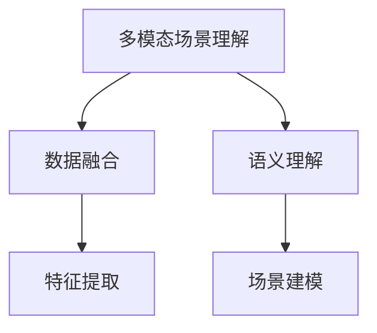
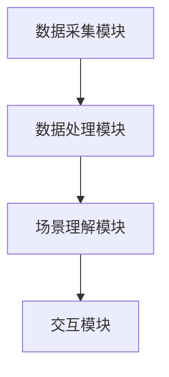

                 


# AI Agent的多模态场景理解技术

## 关键词：AI Agent, 多模态, 场景理解, 多模态数据融合, 人工智能, 机器学习

## 摘要：  
AI Agent的多模态场景理解技术是人工智能领域的重要研究方向，旨在通过整合多种数据模态（如文本、图像、语音等）来提升AI Agent对复杂场景的理解能力。本文系统地介绍了多模态场景理解的背景、核心概念、算法原理、系统架构及实际应用，详细分析了多模态数据融合的方法、AI Agent的多模态交互技术以及场景理解的系统设计。通过具体案例的实战分析，本文为读者提供了从理论到实践的全面指导。

---

## 第1章: 多模态场景理解的背景与概念

### 1.1 多模态场景理解的背景
#### 1.1.1 从单模态到多模态的演进
人工智能技术的发展经历了从单一模态处理到多模态融合的演进过程。早期的AI系统主要处理文本或图像中的一种数据类型，而现代AI Agent需要同时处理多种数据模态，以应对复杂场景中的多样化信息。

#### 1.1.2 AI Agent在多模态场景中的角色
AI Agent是一种能够感知环境、理解场景并执行任务的智能实体。在多模态场景中，AI Agent需要整合文本、图像、语音等多种信息，以实现更精准的理解和决策。

#### 1.1.3 多模态场景理解的必要性
在现实世界中，信息往往是多维度的。例如，在智能客服场景中，用户可能通过文本描述问题，同时提供相关图片或语音信息。AI Agent需要同时处理这些信息，才能准确理解用户的需求。

### 1.2 AI Agent的基本概念
#### 1.2.1 AI Agent的定义与特点
AI Agent是一种智能实体，能够通过感知环境、理解信息、执行任务来实现目标。其特点包括自主性、反应性、目标导向性和学习能力。

#### 1.2.2 多模态数据的定义与分类
多模态数据是指来自不同感知渠道的数据类型，常见的包括文本、图像、语音、视频、传感器数据等。

#### 1.2.3 多模态场景理解的核心要素
多模态场景理解的核心要素包括数据融合、语义理解、场景建模和实时交互。

### 1.3 多模态场景理解的边界与外延
#### 1.3.1 场景理解的边界
场景理解的边界包括数据的时空一致性、信息的完整性以及任务的适用性。

#### 1.3.2 多模态数据的融合方式
多模态数据的融合方式包括特征级融合、决策级融合和混合式融合。

#### 1.3.3 场景理解的外延与应用
多模态场景理解的应用包括智能助手、智能安防、智能驾驶等领域。

### 1.4 多模态场景理解的概念结构
#### 1.4.1 概念结构图


#### 1.4.2 核心要素的组成
| 核心要素 | 描述 |
|----------|------|
| 数据融合 | 整合不同模态的数据 |
| 语义理解 | 理解数据的语义含义 |
| 场景建模 | 建立场景的数学模型 |

#### 1.4.3 概念之间的关系
多模态场景理解通过数据融合和语义理解，构建场景模型，从而实现对复杂场景的理解。

### 1.5 本章小结
本章介绍了多模态场景理解的背景、核心概念和关键要素，为后续内容奠定了基础。

---

## 第2章: 多模态数据的处理与融合

### 2.1 多模态数据的类型与特点
#### 2.1.1 文本数据
文本数据是通过字符序列表示的信息，具有结构化和语义丰富的特点。

#### 2.1.2 图像数据
图像数据是通过像素矩阵表示的二维数据，具有空间和视觉信息丰富的特点。

#### 2.1.3 语音数据
语音数据是通过声学特征表示的声音信息，具有时间序列和情感表达的特点。

### 2.2 多模态数据的预处理
#### 2.2.1 文本预处理
文本预处理包括分词、去除停用词、词干提取等步骤。

#### 2.2.2 图像预处理
图像预处理包括归一化、增强、降噪等步骤。

#### 2.2.3 语音预处理
语音预处理包括降噪、特征提取、端点检测等步骤。

### 2.3 多模态数据的融合方法
#### 2.3.1 基于特征融合的方法
特征融合方法将不同模态的特征向量进行线性组合或非线性变换。

#### 2.3.2 基于注意力机制的融合
注意力机制通过权重分配，突出重要模态的信息。

#### 2.3.3 基于对比学习的融合
对比学习通过对比不同模态的特征，提升数据的表征能力。

### 2.4 多模态数据融合的挑战
#### 2.4.1 数据模态之间的异构性
不同模态的数据具有不同的特征空间和表示方式。

#### 2.4.2 数据量与计算复杂度的平衡
多模态数据的融合需要在数据量和计算效率之间找到平衡。

#### 2.4.3 融合方法的可解释性
多模态数据的融合方法需要具有可解释性，以便理解和优化。

### 2.5 本章小结
本章详细介绍了多模态数据的类型、预处理方法和融合策略，为后续的场景理解奠定了基础。

---

## 第3章: 多模态场景理解的算法

### 3.1 多模态融合算法
#### 3.1.1 加权融合方法
加权融合方法通过分配权重，对不同模态的特征进行加权求和。

$$ y = \sum_{i=1}^{n} w_i x_i $$

其中，$w_i$ 是第$i$个模态的权重，$x_i$ 是第$i$个模态的特征。

#### 3.1.2 注意力机制
注意力机制通过自适应权重分配，突出重要模态的信息。

$$ \alpha_i = \frac{\exp(a_i)}{\sum_{j=1}^{n} \exp(a_j)} $$

其中，$\alpha_i$ 是第$i$个模态的注意力权重，$a_i$ 是注意力得分。

#### 3.1.3 对比学习
对比学习通过对比不同模态的特征，提升数据的表征能力。

$$ L = -\log \text{sim}(x_i, x_j) $$

其中，$L$ 是损失函数，$\text{sim}(x_i, x_j)$ 是$x_i$和$x_j$的相似度。

### 3.2 场景理解算法
#### 3.2.1 多模态分类
多模态分类任务通过融合不同模态的特征，进行场景分类。

$$ p(y|x) = \prod_{i=1}^{n} p(y|x_i) $$

其中，$p(y|x_i)$ 是第$i$个模态的条件概率。

#### 3.2.2 场景分割
场景分割任务通过分割图像或文本，识别场景中的对象或实体。

#### 3.2.3 实体识别
实体识别任务通过识别文本或图像中的实体，构建场景模型。

### 3.3 算法实现
#### 3.3.1 数据预处理
文本、图像和语音数据的预处理步骤。

#### 3.3.2 模型训练
使用深度学习框架（如TensorFlow、PyTorch）训练多模态融合模型。

#### 3.3.3 模型推理
基于训练好的模型，进行场景理解任务。

### 3.4 本章小结
本章介绍了多模态场景理解的核心算法，包括融合方法和分类、分割、实体识别等任务。

---

## 第4章: AI Agent的多模态交互技术

### 4.1 多模态交互的核心技术
#### 4.1.1 自然语言处理
自然语言处理技术用于理解和生成自然语言文本。

#### 4.1.2 视觉理解
视觉理解技术用于识别和理解图像信息。

#### 4.1.3 多模态对话系统
多模态对话系统通过整合文本和视觉信息，实现更自然的对话交互。

### 4.2 多模态交互的实现步骤
#### 4.2.1 用户输入解析
解析用户的输入，提取关键信息。

#### 4.2.2 多模态信息融合
融合文本、图像等多模态信息，生成语义表示。

#### 4.2.3 系统响应生成
根据语义表示，生成系统的响应。

### 4.3 本章小结
本章介绍了AI Agent的多模态交互技术，包括自然语言处理、视觉理解和多模态对话系统。

---

## 第5章: 多模态场景理解的系统架构设计

### 5.1 系统功能设计
#### 5.1.1 数据采集模块
负责采集多模态数据。

#### 5.1.2 数据处理模块
负责对数据进行预处理和融合。

#### 5.1.3 场景理解模块
负责对场景进行分类、分割和实体识别。

#### 5.1.4 交互模块
负责与用户的多模态交互。

### 5.2 系统架构设计


### 5.3 接口设计
#### 5.3.1 数据接口
定义数据输入和输出的格式。

#### 5.3.2 服务接口
定义系统服务的调用接口。

#### 5.3.3 交互接口
定义用户与系统之间的交互接口。

### 5.4 本章小结
本章详细介绍了多模态场景理解系统的架构设计，包括功能模块、系统架构和接口设计。

---

## 第6章: 项目实战——基于多模态场景理解的智能客服系统

### 6.1 项目背景
智能客服系统需要处理用户的文本、图像和语音信息，提供高效的解决方案。

### 6.2 环境安装
安装必要的Python库和框架，如TensorFlow、PyTorch、OpenCV等。

### 6.3 核心代码实现
#### 6.3.1 数据预处理
```python
def preprocess_text(text):
    # 分词
    words = word_tokenize(text)
    # 去除停用词
    filtered = [word for word in words if word not in stop_words]
    return filtered
```

#### 6.3.2 多模态融合
```python
def fuse_modalities(text_features, image_features):
    # 加权融合
    weights = [0.5, 0.5]
    fused_features = [w * f for w, f in zip(weights, [text_features, image_features])]
    return fused_features
```

#### 6.3.3 场景理解
```python
def classify_scene(features):
    # 使用预训练模型进行分类
    prediction = model.predict(features)
    return prediction
```

### 6.4 案例分析
通过具体案例分析，展示系统的实现过程和应用效果。

### 6.5 本章小结
本章通过智能客服系统的实战，展示了多模态场景理解技术的应用。

---

## 第7章: 最佳实践与未来展望

### 7.1 最佳实践
#### 7.1.1 数据质量管理
确保数据的高质量和一致性。

#### 7.1.2 模型优化
通过模型优化提升场景理解的准确性和效率。

#### 7.1.3 系统设计
注重系统的可扩展性和可维护性。

### 7.2 未来展望
未来，多模态场景理解技术将朝着更智能化、更个性化的方向发展。

### 7.3 小结
多模态场景理解技术是一项具有广泛应用前景的技术，未来的研究和应用将更加深入。

### 7.4 注意事项
在实际应用中，需要注意数据隐私和模型的可解释性问题。

### 7.5 拓展阅读
推荐读者阅读相关领域的经典文献和最新研究。

---

## 作者：AI天才研究院/AI Genius Institute & 禅与计算机程序设计艺术 /Zen And The Art of Computer Programming

