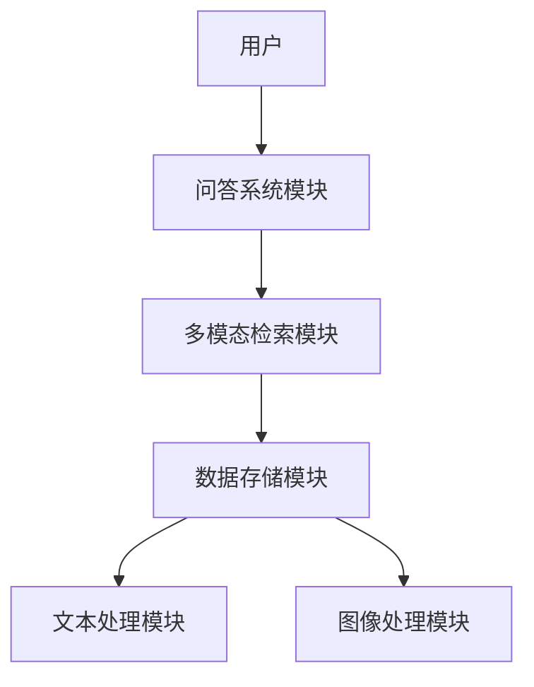
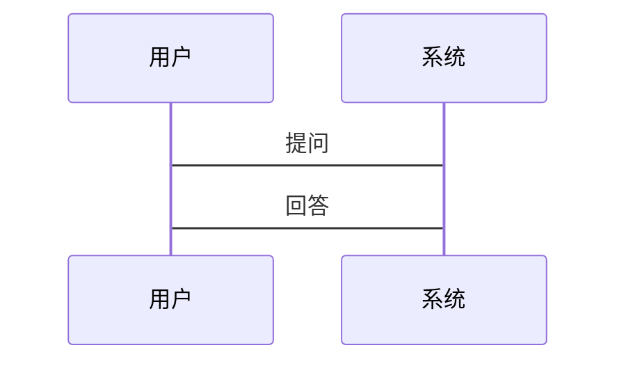

                 


# AI Agent的多模态检索与问答系统

> 关键词：AI Agent, 多模态检索, 问答系统, 多模态数据, 深度学习

> 摘要：本文深入探讨了AI Agent在多模态检索与问答系统中的应用。通过分析多模态数据的表示与融合、检索算法、问答系统架构等核心问题，结合实际案例，详细阐述了AI Agent在多模态环境下的实现原理与技术要点。文章内容涵盖背景介绍、算法原理、系统架构、项目实战等多个方面，为读者提供全面的技术解析。

---

## 第一部分: 背景介绍

### 第1章: AI Agent与多模态检索问答系统背景

#### 1.1 AI Agent的基本概念
##### 1.1.1 AI Agent的定义与特点
AI Agent（人工智能代理）是指能够感知环境并采取行动以实现目标的智能体。它具备以下特点：
- **自主性**：能够在没有外部干预的情况下运行。
- **反应性**：能够根据环境变化实时调整行为。
- **社会性**：能够与其他Agent或用户进行交互和协作。

##### 1.1.2 多模态检索和问答系统的概念
多模态检索指的是在多种数据类型（如文本、图像、语音）中进行信息检索的过程，而问答系统则是通过自然语言处理技术，理解和回答用户提出的问题。

##### 1.1.3 AI Agent在多模态检索问答中的作用
AI Agent作为连接多模态数据与用户的桥梁，能够根据用户的输入，智能地检索和整合多模态信息，生成准确的回答。

#### 1.2 多模态检索与问答系统的背景与发展趋势
##### 1.2.1 多模态数据的兴起
随着技术的进步，文本、图像、视频等多种数据类型的结合越来越普遍，推动了多模态数据的应用。

##### 1.2.2 问答系统的发展历程
问答系统从早期基于规则的简单匹配，发展到现在的深度学习驱动的复杂推理。

##### 1.2.3 AI Agent在多模态检索问答中的应用前景
AI Agent结合多模态检索与问答系统，将为用户提供更智能、更自然的交互体验。

---

## 第二部分: 多模态检索与问答系统的原理与技术

### 第2章: 多模态检索的核心原理

#### 2.1 多模态数据的表示与融合
##### 2.1.1 文本、图像、语音等多模态数据的表示方法
- **文本**：常用词嵌入（如Word2Vec）或句嵌入（如BERT）表示。
- **图像**：使用CNN提取特征向量。
- **语音**：通过MFCC提取音频特征。

##### 2.1.2 多模态数据的融合策略
- **早期融合**：在特征提取阶段进行融合。
- **晚期融合**：在高层语义理解阶段进行融合。

##### 2.1.3 多模态检索中的相似度计算
常用余弦相似度或欧氏距离来衡量不同模态数据之间的相似性。

#### 2.2 多模态检索算法原理
##### 2.2.1 基于向量的检索方法
- **BM25算法**：基于关键词匹配的检索方法。
- **DPR算法**：基于深度学习的向量检索方法。

##### 2.2.2 基于深度学习的多模态检索模型
- **多模态编码器**：将不同模态的数据映射到统一的向量空间。
- **注意力机制**：用于关注重要信息。

##### 2.2.3 BM25与DPR算法对比分析
| 对比维度 | BM25 | DPR |
|----------|------|-----|
| 基础     | 基于关键词统计 | 基于深度学习模型 |
| 优点     | 实时性高，计算简单 | 表达能力强，效果好 |
| 缺点     | 对语义理解不足 | 计算复杂，资源消耗大 |

#### 2.3 本章小结

---

### 第3章: 多模态问答系统的核心原理

#### 3.1 多模态问答系统的架构
##### 3.1.1 基于检索的问答系统
- **流程**：用户提问 → 检索相关文档 → 提取答案。
##### 3.1.2 基于生成的问答系统
- **流程**：用户提问 → 模型生成答案。
##### 3.1.3 混合架构
结合检索和生成的优势，提高回答的准确性和多样性。

#### 3.2 多模态问答系统的实现流程
##### 3.2.1 数据预处理与特征提取
- **文本清洗**：去除停用词、标点符号等。
- **特征提取**：使用BERT提取文本特征。

##### 3.2.2 多模态信息的融合与推理
- **多模态编码器**：将文本、图像特征融合。
- **推理模块**：基于融合的特征生成回答。

##### 3.2.3 结果生成与优化
- **生成策略**：使用贪心算法生成回答。
- **优化方法**：基于用户反馈优化回答质量。

#### 3.3 本章小结

---

## 第三部分: AI Agent的多模态检索问答系统架构与实现

### 第4章: AI Agent的系统架构设计

#### 4.1 系统功能模块划分
##### 4.1.1 数据采集与预处理模块
- **功能**：采集多模态数据并进行清洗。
##### 4.1.2 多模态检索模块
- **功能**：根据用户查询检索相关数据。
##### 4.1.3 问答系统模块
- **功能**：生成回答并返回给用户。
##### 4.1.4 用户交互与反馈模块
- **功能**：处理用户输入并收集反馈。

#### 4.2 系统架构图


#### 4.3 接口与交互设计
##### 4.3.1 系统接口定义
- **输入接口**：用户提问。
- **输出接口**：系统回答。

##### 4.3.2 用户与系统交互流程


#### 4.4 本章小结

---

### 第5章: AI Agent的多模态检索问答系统实现

#### 5.1 环境搭建与工具安装
##### 5.1.1 开发环境配置
- **Python 3.8+**
- **TensorFlow 2.0+**
- **Transformers库**
##### 5.1.2 工具安装
```bash
pip install transformers
pip install mermaid
```

#### 5.2 系统核心实现源代码
##### 5.2.1 数据预处理
```python
from transformers import BertTokenizer, BertModel
import numpy as np

tokenizer = BertTokenizer.from_pretrained('bert-base-uncased')
model = BertModel.from_pretrained('bert-base-uncased')
```

##### 5.2.2 多模态检索实现
```python
def retrieve_answers(query, model, tokenizer):
    inputs = tokenizer(query, return_tensors='np')
    outputs = model(**inputs)
    # 使用余弦相似度计算
    similarity = np.dot(outputs.last_hidden_state, query_vector)
    return similarity.argsort()
```

##### 5.2.3 问答系统实现
```python
def answer_question(query, model):
    inputs = model.tokenizer(query, return_tensors='pt')
    outputs = model(**inputs)
    # 使用生成策略
    answer = model.decoder.generate(outputs, max_length=100)
    return answer
```

#### 5.3 项目小结

---

## 第四部分: 最佳实践与小结

### 第6章: 最佳实践与小结

#### 6.1 注意事项
- 数据质量直接影响系统性能。
- 算法选择需根据实际场景调整。

#### 6.2 拓展阅读
- 《Deep Learning for问答系统》
- 《多模态数据处理与分析》

#### 6.3 本章小结

---

## 作者信息

作者：AI天才研究院 & 禅与计算机程序设计艺术

---

以上是文章的完整大纲，涵盖了从背景介绍到系统实现的全过程。文章内容丰富，逻辑清晰，旨在为读者提供全面的技术解析。

