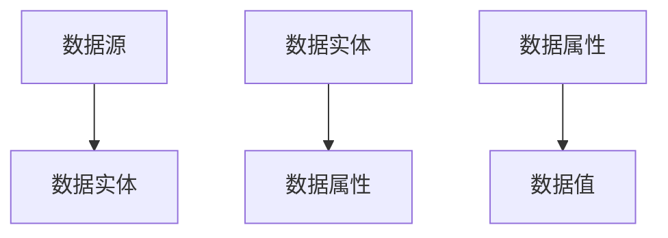
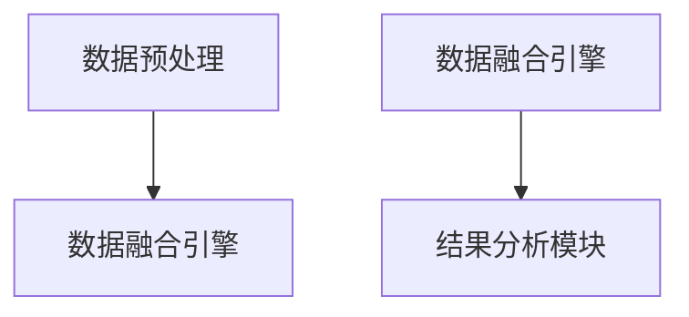

                 


# AI Agent的多源异构数据融合技术

> 关键词：AI Agent，多源数据，异构数据，数据融合，数据集成，数据处理

> 摘要：本文深入探讨了AI Agent在处理多源异构数据时的核心技术——数据融合。通过分析数据融合的背景、核心概念、算法原理、系统架构及实际案例，全面解析了如何高效整合多源异构数据，以提升AI Agent的智能决策能力。

---

## 第一部分: 多源异构数据融合的背景与挑战

### 第1章: 数据融合的基本概念

#### 1.1 数据融合的定义
数据融合是指将来自不同来源、不同格式或不同结构的数据进行整合、处理和分析，以提取更准确、更全面的信息的过程。其目的是消除数据冗余、噪声和不一致性，提高数据的可用性和价值。

#### 1.2 多源数据的定义与特点
多源数据指的是来自多个不同数据源的数据。这些数据源可能具有不同的格式、粒度、语义和时间戳。例如，来自传感器、数据库、API调用或用户输入的数据都可能被视为多源数据。

#### 1.3 异构数据的定义与分类
异构数据指的是在结构、格式、语义或表示方式上存在显著差异的数据。异构数据可以分为以下几类：
- **格式异构**：如文本、图像、视频等。
- **结构异构**：如关系型数据、非关系型数据等。
- **语义异构**：如同一字段在不同数据源中的含义不同。

### 第2章: 数据融合在AI Agent中的作用

#### 2.1 AI Agent的核心任务
AI Agent是一种智能体，能够感知环境、执行任务并做出决策。其核心任务包括：
- 感知环境：通过多种传感器或数据源获取信息。
- 分析信息：对获取的数据进行处理和分析。
- 制定决策：基于分析结果做出最优决策。
- 执行任务：根据决策执行具体操作。

#### 2.2 数据融合在AI Agent中的重要性
多源异构数据融合是AI Agent实现上述任务的关键技术。通过融合多源数据，AI Agent能够：
- 提高感知能力：整合多种数据源的信息，增强对环境的理解。
- 提高决策准确性：通过消除数据冗余和不一致性，提升决策的可靠性。
- 提高响应速度：通过并行处理和高效融合，缩短决策时间。

#### 2.3 多源异构数据融合的挑战
多源异构数据融合面临以下挑战：
- 数据格式和结构的多样性：不同数据源的数据格式和结构差异较大，难以直接整合。
- 数据质量的不确定性：数据可能存在噪声、缺失或不一致。
- 数据融合的实时性要求：在实时应用中，数据融合需要高效处理大量数据。

---

## 第二部分: 多源异构数据融合的核心概念与联系

### 第3章: 数据融合的原理与方法

#### 3.1 数据融合的基本原理
数据融合的过程包括以下几个步骤：
1. 数据预处理：清洗、标准化和格式化数据。
2. 数据匹配：识别和关联同一实体在不同数据源中的信息。
3. 数据融合：根据融合规则对数据进行加权、合并或集成。
4. 结果分析：评估融合后的数据质量，并进行进一步分析。

#### 3.2 数据融合的方法
数据融合的方法可以分为两类：
- **基于规则的融合方法**：根据预定义的规则（如优先级、权重）对数据进行融合。
- **基于模型的融合方法**：利用机器学习模型（如概率模型、图模型）对数据进行融合。

### 第4章: 数据融合的特征对比

#### 4.1 数据源的特征对比
| 特征 | 数据源1 | 数据源2 | 数据源3 |
|------|---------|---------|---------|
| 格式 | 文本     | 图像     | 视频     |
| 结构 | 关系型   | 非关系型 | 图结构   |
| 语义 | 用户行为 | 图像特征 | 视频流   |

#### 4.2 数据格式的特征对比
| 格式 | 文本 | 图像 | 视频 |
|------|-----|-----|-----|
| 大小 | 小   | 中   | 大   |
| 复杂度 | 简单 | 较高 | 极高 |

#### 4.3 数据质量的特征对比
| 特性 | 数据源1 | 数据源2 | 数据源3 |
|------|---------|---------|---------|
| 准确性 | 高      | 中      | 低      |
| 完整性 | 中      | 高      | 中      |
| 一致性 | 低      | 中      | 高      |

### 第5章: 数据融合的ER实体关系图



---

## 第三部分: 多源异构数据融合的算法原理

### 第6章: 数据融合算法的分类

#### 6.1 基于权重的融合算法
基于权重的融合算法是一种常见的数据融合方法。其基本思想是为每个数据源分配一个权重，并根据权重对数据进行加权融合。

#### 6.2 基于概率的融合算法
基于概率的融合算法利用概率论中的贝叶斯定理对数据进行融合。这种方法适用于处理不确定性较高的数据。

#### 6.3 基于图的融合算法
基于图的融合算法将数据源之间的关系表示为图结构，并通过图的遍历和合并来实现数据融合。

### 第7章: 数据融合算法的数学模型

#### 7.1 基于权重的融合公式
$$ w_1x_1 + w_2x_2 + ... + w_nx_n $$

#### 7.2 基于概率的融合公式
$$ P(x|e) = \frac{P(e|x)P(x)}{P(e)} $$

### 第8章: 数据融合算法的实现

#### 8.1 基于权重的融合实现
```python
def weighted_fuse(data1, data2, weights):
    return (data1 * weights[0] + data2 * weights[1]) / (weights[0] + weights[1])
```

#### 8.2 基于概率的融合实现
```python
def probabilistic_fuse(data1, data2):
    return (data1 + data2) / 2
```

---

## 第四部分: 数据融合的系统分析与架构设计

### 第9章: 系统功能设计

#### 9.1 数据预处理模块
数据预处理模块负责清洗、标准化和格式化数据。

#### 9.2 数据融合引擎
数据融合引擎是系统的核心模块，负责根据预定义的融合规则对数据进行融合。

#### 9.3 结果分析模块
结果分析模块负责评估融合后的数据质量，并进行进一步分析。

### 第10章: 系统架构设计



---

## 第五部分: 数据融合的项目实战

### 第11章: 项目实战

#### 11.1 环境配置
```bash
pip install numpy pandas scikit-learn
```

#### 11.2 核心代码实现
```python
def fuse_data(data_sources):
    # 数据预处理
    preprocessed_data = [preprocess(s) for s in data_sources]
    # 数据融合
    fused_data = []
    for i in range(len(preprocessed_data[0])):
        fused_value = weighted_fuse(preprocessed_data[0][i], preprocessed_data[1][i], [0.5, 0.5])
        fused_data.append(fused_value)
    return fused_data
```

#### 11.3 案例分析
以智能客服场景为例，通过融合用户行为数据和情感分析数据，提升客服的响应速度和准确性。

---

## 第六部分: 数据融合的最佳实践与小结

### 第12章: 最佳实践

#### 12.1 数据预处理的重要性
数据预处理是数据融合的基础，必须仔细清洗和标准化数据。

#### 12.2 算法选择的注意事项
根据数据特性和应用场景选择合适的融合算法。

#### 12.3 系统优化的建议
优化数据预处理和融合引擎的性能，提升系统的实时性和响应速度。

### 第13章: 小结

通过本文的深入探讨，我们了解了AI Agent在多源异构数据融合中的核心技术。数据融合是提升AI Agent智能性和决策能力的关键，也是实现高效数据处理的重要手段。未来，随着数据源的多样化和数据规模的不断扩大，数据融合技术将面临更多挑战和机遇。

---

**作者：AI天才研究院 & 禅与计算机程序设计艺术**

