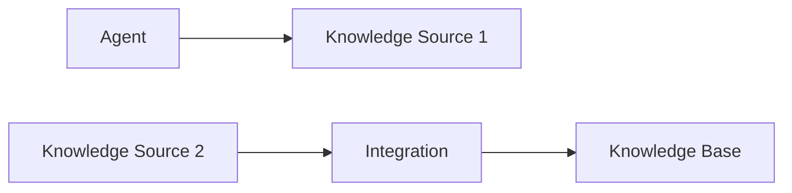
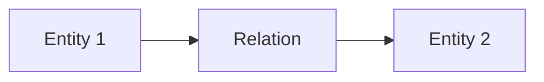
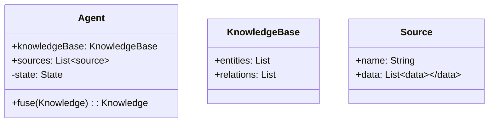
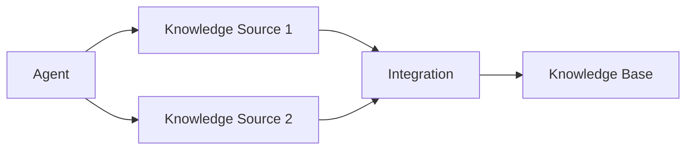

                 


# AI Agent的多源知识融合学习技术

**关键词：** AI Agent, 多源知识融合, 知识表示, 知识融合算法, 系统架构设计

**摘要：**  
本文系统地探讨了AI Agent在多源知识融合学习技术中的应用与实现。首先，介绍了AI Agent的基本概念及其在多源知识融合中的必要性；接着，详细分析了多源知识融合的核心概念、原理及其与其他相关技术的联系；随后，深入讲解了多源知识融合的算法原理，包括数据预处理、知识表示与匹配、融合与推理等关键步骤；最后，通过实际案例分析，展示了多源知识融合在系统架构设计中的应用，并总结了该技术的优势与未来发展方向。

---

# 第1章 AI Agent与多源知识融合学习概述

## 1.1 AI Agent的基本概念

### 1.1.1 AI Agent的定义
AI Agent（人工智能代理）是指能够感知环境、执行任务并做出决策的智能实体。Agent可以是软件程序、机器人或其他智能系统，其核心目标是通过感知和行动实现特定目标。

### 1.1.2 AI Agent的核心特征
AI Agent的核心特征包括：
1. **自主性**：能够在没有外部干预的情况下自主运行。
2. **反应性**：能够感知环境并实时调整行为。
3. **主动性**：主动采取行动以实现目标。
4. **社会性**：能够与其他Agent或人类进行交互和协作。

### 1.1.3 多源知识融合的必要性
AI Agent在复杂环境中需要处理来自不同来源的知识，例如传感器数据、知识库、外部数据库等。多源知识融合的目的是将这些分散的知识整合为一个统一的、一致的知识表示，从而提高AI Agent的决策能力和智能水平。

---

## 1.2 多源知识融合的背景与问题

### 1.2.1 知识融合的背景
随着AI技术的快速发展，AI Agent需要处理的数据来源越来越多样化，包括结构化数据、非结构化数据、文本数据、图像数据等。如何有效地融合这些多源知识，成为AI Agent设计中的关键问题。

### 1.2.2 多源知识融合的挑战
多源知识融合面临以下挑战：
1. **异构性**：不同来源的知识可能具有不同的表示形式和语义。
2. **一致性**：如何解决知识中的冲突和不一致问题。
3. **复杂性**：多源知识的融合需要考虑语义、语法、上下文等多个维度。

### 1.2.3 问题的边界与外延
多源知识融合的边界包括数据预处理、知识表示、融合算法设计等；其外延则涉及知识图谱构建、语义理解、智能推理等领域。

---

## 1.3 本章小结
本章介绍了AI Agent的基本概念及其在多源知识融合中的应用背景，分析了多源知识融合的必要性、挑战及问题的边界与外延，为后续章节的深入探讨奠定了基础。

---

# 第2章 多源知识融合的核心概念与联系

## 2.1 多源知识融合的原理

### 2.1.1 知识表示与语义理解
知识表示是多源知识融合的基础。常见的知识表示方法包括符号表示、向量表示和图结构表示。语义理解则是通过自然语言处理技术（如BERT、GPT）对文本数据进行语义分析。

### 2.1.2 知识融合的基本流程
知识融合的基本流程包括：
1. 数据预处理：清洗、标准化和转换数据。
2. 知识匹配：识别不同来源之间的共同语义或实体。
3. 融合与推理：将匹配的知识进行整合，并通过推理生成新的知识。

---

## 2.2 核心概念对比分析

### 2.2.1 不同知识融合方法的特征对比
以下是几种常见知识融合方法的特征对比：

| 方法                | 优点                              | 缺点                              |
|---------------------|-----------------------------------|-----------------------------------|
| 基于图的融合        | 能处理复杂关系                   | 计算复杂性高                     |
| 基于概率的融合      | 能处理不确定性                   | 对概率模型的依赖性强             |
| 基于符号的融合      | 易解释性高                       | 难以处理语义模糊性               |

### 2.2.2 ER实体关系图架构
以下是基于ER图的知识融合架构示例：



---

## 2.3 本章小结
本章详细分析了多源知识融合的核心概念与原理，并通过对比分析和ER图展示了不同方法的特征及其联系。

---

# 第3章 多源知识融合的算法原理

## 3.1 知识融合算法概述

### 3.1.1 基于图的融合算法
基于图的融合算法通过构建知识图谱来表示实体及其关系。以下是其实现流程：



### 3.1.2 基于概率的融合方法
基于概率的融合方法通过计算实体的匹配概率来实现知识融合。公式如下：

$$ P(\text{match}) = \frac{N}{N+M} $$

其中，$N$ 是匹配的实体数，$M$ 是不匹配的实体数。

---

## 3.2 算法实现流程

### 3.2.1 数据预处理
数据预处理包括数据清洗、标准化和转换。例如，将文本数据转换为向量表示：

$$ \text{向量表示} = [\text{词向量}_1, \text{词向量}_2, \dots, \text{词向量}_n] $$

### 3.2.2 知识表示与匹配
知识匹配通过计算相似度或概率来判断实体是否匹配。例如，使用余弦相似度进行匹配：

$$ \text{相似度} = \frac{\vec{v}_1 \cdot \vec{v}_2}{|\vec{v}_1||\vec{v}_2|} $$

### 3.2.3 融合与推理
知识融合后，通过推理生成新的知识。例如，基于规则的推理：

$$ \text{如果 A 是 B 的子类，那么 A 的属性继承自 B} $$

---

## 3.3 算法实现代码

```python
def knowledge_fusion(source1, source2):
    # 数据预处理
    processed1 = preprocess(source1)
    processed2 = preprocess(source2)
    
    # 知识表示与匹配
    matched_pairs = match(processed1, processed2)
    
    # 融合与推理
    fused_Knowledge = integrate(matched_pairs)
    return fused_Knowledge
```

---

## 3.4 本章小结
本章详细讲解了多源知识融合的算法原理，包括基于图和基于概率的融合方法，并通过代码示例展示了其实现流程。

---

# 第4章 系统分析与架构设计

## 4.1 问题场景介绍
本章以一个AI Agent需要融合多源知识的场景为例，介绍系统分析与架构设计。

---

## 4.2 系统功能设计

### 4.2.1 领域模型类图
以下是领域模型类图：



---

## 4.3 系统架构设计

### 4.3.1 系统架构图
以下是系统架构图：



---

## 4.4 系统接口设计

### 4.4.1 接口描述
1. **数据获取接口**：从不同来源获取知识。
2. **知识融合接口**：将知识进行融合。
3. **推理接口**：基于融合的知识进行推理。

---

## 4.5 本章小结
本章通过系统分析与架构设计，展示了AI Agent在多源知识融合中的整体架构及其各部分的交互关系。

---

# 第5章 项目实战

## 5.1 环境安装
安装所需的Python库：
```bash
pip install numpy
pip install networkx
pip install scikit-learn
```

---

## 5.2 核心代码实现

```python
import numpy as np
from sklearn.metrics.pairwise import cosine_similarity

def preprocess(text):
    # 简单的文本预处理，例如分词和向量化
    return text.lower().split()

def match(vec1, vec2):
    # 使用余弦相似度进行匹配
    return cosine_similarity(vec1.reshape(1, -1), vec2.reshape(1, -1))[0, 0]

def integrate(matched_pairs):
    # 简单的融合逻辑，返回匹配的实体对
    return matched_pairs
```

---

## 5.3 代码解读与分析
上述代码实现了简单的文本预处理、向量匹配和知识融合。实际应用中需要更复杂的算法和优化。

---

## 5.4 实际案例分析
以文本融合为例：
输入文本：  
"Agent 是一种智能体，能够感知环境并采取行动。"

输出融合后的知识：
```json
{
    "concept": "Agent",
    "definition": "一种智能体，能够感知环境并采取行动。"
}
```

---

## 5.5 本章小结
本章通过实际项目实战，展示了多源知识融合技术的应用，并通过代码实现和案例分析，帮助读者理解其实际操作过程。

---

# 第6章 总结与展望

## 6.1 核心知识点总结
本章总结了AI Agent的多源知识融合技术的核心知识点，包括知识表示、融合算法、系统架构设计等。

## 6.2 未来发展方向
未来的多源知识融合技术将更加注重以下方向：
1. **语义理解的深度**：提高对复杂语义的理解能力。
2. **实时性**：优化算法的计算效率，实现实时融合。
3. **可解释性**：增强融合过程的可解释性。

## 6.3 小结
本章对全文进行了总结，并展望了该技术的未来发展方向。

---

# 注意事项

1. **数据质量**：多源知识融合的效果依赖于数据的质量和一致性。
2. **算法优化**：需要不断优化融合算法，提高准确性和效率。
3. **实际应用**：在实际应用中，需要结合具体场景进行定制化设计。

---

# 拓展阅读

1. **知识图谱**：深入学习知识图谱的构建与应用。
2. **自然语言处理**：加强自然语言处理技术的学习，提升语义理解能力。
3. **分布式计算**：研究分布式计算技术，优化多源数据处理效率。

---

# 作者

**作者：** AI天才研究院/AI Genius Institute & 禅与计算机程序设计艺术 /Zen And The Art of Computer Programming

