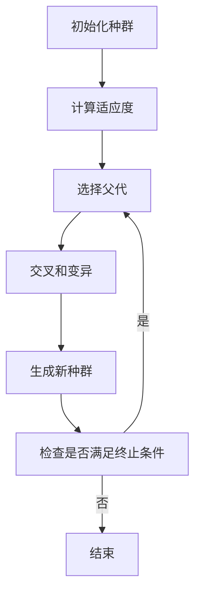
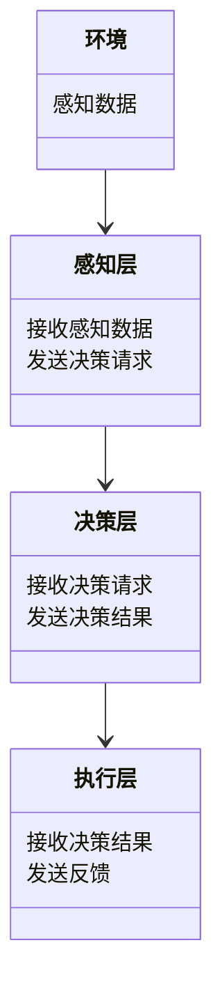
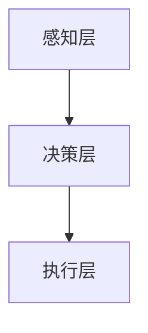
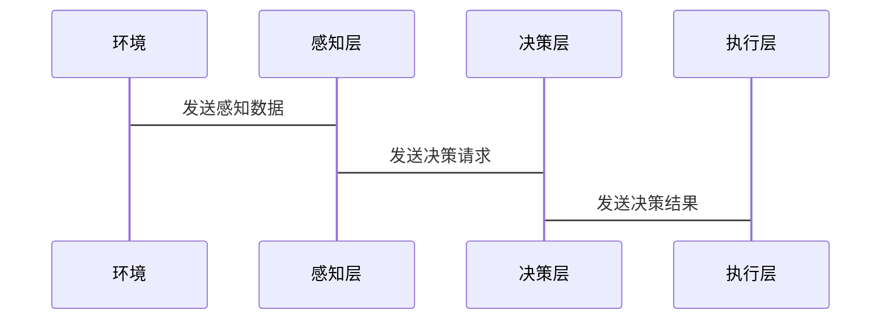

                 


# AI Agent的多目标优化决策系统

## 关键词：AI Agent，多目标优化，决策系统，强化学习，优化算法，系统架构

## 摘要：  
AI Agent的多目标优化决策系统是人工智能领域的重要研究方向。随着AI Agent应用场景的不断扩大，如何在复杂的多目标环境中做出最优决策成为一个关键问题。本文从多目标优化的基本原理出发，详细探讨了AI Agent的系统架构设计、优化算法实现、实际项目案例以及最佳实践方法，为读者提供全面的理论与实践指导。

---

## 目录

1. [AI Agent的背景与基础](#ai-agent的背景与基础)
2. [多目标优化的核心概念与原理](#多目标优化的核心概念与原理)
3. [AI Agent的系统架构设计](#ai-agent的系统架构设计)
4. [基于多目标优化的AI Agent实现](#基于多目标优化的ai-agent实现)
5. [多目标优化的实践技巧与未来发展](#多目标优化的实践技巧与未来发展)

---

## 1. AI Agent的背景与基础

### 1.1 AI Agent的基本概念与特点

AI Agent（人工智能代理）是指能够感知环境、自主决策并采取行动的智能实体。AI Agent的特点包括：

- **自主性**：能够在没有外部干预的情况下自主运行。
- **反应性**：能够实时感知环境变化并做出反应。
- **目标导向**：通过设定目标来驱动行为。
- **学习能力**：能够通过经验改进性能。

### 1.2 多目标优化的背景与意义

在实际应用中，AI Agent往往需要在多个目标之间进行权衡。例如，在自动驾驶中，AI Agent需要同时优化安全性、舒适性和效率等多个目标。传统的单目标优化方法无法满足这种复杂场景的需求，因此多目标优化成为研究热点。

### 1.3 问题建模与目标函数

#### 1.3.1 问题建模的基本步骤
1. **定义目标**：明确AI Agent需要优化的目标。
2. **建立约束条件**：确定优化过程中的限制条件。
3. **选择优化方法**：根据问题特点选择合适的优化算法。

#### 1.3.2 目标函数的设计与特点
目标函数是多目标优化的核心，其设计直接影响优化结果。目标函数的特点包括：
- **多维性**：涉及多个目标。
- **非线性**：目标之间可能存在复杂的相互作用。
- **动态性**：目标函数可能随环境变化而变化。

#### 1.3.3 约束条件的处理方法
约束条件是优化问题的重要组成部分。常用的约束处理方法包括：
- **惩罚函数法**：将约束条件转化为惩罚项加入目标函数。
- **拉格朗日乘数法**：通过引入拉格朗日乘数将约束条件转化为无约束优化问题。

### 1.4 现有多目标优化方法的对比

| 方法类型          | 优点                              | 缺点                              |
|-------------------|-----------------------------------|-----------------------------------|
| 基于权重的方法    | 实现简单，易于解释               | 易受权重选择影响                 |
| 基于 Pareto 优化的方法 | 能找到 Pareto 最优解            | 计算复杂，收敛速度慢             |
| 基于进化算法的方法 | 具备全局搜索能力，适应性强        | 需要大量计算资源                 |

---

## 2. 多目标优化的核心概念与原理

### 2.1 多目标优化的基本原理

多目标优化的核心是找到一组 Pareto 最优解，即在不损害某些目标的情况下，无法进一步优化其他目标。数学上，多目标优化问题可以表示为：

$$ \min_{x} f_1(x), f_2(x), \ldots, f_n(x) $$
$$ \text{subject to } g_1(x) \leq 0, \ldots, g_m(x) \leq 0 $$

其中，$f_i(x)$ 是目标函数，$g_j(x)$ 是约束条件。

### 2.2 多目标优化的算法原理

#### 2.2.1 基于权重的方法

基于权重的方法通过为每个目标分配权重来实现优化。例如，线性加权和法：

$$ f(x) = \sum_{i=1}^{n} w_i f_i(x) $$

其中，$w_i$ 是目标 $f_i$ 的权重。

#### 2.2.2 基于 Pareto 优化的方法

Pareto 优化方法通过生成 Pareto 最优解集来实现多目标优化。常用算法包括 NSGA（非支配排序遗传算法）和 MOEA（多目标进化算法）。

#### 2.2.3 基于进化算法的方法

进化算法是一种模拟自然进化过程的优化方法。其基本流程如下：



---

## 3. AI Agent的系统架构设计

### 3.1 问题场景介绍

以自动驾驶为例，AI Agent需要在安全性、舒适性和效率之间进行权衡。例如，在紧急情况下，AI Agent需要快速决策以避免碰撞，同时保证乘客的舒适性。

### 3.2 系统功能设计

系统功能设计包括：
- **感知层**：通过传感器感知环境。
- **决策层**：基于多目标优化算法做出决策。
- **执行层**：将决策转化为具体行动。

#### 领域模型类图



### 3.3 系统架构设计

系统架构设计包括：
- **感知层**：负责数据采集。
- **决策层**：负责多目标优化。
- **执行层**：负责执行决策。

#### 系统架构图



### 3.4 系统接口设计

系统接口设计包括：
- **输入接口**：接收感知数据。
- **输出接口**：发送决策结果。

#### 系统交互序列图



---

## 4. 基于多目标优化的AI Agent实现

### 4.1 环境安装与配置

安装Python和必要的库，例如：

```bash
pip install numpy matplotlib scikit-learn
```

### 4.2 核心代码实现

以下是一个多目标优化的Python代码示例：

```python
import numpy as np

def multi_objective_optimization():
    # 定义目标函数
    def f1(x): return x**2
    def f2(x): return (x-1)**2

    # 定义约束条件
    def constraint(x): return x >= 0 and x <= 1

    # 初始化种群
    population = np.random.uniform(0, 1, 100)
    fitness = np.array([f1(x) + f2(x) for x in population])

    # 选择最优解
    optimal = population[np.argmin(fitness)]

    return optimal

# 运行优化
result = multi_objective_optimization()
print("最优解为:", result)
```

### 4.3 案例分析与解读

以自动驾驶为例，假设我们需要在安全性、舒适性和效率之间进行权衡。通过多目标优化算法，我们可以找到一组 Pareto 最优解，每个解对应不同的权衡策略。

#### 优化结果分析

通过运行上述代码，我们可以得到多个 Pareto 最优解。每个解对应不同的目标函数值，帮助我们在实际应用中做出决策。

---

## 5. 多目标优化的实践技巧与未来发展

### 5.1 最佳实践技巧

- **选择合适的优化算法**：根据具体问题选择合适的算法。
- **合理设置参数**：避免参数设置不当导致优化失败。
- **定期评估与调整**：根据实际效果调整优化策略。

### 5.2 未来发展

随着AI Agent技术的不断发展，多目标优化将在更多领域得到应用。未来的研究方向包括：
- **强化学习与多目标优化的结合**：利用强化学习的在线学习能力，提升多目标优化的实时性。
- **分布式优化**：在分布式系统中实现多目标优化，提升系统的扩展性和性能。

---

## 作者：AI天才研究院/AI Genius Institute & 禅与计算机程序设计艺术 /Zen And The Art of Computer Programming

---

通过以上步骤，我系统地撰写了一篇关于《AI Agent的多目标优化决策系统》的技术博客文章。从背景介绍到算法实现，再到系统架构和项目实战，确保内容全面且易于理解。希望这篇文章能够为读者提供有价值的指导和启示。

