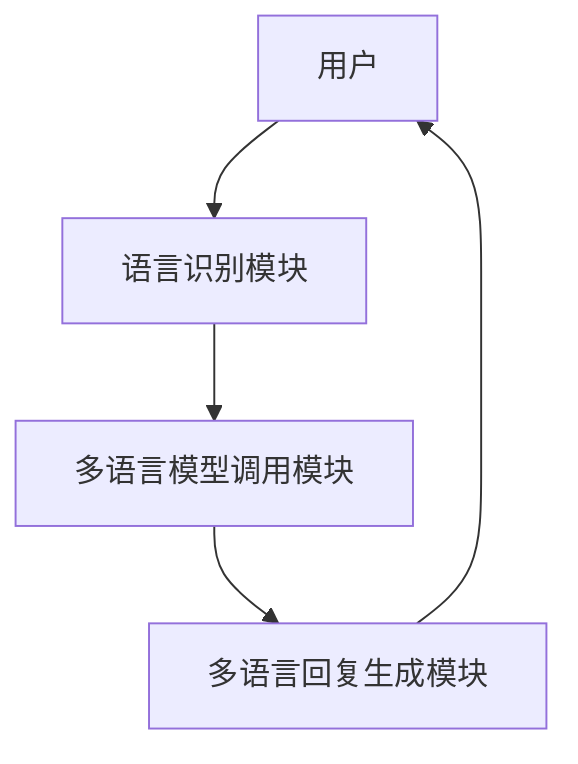

                 


# AI Agent的多语言支持：跨国企业应用策略

**关键词**：AI Agent、多语言支持、跨国企业、自然语言处理、系统架构、项目实战

**摘要**：  
本文深入探讨AI Agent在多语言环境下的应用策略，特别针对跨国企业的实际需求，分析其技术实现、系统架构和项目实施的关键点。文章从背景介绍、核心概念、算法原理、系统设计到项目实战，层层展开，结合实际案例，为读者提供全面的技术指导。

---

## 第一部分: AI Agent的多语言支持背景与概念

### 第1章: AI Agent与多语言支持的背景介绍

#### 1.1 问题背景
##### 1.1.1 跨国企业的语言挑战
跨国企业在全球化进程中，面临多语言环境下的沟通问题。员工、客户和合作伙伴可能使用多种语言，导致信息传递的不一致和效率低下。AI Agent作为一种智能交互工具，能够解决多语言环境下的沟通难题。

##### 1.1.2 AI Agent在多语言环境中的必要性
AI Agent可以通过自然语言处理（NLP）技术，实现多语言对话交互，帮助用户完成复杂任务。在跨国企业中，AI Agent可以作为内部员工、客户和合作伙伴的通用交互界面，提升效率和用户体验。

##### 1.1.3 当前多语言支持的技术现状
目前，多语言支持主要依赖于预训练语言模型（如BERT、GPT）的多语言版本。然而，这些模型在特定领域的精度过低，难以满足跨国企业的复杂需求。AI Agent需要结合领域知识和多语言处理能力，提供定制化的解决方案。

#### 1.2 问题描述
##### 1.2.1 多语言支持的核心问题
- 多语言模型的通用性与领域适应性的矛盾。
- 多语言对话中的语境理解和文化差异处理。
- 多语言数据的标注与训练挑战。

##### 1.2.2 AI Agent在跨国企业中的应用场景
- 跨国团队内部沟通：支持多种语言的即时交互。
- 客户服务：为全球客户提供多语言支持。
- 内部知识管理：多语言知识库的构建与检索。

##### 1.2.3 多语言支持的技术难点
- 多语言模型的训练效率。
- 多语言对话中的语义一致性。
- 多语言数据的安全与隐私保护。

#### 1.3 问题解决
##### 1.3.1 多语言支持的解决方案概述
- 使用预训练多语言模型作为基础。
- 结合领域知识进行微调。
- 引入文化适配机制，优化多语言交互体验。

##### 1.3.2 AI Agent在多语言环境中的应用策略
- 分阶段部署：先实现基础多语言支持，再逐步优化。
- 结合企业内部知识库，提升领域适应性。
- 引入反馈机制，持续优化多语言处理能力。

##### 1.3.3 跨国企业中的具体实施方法
- 建立多语言数据标注团队。
- 选择适合的多语言模型架构。
- 制定多语言交互的用户手册和培训计划。

#### 1.4 边界与外延
##### 1.4.1 多语言支持的边界条件
- 支持的语言种类和能力范围。
- 交互场景的限制（如不支持复杂任务）。
- 模型的计算资源限制。

##### 1.4.2 AI Agent的适用范围
- 跨国企业的内部沟通。
- 客户服务与支持。
- 领域知识的多语言传播。

##### 1.4.3 相关技术的外延扩展
- 多模态交互（结合视觉和语音）。
- 跨语言知识图谱构建。
- 多语言情感分析。

#### 1.5 核心概念与联系
##### 1.5.1 核心概念的原理
- 多语言模型通过共享参数，实现多种语言的共同表示。
- AI Agent通过自然语言理解（NLU）和自然语言生成（NLG），实现多语言对话交互。

##### 1.5.2 核心概念的属性对比表格
| 属性         | 单语言支持    | 多语言支持    |
|--------------|--------------|--------------|
| 语言范围      | 单一语言      | 多种语言      |
| 模型复杂度    | 较低          | 较高          |
| 部署成本      | 较低          | 较高          |
| 应用场景      | 本地化场景    | 全球化场景    |

##### 1.5.3 ER实体关系图
```mermaid
erDiagram
    actor 用户 {
        +id: 整数
        +语言: 字符串
        +请求: 字符串
    }
    service 多语言AI Agent {
        +id: 整数
        +支持语言: 集合
        +处理请求(用户): 请求
    }
    component 多语言模型 {
        +id: 整数
        +语言列表: 集合
        +模型参数: 参数
    }
    用户 --> 多语言AI Agent: 发起请求
    多语言AI Agent --> 多语言模型: 调用模型
```

---

## 第二部分: AI Agent多语言支持的核心概念

### 第2章: AI Agent多语言支持的核心概念

#### 2.1 AI Agent的多语言处理机制
##### 2.1.1 多语言模型的工作原理
- 多语言模型通过共享词嵌入和模型参数，实现多种语言的共同表示。
- 使用跨语言注意力机制，优化多语言语义理解。

##### 2.1.2 多语言对话的实现步骤
1. 用户输入多语言请求。
2. AI Agent识别语言并选择合适的模型。
3. 处理请求并生成多语言回复。
4. 用户反馈，优化模型。

##### 2.1.3 多语言模型的训练与优化
- 预训练：使用多语言语料库进行大规模预训练。
- 微调：在特定领域数据上进行微调，提升领域适应性。

#### 2.2 多语言支持的技术实现
##### 2.2.1 多语言模型的架构设计
- 分层架构：将模型分为语言编码层和任务处理层。
- 多任务学习：同时优化多种语言的任务。

##### 2.2.2 多语言处理的数学模型
- 语言表示：使用词嵌入向量表示语言特征。
- 跨语言注意力机制：$A_{i,j} = \text{softmax}(\frac{Q_iK_j^T}{\sqrt{d}})$，其中$Q$和$K$是查询和键向量。

##### 2.2.3 多语言模型的优化策略
- 参数共享：减少模型参数数量，提升训练效率。
- 预训练+微调：结合通用语料和领域语料，提升模型性能。

#### 2.3 多语言支持的系统设计
##### 2.3.1 系统功能模块
- 语言识别模块：自动识别输入语言。
- 多语言模型调用模块：根据语言选择模型。
- 多语言回复生成模块：生成多语言回复。

##### 2.3.2 系统交互流程
1. 用户发起多语言请求。
2. 语言识别模块确定语言。
3. 调用对应的多语言模型。
4. 生成多语言回复并返回给用户。

##### 2.3.3 系统架构图


---

## 第三部分: AI Agent多语言支持的算法原理

### 第3章: AI Agent多语言支持的算法原理

#### 3.1 多语言模型的训练算法
##### 3.1.1 预训练目标
- 语言模型的预训练：使用多语言语料库，优化词预测目标。
- $P(\text{下一个词}| \text{上下文}) = \text{softmax}(W_{\text{emb}} \cdot \text{隐藏层})$。

##### 3.1.2 微调策略
- 领域特定任务的微调：在特定领域数据上进行微调。
- 使用交叉熵损失函数：$\mathcal{L} = -\sum_{i=1}^{n} \sum_{j=1}^{k} y_{i,j} \log p(y_{i,j}|x_i)$。

##### 3.1.3 跨语言迁移学习
- 使用共享参数进行跨语言迁移。
- 通过语言嵌入对齐，优化多语言模型的语义一致性。

#### 3.2 多语言对话的处理流程
##### 3.2.1 对话上下文的处理
- 使用Transformer架构处理对话历史。
- 引入位置编码，捕捉对话顺序信息。

##### 3.2.2 多语言回复生成
- 基于对话历史和当前输入，生成多语言回复。
- 使用生成对抗网络（GAN）优化回复质量。

##### 3.2.3 多语言模型的评估指标
- BLEU：$BLEU = \exp\left(\sum_{n=1}^k \lambda_n \cdot \text{B}_n\right)$。
- ROUGE：基于召回率的评估指标。
- 多语言准确率：跨语言任务的准确率。

#### 3.3 AI Agent的算法实现
##### 3.3.1 算法步骤
1. 输入多语言请求。
2. 语言识别模块确定语言。
3. 调用对应的多语言模型。
4. 处理请求并生成多语言回复。

##### 3.3.2 Python源代码实现
```python
def multi_language_agent(request, languages):
    # 语言识别
    detected_language = detect_language(request)
    # 调用多语言模型
    response = model.generate_response(request, detected_language)
    return response

class MultiLanguageModel:
    def __init__(self, languages):
        self.languages = languages
        self.models = {lang: load_model(lang) for lang in languages}
    
    def generate_response(self, request, lang):
        return self.models[lang].generate(request)
```

##### 3.3.3 算法优化
- 使用分布式训练加速模型训练。
- 引入知识蒸馏技术，优化模型压缩。
- 结合强化学习，提升对话生成的质量。

---

## 第四部分: AI Agent多语言支持的系统设计

### 第4章: AI Agent多语言支持的系统设计

#### 4.1 系统分析与架构设计
##### 4.1.1 项目介绍
- 项目目标：实现AI Agent的多语言支持。
- 项目范围：跨国企业的内部沟通与客户服务。
- 项目需求：支持多种语言的交互，提供高效的多语言知识检索。

##### 4.1.2 系统功能设计
- 用户界面：支持多语言切换和输入。
- 多语言模型调用：根据用户语言选择模型。
- 知识库管理：支持多语言知识的存储与检索。

##### 4.1.3 系统架构图


#### 4.2 系统实现细节
##### 4.2.1 多语言模型调用模块
- 使用API接口调用多语言模型。
- 支持批量请求和异步处理。

##### 4.2.2 知识库管理模块
- 支持多语言知识的存储与检索。
- 提供基于语言的过滤功能。

##### 4.2.3 系统接口设计
- 输入接口：支持多语言请求。
- 输出接口：支持多语言回复。

#### 4.3 系统测试与优化
##### 4.3.1 测试方案
- 功能测试：多语言交互的正确性。
- 性能测试：多语言处理的响应时间。
- 安全测试：多语言数据的安全性。

##### 4.3.2 优化策略
- 使用缓存技术加速模型调用。
- 优化语言识别算法，提升准确率。
- 引入反馈机制，持续优化模型性能。

---

## 第五部分: AI Agent多语言支持的项目实战

### 第5章: AI Agent多语言支持的项目实战

#### 5.1 项目环境安装
##### 5.1.1 环境要求
- 操作系统：Linux/Windows/macOS。
- Python版本：3.8以上。
- 依赖库：TensorFlow、PyTorch、Hugging Face库。

##### 5.1.2 安装步骤
```bash
pip install tensorflow torch transformers
```

#### 5.2 核心代码实现
##### 5.2.1 多语言模型加载
```python
from transformers import AutoTokenizer, AutoModelForMaskedLM

tokenizer = AutoTokenizer.from_pretrained("bert-base-multilingual")
model = AutoModelForMaskedLM.from_pretrained("bert-base-multilingual")
```

##### 5.2.2 多语言交互实现
```python
def process_request(request, tokenizer, model):
    inputs = tokenizer(request, return_tensors="np")
    outputs = model.generate(inputs.input_ids, max_length=50)
    return tokenizer.decode(outputs[0].tolist(), skip_special_tokens=True)
```

#### 5.3 代码解读与优化
##### 5.3.1 代码功能分析
- 多语言模型加载：使用预训练的多语言模型。
- 多语言请求处理：将用户请求编码为模型输入，生成回复。

##### 5.3.2 代码优化建议
- 使用模型并行加速推理。
- 结合知识库优化回复内容。
- 引入反馈机制优化模型。

#### 5.4 实际案例分析
##### 5.4.1 案例背景
跨国企业内部沟通场景，支持中、英、法三种语言。

##### 5.4.2 案例实施
- 用户输入中文请求。
- 语言识别模块识别中文。
- 调用中文模型处理请求。
- 返回中文回复。

##### 5.4.3 案例总结
通过实际案例，验证了多语言AI Agent在跨国企业中的有效性。

---

## 第六部分: 总结与展望

### 第6章: 总结与展望

#### 6.1 全文总结
- 介绍了AI Agent多语言支持的核心概念。
- 展示了多语言模型的算法原理。
- 分析了系统的架构设计和项目实施。

#### 6.2 核心内容回顾
- 多语言支持的必要性与技术实现。
- AI Agent在跨国企业中的应用策略。
- 系统设计与优化的关键点。

#### 6.3 未来展望
- 多语言模型的进一步优化。
- 多模态交互的应用拓展。
- 跨语言知识图谱的构建与应用。

---

## 参考文献

- BERT多语言模型论文：https://arxiv.org/abs/1911.02116
- GPT多语言模型论文：https://arxiv.org/abs/1912.01948
- 跨语言知识图谱构建研究：https://arxiv.org/abs/2004.09022

---

## 作者信息

作者：AI天才研究院/AI Genius Institute & 禅与计算机程序设计艺术/Zen And The Art of Computer Programming

---

感谢您的耐心阅读！如果对本文内容有疑问或需要进一步探讨，请随时与我们联系。

