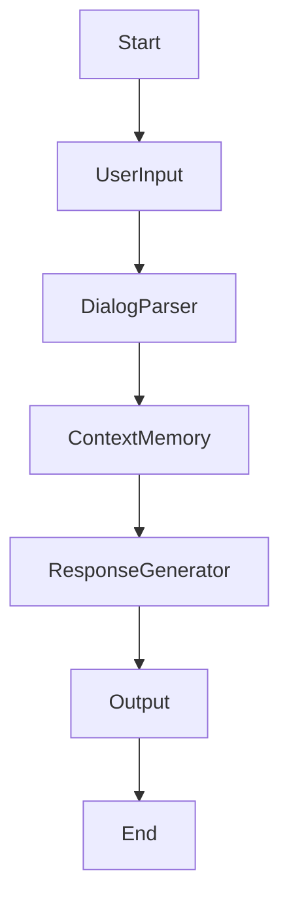

                 


# AI Agent的多轮对话能力增强

> 关键词：AI Agent, 多轮对话, 自然语言处理, 对话系统, 上下文理解

> 摘要：  
本文深入探讨了AI Agent在多轮对话中的能力提升方法，结合实际案例分析，从算法原理到系统架构，详细讲解了如何通过自然语言处理技术增强对话系统的连贯性和智能性。文章内容涵盖对话系统的构成要素、核心算法、系统设计与实现，以及实际项目中的最佳实践。

---

## 第1章: 多轮对话的背景与挑战

### 1.1 多轮对话的定义与特点
多轮对话是指用户与AI Agent之间进行的连续交互，每次交互都基于前一次的上下文进行。其特点包括：

1. **连续性**：对话过程是连续的，每次回复都依赖于之前的上下文。
2. **动态性**：对话内容会根据用户反馈实时调整。
3. **复杂性**：需要处理歧义、上下文关联等问题。

### 1.2 多轮对话的背景
随着自然语言处理技术的发展，AI Agent在客服、教育、医疗等领域的应用越来越广泛。然而，现有的对话系统在多轮对话中仍存在以下问题：

- **上下文理解不足**：无法准确捕捉用户意图。
- **对话连贯性差**：回复缺乏逻辑性。
- **对话策略单一**：无法灵活应对复杂场景。

### 1.3 多轮对话的核心挑战
- **上下文记忆**：如何有效存储和管理对话历史。
- **对话策略**：如何制定合理的对话策略以引导对话方向。
- **语义理解**：如何准确理解用户的深层需求。

---

## 第2章: 多轮对话系统的构成与核心要素

### 2.1 对话系统的构成要素
一个完整的多轮对话系统通常包括以下几个部分：

1. **用户输入**：用户的自然语言输入。
2. **对话解析**：对用户输入进行语义分析。
3. **上下文记忆**：存储对话历史信息。
4. **对话生成**：根据上下文生成回复。

### 2.2 对话系统的分类
根据实现方式的不同，多轮对话系统可以分为以下几类：

1. **基于规则的对话系统**：通过预定义的规则生成回复。
2. **基于检索的对话系统**：从预存的数据中检索最相关的回复。
3. **基于生成的对话系统**：利用自然语言生成模型实时生成回复。

### 2.3 对话系统的实体关系图
```mermaid
graph TD
User -> DialogSystem: 发起对话
DialogSystem -> Memory: 存储上下文
Memory -> ResponseGenerator: 生成响应
ResponseGenerator -> User: 输出响应
```

### 2.4 对话系统的流程图


---

## 第3章: 增强多轮对话能力的关键算法

### 3.1 基于规则的对话算法
#### 3.1.1 算法流程
1. **用户输入**：用户发送一条消息。
2. **解析输入**：将输入拆解为关键词和意图。
3. **匹配规则**：根据关键词匹配预定义的规则。
4. **生成回复**：根据匹配的规则生成回复。

#### 3.1.2 代码示例
```python
def generate_response(user_input):
    # 解析用户输入
    intent = extract_intent(user_input)
    keywords = extract_keywords(user_input)
    
    # 匹配规则
    for rule in rules:
        if rule.intent == intent and rule.keyword == keywords:
            return rule.response
    return default_response
```

### 3.2 基于检索的对话算法
#### 3.2.1 算法流程
1. **用户输入**：用户发送一条消息。
2. **解析输入**：提取关键词和意图。
3. **检索数据库**：从知识库中检索相关的信息。
4. **生成回复**：根据检索结果生成回复。

#### 3.2.2 代码示例
```python
def retrieve_response(user_input):
    # 解析用户输入
    intent = extract_intent(user_input)
    keywords = extract_keywords(user_input)
    
    # 检索数据库
    results = database.query(intent, keywords)
    
    # 生成回复
    if results:
        return generate_response(results)
    else:
        return default_response
```

### 3.3 基于生成的对话算法
#### 3.3.1 算法流程
1. **用户输入**：用户发送一条消息。
2. **解析输入**：提取关键词和意图。
3. **生成回复**：利用生成模型生成回复。

#### 3.3.2 代码示例
```python
def generate_response(user_input):
    # 解析用户输入
    input_text = extract_text(user_input)
    
    # 生成回复
    response = model.generate(input_text)
    
    return response
```

---

## 第4章: 对话系统的架构设计与实现

### 4.1 系统架构设计
```mermaid
graph TD
User --> DialogSystem: 发起对话
DialogSystem --> NLPProcessor: 处理用户输入
NLPProcessor --> Memory: 存储上下文
Memory --> ResponseGenerator: 生成回复
ResponseGenerator --> User: 输出回复
```

### 4.2 系统功能设计
1. **用户输入处理**：解析用户输入，提取关键词和意图。
2. **上下文管理**：存储和管理对话历史。
3. **对话生成**：根据上下文生成回复。

### 4.3 系统实现步骤
1. **环境安装**：安装所需的依赖库，如Python的自然语言处理库。
2. **数据准备**：收集和整理对话数据。
3. **模型训练**：训练对话生成模型。
4. **系统集成**：将各模块集成到一个完整的系统中。

---

## 第5章: 项目实战与案例分析

### 5.1 项目背景
本项目旨在开发一个能够进行多轮对话的智能客服系统。

### 5.2 核心代码实现
```python
class DialogSystem:
    def __init__(self):
        self.memory = []
    
    def process_input(self, user_input):
        # 解析输入
        intent = extract_intent(user_input)
        keywords = extract_keywords(user_input)
        
        # 更新上下文
        self.memory.append((intent, keywords))
        
        # 生成回复
        response = self.generate_response(intent, keywords)
        
        return response
    
    def generate_response(self, intent, keywords):
        # 根据意图和关键词生成回复
        # 这里可以调用生成模型或其他方法
        return "请问您还有其他问题吗？"
```

### 5.3 案例分析
通过实际案例分析，展示了如何通过上下文理解和对话生成提升对话系统的智能性。

---

## 第6章: 最佳实践与总结

### 6.1 小结
本文详细探讨了AI Agent多轮对话能力的增强方法，包括算法原理和系统架构设计。

### 6.2 注意事项
- **数据质量**：确保训练数据的质量和多样性。
- **模型优化**：不断优化对话生成模型，提高回复的准确性和流畅性。
- **用户体验**：注重用户体验，提升对话的自然性和连贯性。

### 6.3 拓展阅读
- 建议读者阅读相关领域的最新论文和书籍，深入了解多轮对话的前沿技术。

---

## 作者信息

作者：AI天才研究院/AI Genius Institute & 禅与计算机程序设计艺术 /Zen And The Art of Computer Programming

---

通过以上内容，您可以系统地增强AI Agent的多轮对话能力，从理论到实践，全面掌握相关技术和方法。

