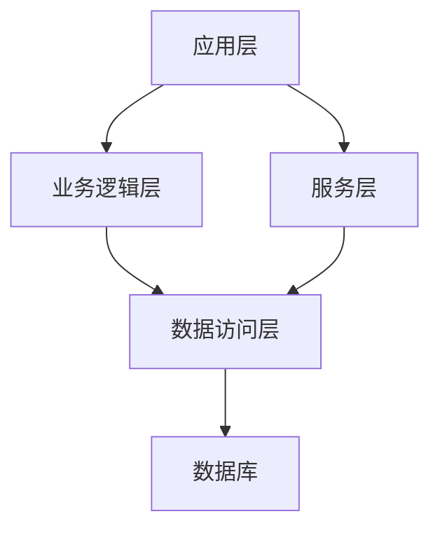
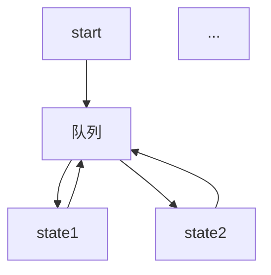
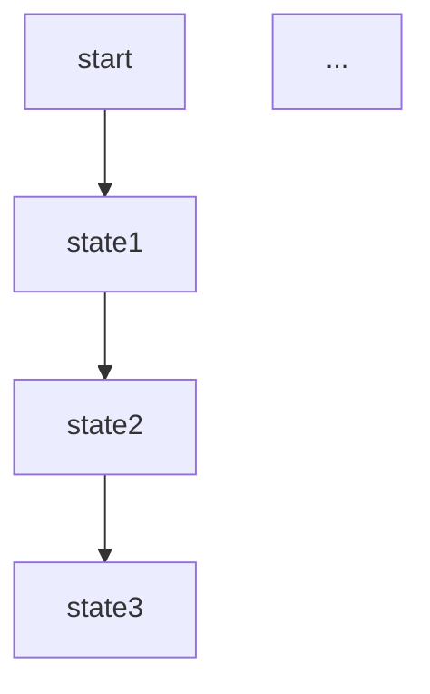
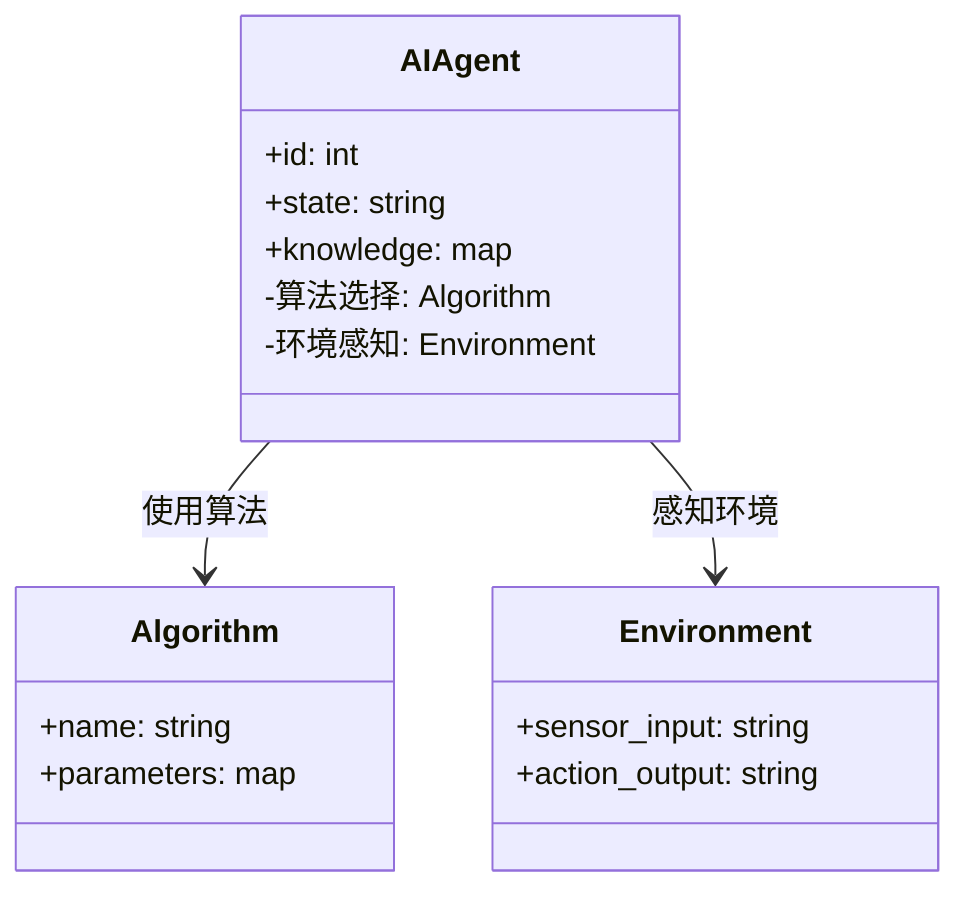
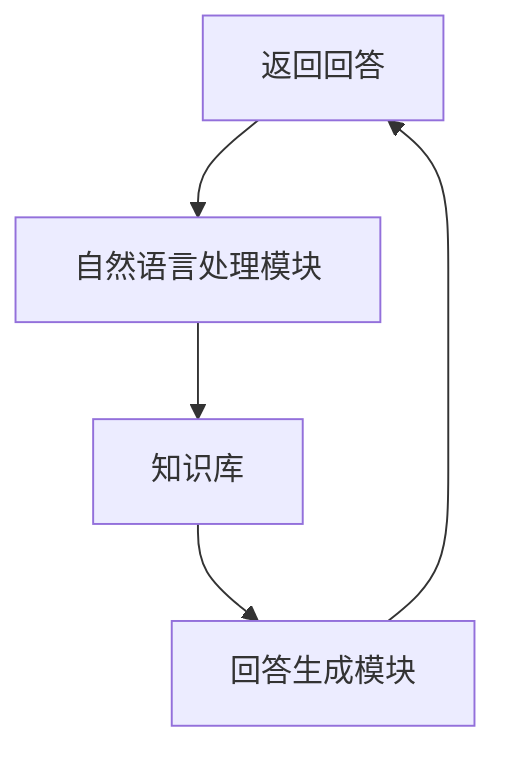

                 


# AI Agent的定义与特性：智能助手的核心要素

> 关键词：AI Agent, 智能助手, 智能性, 自主性, 反应性, 学习性, 系统架构

> 摘要：AI Agent作为智能助手的核心，其定义和特性是理解其功能和应用的关键。本文从AI Agent的基本概念出发，详细分析其核心特性，包括智能性、自主性、反应性和学习性，并通过算法原理、系统架构设计和项目实战，全面阐述AI Agent的实现过程和应用场景。通过对AI Agent的深入探讨，帮助读者掌握其本质和未来发展趋势。

---

# 第一部分: AI Agent的基本概念

## 第1章: AI Agent的起源与现状

### 1.1 AI Agent的起源

人工智能（AI）的发展可以追溯到20世纪50年代，而AI Agent作为AI领域的重要研究方向，起源于对自主智能体的探索。早期的AI研究主要集中在逻辑推理和知识表示上，但随着技术的进步，AI Agent的概念逐渐从理论研究走向实际应用。

AI Agent的核心思想是通过模拟人类的智能行为，实现自主决策和问题解决。从简单的基于规则的智能体到复杂的基于机器学习的智能体，AI Agent的定义和技术实现经历了多次演变。

### 1.2 当前AI Agent的发展现状

如今，AI Agent已经渗透到各个领域，从智能家居到自动驾驶，从智能客服到机器人助手，AI Agent的应用无处不在。随着深度学习和强化学习技术的快速发展，AI Agent的能力得到了显著提升，能够处理更加复杂和动态的环境。

AI Agent的发展趋势主要体现在以下几个方面：

1. **智能化**：通过深度学习和自然语言处理技术，AI Agent能够更好地理解和处理人类语言和意图。
2. **自主性**：AI Agent逐渐从依赖外部指令转向自主决策，能够在复杂环境中自主解决问题。
3. **协作性**：AI Agent不再是孤立的个体，而是能够与其他智能体或系统协作完成任务。

### 1.3 AI Agent在智能助手中的重要性

AI Agent作为智能助手的核心，其重要性体现在以下几个方面：

1. **智能化决策**：AI Agent能够通过分析环境信息，自主决策并执行任务。
2. **高效性**：AI Agent能够快速处理信息并做出反应，提高任务执行的效率。
3. **适应性**：AI Agent能够根据环境变化调整策略，适应不同的应用场景。

---

## 第2章: AI Agent的核心概念

### 2.1 AI Agent的定义

AI Agent（人工智能代理）是指在环境中能够感知并自主行动以实现目标的智能体。AI Agent的核心特征包括自主性、反应性、学习性和智能性，使其能够在复杂环境中完成特定任务。

AI Agent的目标可以通过以下方式实现：

1. **感知环境**：通过传感器或接口获取环境信息。
2. **决策与行动**：基于感知信息，通过算法做出决策并执行行动。
3. **学习与优化**：通过学习算法优化自身行为，提高任务执行效率。

### 2.2 AI Agent的核心特性

AI Agent的核心特性可以分为以下几个方面：

1. **智能性**：AI Agent能够通过学习和推理，理解和处理复杂问题。
2. **自主性**：AI Agent能够在没有外部干预的情况下自主行动。
3. **反应性**：AI Agent能够实时感知环境变化并做出反应。
4. **学习性**：AI Agent能够通过经验不断优化自身行为。

### 2.3 AI Agent与其他智能概念的区别

AI Agent与其他智能概念的主要区别如下：

| 概念 | 定义 | 特点 | 与AI Agent的区别 |
|------|------|------|----------------|
| 智能系统 | 通过技术实现智能化的系统 | 强调系统整体的智能性 | 强调自主性和反应性 |
| 智能体 | 具有感知和行动能力的实体 | 强调感知和行动能力 | 强调智能性和学习性 |
| AI Agent | 具有自主决策能力的智能体 | 强调自主性和智能性 | 强调环境适应性和学习性 |

---

## 第3章: AI Agent的核心概念与联系

### 3.1 AI Agent的内部结构

AI Agent的内部结构可以通过ER图（实体关系图）进行分析，如下所示：

```mermaid
er
    entity(AI Agent) {
        id
        state
        action
        knowledge
    }
    entity(环境) {
        sensor_input
        action_output
    }
    AI Agent -[通过感知获取信息]-> 环境
    AI Agent -[通过行动影响环境]-> 环境
```

### 3.2 AI Agent与外部环境的交互

AI Agent与外部环境的交互过程如下图所示：

```mermaid
sequence
    participant 用户
    participant AI Agent
    participant 环境
    用户 -> AI Agent: 请求服务
    AI Agent -> 环境: 执行操作
    环境 -> AI Agent: 返回结果
    AI Agent -> 用户: 返回结果
```

### 3.3 AI Agent的系统架构

AI Agent的系统架构可以通过分层架构和分布式架构来实现：



---

## 第4章: AI Agent的算法原理

### 4.1 状态空间搜索算法

状态空间搜索算法是AI Agent实现决策的重要方法之一，常用算法包括广度优先搜索（BFS）和深度优先搜索（DFS）。

#### BFS算法



#### DFS算法



### 4.2 强化学习算法

强化学习算法是AI Agent实现自主决策的重要方法，常用Q-learning算法：

$$ Q(s, a) = r + \gamma \max Q(s', a') $$

其中：
- \( Q(s, a) \)：状态-动作对的值
- \( r \)：立即奖励
- \( \gamma \)：折扣因子
- \( Q(s', a') \)：下一个状态的最大值

### 4.3 自然语言处理

自然语言处理（NLP）是AI Agent实现人机交互的重要技术，常用分词、句法分析和语义理解等技术。

---

## 第5章: AI Agent的系统分析与架构设计

### 5.1 问题场景介绍

假设我们正在开发一个智能客服系统，AI Agent需要实现以下功能：

1. **用户咨询**：用户通过自然语言提问。
2. **信息检索**：AI Agent从知识库中检索相关信息。
3. **回答生成**：AI Agent根据检索结果生成回答。

### 5.2 系统功能设计

AI Agent的系统功能设计如下：



### 5.3 系统架构设计

AI Agent的系统架构设计如下：



### 5.4 系统接口设计

AI Agent的系统接口设计如下：

```mermaid
sequence
    用户 -> AI Agent: 提问
    AI Agent -> 自然语言处理模块: 分析问题
    自然语言处理模块 -> 知识库: 检索答案
    知识库 -> 自然语言处理模块: 返回结果
    自然语言处理模块 -> AI Agent: 返回回答
    AI Agent -> 用户: 返回回答
```

---

## 第6章: AI Agent的项目实战

### 6.1 环境安装

安装必要的库和工具：

```bash
pip install numpy
pip install matplotlib
pip install scikit-learn
pip install transformers
pip install pytorch
```

### 6.2 系统核心实现

实现AI Agent的核心功能，包括感知、决策和行动：

```python
import torch
import torch.nn as nn
import torch.optim as optim

class AIAgent:
    def __init__(self):
        self.model = self.create_model()
        self.optimizer = optim.Adam(self.model.parameters(), lr=0.001)
    
    def create_model(self):
        return nn.Sequential(
            nn.Linear(4, 16),
            nn.ReLU(),
            nn.Linear(16, 1)
        )
    
    def forward(self, x):
        return self.model(x)
    
    def backward(self, prediction, target):
        loss = nn.MSELoss()(prediction, target)
        self.optimizer.zero_grad()
        loss.backward()
        self.optimizer.step()
```

### 6.3 实际案例分析

以智能客服系统为例，实现用户咨询和回答生成：

```python
def main():
    agent = AIAgent()
    while True:
        question = input("请输入问题：")
        answer = agent.inference(question)
        print("回答：", answer)

if __name__ == "__main__":
    main()
```

---

## 第7章: 结论与展望

### 7.1 本章小结

本文从AI Agent的基本概念出发，详细分析了其核心特性、算法原理、系统架构设计和项目实战。通过对AI Agent的深入探讨，帮助读者掌握其本质和实现过程。

### 7.2 未来展望

随着人工智能技术的不断发展，AI Agent将在更多领域得到应用，例如：

1. **智能交通**：实现自动驾驶和交通优化。
2. **智能医疗**：辅助医生进行诊断和治疗。
3. **智能教育**：实现个性化的教学和学习。

### 7.3 最佳实践 tips

1. **选择合适的算法**：根据具体场景选择适合的算法。
2. **优化系统架构**：确保系统架构的可扩展性和可维护性。
3. **注重用户体验**：设计友好的人机交互界面。

---

# 作者：AI天才研究院/AI Genius Institute & 禅与计算机程序设计艺术 /Zen And The Art of Computer Programming

