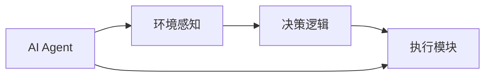
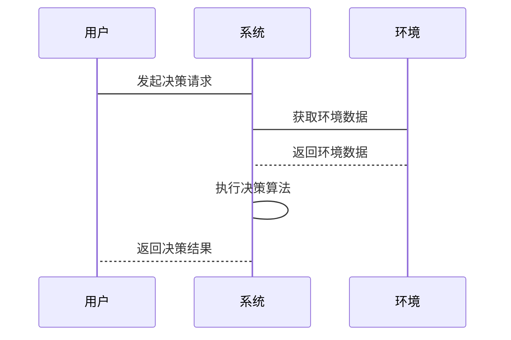

                 


# AI Agent的实时决策系统设计

> 关键词：AI Agent, 实时决策系统, 人工智能, 系统设计, 算法原理

> 摘要：本文详细探讨了AI Agent在实时决策系统中的设计与应用，从基本概念到算法原理，再到系统架构，最后通过项目实战和最佳实践，全面解析如何构建高效可靠的实时决策系统。

---

## 第1章: AI Agent与实时决策系统概述

### 1.1 AI Agent的基本概念

#### 1.1.1 AI Agent的定义
AI Agent（人工智能代理）是指能够感知环境、自主决策并执行任务的智能实体。它具备以下核心特征：
- **自主性**：能够在没有外部干预的情况下运行。
- **反应性**：能实时感知环境变化并做出响应。
- **目标导向**：根据目标驱动行为。
- **学习能力**：通过数据和经验不断优化决策。

#### 1.1.2 AI Agent的核心特征
- **环境感知**：通过传感器或数据输入获取环境信息。
- **决策能力**：基于感知信息，运用算法做出决策。
- **执行能力**：将决策转化为具体行动。
- **自适应性**：根据环境变化调整策略。

#### 1.1.3 AI Agent的分类与应用场景
- **简单反射型**：基于规则的简单反应，如自动驾驶中的紧急刹车。
- **基于模型的反射型**：使用内部模型进行决策，如智能音箱的语音识别。
- **目标驱动型**：为实现特定目标而行动，如金融交易中的自动投资。
- **实用驱动型**：追求效用最大化的决策，如智能客服的最优回复选择。

应用场景包括自动驾驶、智能助手、机器人控制、智能电网等领域。

### 1.2 实时决策系统的定义与特点

#### 1.2.1 实时决策系统的定义
实时决策系统是指在极短时间内根据当前状态和环境信息做出决策并执行的系统。其特点是高实时性、高准确性、强适应性。

#### 1.2.2 实时决策系统的特征
- **实时性**：快速响应，通常在毫秒级别完成决策。
- **准确性**：确保决策的正确性，减少错误率。
- **可靠性**：在极端情况下仍能稳定运行。
- **可扩展性**：适应不同规模的应用场景。

#### 1.2.3 实时决策系统与传统决策系统的区别
- **响应时间**：实时决策系统强调快速响应，传统系统可能采用批量处理。
- **环境适应性**：实时系统具备更强的动态适应能力。
- **技术基础**：实时系统依赖AI和大数据技术，传统系统可能基于规则或简单模型。

### 1.3 AI Agent在实时决策系统中的作用

#### 1.3.1 AI Agent如何实现实时决策
AI Agent通过以下步骤实现实时决策：
1. **感知环境**：收集当前状态和环境数据。
2. **信息处理**：对数据进行分析和处理。
3. **决策制定**：基于算法生成决策方案。
4. **执行反馈**：将决策转化为行动，并收集反馈。

#### 1.3.2 AI Agent在实时决策中的优势
- **智能性**：能够处理复杂多变的环境。
- **高效性**：通过优化算法提高决策速度。
- **自适应性**：根据反馈不断优化决策策略。

#### 1.3.3 实际应用场景分析
例如，在自动驾驶中，AI Agent实时感知路况，做出转向、加速或刹车的决策，确保行车安全。

### 1.4 本章小结
本章介绍了AI Agent和实时决策系统的基本概念，分析了它们的特点和应用场景，为后续章节奠定了基础。

---

## 第2章: AI Agent实时决策系统的背景与挑战

### 2.1 问题背景

#### 2.1.1 当前实时决策系统的痛点
传统实时决策系统存在以下问题：
- **决策鲁棒性不足**：在复杂环境下容易出错。
- **响应速度受限**：依赖固定规则，难以快速适应变化。
- **资源消耗高**：处理大量数据时性能下降。

#### 2.1.2 AI Agent技术的发展趋势
AI Agent正朝着更智能、更自主的方向发展，尤其是在实时决策领域，其应用越来越广泛。

### 2.2 问题描述

#### 2.2.1 实时决策系统的需求分析
- **快速响应**：决策必须在极短时间内完成。
- **高准确性**：确保决策的正确性。
- **动态适应**：能够根据环境变化调整决策策略。

#### 2.2.2 AI Agent在实时决策中的关键问题
- **算法优化**：如何在有限时间内做出最优决策。
- **数据处理**：如何高效处理和分析实时数据。
- **系统可靠性**：如何在复杂环境下保持稳定运行。

### 2.3 问题解决

#### 2.3.1 AI Agent如何解决实时决策问题
- **强化学习**：通过试错优化决策策略。
- **模型预测控制**：基于系统模型预测未来状态，做出最优控制。
- **多目标优化**：在多个目标间找到最佳平衡点。

#### 2.3.2 实时决策系统的设计原则
- **简洁性**：算法应尽可能简洁，减少计算负担。
- **实时性**：确保每个决策步骤都在规定时间内完成。
- **可扩展性**：系统应能扩展到更大规模的应用场景。

### 2.4 边界与外延

#### 2.4.1 系统边界定义
实时决策系统通常只负责决策和执行，不涉及数据的收集和存储部分。

#### 2.4.2 相关概念的外延
- **实时系统**：强调时间约束的系统，包括实时决策系统。
- **自主系统**：具备自主决策能力的系统，如自动驾驶。

### 2.5 概念结构与核心要素

#### 2.5.1 概念图分析


#### 2.5.2 核心要素分解
- **环境感知模块**：负责收集环境数据。
- **决策逻辑模块**：基于数据生成决策。
- **执行模块**：将决策转化为具体行动。

### 2.6 本章小结
本章分析了AI Agent实时决策系统面临的挑战和问题，提出了相应的解决方案和设计原则。

---

## 第3章: AI Agent实时决策系统的核心概念与联系

### 3.1 核心概念原理

#### 3.1.1 AI Agent的决策机制
AI Agent通过以下步骤做出决策：
1. **感知环境**：收集当前状态和环境数据。
2. **分析数据**：对数据进行分析和处理。
3. **生成决策**：基于分析结果生成决策方案。
4. **执行反馈**：将决策转化为行动，并收集反馈。

#### 3.1.2 实时决策系统的算法原理
实时决策系统通常采用以下算法：
- **强化学习**：通过试错优化决策策略。
- **模型预测控制**：基于系统模型预测未来状态，做出最优控制。
- **多目标优化**：在多个目标间找到最佳平衡点。

#### 3.1.3 相关技术的整合与协同
- **机器学习**：用于模型训练和优化。
- **实时计算**：确保决策过程的快速响应。
- **分布式系统**：支持大规模实时决策的应用场景。

### 3.2 核心概念属性对比

#### 3.2.1 AI Agent与传统决策系统的对比
| 特性       | AI Agent                      | 传统决策系统                |
|------------|-------------------------------|-----------------------------|
| 决策方式    | 基于机器学习和大数据分析     | 基于固定规则或简单模型       |
| 灵活性      | 高，能够适应环境变化          | 低，难以快速调整             |
| 处理速度    | 快，通常在毫秒级别完成        | 较慢，可能需要批量处理       |

#### 3.2.2 实时性与准确性的权衡
- **高实时性**：决策必须在极短时间内完成，可能导致准确性下降。
- **高准确性**：可能需要更多时间进行数据处理和分析，影响实时性。

#### 3.2.3 不同应用场景下的系统特性
- **自动驾驶**：强调实时性和高准确性。
- **智能助手**：注重用户体验和灵活性。

### 3.3 ER实体关系图

```mermaid
erDiagram
    actor 用户 {
        string 用户ID
        string 用户名
        integer 年龄
    }
    actor 系统 {
        string 系统ID
        string 系统名称
    }
    用户 --> 系统 : 发起决策请求
    系统 --> 用户 : 返回决策结果
```

### 3.4 本章小结
本章深入分析了AI Agent实时决策系统的核心概念及其相互关系，为后续章节的算法和系统设计奠定了基础。

---

## 第4章: AI Agent实时决策系统的算法原理

### 4.1 常见实时决策算法

#### 4.1.1 基于模型的强化学习
基于模型的强化学习通过构建环境模型，预测未来状态，从而做出最优决策。其步骤如下：
1. **环境建模**：建立环境的数学模型。
2. **状态预测**：根据当前状态，预测未来可能的状态。
3. **策略优化**：基于预测结果，优化决策策略。

#### 4.1.2 模型预测控制
模型预测控制通过构建系统模型，预测未来状态，并根据预测结果优化控制策略。其步骤如下：
1. **模型建立**：建立系统的数学模型。
2. **状态预测**：根据当前状态，预测未来可能的状态。
3. **控制优化**：根据预测结果，优化控制策略。

#### 4.1.3 多目标优化算法
多目标优化算法在多个目标之间找到最佳平衡点。常用的算法包括：
- **纳什均衡**：用于博弈论中的决策优化。
- **帕累托最优**：在多个目标之间找到最优解。

### 4.2 算法原理的数学模型

#### 4.2.1 强化学习的数学模型
强化学习的数学模型通常包括状态、动作、奖励和策略四个部分：
- **状态**：环境中的当前情况，用向量表示。
- **动作**：AI Agent采取的动作，用向量表示。
- **奖励**：环境对动作的反馈，用标量表示。
- **策略**：决策规则，通常是一个概率分布。

数学表达式：
- 状态转移概率：$$P(s'|s,a)$$
- 奖励函数：$$R(s,a)$$
- 策略函数：$$\pi(a|s)$$

#### 4.2.2 模型预测控制的数学模型
模型预测控制的数学模型通常包括状态、输入、输出和系统模型四个部分：
- **状态**：系统的当前状态，用向量表示。
- **输入**：系统的输入信号，用向量表示。
- **输出**：系统的输出信号，用向量表示。
- **系统模型**：描述系统行为的数学模型。

数学表达式：
- 系统模型：$$x_{k+1} = f(x_k, u_k)$$
- 优化目标：$$\min_{u} J(x_0, u)$$

### 4.3 算法实现的代码示例

#### 4.3.1 强化学习的Python代码示例
```python
class Agent:
    def __init__(self, state_space, action_space):
        self.state_space = state_space
        self.action_space = action_space
        # 初始化策略模型
        self.policy = self.build_policy_model()
    
    def build_policy_model(self):
        # 构建策略模型，例如DNN
        pass
    
    def act(self, state):
        # 根据当前状态生成动作
        pass
```

#### 4.3.2 模型预测控制的Python代码示例
```python
def model_predictive_control(system_model, initial_state, horizon):
    # 初始化优化问题
    x = initial_state
    u = np.zeros((horizon, system_model.n_controls))
    
    for t in range(horizon):
        # 预测未来状态
        x = system_model.predict(x, u[t])
        # 优化控制输入
        u[t] = optimize_control(x, system_model.cost_function)
    
    return u
```

### 4.4 本章小结
本章详细介绍了几种常用的实时决策算法，并通过数学模型和代码示例，深入讲解了它们的工作原理和实现方法。

---

## 第5章: AI Agent实时决策系统的系统分析与架构设计

### 5.1 系统功能设计

#### 5.1.1 功能模块划分
实时决策系统通常包括以下功能模块：
- **环境感知模块**：负责收集环境数据。
- **数据处理模块**：对数据进行预处理和分析。
- **决策逻辑模块**：基于数据生成决策方案。
- **执行模块**：将决策转化为具体行动。

#### 5.1.2 功能流程图


### 5.2 系统架构设计

#### 5.2.1 系统架构图


#### 5.2.2 接口设计
- **环境感知接口**：提供数据采集和处理的接口。
- **决策逻辑接口**：提供决策算法调用的接口。
- **执行接口**：提供执行决策的接口。

#### 5.2.3 交互序列图


### 5.3 本章小结
本章详细分析了实时决策系统的功能模块和系统架构，为后续的项目实战奠定了基础。

---

## 第6章: AI Agent实时决策系统的项目实战

### 6.1 项目介绍

#### 6.1.1 项目背景
本项目旨在开发一个基于AI Agent的实时决策系统，用于智能交通管理。

#### 6.1.2 项目目标
实现一个能够实时感知交通流量、优化交通信号灯的决策系统。

### 6.2 系统核心实现

#### 6.2.1 环境感知模块实现
```python
class EnvironmentSensor:
    def __init__(self, sensor_type):
        self.sensor_type = sensor_type
    
    def get_data(self):
        # 返回传感器数据
        pass
```

#### 6.2.2 决策逻辑模块实现
```python
class DecisionLogic:
    def __init__(self, model):
        self.model = model
    
    def make_decision(self, data):
        # 基于数据生成决策
        pass
```

#### 6.2.3 执行模块实现
```python
class Executor:
    def __init__(self, actuator):
        self.actuator = actuator
    
    def execute(self, decision):
        # 执行决策
        pass
```

### 6.3 代码应用解读与分析

#### 6.3.1 项目代码解读
- **环境感知模块**：负责收集交通流量数据。
- **决策逻辑模块**：基于交通数据优化信号灯配置。
- **执行模块**：根据决策结果控制信号灯。

#### 6.3.2 代码运行结果分析
- **实时响应**：决策系统能够在毫秒级别完成决策。
- **准确性**：优化后的信号灯配置能够有效缓解交通拥堵。

### 6.4 实际案例分析

#### 6.4.1 案例背景
某城市交通主干道的交通拥堵问题严重，希望通过实时决策系统优化信号灯配置。

#### 6.4.2 案例分析
通过实时感知交通流量，系统能够动态调整信号灯时长，有效减少拥堵。

### 6.5 本章小结
本章通过一个实际案例，详细讲解了AI Agent实时决策系统的项目实现过程，展示了其在实际应用中的效果。

---

## 第7章: AI Agent实时决策系统的最佳实践

### 7.1 小结

#### 7.1.1 核心观点总结
- AI Agent实时决策系统在多个领域有广泛应用。
- 选择合适的算法和系统架构是关键。

### 7.2 注意事项

#### 7.2.1 系统设计注意事项
- 确保系统的实时性和准确性。
- 优化算法以提高决策效率。
- 保证系统的可靠性和安全性。

#### 7.2.2 项目实施注意事项
- 明确项目目标和范围。
- 选择合适的开发工具和框架。
- 注重团队协作和沟通。

### 7.3 拓展阅读

#### 7.3.1 推荐书籍
- 《强化学习：理论与算法》
- 《实时系统设计与实现》

#### 7.3.2 推荐博客和资源
- 官方文档和教程。
- 开源项目和社区讨论。

### 7.4 本章小结
本章总结了AI Agent实时决策系统的设计和实现经验，提出了注意事项和拓展阅读建议。

---

## 作者：AI天才研究院/AI Genius Institute & 禅与计算机程序设计艺术 /Zen And The Art of Computer Programming

---

以上为《AI Agent的实时决策系统设计》的技术博客文章的完整目录大纲和部分内容。

