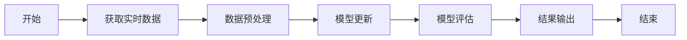
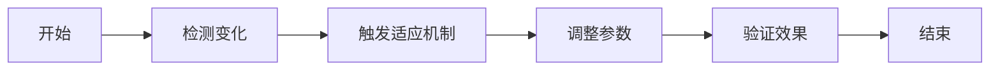
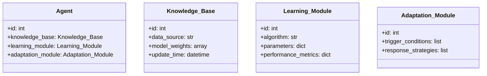
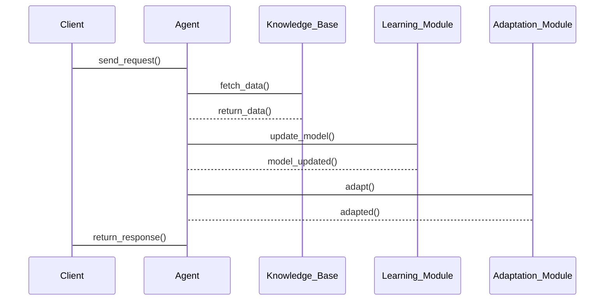

                 


# AI Agent的实时学习与适应机制

> 关键词：AI Agent, 实时学习, 适应机制, 动态环境, 机器学习, 系统架构

> 摘要：本文深入探讨了AI Agent在实时学习与适应机制中的关键原理和实现方法，分析了其在动态环境中的应用挑战，并通过实际案例展示了如何设计和优化AI Agent的实时学习与适应系统。文章从背景介绍、核心概念、算法原理、系统架构、项目实战到总结，全面而详细地解析了AI Agent的实时学习与适应机制。

---

## 第一部分: 背景介绍

### 第1章: AI Agent的背景与问题背景

#### 1.1 问题背景
- **1.1.1 AI Agent的基本概念**
  - AI Agent的定义与分类
  - AI Agent的核心功能与特点
  - AI Agent的应用场景与挑战

- **1.1.2 问题描述**
  - 动态环境中的AI Agent面临的挑战
  - 实时学习与适应机制的必要性
  - AI Agent在复杂环境中的适应性需求

- **1.1.3 问题解决**
  - 实时学习与适应的基本思路
  - 相关技术的综述
  - 当前AI Agent技术的局限性与改进方向

#### 1.2 边界与外延
- AI Agent的边界定义
- 实时学习与适应机制的外延
- 相关领域的区别与联系

---

## 第二部分: 核心概念与联系

### 第2章: AI Agent的核心概念

#### 2.1 核心概念原理
- 实时学习的基本原理
- 适应机制的实现方式
- 相关算法的比较分析

#### 2.2 概念属性特征对比
- 不同AI Agent模型的特征对比
- 实时学习与离线学习的对比
- 适应机制的动态性与稳定性对比

#### 2.3 ER实体关系图
```mermaid
er
    Agent {
        id
        knowledge_base
        learning_module
        adaptation_module
    }
    Knowledge_Base {
        id
        data_source
        model_weights
        update_time
    }
    Learning_Module {
        id
        algorithm
        parameters
        performance_metrics
    }
    Adaptation_Module {
        id
        trigger_conditions
        response_strategies
    }
```

---

## 第三部分: 算法原理讲解

### 第3章: 算法原理

#### 3.1 实时学习算法
- 算法流程图


- 数学模型与公式
$$ \text{损失函数} = \sum_{i=1}^{n} (y_i - \hat{y}_i)^2 $$
$$ \text{模型更新} = \theta_{\text{new}} = \theta_{\text{old}} - \eta \cdot \nabla L $$

- 代码实现
```python
def real_time_learning(data_stream):
    model = initialize_model()
    while True:
        batch = next(data_stream)
        preprocessed_batch = preprocess(batch)
        loss, gradients = compute_loss(model, preprocessed_batch)
        model.update(gradients)
        evaluate(model)
```

#### 3.2 适应机制算法
- 算法流程图


- 数学模型与公式
$$ \text{适应策略} = \arg \min_{\theta} \sum_{i=1}^{m} (y_i - \hat{y}_i)^2 $$
$$ \text{参数调整} = \theta_{\text{new}} = \theta_{\text{old}} + \alpha \cdot \Delta \theta $$

- 代码实现
```python
def adaptation Mechanism(model, environment):
    while True:
        state = get_current_state(environment)
        if is_change detected(state):
            model_adaptation = update_parameters(model, state)
            validate_adaptation(model_adaptation)
```

---

## 第四部分: 系统分析与设计

### 第4章: 系统分析与架构设计

#### 4.1 问题场景介绍
- 动态环境中的AI Agent应用案例
- 系统需求分析
- 功能需求与非功能需求

#### 4.2 系统功能设计
- 领域模型类图


- 系统架构设计


#### 4.3 系统接口设计
- API接口定义
- 接口交互流程图


---

## 第五部分: 项目实战

### 第5章: 项目实战

#### 5.1 环境安装与配置
- 开发环境要求
- 依赖库安装
- 数据集准备

#### 5.2 核心系统实现
- 代码实现
```python
def main():
    model = initialize_model()
    environment = setup_environment()
    while True:
        data = environment.get_data()
        preprocess_data = preprocess(data)
        model.update(preprocess_data)
        check_adaptation(model, environment)
```

- 代码解读
  - 初始化模型
  - 数据预处理
  - 模型更新
  - 适应机制触发

#### 5.3 案例分析与解读
- 实际案例分析
- 系统性能评估
- 可能的问题与解决方案

---

## 第六部分: 总结与展望

### 第6章: 总结与展望

#### 6.1 最佳实践
- 系统设计中的注意事项
- 开发中的常见问题与解决方案
- 性能优化技巧

#### 6.2 小结
- AI Agent实时学习与适应机制的核心要点
- 本文的主要贡献与不足
- 未来研究方向与改进空间

#### 6.3 未来展望
- 更高级的适应算法研究
- 更高效的实时学习方法
- AI Agent在更多领域的应用探索

---

## 作者信息

作者：AI天才研究院/AI Genius Institute & 禅与计算机程序设计艺术 /Zen And The Art of Computer Programming

