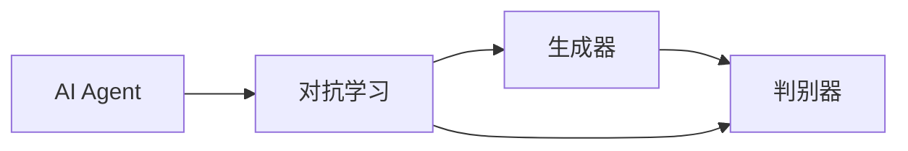
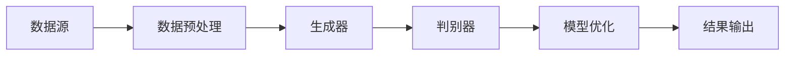

                 


# AI Agent的对抗学习技术应用

> 关键词：AI Agent，对抗学习，机器学习，生成对抗网络，智能体安全

> 摘要：本文深入探讨了对抗学习技术在AI Agent中的应用，分析了对抗学习的基本原理及其在AI Agent系统中的具体应用案例。通过详细的数学推导和代码实现，结合系统架构设计，展示了对抗学习在提升AI Agent智能性和安全性方面的重要作用。同时，本文还提供了实际项目实战指导，帮助读者更好地理解和应用对抗学习技术。

---

## 第一部分: AI Agent的对抗学习技术背景

## 第1章: 对抗学习与AI Agent概述

### 1.1 问题背景

#### 1.1.1 对抗学习的基本概念
对抗学习（Adversarial Learning）是一种基于博弈论的机器学习范式，其核心思想是通过两个智能体（生成器和判别器）之间的对抗训练，分别优化各自的损失函数，从而实现模型的改进和性能的提升。这种学习范式广泛应用于图像生成、自然语言处理等领域。

#### 1.1.2 AI Agent的定义与特点
AI Agent（人工智能代理）是一种能够感知环境、做出决策并采取行动的智能实体。AI Agent具有自主性、反应性、目标导向性和社会性等特性，能够在复杂环境中完成特定任务。

#### 1.1.3 问题描述：AI Agent面临的挑战
在实际应用中，AI Agent可能会面临以下挑战：
1. **环境不确定性**：AI Agent需要在不确定的环境中做出决策。
2. **对抗性攻击**：恶意攻击者可能会利用对抗样本攻击AI Agent，导致其决策失误。
3. **数据稀疏性**：在某些领域，数据可能非常稀疏，导致模型难以泛化。

#### 1.1.4 问题解决：对抗学习的应用价值
对抗学习可以通过生成对抗样本的方式，增强AI Agent的鲁棒性。通过对抗训练，AI Agent能够更好地应对对抗性攻击，提高其在复杂环境中的适应能力。

#### 1.1.5 边界与外延：对抗学习的适用范围
对抗学习适用于需要生成高质量数据或需要提高模型鲁棒性的场景，如图像生成、语音识别、自然语言处理等领域。

#### 1.1.6 概念结构与核心要素组成
对抗学习的核心要素包括：
- 生成器：生成对抗样本。
- 判别器：识别样本是否为真实样本。
- 对抗目标函数：定义生成器和判别器的损失函数。

### 1.2 核心概念与联系

#### 1.2.1 对抗学习的原理
对抗学习的原理是通过生成器和判别器的博弈过程，逐步优化模型参数。生成器的目标是生成能够欺骗判别器的样本，而判别器的目标是区分真实样本和生成样本。

#### 1.2.2 AI Agent与对抗学习的关系
AI Agent可以利用对抗学习技术来增强自身的智能性和安全性。通过对抗训练，AI Agent能够更好地应对对抗性攻击，提高其在复杂环境中的适应能力。

#### 1.2.3 对抗学习与其他机器学习方法的对比分析

| 方法 | 描述 | 优缺点 |
|------|------|--------|
| 监督学习 | 基于标注数据进行训练 | 数据依赖性强，难以处理对抗性攻击 |
| 无监督学习 | 基于未标注数据进行训练 | 数据稀疏性问题，难以生成高质量样本 |
| 对抗学习 | 基于生成器和判别器的博弈过程 | 能够生成高质量样本，提高模型鲁棒性 |

#### 1.2.4 ER实体关系图架构


---

## 第2章: 对抗学习的核心概念与原理

### 2.1 对抗学习的原理

#### 2.1.1 生成器与判别器的动态博弈
生成器的目标是生成能够欺骗判别器的样本，判别器的目标是区分真实样本和生成样本。两者的博弈过程可以通过优化目标函数来实现。

#### 2.1.2 对抗过程的数学模型
生成对抗网络（GAN）的损失函数如下：
$$ \mathcal{L} = \mathbb{E}_{x \sim p_{data}}[\log D(x)] + \mathbb{E}_{z \sim p_z}[\log (1 - D(G(z)))] $$

其中，$D(x)$表示判别器对输入样本$x$的判断概率，$G(z)$表示生成器生成的样本。

---

## 第3章: 对抗学习的算法实现与实战

### 3.1 对抗学习的算法实现

#### 3.1.1 GAN的数学模型
生成器和判别器的数学模型如下：
$$ G(z) = f_g(z) $$
$$ D(x) = f_d(x) $$

其中，$f_g$和$f_d$是生成器和判别器的网络结构。

#### 3.1.2 GAN的优化过程
通过交替优化生成器和判别器的参数，逐步提高生成样本的质量。

#### 3.1.3 对抗训练的代码实现
以下是GAN的Python代码实现：
```python
import torch
import torch.nn as nn
import torch.optim as optim

# 定义生成器
class Generator(nn.Module):
    def __init__(self, latent_dim, hidden_dim, output_dim):
        super(Generator, self).__init__()
        self.fc1 = nn.Linear(latent_dim, hidden_dim)
        self.fc2 = nn.Linear(hidden_dim, output_dim)
    
    def forward(self, x):
        x = self.fc1(x)
        x = self.fc2(x)
        return x

# 定义判别器
class Discriminator(nn.Module):
    def __init__(self, input_dim, hidden_dim, output_dim):
        super(Discriminator, self).__init__()
        self.fc1 = nn.Linear(input_dim, hidden_dim)
        self.fc2 = nn.Linear(hidden_dim, output_dim)
    
    def forward(self, x):
        x = self.fc1(x)
        x = self.fc2(x)
        return x

# 初始化模型
latent_dim = 100
hidden_dim = 256
output_dim = 784

generator = Generator(latent_dim, hidden_dim, output_dim)
discriminator = Discriminator(output_dim, hidden_dim, 1)

# 定义优化器
opt_gen = optim.Adam(generator.parameters(), lr=0.0002)
opt_dis = optim.Adam(discriminator.parameters(), lr=0.0002)

# 定义损失函数
criterion = nn.BCELoss()

# 训练过程
for epoch in range(num_epochs):
    for _ in range(iterations):
        # 生成样本
        z = torch.randn(batch_size, latent_dim)
        gen_output = generator(z)
        
        # 判别器训练
        real_labels = torch.ones(batch_size, 1)
        fake_labels = torch.zeros(batch_size, 1)
        
        dis_real_output = discriminator(real_samples)
        dis_fake_output = discriminator(gen_output)
        
        # 计算损失
        dis_loss = criterion(dis_real_output, real_labels) + criterion(dis_fake_output, fake_labels)
        dis_loss.backward()
        opt_dis.step()
        
        # 生成器训练
        gen_loss = criterion(dis_fake_output, real_labels)
        gen_loss.backward()
        opt_gen.step()
```

#### 3.1.4 对抗训练的实际应用案例
通过对抗训练，可以生成高质量的图像样本。例如，在MNIST数据集上，可以通过对抗训练生成手写数字的图像。

---

## 第4章: AI Agent的系统架构与对抗学习集成

### 4.1 系统架构设计

#### 4.1.1 系统功能设计
AI Agent的系统功能包括：
- 数据采集与处理
- 模型训练与优化
- 对抗样本生成与检测

#### 4.1.2 系统架构设计


#### 4.1.3 接口设计与交互流程
AI Agent通过API接口与外部系统进行交互，接收输入数据并返回处理结果。

---

## 第5章: 对抗学习在AI Agent中的实际应用案例

### 5.1 项目实战

#### 5.1.1 环境安装与配置
安装必要的Python库：
```bash
pip install torch matplotlib numpy
```

#### 5.1.2 代码实现与解读
以下是AI Agent的代码实现：
```python
import torch
import torch.nn as nn
import torch.optim as optim
import numpy as np
import matplotlib.pyplot as plt

# 定义生成器和判别器
class Generator(nn.Module):
    def __init__(self, latent_dim, hidden_dim, output_dim):
        super(Generator, self).__init__()
        self.fc1 = nn.Linear(latent_dim, hidden_dim)
        self.fc2 = nn.Linear(hidden_dim, output_dim)
    
    def forward(self, x):
        x = self.fc1(x)
        x = self.fc2(x)
        return x

class Discriminator(nn.Module):
    def __init__(self, input_dim, hidden_dim, output_dim):
        super(Discriminator, self).__init__()
        self.fc1 = nn.Linear(input_dim, hidden_dim)
        self.fc2 = nn.Linear(hidden_dim, output_dim)
    
    def forward(self, x):
        x = self.fc1(x)
        x = self.fc2(x)
        return x

# 初始化模型和优化器
latent_dim = 100
hidden_dim = 256
output_dim = 784

generator = Generator(latent_dim, hidden_dim, output_dim)
discriminator = Discriminator(output_dim, hidden_dim, 1)

opt_gen = optim.Adam(generator.parameters(), lr=0.0002)
opt_dis = optim.Adam(discriminator.parameters(), lr=0.0002)
criterion = nn.BCELoss()

# 训练过程
num_epochs = 100
iterations = 100
batch_size = 64

for epoch in range(num_epochs):
    for _ in range(iterations):
        # 生成随机噪声
        z = torch.randn(batch_size, latent_dim)
        gen_output = generator(z)
        
        # 判别器训练
        real_samples = torch.randn(batch_size, output_dim)
        real_labels = torch.ones(batch_size, 1)
        fake_labels = torch.zeros(batch_size, 1)
        
        dis_real_output = discriminator(real_samples)
        dis_fake_output = discriminator(gen_output)
        
        # 计算损失
        dis_loss = criterion(dis_real_output, real_labels) + criterion(dis_fake_output, fake_labels)
        dis_loss.backward()
        opt_dis.step()
        
        # 生成器训练
        gen_loss = criterion(dis_fake_output, real_labels)
        gen_loss.backward()
        opt_gen.step()
        
    # 可视化生成样本
    with torch.no_grad():
        z = torch.randn(1, latent_dim)
        gen_output = generator(z)
        gen_output = gen_output.view(-1, 28, 28)
        plt.imshow(gen_output[0].numpy(), cmap='gray')
        plt.show()

```

#### 5.1.3 实际案例分析与结果解读
通过对抗训练，生成器能够生成高质量的图像样本，判别器能够准确区分真实样本和生成样本。通过可视化生成样本，可以观察到生成样本的质量随训练轮数的增加而逐步提高。

---

## 第6章: 对抗学习在AI Agent中的最佳实践与注意事项

### 6.1 最佳实践 tips

1. **模型收敛性**：在对抗训练中，生成器和判别器的参数需要协调优化，避免模型发散。
2. **数据多样性**：对抗训练需要多样化的数据集，以生成高质量的样本。
3. **训练稳定性**：对抗训练过程中，需要定期调整学习率和优化策略，确保模型收敛。

### 6.2 小结
通过对抗学习，AI Agent能够生成高质量的样本，提高其在复杂环境中的适应能力和智能性。

### 6.3 注意事项

1. **模型过拟合**：在对抗训练中，生成器和判别器可能会出现过拟合现象。
2. **计算资源需求**：对抗训练需要大量的计算资源，尤其是在生成高维数据时。
3. **伦理问题**：对抗学习可能被用于恶意攻击，需要关注其伦理问题。

### 6.4 拓展阅读
推荐阅读以下文献：
1. Goodfellow, I., Pouget-Abadie, J., & Bengio, Y. (2014). Generative adversarial nets. Advances in neural information processing systems.
2. 梅森, 人工智能: 理论与实践[M]. 北京: 清华大学出版社, 2020.

---

## 第7章: 总结与展望

通过对抗学习，AI Agent能够生成高质量的样本，提高其在复杂环境中的适应能力和智能性。未来，对抗学习将在AI Agent的智能性提升和安全性保障方面发挥更大的作用。

---

## 作者

作者：AI天才研究院/AI Genius Institute & 禅与计算机程序设计艺术 /Zen And The Art of Computer Programming

