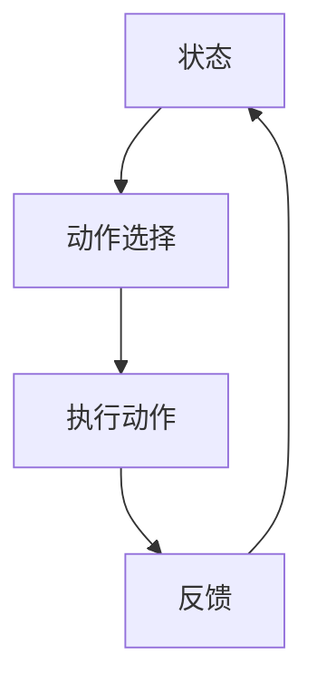
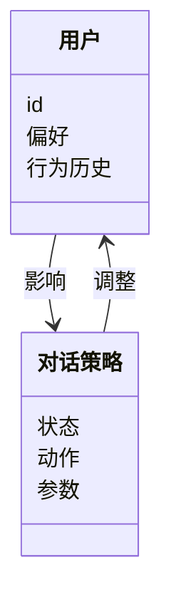
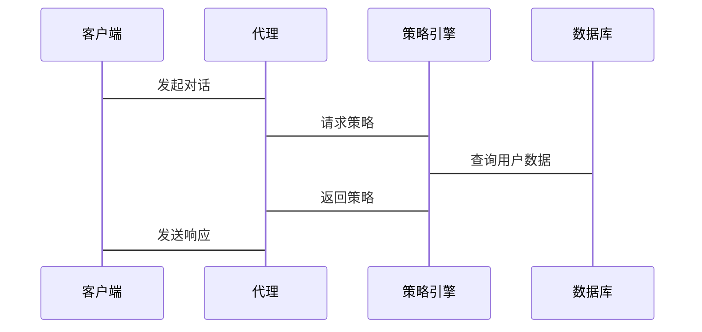

                 


# AI Agent的对话策略优化与个性化

> 关键词：AI Agent, 对话策略优化, 对话个性化, 强化学习, 生成式模型, 自然语言处理

> 摘要：本文详细探讨了AI Agent在对话系统中的策略优化与个性化实现，从问题背景、核心概念、算法原理、系统架构到项目实战，全面分析了如何提升对话系统的智能化和用户体验。

---

# 第一部分: AI Agent的对话策略优化与个性化基础

## 第1章: 背景介绍

### 1.1 问题背景

#### 1.1.1 对话系统的发展历程
对话系统从早期的基于规则的系统，逐步发展为统计学习、深度学习驱动的生成式模型。随着AI Agent的兴起，对话系统需要更智能、更个性化的交互能力。

#### 1.1.2 当前对话系统的主要挑战
- **理解能力不足**：难以准确理解用户意图，尤其在复杂场景下。
- **对话策略单一**：缺乏灵活性，无法根据上下文动态调整。
- **个性化不足**：用户需求多样，但系统难以提供个性化服务。

#### 1.1.3 AI Agent在对话系统中的角色
AI Agent作为对话的核心驱动者，负责理解用户需求、生成响应、维护对话上下文，并根据用户反馈动态调整策略。

### 1.2 问题描述

#### 1.2.1 对话策略优化的核心问题
- 如何根据对话历史和用户反馈，优化对话策略，提升对话流畅性。
- 如何在多目标优化中找到平衡点，兼顾用户体验和系统目标。

#### 1.2.2 对话个性化的需求分析
- 用户期望对话系统能够理解其个人偏好和行为模式。
- 系统需要根据用户特征动态调整对话策略。

#### 1.2.3 问题解决的必要性与可行性
- 必要性：提升用户体验，增强系统智能化。
- 可行性：基于深度学习和强化学习的技术进步，对话策略优化和个性化实现成为可能。

### 1.3 问题解决

#### 1.3.1 对话策略优化的实现路径
- 基于强化学习的策略优化。
- 基于生成式模型的策略生成。
- 多目标学习框架的引入。

#### 1.3.2 对话个性化的技术手段
- 用户建模与偏好分析。
- 动态策略调整。
- 个性化内容生成。

### 1.4 边界与外延

#### 1.4.1 对话策略优化的适用范围
- 适用于需要动态调整的对话场景。
- 适用于用户需求多样化的领域。

#### 1.4.2 对话个性化的边界条件
- 需要足够多的用户数据支持。
- 对话系统需具备一定的上下文理解和生成能力。

#### 1.4.3 相关领域的关联与区别
- 关联：自然语言处理、强化学习。
- 区别：对话策略优化更注重系统行为的优化，而个性化更注重用户体验的定制。

### 1.5 核心概念与联系

#### 1.5.1 对话策略优化的核心原理
对话策略优化通过强化学习等方法，根据对话历史和用户反馈，不断调整策略参数，以实现更优的对话效果。

#### 1.5.2 对话个性化的主要特征
个性化对话系统能够根据用户特征和行为模式，动态调整对话内容和策略，提供更贴合用户需求的服务。

#### 1.5.3 ER实体关系图
```mermaid
er
    A:对话策略
    B:对话内容
    C:用户需求
    D:个性化参数
    A --> B: 包含
    B --> C: 响应
    C --> D: 影响
    D --> A: 调整
```

---

# 第二部分: 对话策略优化的算法原理

## 第2章: 对话策略优化的核心算法

### 2.1 算法原理

#### 2.1.1 基于强化学习的对话策略优化
- **原理**：通过与环境交互，学习最优策略。
- **方法**：使用策略梯度法或Q-learning等算法，优化策略参数。

#### 2.1.2 基于生成式模型的对话策略优化
- **原理**：利用生成式模型生成多样化的对话内容，通过反馈机制优化策略。
- **方法**：结合GPT等生成模型，设计策略优化模块。

#### 2.1.3 对比学习在对话策略优化中的应用
- **原理**：通过对比不同策略的效果，选择最优策略。
- **方法**：设计对比损失函数，优化策略参数。

### 2.2 算法流程

#### 2.2.1 强化学习对话策略优化流程图


### 2.3 算法实现

#### 2.3.1 Python源代码实现
```python
def optimize_dialogue_policy(state, actions):
    # 状态转换
    next_state = transition(state, actions)
    # 反馈计算
    reward = calculate_reward(state, actions, next_state)
    # 策略更新
    update_policy(reward)
    return best_action
```

#### 2.3.2 对话策略优化的数学模型
对话策略优化可以表示为一个马尔可夫决策过程（MDP），定义如下：
$$
MDP = \langle S, A, P, R, \gamma \rangle
$$
其中：
- \( S \) 是状态空间。
- \( A \) 是动作空间。
- \( P(s'|s,a) \) 是从状态 \( s \) 执行动作 \( a \) 后到达状态 \( s' \) 的概率。
- \( R(s,a,s') \) 是在状态 \( s \) 执行动作 \( a \) 后到达状态 \( s' \) 的奖励。
- \( \gamma \) 是折扣因子。

### 2.4 对话策略优化的数学公式
强化学习的目标是最大化累积奖励，可以用以下公式表示：
$$
J(\theta) = \mathbb{E}_{\tau}[ \sum_{t=0}^{\infty} \gamma^t r_t ]
$$
其中：
- \( \tau \) 是一条轨迹。
- \( \theta \) 是策略参数。

---

# 第三部分: 对话个性化的实现方案

## 第3章: 对话个性化的系统架构设计

### 3.1 问题场景

#### 3.1.1 个性化对话的典型场景
- 电商客服：根据用户购买历史推荐产品。
- 健康咨询：根据用户健康数据提供建议。

#### 3.1.2 个性化对话的核心要素
- 用户建模：收集和分析用户数据。
- 动态调整：根据用户反馈实时调整对话策略。

### 3.2 系统功能设计

#### 3.2.1 领域模型设计


#### 3.2.2 系统架构设计


#### 3.2.3 系统交互设计


### 3.3 接口设计

#### 3.3.1 系统接口
- `/api/v1/dialogue`：处理对话请求。
- `/api/v1/preferences`：管理用户偏好。

#### 3.3.2 交互协议
- 使用HTTP协议进行通信。
- 支持JSON格式的数据交换。

---

# 第四部分: 项目实战

## 第4章: 个性化对话系统实现

### 4.1 环境安装

#### 4.1.1 安装Python环境
```bash
python -m pip install --upgrade pip
pip install -r requirements.txt
```

#### 4.1.2 安装依赖
```bash
pip install transformers
pip install torch
pip install matplotlib
```

### 4.2 核心代码实现

#### 4.2.1 用户建模
```python
class User:
    def __init__(self, id):
        self.id = id
        self.preferences = {}
        self.behavior_history = []
```

#### 4.2.2 对话策略引擎
```python
class DialoguePolicy:
    def __init__(self, model):
        self.model = model
        self.params = {}

    def get_action(self, state):
        # 根据状态生成动作
        pass
```

#### 4.2.3 个性化模块
```python
class Personalizer:
    def __init__(self, user, policy):
        self.user = user
        self.policy = policy

    def personalize_response(self, response):
        # 根据用户特征调整响应
        pass
```

### 4.3 代码解读与分析

#### 4.3.1 用户建模模块
- `User` 类封装了用户的ID、偏好和行为历史。
- `preferences` 字典存储用户的个性化参数。
- `behavior_history` 列表记录用户的对话历史。

#### 4.3.2 对话策略引擎
- `DialoguePolicy` 类依赖一个预训练的模型，根据当前状态生成动作。
- `get_action` 方法实现策略选择逻辑。

#### 4.3.3 个性化模块
- `Personalizer` 类负责根据用户特征调整对话响应。
- `personalize_response` 方法实现个性化处理。

### 4.4 实际案例分析

#### 4.4.1 案例介绍
假设一个用户在电商平台上咨询商品信息，系统根据用户的购买历史推荐相关产品。

#### 4.4.2 对话过程
1. 用户询问“有什么红色连衣裙吗？”
2. 系统返回多款红色连衣裙。
3. 用户选择其中一款，询问库存情况。
4. 系统根据库存数据实时更新响应。

### 4.5 项目小结

#### 4.5.1 核心代码实现
- 用户建模、对话策略引擎和个性化模块的实现。
- 系统架构设计和接口设计的具体实现。

#### 4.5.2 实战经验总结
- 数据是个性化对话的基础，需要收集和分析用户特征。
- 策略优化需要结合实际场景，动态调整参数。
- 系统设计需要考虑可扩展性和可维护性。

---

# 第五部分: 最佳实践与总结

## 第5章: 最佳实践

### 5.1 实践经验

#### 5.1.1 数据收集与处理
- 收集足够的用户数据，包括用户特征和行为数据。
- 使用数据清洗和特征工程提升模型性能。

#### 5.1.2 模型优化
- 选择合适的模型架构，如Transformer或GPT。
- 调参和超参数优化。

#### 5.1.3 系统测试与优化
- 进行单元测试和集成测试。
- 使用A/B测试评估策略效果。

### 5.2 小结

#### 5.2.1 核心内容回顾
- 对话策略优化的核心算法。
- 对话个性化实现的关键技术。
- 项目实战的经验总结。

### 5.3 注意事项

#### 5.3.1 数据隐私
- 遵守数据隐私法规，保护用户隐私。
- 加密敏感数据。

#### 5.3.2 系统性能
- 确保系统在高并发下的性能。
- 使用缓存和负载均衡技术。

#### 5.3.3 用户体验
- 提供流畅的对话体验。
- 处理用户反馈，持续优化系统。

### 5.4 拓展阅读

#### 5.4.1 推荐书籍
- 《对话系统实践》
- 《强化学习实战》

#### 5.4.2 技术博客
- [Towards Data Science](https://towardsdatascience.com)
- [Medium: AI](https://medium.com/ai)

---

# 作者信息

作者：AI天才研究院/AI Genius Institute & 禅与计算机程序设计艺术/Zen And The Art of Computer Programming

---

通过以上详细的内容安排，您可以根据实际需求扩展每个部分的具体内容，撰写一篇完整且有深度的博客文章。

