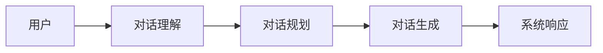
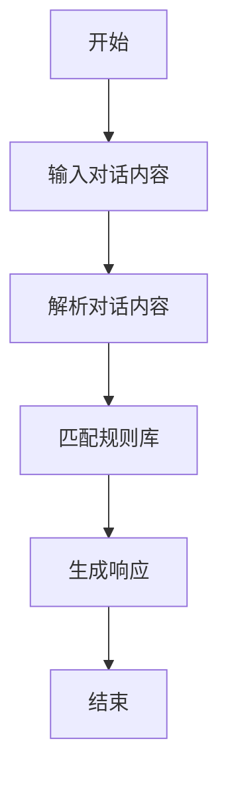

                 


# AI Agent的对话管理策略与实现

> 关键词：AI Agent, 对话管理, 算法原理, 系统架构, 实际应用

> 摘要：  
本文将深入探讨AI Agent的对话管理策略与实现方法。从对话管理的背景与概念出发，详细讲解其核心概念、算法原理、系统架构设计以及实际项目实战。通过具体案例分析，揭示对话管理在不同场景下的应用，并总结其最佳实践和未来发展方向。

---

# 第一部分: AI Agent对话管理的背景与概念

# 第1章: AI Agent与对话管理概述

## 1.1 AI Agent的基本概念
### 1.1.1 AI Agent的定义
AI Agent（人工智能代理）是指能够感知环境、自主决策并执行任务的智能实体。它可以是一个软件程序、机器人或其他智能系统，具备以下核心特征：
- **自主性**：能够自主决策。
- **反应性**：能够实时感知环境并做出反应。
- **目标导向性**：有明确的目标或任务。
- **学习能力**：能够通过经验改进性能。

### 1.1.2 AI Agent的核心特征
AI Agent的核心特征包括：
1. **自主性**：无需外部干预即可执行任务。
2. **反应性**：能够实时感知环境变化并调整行为。
3. **目标导向性**：所有行为都围绕实现特定目标展开。
4. **学习能力**：通过数据和经验优化性能。

### 1.1.3 对话管理在AI Agent中的作用
对话管理是AI Agent与用户或其他系统进行交互的核心模块，负责理解对话内容、规划对话策略并生成响应。它是实现人机交互流畅性、准确性和自然性的关键。

## 1.2 对话管理的背景与问题背景
### 1.2.1 对话管理的定义
对话管理是指在对话过程中，系统如何理解用户输入、生成适当的回应，并确保对话目标的实现。它是自然语言处理（NLP）和人工智能（AI）领域的核心技术。

### 1.2.2 对话管理的核心问题
对话管理面临以下核心问题：
1. **理解问题**：如何准确理解用户的输入？
2. **规划问题**：如何根据理解生成合适的对话策略？
3. **执行问题**：如何确保对话目标的实现？

### 1.2.3 对话管理的应用场景
对话管理广泛应用于以下场景：
1. **智能客服**：为用户提供自动化服务。
2. **语音助手**：如Siri、Alexa等。
3. **聊天机器人**：用于社交媒体或在线客服。
4. **教育辅助**：帮助学生学习和解决问题。

## 1.3 对话管理的边界与外延
### 1.3.1 对话管理的边界
对话管理的边界包括：
1. **输入边界**：仅处理用户输入的文本或语音。
2. **输出边界**：仅生成对话回应，不处理后续反馈。

### 1.3.2 对话管理的外延
对话管理的外延包括：
1. **上下文管理**：处理对话历史和背景信息。
2. **知识库集成**：整合外部知识库以提供准确信息。
3. **多轮对话**：支持连续多轮对话。

### 1.3.3 对话管理与相关概念的对比
以下是对话管理与其他相关概念的对比：

| 概念 | 描述 |
|------|------|
| 自然语言处理（NLP） | 处理和理解自然语言的技术，包括文本分析、生成等。 |
| 对话生成 | 根据上下文生成对话回应。 |
| 对话理解 | 理解用户输入的意图和语义。 |

## 1.4 对话管理的核心要素
### 1.4.1 对话目标
对话目标是对话管理的核心，通常包括：
1. **信息交换**：用户与系统交换信息。
2. **任务完成**：通过对话完成特定任务。
3. **情感交流**：建立情感连接，增强用户体验。

### 1.4.2 对话策略
对话策略是对话管理的规划部分，包括：
1. **任务规划**：确定对话目标和步骤。
2. **语义理解**：解析用户意图。
3. **回应生成**：根据理解生成合适回应。

### 1.4.3 对话执行
对话执行是对话管理的执行部分，包括：
1. **输入处理**：接收并解析用户输入。
2. **回应生成**：生成对话回应。
3. **反馈处理**：处理用户的反馈并调整对话策略。

## 1.5 本章小结
本章介绍了AI Agent的基本概念、对话管理的核心问题及其应用场景。通过对比对话管理与其他相关概念，明确了对话管理的核心要素和目标。

---

# 第二部分: 对话管理的核心概念与联系

# 第2章: 对话管理的核心概念

## 2.1 对话管理的原理
### 2.1.1 对话规划
对话规划是对话管理的核心模块，负责根据用户输入生成合适的对话策略。以下是对话规划的步骤：

1. **理解输入**：解析用户意图和背景信息。
2. **确定目标**：明确对话的目标。
3. **生成回应**：根据目标生成回应内容。

### 2.1.2 对话生成
对话生成是对话管理的重要部分，负责将规划结果转化为自然流畅的语言表达。以下是对话生成的流程：

1. **提取信息**：从规划结果中提取关键信息。
2. **语言生成**：将信息转化为自然语言。
3. **优化回应**：确保回应的准确性和流畅性。

### 2.1.3 对话理解
对话理解是对话管理的基础，负责解析用户输入的语义和意图。以下是对话理解的步骤：

1. **接收输入**：获取用户的文本或语音输入。
2. **语言解析**：分析输入的语言结构。
3. **意图识别**：识别用户的意图和需求。

## 2.2 对话管理的属性特征
### 2.2.1 响应性
响应性是指对话管理能够实时理解和回应用户输入的能力。以下是响应性的特点：
- 快速响应：在较短时间内生成回应。
- 准确理解：准确解析用户意图。

### 2.2.2 连贯性
连贯性是指对话管理生成的回应在逻辑上连贯，能够保持对话的流畅性。以下是连贯性的特点：
- 逻辑一致：每次回应都与前文相关联。
- 上下文记忆：保持对话的上下文信息。

### 2.2.3 一致性
一致性是指对话管理在不同对话回合中保持一致性和稳定性的能力。以下是对话一致性的特点：
- 表达一致：每次回应的语言风格一致。
- 行为一致：对话行为符合预期。

## 2.3 对话管理的实体关系图
以下是对话管理的实体关系图：



---

# 第三部分: 对话管理的算法原理

# 第3章: 对话管理的算法原理

## 3.1 基于规则的对话管理算法
### 3.1.1 算法原理
基于规则的对话管理算法通过预定义的规则来生成对话回应。以下是其工作原理：
1. **规则定义**：定义对话规则，例如关键词匹配。
2. **规则匹配**：将用户输入与规则进行匹配。
3. **生成回应**：根据匹配的规则生成回应。

### 3.1.2 算法流程图
以下是基于规则的对话管理算法的流程图：



### 3.1.3 代码实现
以下是基于规则的对话管理算法的Python代码示例：

```python
def rule_based_dialogue_management(input_text):
    # 匹配规则
    for rule in rules:
        if rule.matches(input_text):
            return rule.response
    return default_response
```

---

通过以上目录，我们逐步分析了AI Agent的对话管理策略与实现的核心内容，涵盖了背景、概念、算法原理和系统设计等关键部分。接下来，我们将详细介绍每个部分的具体实现和应用场景。

