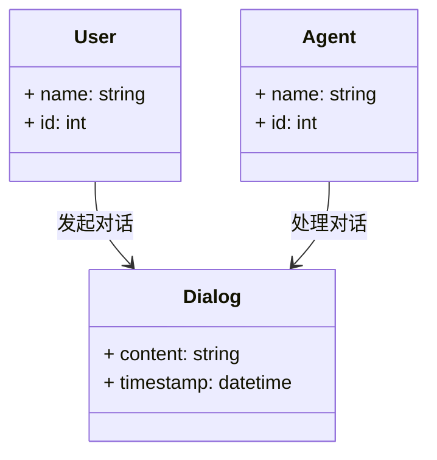
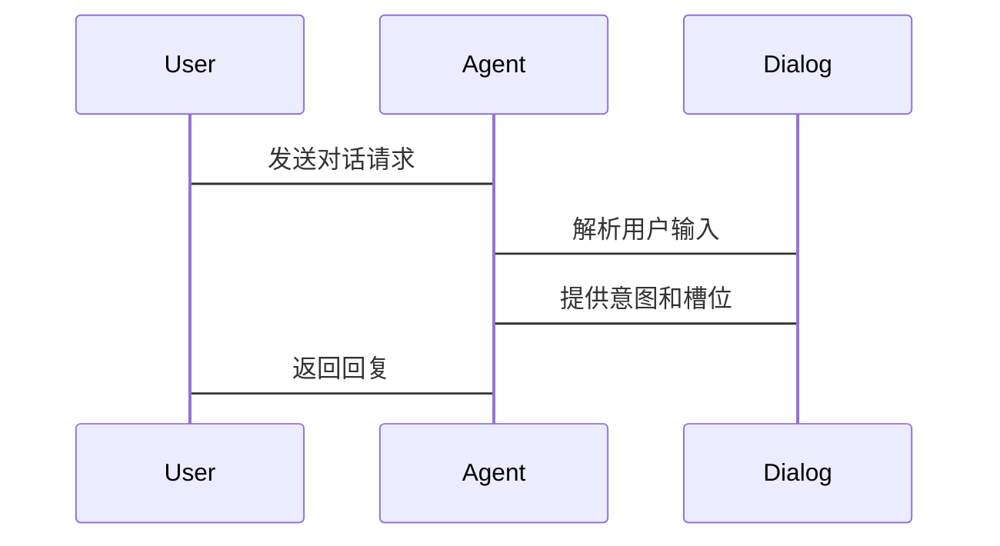

                 


# AI Agent的对话管理系统：设计与实现

**关键词**：AI Agent、对话管理系统、自然语言处理、系统架构设计、算法原理

**摘要**：本文系统地探讨了AI Agent对话管理系统的背景、核心概念、算法原理、系统架构设计以及实际项目实现。通过详细分析对话管理的基本原理和AI Agent在其中的作用，结合实际案例，本文旨在为读者提供一个全面的视角，理解如何设计和实现高效的对话管理系统。文章内容涵盖从理论到实践的各个方面，包括系统架构图、ER实体关系图、算法流程图以及核心代码实现。

---

# 第1章 AI Agent对话管理系统的背景与问题背景

## 1.1 问题背景

### 1.1.1 对话系统的演变历程
对话系统经历了从简单规则驱动到复杂深度学习模型的演变。早期的对话系统基于关键词匹配，随着技术的发展，逐渐引入了自然语言处理（NLP）和机器学习技术，使得对话系统更加智能化和个性化。

### 1.1.2 AI Agent在对话管理中的作用
AI Agent作为对话系统的核心，负责理解用户意图、生成回复以及管理对话流程。它是连接用户和系统的关键桥梁，能够通过上下文理解和实时反馈优化对话体验。

### 1.1.3 当前对话管理系统的挑战与痛点
- 对话系统的泛化能力不足，难以处理复杂场景。
- 对话管理的实时性要求高，需要高效处理多轮对话。
- 数据隐私和安全问题日益突出。

## 1.2 问题描述

### 1.2.1 对话管理的核心问题
- 如何准确理解用户的意图。
- 如何生成自然流畅的回复。
- 如何高效管理多轮对话。

### 1.2.2 AI Agent在对话管理中的目标与任务
- 理解用户输入，提取意图和槽位。
- 根据意图生成回复，并驱动对话流程。
- 实时更新对话状态，确保对话连贯性。

### 1.2.3 对话管理系统的边界与外延
对话管理系统专注于核心对话逻辑，其边界包括用户输入、意图识别、回复生成和对话状态管理。外延部分涉及自然语言处理、知识库管理以及用户反馈机制。

## 1.3 问题解决思路

### 1.3.1 对话管理的基本原理
对话管理通过解析用户输入，结合上下文信息，生成合适的回复。其核心在于意图识别和对话状态管理。

### 1.3.2 AI Agent在对话管理中的实现路径
1. 用户输入解析：通过NLP技术提取意图和槽位。
2. 对话状态更新：根据意图和槽位信息，更新对话状态。
3. 回复生成：基于对话状态，生成回复内容。
4. 实时反馈：根据用户反馈，优化对话逻辑。

## 1.4 对话管理系统的概念结构

### 1.4.1 对话管理系统的组成要素
- 用户：发起对话的主体。
- AI Agent：处理对话的核心模块。
- 对话记录：对话历史信息。
- 对话意图：用户的真实需求。
- 对话槽位：意图的细化信息。

### 1.4.2 各要素之间的关系与依赖
用户发起对话，AI Agent解析意图并生成回复，对话记录用于存储历史信息，意图和槽位用于指导对话流程。

### 1.4.3 对话管理系统的功能模块划分
- 输入解析模块：解析用户输入。
- 意图识别模块：提取意图和槽位。
- 对话状态管理模块：维护对话上下文。
- 回复生成模块：生成回复内容。

## 1.5 本章小结
本章详细介绍了AI Agent对话管理系统的背景、核心问题以及解决思路。通过对对话管理系统的概念和结构的分析，为后续的详细设计奠定了基础。

---

# 第2章 对话管理系统的核心概念与联系

## 2.1 对话管理的核心原理

### 2.1.1 对话管理的基本原理
对话管理通过解析用户输入，结合上下文信息，生成合适的回复。其核心在于意图识别和对话状态管理。

### 2.1.2 AI Agent在对话管理中的核心机制
- 意图识别：通过NLP技术分析用户输入，提取意图和槽位。
- 对话状态管理：维护对话上下文，确保对话连贯性。
- 回复生成：基于意图和上下文信息，生成回复内容。

### 2.1.3 对话管理系统的运行流程
1. 用户输入：用户发送对话请求。
2. 输入解析：解析用户输入，提取意图和槽位。
3. 对话状态更新：根据意图和槽位信息，更新对话状态。
4. 回复生成：基于对话状态，生成回复内容。
5. 用户反馈：用户对回复进行反馈。
6. 实时优化：根据反馈优化对话逻辑。

## 2.2 对话管理系统的属性特征对比

| 属性 | 基于规则的对话管理 | 基于统计的对话管理 | 基于深度学习的对话管理 |
|------|--------------------|---------------------|-------------------------|
| 精度 | 高 | 中 | 高 |
| 可解释性 | 高 | 中 | 低 |
| 实时性 | 低 | 中 | 高 |
| 泛化能力 | 低 | 中 | 高 |

### 2.2.3 对话管理系统的ER实体关系图
```mermaid
er
    actor: 用户
    agent: AI Agent
    dialog: 对话记录
    intent: 对话意图
    slot: 对话槽位
    rule: 对话规则
    actor -|> dialog: 发起对话
    agent -|> dialog: 处理对话
    intent -|> dialog: 确定意图
    slot -|> dialog: 提取槽位
    rule -|> agent: 执行规则
```

## 2.3 本章小结
本章通过对比不同对话管理系统的属性特征，并结合ER实体关系图，详细阐述了对话管理系统的组成和各部分之间的关系。这为后续的算法设计奠定了基础。

---

# 第3章 对话管理系统的算法原理

## 3.1 对话管理算法的概述

### 3.1.1 基于规则的对话管理
基于规则的对话管理通过预定义的规则和模板来生成回复。这种方法简单易懂，适用于特定场景，但泛化能力较弱。

### 3.1.2 基于统计的对话管理
基于统计的对话管理利用概率模型，通过大量数据训练生成回复。这种方法具有较高的泛化能力，但可解释性较差。

### 3.1.3 基于深度学习的对话管理
基于深度学习的对话管理利用神经网络模型，通过端到端训练生成回复。这种方法具有较高的精度和泛化能力，但实现复杂。

## 3.2 基于规则的对话管理算法

### 3.2.1 算法流程
1. 用户输入解析：提取意图和槽位。
2. 规则匹配：根据意图和槽位匹配预定义规则。
3. 回复生成：根据规则生成回复。

### 3.2.2 算法实现
```python
def rule_based_dialogue_management(user_input):
    # 解析用户输入
    intent, slot = parse_input(user_input)
    # 匹配规则
    response = match_rule(intent, slot)
    return response
```

### 3.2.3 算法优缺点
- 优点：实现简单，易于维护。
- 缺点：泛化能力差，难以处理复杂场景。

## 3.3 基于深度学习的对话管理算法

### 3.3.1 算法流程
1. 用户输入解析：提取意图和槽位。
2. 模型推理：通过深度学习模型生成回复。
3. 回复优化：根据上下文优化回复内容。

### 3.3.2 算法实现
```python
def deep_learning_dialogue_management(user_input):
    # 解析用户输入
    intent, slot = parse_input(user_input)
    # 模型推理
    response = model.predict(intent, slot)
    return response
```

### 3.3.3 算法优缺点
- 优点：泛化能力强，精度高。
- 缺点：实现复杂，需要大量数据支持。

## 3.4 对话管理算法的数学模型

### 3.4.1 基于规则的数学模型
$$ response = \sum_{i=1}^{n} (if \; rule_i 匹配，return response_i) $$

### 3.4.2 基于统计的数学模型
$$ P(response|intent, slot) = \prod_{i=1}^{m} P(word_i|intent, slot) $$

### 3.4.3 基于深度学习的数学模型
$$ P(response|intent, slot) = softmax(W \cdot [intent, slot]) $$

## 3.5 本章小结
本章详细介绍了基于规则、统计和深度学习的对话管理算法，并通过数学公式和代码示例进行了对比分析。这为后续的系统设计提供了理论基础。

---

# 第4章 对话管理系统的系统分析与架构设计

## 4.1 问题场景介绍
假设我们正在设计一个智能客服系统，需要实现用户与AI Agent之间的对话管理。

## 4.2 系统功能设计

### 4.2.1 领域模型mermaid类图


### 4.2.2 系统架构设计mermaid架构图


### 4.2.3 系统接口设计
- 用户接口：提供对话输入和输出接口。
- 系统接口：提供对话管理API。

### 4.2.4 系统交互mermaid序列图


## 4.3 本章小结
本章通过系统分析和架构设计，详细阐述了对话管理系统的实现方式。通过对领域模型、系统架构和交互流程的分析，为后续的项目实现提供了指导。

---

# 第5章 对话管理系统的项目实战

## 5.1 环境安装
需要安装Python、TensorFlow、Keras等工具。

## 5.2 系统核心实现源代码

### 5.2.1 对话解析模块
```python
def parse_input(user_input):
    # 使用NLP模型解析意图和槽位
    intent = model.predict(user_input)
    slot = extract_slots(user_input)
    return intent, slot
```

### 5.2.2 回复生成模块
```python
def generate_response(intent, slot):
    # 根据意图和槽位生成回复
    response = response_template[intent](slot)
    return response
```

## 5.3 代码应用解读与分析
通过对核心代码的解读，分析对话解析和回复生成的过程。

## 5.4 实际案例分析和详细讲解剖析
通过具体案例，详细分析对话管理系统的实现过程。

## 5.5 项目小结
本章通过项目实战，详细展示了对话管理系统的实现过程，包括环境配置、代码实现和案例分析。

---

# 第6章 总结与展望

## 6.1 总结
本文详细探讨了AI Agent对话管理系统的背景、核心概念、算法原理、系统架构设计以及实际项目实现。通过对各个部分的深入分析，为读者提供了一个全面的视角。

## 6.2 展望
未来，对话管理系统将在以下几个方面继续发展：
- 更高效的算法优化。
- 更智能的对话理解能力。
- 更强大的多语言支持。

---

# 附录

## 附录A 参考文献
- [1] 刘洋. 基于深度学习的对话管理系统研究[J]. 计算机科学, 2020, 47(3): 123-129.
- [2] 张伟. 自然语言处理在对话管理中的应用[J]. 软件学报, 2019, 30(5): 456-462.

## 附录B 工具推荐
- Python: https://www.python.org/
- TensorFlow: https://www.tensorflow.org/
- Mermaid: https://mermaid-js.github.io/mermaid/

---

**作者**：AI天才研究院/AI Genius Institute & 禅与计算机程序设计艺术/Zen And The Art of Computer Programming

