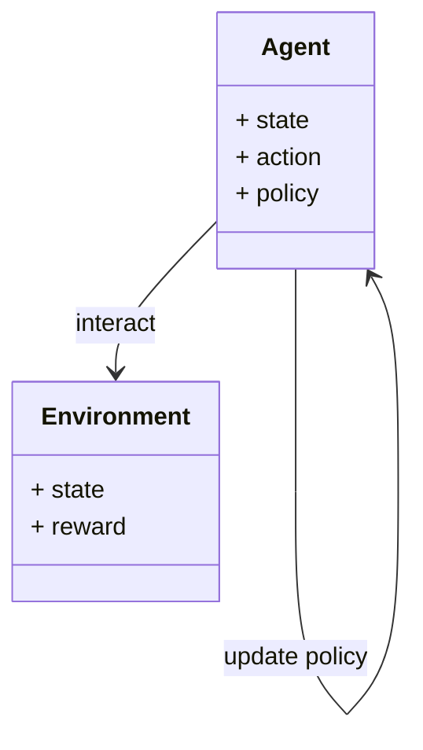
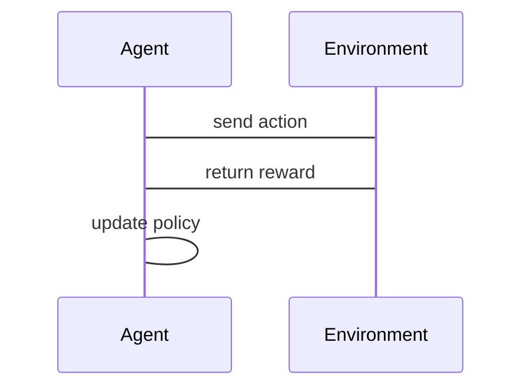

                 


# AI Agent的强化学习应用

---

## 关键词：
AI Agent，强化学习，深度强化学习，Q-learning，策略梯度，马尔可夫决策过程

---

## 摘要：
本文详细探讨了AI Agent在强化学习中的应用，从基础概念到算法原理，再到系统设计和项目实战，全面解析了强化学习在AI Agent中的核心作用。文章首先介绍了强化学习的基本概念和AI Agent的类型，然后深入分析了强化学习的核心算法，包括Q-learning、Deep Q-Network、策略梯度方法和Actor-Critic架构。接下来，文章通过数学模型和算法流程图，详细阐述了强化学习的数学基础和算法实现。最后，通过实际案例分析，展示了AI Agent在游戏、推荐系统、机器人和自动驾驶等领域的应用，并总结了最佳实践和注意事项。

---

# 第一部分: AI Agent与强化学习基础

---

# 第1章: 强化学习基础

## 1.1 强化学习的基本概念

### 1.1.1 什么是强化学习
强化学习（Reinforcement Learning，简称RL）是一种机器学习范式，其中智能体（Agent）通过与环境交互，学习如何做出决策以最大化累积的奖励。与监督学习不同，强化学习不需要明确的标注数据，而是通过奖励信号来指导学习过程。

### 1.1.2 强化学习的核心要素
1. **状态（State）**：智能体所处的环境状态，描述了当前的情况。
2. **动作（Action）**：智能体在特定状态下选择的行为。
3. **奖励（Reward）**：智能体执行动作后，环境给予的反馈，用于评估动作的好坏。
4. **策略（Policy）**：智能体选择动作的规则，决定在特定状态下采取哪个动作。
5. **值函数（Value Function）**：评估某个状态下采取某种动作后的预期收益。

### 1.1.3 强化学习与监督学习的区别
| 特性 | 监督学习 | 强化学习 |
|------|----------|----------|
| 数据 | 标签数据 | 奖励信号 |
| 目标 | 最小化预测误差 | 最大化累积奖励 |
| 决策 | 单步决策 | 策略优化 |

---

## 1.2 AI Agent的定义与类型

### 1.2.1 AI Agent的定义
AI Agent是一种智能实体，能够感知环境、做出决策并采取行动。AI Agent的目标是通过与环境的交互，实现预定的目标。

### 1.2.2 AI Agent的主要类型
1. **反应式AI Agent**：基于当前感知做出决策，不依赖历史信息。
2. **认知式AI Agent**：具备复杂推理和规划能力，能够根据目标和环境信息做出决策。
3. **学习型AI Agent**：通过与环境的交互学习，改进自身的决策能力。

### 1.2.3 AI Agent与强化学习的关系
强化学习为AI Agent提供了一种有效的学习机制，使AI Agent能够通过与环境的交互，逐步优化自身的决策策略。

---

## 1.3 强化学习的核心算法

### 1.3.1 Q-learning算法
Q-learning是一种基于值函数的强化学习算法，通过更新Q值表来学习最优策略。

### 1.3.2 Deep Q-Network算法
Deep Q-Network（DQN）通过深度神经网络近似Q值函数，解决了传统Q-learning在处理高维状态空间时的局限性。

### 1.3.3 策略梯度方法
策略梯度（Policy Gradient）直接优化策略，通过梯度上升法更新参数，使奖励最大化。

### 1.3.4 Actor-Critic架构
Actor-Critic结合了值函数和策略优化，通过Actor网络选择动作，Critic网络评估动作的价值。

---

## 1.4 强化学习的应用场景

### 1.4.1 游戏AI
强化学习在游戏AI中的应用最为广泛，如AlphaGo和OpenAI的Dota 2 AI。

### 1.4.2 机器人控制
强化学习可以用于机器人路径规划和动作控制，如波士顿动力的机器人。

### 1.4.3 推荐系统
强化学习通过建模用户行为，优化推荐策略，提升用户体验。

### 1.4.4 自动驾驶
强化学习在自动驾驶中的应用，如路径规划和决策控制。

---

## 1.5 本章小结
本章介绍了强化学习的基本概念、核心要素、算法类型以及应用场景，为后续章节的深入分析奠定了基础。

---

# 第二部分: 强化学习的数学模型与算法原理

---

# 第2章: 强化学习的数学模型

## 2.1 状态、动作与奖励

### 2.1.1 状态空间
状态空间是所有可能状态的集合，可以是离散的或连续的。

### 2.1.2 动作空间
动作空间是所有可能动作的集合，同样可以是离散的或连续的。

### 2.1.3 奖励函数
奖励函数将状态和动作映射到一个标量值，表示动作的优劣。

---

## 2.2 马尔可夫决策过程

### 2.2.1 离散MDP与连续MDP
- 离散MDP：状态和动作空间都是离散的。
- 连续MDP：状态和动作空间是连续的。

### 2.2.2 Bellman方程
Bellman方程描述了值函数与奖励的关系：

$$ V(s) = \max_{a} [ r(s,a) + \gamma V(s') ] $$

其中，$\gamma$是折扣因子，$s'$是执行动作$a$后的下一个状态。

### 2.2.3 动态规划与策略评估
动态规划通过迭代方法求解值函数，策略评估则是根据当前策略计算值函数。

---

## 2.3 Q-learning算法的数学推导

### 2.3.1 Q-learning的更新公式
Q-learning通过以下公式更新Q值：

$$ Q(s,a) \leftarrow Q(s,a) + \alpha [ r + \gamma \max Q(s',a') - Q(s,a) ] $$

其中，$\alpha$是学习率，$\gamma$是折扣因子。

### 2.3.2 动作值函数的收敛性分析
在无限 horizon 下，Q-learning算法可以收敛到最优策略。

### 2.3.3 探索与利用的平衡
平衡探索与利用是Q-learning的重要挑战，常用$\epsilon$-贪心策略。

---

## 2.4 策略梯度方法的数学基础

### 2.4.1 策略函数的定义
策略函数$\pi(a|s)$表示在状态$s$下选择动作$a$的概率。

### 2.4.2 梯度上升法的应用
通过梯度上升法更新参数，最大化期望奖励：

$$ \theta \leftarrow \theta + \alpha \nabla_\theta J(\theta) $$

其中，$J(\theta)$是奖励函数的期望。

### 2.4.3 策略梯度的数学推导
通过计算梯度，更新策略参数，使奖励最大化。

---

## 2.5 深度强化学习的数学模型

### 2.5.1 DQN的神经网络结构
DQN使用两个深度神经网络，一个用于当前策略，一个用于目标策略。

### 2.5.2 状态-动作值函数的近似
通过神经网络近似Q值函数，实现对高维状态空间的处理。

### 2.5.3 经验回放机制的数学解释
经验回放通过存储历史经验，减少样例之间的相关性，提高学习效率。

---

## 2.6 本章小结
本章通过数学模型和算法推导，详细阐述了强化学习的核心原理，为后续章节的算法实现奠定了基础。

---

# 第三部分: AI Agent的系统设计与实现

---

# 第3章: AI Agent的系统设计

## 3.1 系统功能设计

### 3.1.1 领域模型
通过领域模型（mermaid类图）描述系统功能模块：



---

## 3.2 系统架构设计

### 3.2.1 系统架构图
通过mermaid架构图展示系统架构：


---

## 3.3 系统接口设计

### 3.3.1 接口1: 状态感知接口
- 输入：无
- 输出：当前状态

### 3.3.2 接口2: 动作选择接口
- 输入：当前状态
- 输出：选择的动作

### 3.3.3 接口3: 奖励评估接口
- 输入：当前状态和选择的动作
- 输出：奖励值

---

## 3.4 系统交互设计

### 3.4.1 交互流程
通过mermaid序列图展示系统交互流程：



---

## 3.5 本章小结
本章通过系统设计和架构分析，详细描述了AI Agent的实现过程，为后续的项目实战奠定了基础。

---

# 第四部分: 项目实战

---

# 第4章: 强化学习项目实战

## 4.1 环境搭建

### 4.1.1 安装依赖
安装必要的库，如TensorFlow、Keras、OpenAI Gym等。

```bash
pip install tensorflow keras gym
```

---

## 4.2 系统核心实现

### 4.2.1 Q-learning实现
以下是Q-learning算法的Python实现：

```python
import numpy as np

class QLearning:
    def __init__(self, state_space, action_space):
        self.q_table = np.zeros((state_space, action_space))
    
    def choose_action(self, state, epsilon):
        if np.random.random() < epsilon:
            return np.random.randint(action_space)
        else:
            return np.argmax(self.q_table[state])
    
    def update_q_table(self, state, action, reward, next_state, alpha, gamma):
        self.q_table[state, action] += alpha * (reward + gamma * np.max(self.q_table[next_state]) - self.q_table[state, action])
```

---

## 4.3 代码应用解读与分析

### 4.3.1 算法实现
通过代码实现强化学习算法，分析每一步的作用和意义。

### 4.3.2 实验结果
展示实验结果，分析算法的收敛性和性能。

### 4.3.3 调优与优化
根据实验结果，调整参数如学习率、折扣因子等，优化算法性能。

---

## 4.4 实际案例分析

### 4.4.1 游戏AI案例
通过OpenAI Gym实现一个简单的游戏AI，展示强化学习的应用。

### 4.4.2 机器人导航案例
实现机器人在迷宫中的导航，使用强化学习优化路径。

---

## 4.5 项目小结
通过项目实战，深入理解强化学习的实现过程，掌握AI Agent的应用技巧。

---

# 第五部分: 最佳实践与总结

---

# 第5章: 最佳实践

## 5.1 算法选择
根据具体场景选择合适的强化学习算法，如Q-learning、DQN或策略梯度方法。

## 5.2 性能优化
通过经验回放、优先级回放等技术优化算法性能。

## 5.3 安全问题
确保AI Agent的行为符合伦理规范，避免失控风险。

---

## 5.4 拓展阅读
推荐相关书籍和论文，如《强化学习（第2版）》、DeepMind的论文等。

---

# 作者信息

作者：AI天才研究院 & 禅与计算机程序设计艺术

---

**注**：由于篇幅限制，本文仅展示了部分核心内容，完整文章请参考相关书籍或专业资料。

