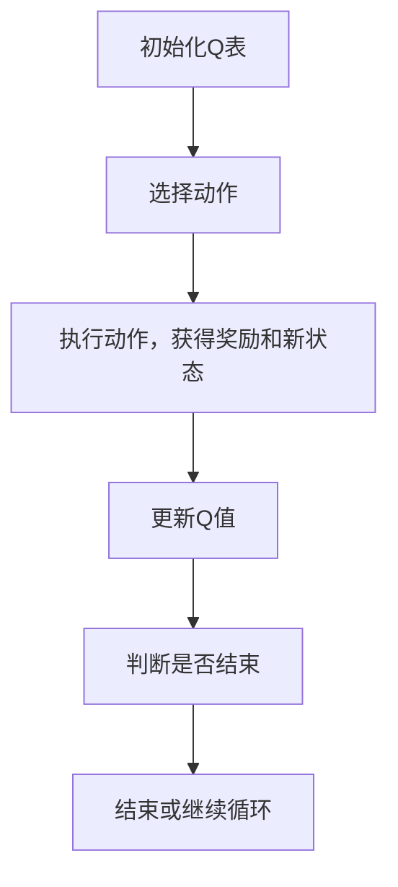
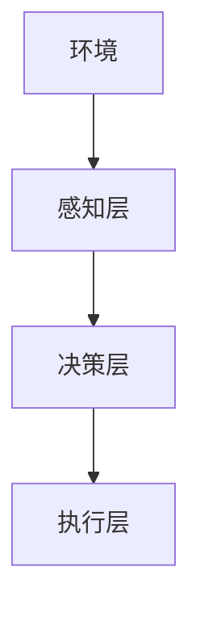
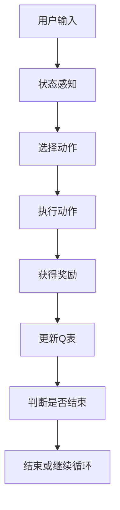

                 


# AI Agent的强化学习机制实现

> 关键词：AI Agent，强化学习，Q-learning，价值函数，策略优化，系统架构，项目实战

> 摘要：本文详细探讨了AI Agent的强化学习机制实现，从基本概念到数学模型，从系统架构到项目实战，全面解析强化学习在AI Agent中的应用。文章通过逐步分析和推理，结合实际案例和代码实现，帮助读者深入理解强化学习的核心原理和实现方法。

---

# 第一部分: AI Agent的强化学习机制基础

# 第1章: AI Agent与强化学习概述

## 1.1 AI Agent的基本概念

### 1.1.1 AI Agent的定义与特点

AI Agent（人工智能代理）是指能够感知环境、做出决策并执行动作的智能体。它具有以下特点：

- **自主性**：AI Agent能够自主决策，无需外部干预。
- **反应性**：能够实时感知环境并做出响应。
- **目标导向**：通过目标驱动行为，优化决策以实现目标。
- **学习能力**：通过与环境的交互不断优化自身的决策策略。

### 1.1.2 强化学习的基本概念

强化学习是一种机器学习范式，通过试错机制优化决策策略。其核心是通过与环境交互，学习最优策略以最大化累积奖励。以下是强化学习的关键概念：

- **状态（State）**：环境在某一时刻的观测。
- **动作（Action）**：AI Agent在某一状态下选择的行为。
- **奖励（Reward）**：环境对AI Agent行为的反馈，表示行为的好坏程度。
- **策略（Policy）**：AI Agent在状态下的动作选择概率分布。
- **价值函数（Value Function）**：衡量某一状态或状态-动作对的优劣程度。

### 1.1.3 AI Agent与强化学习的关系

AI Agent通过强化学习机制与环境交互，不断优化自身的决策策略。强化学习为AI Agent提供了从经验中学习的框架，使得AI Agent能够在动态环境中自适应地调整行为。

## 1.2 强化学习的核心机制

### 1.2.1 状态、动作、奖励的定义

- **状态（State）**：环境在某一时刻的观测。例如，在游戏中，状态可以表示当前的游戏板布局。
- **动作（Action）**：AI Agent在某一状态下选择的行为。例如，在游戏中，动作可以是“向上移动”或“向右移动”。
- **奖励（Reward）**：环境对AI Agent行为的反馈，表示行为的好坏程度。例如，在游戏中，奖励可以是“+1分”或“-1分”。

### 1.2.2 马尔可夫决策过程（MDP）

马尔可夫决策过程（Markov Decision Process, MDP）是强化学习的核心模型，描述了AI Agent与环境交互的动态过程。MDP由以下要素组成：

- **状态空间（State Space）**：所有可能的状态集合。
- **动作空间（Action Space）**：所有可能的动作集合。
- **状态转移概率（Transition Probability）**：从当前状态执行某个动作后转移到下一个状态的概率。
- **奖励函数（Reward Function）**：执行某个动作后获得的奖励。

### 1.2.3 策略与价值函数的定义

- **策略（Policy）**：AI Agent在状态下的动作选择概率分布。策略可以用函数 $\pi(a|s)$ 表示，表示在状态 $s$ 下选择动作 $a$ 的概率。
- **价值函数（Value Function）**：衡量某一状态或状态-动作对的优劣程度。价值函数可以分为状态价值函数 $V(s)$ 和动作价值函数 $Q(s,a)$。

## 1.3 强化学习的主要算法

### 1.3.1 Q-learning算法

Q-learning是一种经典的强化学习算法，适用于离散动作空间和有限状态空间的问题。其核心思想是通过更新Q表（Q-table）来学习最优策略。

### 1.3.2 深度强化学习（DRL）

深度强化学习（Deep Reinforcement Learning, DRL）将深度学习与强化学习结合，适用于高维状态空间和复杂动作空间的问题。其核心是使用深度神经网络近似价值函数或策略函数。

### 1.3.3 其他常见强化学习算法

- **策略梯度法（Policy Gradient Method）**：通过优化策略函数的参数来直接优化策略。
- **Actor-Critic算法**：同时学习策略（Actor）和价值函数（Critic），通过策略梯度和价值梯度共同优化。

## 1.4 本章小结

本章介绍了AI Agent的基本概念和强化学习的核心机制，包括状态、动作、奖励、策略和价值函数等关键概念，并概述了常见的强化学习算法。

---

# 第2章: 强化学习的数学模型与算法原理

## 2.1 状态空间与动作空间

### 2.1.1 状态空间的定义

状态空间是所有可能状态的集合。例如，在迷宫导航问题中，状态可以是迷宫中的每个格子位置。

### 2.1.2 动作空间的定义

动作空间是所有可能动作的集合。例如，在迷宫导航问题中，动作可以是“左移”、“右移”、“上移”、“下移”。

### 2.1.3 状态转移概率

状态转移概率描述了从当前状态执行某个动作后转移到下一个状态的概率。可以用概率矩阵或概率分布来表示。

## 2.2 价值函数与策略优化

### 2.2.1 价值函数的数学表达

- **状态价值函数（State Value Function）**：$V(s) = \max_a Q(s,a)$
- **动作价值函数（Action Value Function）**：$Q(s,a) = r + \gamma V(s')$

其中，$\gamma$ 是折扣因子，表示未来奖励的当前价值。

### 2.2.2 策略函数的数学表达

- **策略函数**：$\pi(a|s) = \text{argmax}_a Q(s,a)$

## 2.3 Q-learning算法的数学推导

### 2.3.1 Q值更新公式

Q值的更新公式如下：

$$ Q(s,a) = Q(s,a) + \alpha [r + \gamma \max_{a'} Q(s',a') - Q(s,a)] $$

其中，$\alpha$ 是学习率，$\gamma$ 是折扣因子。

### 2.3.2 算法流程图



## 2.4 本章小结

本章详细推导了强化学习的核心算法Q-learning的数学模型，并通过流程图展示了其算法流程。

---

# 第3章: AI Agent的系统分析与架构设计

## 3.1 系统功能设计

### 3.1.1 状态感知模块

状态感知模块负责感知环境的状态信息，例如传感器输入或环境反馈。

### 3.1.2 动作选择模块

动作选择模块根据当前状态选择最优动作，并输出执行指令。

### 3.1.3 奖励机制模块

奖励机制模块根据动作执行的结果生成奖励信号，用于更新Q表或优化策略。

## 3.2 系统架构设计

### 3.2.1 分层架构设计



## 3.3 系统接口设计

### 3.3.1 状态输入接口

- 输入：当前状态 $s$
- 输出：无

### 3.3.2 动作输出接口

- 输入：无
- 输出：选择的动作 $a$

### 3.3.3 奖励反馈接口

- 输入：无
- 输出：奖励信号 $r$

## 3.4 系统交互流程图



## 3.5 本章小结

本章从系统功能设计到架构设计，详细分析了AI Agent的系统构成和交互流程。

---

# 第4章: 项目实战——基于Q-learning的AI Agent实现

## 4.1 环境配置

### 4.1.1 安装必要的库

- Python 3.x
- NumPy
- Matplotlib
- OpenAI Gym

### 4.1.2 环境配置代码

```python
import gym
env = gym.make('CartPole-v0')
env.seed(42)
```

## 4.2 系统核心实现

### 4.2.1 Q表初始化

```python
import numpy as np

class QLearningAgent:
    def __init__(self, state_space_size, action_space_size, learning_rate=0.1, gamma=0.99):
        self.Q = np.zeros((state_space_size, action_space_size))
        self.alpha = learning_rate
        self.gamma = gamma
```

### 4.2.2 动作选择

```python
def choose_action(self, state):
    return np.argmax(self.Q[state])
```

### 4.2.3 Q值更新

```python
def update_Q(self, current_state, action, reward, next_state):
    self.Q[current_state, action] += self.alpha * (reward + self.gamma * np.max(self.Q[next_state]) - self.Q[current_state, action])
```

## 4.3 代码实现与分析

### 4.3.1 完整代码示例

```python
import gym
import numpy as np

class QLearningAgent:
    def __init__(self, state_space_size, action_space_size, learning_rate=0.1, gamma=0.99):
        self.Q = np.zeros((state_space_size, action_space_size))
        self.alpha = learning_rate
        self.gamma = gamma

    def choose_action(self, state):
        return np.argmax(self.Q[state])

    def update_Q(self, current_state, action, reward, next_state):
        self.Q[current_state, action] += self.alpha * (reward + self.gamma * np.max(self.Q[next_state]) - self.Q[current_state, action])

def main():
    env = gym.make('CartPole-v0')
    env.seed(42)
    state_space_size = env.observation_space.shape[0]
    action_space_size = env.action_space.n
    agent = QLearningAgent(state_space_size, action_space_size)
    num_episodes = 1000
    total_rewards = []
    
    for episode in range(num_episodes):
        state = env.reset()
        total_reward = 0
        done = False
        
        while not done:
            action = agent.choose_action(state)
            next_state, reward, done, _ = env.step(action)
            agent.update_Q(state, action, reward, next_state)
            total_reward += reward
            state = next_state
        
        total_rewards.append(total_reward)
        print(f"Episode {episode}: Total Reward = {total_reward}")
    
    import matplotlib.pyplot as plt
    plt.plot(total_rewards)
    plt.xlabel('Episode')
    plt.ylabel('Total Reward')
    plt.show()

if __name__ == '__main__':
    main()
```

### 4.3.2 代码分析

- **QLearningAgent类**：实现Q-learning算法的核心逻辑，包括Q表的初始化、动作选择和Q值更新。
- **main函数**：定义环境、训练参数和训练循环，展示AI Agent在CartPole环境中的学习过程。

## 4.4 实际案例分析

通过训练过程中的奖励曲线，可以看到AI Agent逐步优化其策略，最终能够稳定地控制杆子保持直立。

## 4.5 本章小结

本章通过一个实际的Q-learning算法实现案例，展示了AI Agent在强化学习中的应用过程。

---

# 第5章: 最佳实践与小结

## 5.1 最佳实践

- **算法选择**：根据问题特点选择合适的强化学习算法。
- **超参数调整**：合理设置学习率、折扣因子等超参数。
- **环境设计**：设计合理的环境和奖励机制，引导AI Agent学习正确的策略。
- **经验复用**：通过经验回放等方法提高学习效率。

## 5.2 小结

本文详细探讨了AI Agent的强化学习机制实现，从基本概念到数学模型，从系统架构到项目实战，全面解析了强化学习的核心原理和实现方法。

---

# 作者：AI天才研究院/AI Genius Institute & 禅与计算机程序设计艺术 /Zen And The Art of Computer Programming

