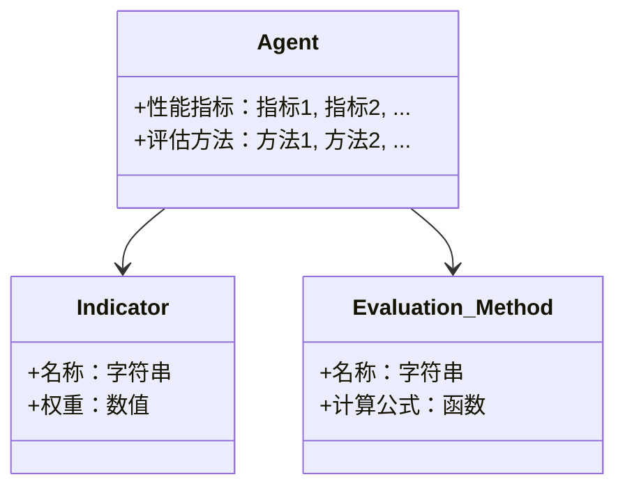
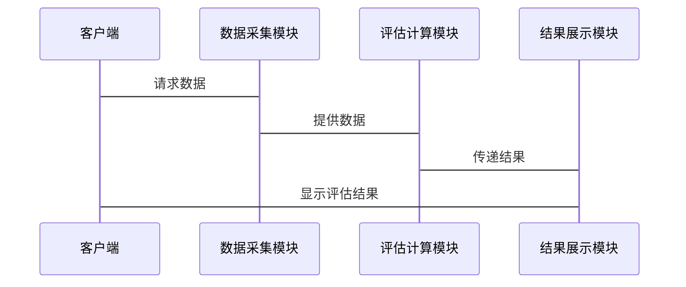

                 


# AI Agent的性能评估指标与方法

> 关键词：AI Agent, 性能评估, 指标方法, 系统分析, 数学模型

> 摘要：AI Agent在现代信息技术中的应用日益广泛，其性能评估成为确保其高效运作的关键。本文系统性地分析了AI Agent的性能评估指标与方法，涵盖从基础概念到高级算法的各个方面，旨在为技术专家和开发者提供深度解析。

---

# 第一部分: AI Agent的背景与概念

## 第1章: AI Agent的基本概念

### 1.1 AI Agent的定义与特征

#### 1.1.1 AI Agent的定义
AI Agent（智能体）是能够感知环境、自主决策并采取行动以实现目标的实体。其核心特征包括自主性、反应性、主动性、社交性和学习性。

#### 1.1.2 AI Agent的核心特征
- **自主性**：无需外部干预，自主决策。
- **反应性**：实时感知环境并做出反应。
- **主动性**：主动采取行动以实现目标。
- **社交性**：与其他系统或用户交互。
- **学习性**：通过经验改进性能。

#### 1.1.3 AI Agent的分类与应用场景
- **按智能层次**：反应式、基于模型、混合式。
- **应用场景**：推荐系统、自动驾驶、智能助手、机器人控制。

### 1.2 AI Agent性能评估的背景与重要性

#### 1.2.1 AI Agent在实际应用中的挑战
- 复杂环境下的决策难度。
- 多目标优化的平衡问题。
- 动态环境中的适应性。

#### 1.2.2 性能评估在AI Agent开发中的作用
- 确保AI Agent的有效性和可靠性。
- 为优化和改进提供数据支持。
- 为用户和开发者提供性能基准。

#### 1.2.3 评估指标与方法的现状与趋势
- 现状：从单一指标到综合评估的发展。
- 趋势：多模态评估、动态评估、个性化评估。

---

# 第二部分: AI Agent性能评估的核心概念与理论基础

## 第2章: 性能评估的基本定义与目标

### 2.1 性能评估的基本定义

#### 2.1.1 性能评估的定义
AI Agent的性能评估是对其在特定任务中表现的系统性测量和分析。

#### 2.1.2 性能评估的目标
- 度量AI Agent的执行效果。
- 识别性能瓶颈并提出改进建议。
- 为不同AI Agent提供可比较的基准。

### 2.2 核心概念与联系

#### 2.2.1 性能评估指标的分类
- **任务完成度**：准确率、完成时间。
- **效率**：资源利用率、处理速度。
- **鲁棒性**：抗干扰能力、适应性。
- **用户体验**：响应速度、易用性。
- **安全性**：漏洞检测、隐私保护。

#### 2.2.2 ER实体关系图架构
```mermaid
erDiagram
    agent.PERFORMANCE_ASSESSMENT +----- indicator.Indicator
    agent.PERFORMANCE_METRICS +----- method.Evaluation_Method
    indicator.Indicator +----- method.Evaluation_Method
```

#### 2.2.3 性能指标与评估方法的关联
- **指标驱动方法**：基于具体指标设计评估方法。
- **方法影响指标**：评估方法的选择影响指标的计算方式。

---

## 第3章: AI Agent性能评估的数学模型与算法原理

### 3.1 性能评估的数学模型

#### 3.1.1 基于指标的评估模型
公式：$$\text{综合得分} = \sum (\text{指标权重} \times \text{指标得分})$$
- 示例：计算准确率、召回率的加权平均。

#### 3.1.2 基于模型的评估模型
公式：$$\text{性能评分} = f(\text{输入数据}, \text{模型参数})$$
- 示例：回归模型预测误差分析。

#### 3.1.3 综合评估模型
公式：$$\text{综合性能} = g(\text{指标1}, \text{指标2}, ..., \text{指标n})$$
- 示例：结合准确率和效率的多因素评估。

### 3.2 算法原理讲解

#### 3.2.1 基于指标的评估算法
流程：
1. 收集相关指标数据。
2. 确定各指标的权重。
3. 计算综合得分。

#### 3.2.2 基于模型的评估算法
流程：
1. 定义评估函数。
2. 输入数据，计算模型输出。
3. 比较输出与预期，计算误差。

#### 3.2.3 综合评估算法
流程：
1. 收集多个指标数据。
2. 应用综合模型计算最终评分。

---

## 第4章: AI Agent性能评估的系统分析与架构设计

### 4.1 系统分析

#### 4.1.1 问题场景介绍
- 案例：AI客服系统的性能评估。

#### 4.1.2 系统功能设计
- 数据采集模块：收集任务完成度、响应时间等数据。
- 评估计算模块：应用数学模型计算性能指标。
- 结果展示模块：可视化评估结果。

#### 4.1.3 领域模型设计（Mermaid类图）


### 4.2 系统架构设计

#### 4.2.1 系统架构设计（Mermaid架构图）


#### 4.2.2 系统接口设计
- 数据接口：数据输入与输出接口。
- 计算接口：评估算法调用接口。
- 展示接口：结果可视化接口。

#### 4.2.3 系统交互设计（Mermaid序列图）


---

## 第5章: AI Agent性能评估的项目实战

### 5.1 项目环境与工具安装

#### 5.1.1 开发环境配置
- 操作系统：Linux或Windows。
- 开发工具：Python、Jupyter Notebook、IDE。

#### 5.1.2 依赖工具安装
- Python库：numpy、pandas、scikit-learn。
- 其他工具：Mermaid图表工具、版本控制系统。

### 5.2 核心代码实现

#### 5.2.1 评估指标计算代码
```python
def calculate_accuracy(actual, predicted):
    return sum(actual == predicted) / len(actual)

actual = [1, 2, 3, 4]
predicted = [1, 2, 4, 4]
accuracy = calculate_accuracy(actual, predicted)
print(accuracy)  # 输出：0.75
```

#### 5.2.2 综合评估算法实现
```python
def comprehensive_score(metrics, weights):
    return sum(metric * weight for metric, weight in zip(metrics, weights))

metrics = [0.8, 0.9, 0.7]
weights = [0.5, 0.3, 0.2]
score = comprehensive_score(metrics, weights)
print(score)  # 输出：0.79
```

#### 5.2.3 系统接口实现
```python
class AgentEvaluator:
    def __init__(self, data):
        self.data = data

    def assess_performance(self, metrics):
        scores = {}
        for metric in metrics:
            scores[metric] = self.calculate_score(metric)
        return scores

    def calculate_score(self, metric):
        # 根据具体指标计算得分
        pass

agent = AgentEvaluator(data)
scores = agent.assess_performance(metrics)
print(scores)
```

### 5.3 案例分析与详细解读

#### 5.3.1 实际案例分析
- 案例：评估一个AI客服系统的响应时间和准确率。
- 步骤：数据收集、指标计算、结果分析、优化建议。

---

# 第三部分: 总结与展望

## 第6章: 总结与展望

### 6.1 总结
- 本文系统性地介绍了AI Agent的性能评估指标与方法，涵盖从理论到实践的各个方面。
- 通过实际案例分析，展示了如何应用这些方法进行系统评估和优化。

### 6.2 未来展望
- **研究方向**：多模态评估、动态评估、自适应评估。
- **技术趋势**：结合AI新技术（如大语言模型）提升评估的全面性和准确性。

### 6.3 最佳实践 tips
- **数据质量**：确保数据的全面性和代表性。
- **指标选择**：根据具体场景选择合适的评估指标。
- **动态调整**：根据反馈持续优化评估方法和模型。

---

# 作者

作者：AI天才研究院 & 禅与计算机程序设计艺术

---

本文系统性地探讨了AI Agent的性能评估指标与方法，从基础概念到高级算法，再到实际项目应用，为技术专家和开发者提供了深度解析和实践指导。

