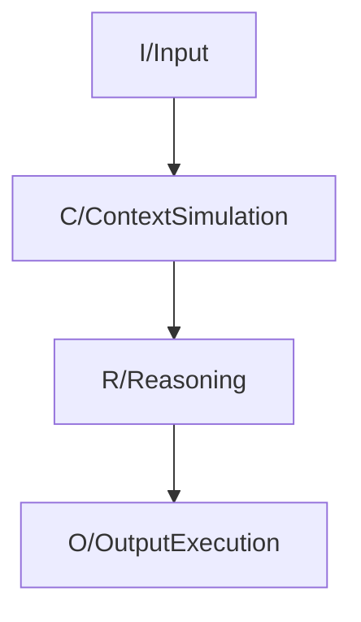
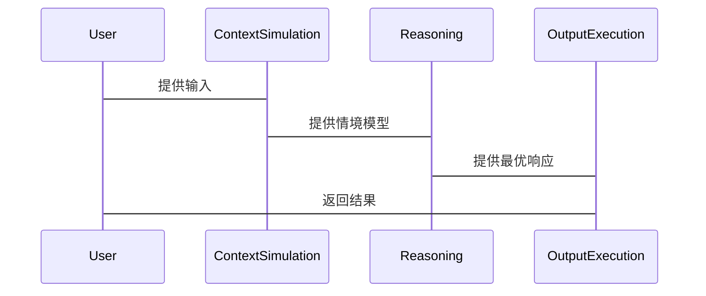

                 


```markdown
# AI Agent的情境模拟与推演能力

> 关键词：AI Agent, 情境模拟, 推演能力, 强化学习, 算法原理, 系统架构设计

> 摘要：AI Agent的情境模拟与推演能力是实现智能决策和自主行动的核心能力。本文将从AI Agent的基本概念入手，详细探讨情境模拟与推演能力的重要性，分析相关的算法原理，设计系统的架构，并通过实际项目展示如何实现这些能力。通过本文，读者将能够全面理解AI Agent在情境模拟与推演方面的技术细节和应用方法。

---

## 第1章: AI Agent的基本概念与背景

### 1.1 AI Agent的定义与分类

#### 1.1.1 AI Agent的定义
AI Agent（人工智能代理）是指能够感知环境、采取行动以实现目标的智能实体。它可以是一个软件程序，也可以是一个物理机器人，通过与环境交互来完成特定任务。

#### 1.1.2 AI Agent的主要分类
AI Agent可以根据智能水平、应用场景和功能特点进行分类：
- **按智能水平**：反应式AI Agent、认知式AI Agent。
- **按应用场景**：服务机器人、自动驾驶、推荐系统。
- **按功能特点**：简单反射型、基于模型的反射型、目标驱动型。

#### 1.1.3 AI Agent的核心特点
- **自主性**：能够在没有外部干预的情况下自主运行。
- **反应性**：能够实时感知环境并做出响应。
- **目标导向性**：基于目标驱动行为和决策。

### 1.2 情境模拟与推演能力的背景

#### 1.2.1 情境模拟的定义与作用
情境模拟是指通过构建数学模型和算法，模拟真实或虚拟环境中的各种情况。其作用在于帮助AI Agent更好地理解和预测环境的变化，从而做出更合理的决策。

#### 1.2.2 推演能力的定义与意义
推演能力是指AI Agent能够根据当前状态和环境信息，预测未来可能发生的情况，并推导出最优行动方案。这种能力使得AI Agent能够在复杂环境中进行决策和规划。

#### 1.2.3 情境模拟与推演能力的结合
将情境模拟与推演能力结合，可以使AI Agent不仅能够理解当前环境，还能预测和应对未来的变化，从而提高其智能水平和适应性。

### 1.3 本章小结
本章介绍了AI Agent的基本概念、分类及其核心特点，重点探讨了情境模拟与推演能力的背景和重要性，为后续章节的深入分析奠定了基础。

---

## 第2章: AI Agent的情境模拟与推演能力的核心概念

### 2.1 情境模拟的核心要素

#### 2.1.1 情境的构建与表示
情境的构建与表示需要考虑以下几个方面：
- **状态空间**：定义可能的状态，例如位置、速度等。
- **动作空间**：定义可能的行动，例如移动、停止等。
- **状态转移**：描述从一个状态到另一个状态的可能方式及其概率。

#### 2.1.2 情境的动态变化与更新
情境是动态变化的，AI Agent需要实时更新其对环境的理解。这可以通过传感器数据、历史记录等方式实现。

#### 2.1.3 情境的复杂性与层次性
复杂的情境可能包含多个层次，例如物理层、认知层等。AI Agent需要在不同层次上进行情境模拟和推演。

### 2.2 推演能力的关键特征

#### 2.2.1 推演的逻辑与规则
推演能力依赖于逻辑推理和规则的应用。例如，基于规则的系统通过预定义的规则进行推理，而基于学习的系统则通过训练得到的模型进行推理。

#### 2.2.2 推演的不确定性与概率模型
在真实世界中，许多情况具有不确定性，因此需要使用概率模型来描述和处理这些不确定性。例如，马尔可夫决策过程（MDP）是一种常用的概率模型。

#### 2.2.3 推演的优化与自适应能力
为了提高推演能力，AI Agent需要能够优化其推理过程，并根据新的信息进行自适应调整。

### 2.3 情境模拟与推演能力的系统架构

#### 2.3.1 系统输入与输出
- **输入**：环境数据、用户指令等。
- **输出**：决策结果、行动建议等。

#### 2.3.2 系统功能模块划分
- **情境感知模块**：负责感知和理解当前环境。
- **情境模拟模块**：构建和模拟环境模型。
- **推演模块**：基于模拟结果进行推理和决策。
- **行动执行模块**：根据推演结果执行相应的动作。

#### 2.3.3 系统的层次结构与交互流程
系统层次结构可以分为感知层、模拟层、推演层和执行层。各层之间通过明确的接口进行交互，确保系统的高效运行。

### 2.4 本章小结
本章详细探讨了情境模拟与推演能力的核心概念，包括情境的构建与表示、推演的逻辑与规则，以及系统的整体架构。这些内容为后续章节的算法实现奠定了理论基础。

---

## 第3章: AI Agent情境模拟与推演的核心算法原理

### 3.1 情境模拟的算法基础

#### 3.1.1 状态空间与动作空间的建模
- **状态空间**：所有可能的状态的集合。
- **动作空间**：所有可能的动作的集合。

#### 3.1.2 状态转移的概率模型
使用马尔可夫决策过程（MDP）描述状态转移：
- **状态s**：当前状态。
- **动作a**：采取的动作。
- **奖励r**：采取动作后的奖励。
- **下一个状态s'**：转移到的新状态。
$$ P(s' | s, a) $$

#### 3.1.3 状态评估与价值函数
价值函数V(s)表示从状态s开始能够获得的最大累计奖励。

### 3.2 推演算法的原理与实现

#### 3.2.1 基于规则的推演算法
- **规则定义**：预定义的规则，例如“如果条件满足，则执行动作”。
- **实现方式**：通过条件判断和动作执行来实现推演。

#### 3.2.2 基于逻辑推理的推演算法
- **逻辑推理**：基于谓词逻辑进行推理，例如一阶逻辑。
- **推理引擎**：使用推理引擎进行推理和决策。

#### 3.2.3 基于机器学习的推演算法
- **强化学习**：通过与环境交互学习最优策略。
- **深度学习**：使用神经网络进行复杂模式识别和推演。

### 3.3 算法的优化与改进

#### 3.3.1 算法的复杂度分析
- **时间复杂度**：算法运行所需的时间。
- **空间复杂度**：算法运行所需的空间。

#### 3.3.2 算法的加速与并行化
- **并行计算**：利用多核处理器或分布式计算加速算法。
- **优化策略**：例如剪枝策略减少不必要的计算。

#### 3.3.3 算法的鲁棒性与适应性
- **鲁棒性**：算法在面对噪声和不确定性时的稳定性。
- **自适应性**：算法根据环境变化动态调整的能力。

### 3.4 本章小结
本章详细讲解了AI Agent情境模拟与推演的核心算法，包括状态空间建模、概率模型、价值函数，以及基于规则、逻辑推理和机器学习的推演算法。同时，还讨论了算法的优化与改进策略。

---

## 第4章: AI Agent情境模拟与推演的数学模型与公式

### 4.1 情境模拟的数学模型

#### 4.1.1 状态空间的数学表示
状态空间可以用集合论表示：
$$ S = \{ s_1, s_2, \dots, s_n \} $$
其中，$s_i$ 表示一个状态。

#### 4.1.2 动作空间的数学表示
动作空间可以用集合论表示：
$$ A = \{ a_1, a_2, \dots, a_m \} $$
其中，$a_j$ 表示一个动作。

#### 4.1.3 状态转移的概率模型
状态转移可以用概率矩阵表示：
$$ P(s' | s, a) $$
其中，$P$ 表示状态转移的概率。

### 4.2 推演能力的数学模型

#### 4.2.1 价值函数的数学表示
价值函数可以表示为：
$$ V(s) = \max_a \sum_{s'} P(s' | s, a) V(s') $$

#### 4.2.2 Q值函数的数学表示
Q值函数可以表示为：
$$ Q(s, a) = \sum_{s'} P(s' | s, a) Q(s', a') $$

### 4.3 本章小结
本章通过数学模型和公式，详细描述了AI Agent情境模拟与推演的核心原理。这些数学模型为算法的实现提供了理论基础。

---

## 第5章: AI Agent情境模拟与推演能力的系统架构设计

### 5.1 问题场景介绍
假设我们正在开发一个智能助手，需要具备情境模拟与推演能力，以提供个性化的服务。

### 5.2 系统功能设计

#### 5.2.1 系统功能模块划分
- **输入处理模块**：接收用户输入。
- **情境模拟模块**：模拟用户可能的需求和环境变化。
- **推演模块**：基于模拟结果推演出最优的响应。
- **输出执行模块**：根据推演结果执行相应的动作。

#### 5.2.2 系统功能流程
1. **输入处理**：接收用户的查询或指令。
2. **情境模拟**：根据输入构建情境模型。
3. **推演推理**：基于情境模型进行推理，生成候选响应。
4. **选择最优响应**：根据预设的评价标准选择最优响应。
5. **输出执行**：将最优响应输出给用户或执行相关动作。

### 5.3 系统架构设计

#### 5.3.1 系统架构图


#### 5.3.2 接口设计
- **输入接口**：接收用户的输入数据。
- **输出接口**：将推演结果输出给用户或系统。

#### 5.3.3 交互流程


### 5.4 本章小结
本章通过系统架构设计，详细描述了AI Agent情境模拟与推演能力的实现框架。通过模块划分和交互流程的设计，确保系统的高效运行和良好的扩展性。

---

## 第6章: AI Agent情境模拟与推演能力的项目实战

### 6.1 环境配置

#### 6.1.1 开发工具安装
- **Python**：编程语言
- **TensorFlow**或**PyTorch**：深度学习框架
- **OpenAI Gym**：强化学习环境

#### 6.1.2 项目依赖安装
```bash
pip install numpy matplotlib gym
```

### 6.2 核心算法实现

#### 6.2.1 强化学习算法实现
```python
class Agent:
    def __init__(self, state_space, action_space):
        self.state_space = state_space
        self.action_space = action_space
        # 初始化价值函数
        self.value_function = np.zeros(state_space)

    def act(self, state):
        # 根据价值函数选择动作
        action = np.argmax(self.value_function[state])
        return action

    def update(self, state, reward):
        # 更新价值函数
        self.value_function[state] += reward
```

#### 6.2.2 状态转移模型实现
```python
def transition(state, action):
    # 返回下一个状态的概率分布
    return np.random.choice(next_states, p=probabilities)
```

### 6.3 系统测试与优化

#### 6.3.1 测试用例设计
- **测试输入**：不同的用户输入。
- **测试输出**：系统响应是否符合预期。

#### 6.3.2 性能优化
- **算法优化**：改进强化学习算法，提高训练效率。
- **并行计算**：利用多线程或分布式计算加速训练过程。

### 6.4 项目小结
本章通过一个具体的项目实战，展示了如何实现AI Agent的情境模拟与推演能力。通过环境配置、算法实现和系统测试，读者可以掌握实际开发中的关键步骤和技巧。

---

## 第7章: 总结与展望

### 7.1 总结
本文详细探讨了AI Agent的情境模拟与推演能力，从基本概念到算法实现，再到系统设计和项目实战，全面介绍了相关技术和方法。

### 7.2 展望
随着人工智能技术的不断发展，AI Agent的情境模拟与推演能力将更加智能化和多样化。未来的研究方向包括更复杂的模型、更高效的算法以及更广泛的应用场景。

---

## 作者：AI天才研究院/AI Genius Institute & 禅与计算机程序设计艺术 /Zen And The Art of Computer Programming

---

**本文通过系统的分析和详细的讲解，帮助读者全面理解AI Agent的情境模拟与推演能力。从理论到实践，从算法到系统设计，本文为读者提供了丰富的知识和实践指导，帮助他们在实际项目中应用这些技术。**
```

