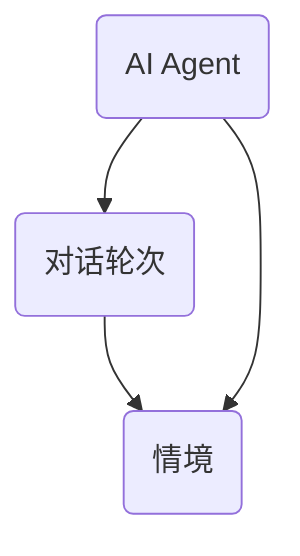
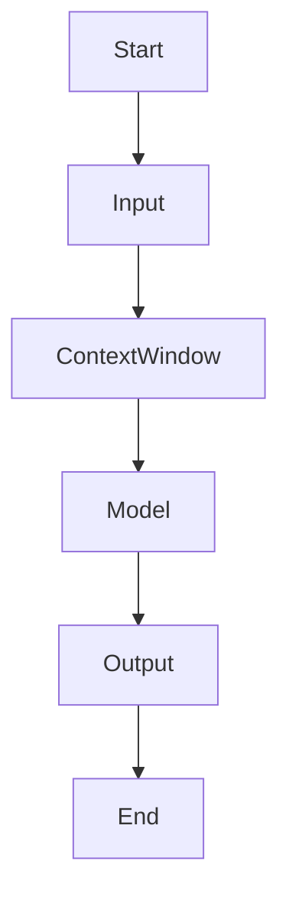
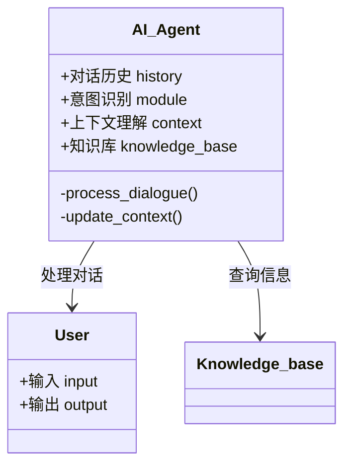
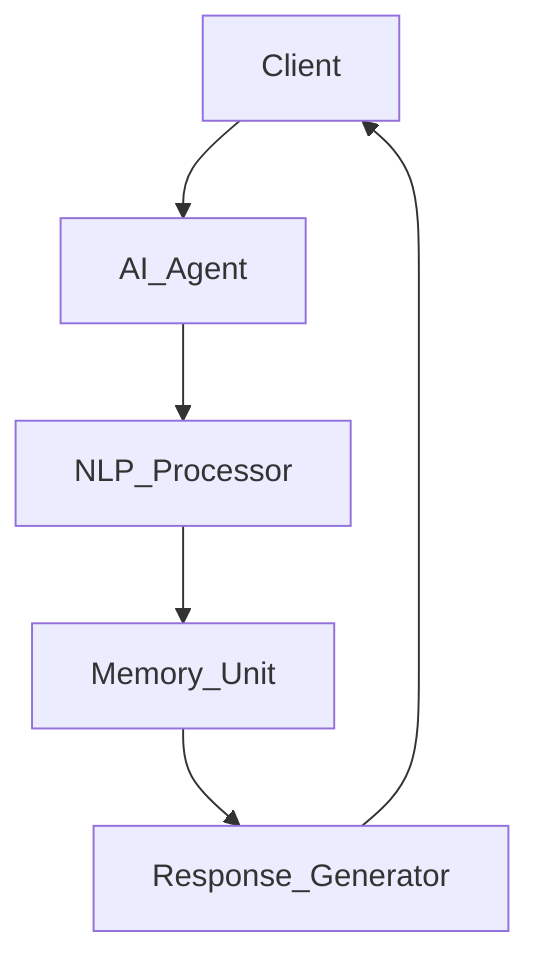
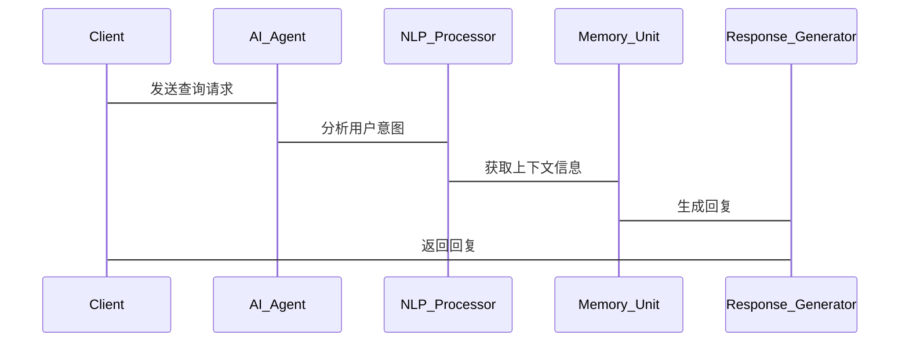

                 


# AI Agent的情境理解：超越单一对话轮次

## 关键词：AI Agent, 情境理解, 多轮对话, 机器学习, 自然语言处理

## 摘要：AI Agent在情境理解方面面临着超越单一对话轮次的挑战。本文将从背景介绍、核心概念、算法原理、系统架构设计、项目实战到最佳实践，详细阐述AI Agent如何实现多轮对话中的情境理解，结合具体案例和代码实现，帮助读者深入理解相关技术原理和应用场景。

---

## 正文

### 第1章：背景介绍

#### 1.1 问题背景

##### 1.1.1 AI Agent的基本概念
AI Agent（人工智能代理）是一种能够感知环境并采取行动以实现目标的智能体。它通过与用户交互，理解需求并提供解决方案。传统的AI Agent在单轮对话中表现出色，但在多轮对话中缺乏对上下文的深度理解，导致用户体验不连贯。

##### 1.1.2 情境理解的定义与重要性
情境理解是指AI Agent在对话过程中，不仅理解当前输入的内容，还能结合历史对话信息、用户意图和环境信息，构建一个完整的语境。这种理解能够使AI Agent在复杂对话中保持连贯性和准确性。

##### 1.1.3 当前AI Agent在情境理解中的局限性
当前的AI Agent多依赖于单轮对话处理，缺乏对上下文的长期记忆和关联能力。在处理多轮对话时，容易出现信息遗忘、意图识别错误等问题，影响用户体验。

#### 1.2 问题描述

##### 1.2.1 单一对话轮次的局限性
单轮对话处理方式使得AI Agent无法有效处理对话中的上下文信息，导致在复杂问题或需要多步骤推理的场景中表现不佳。

##### 1.2.2 多轮对话与情境理解的需求
在实际应用中，许多场景需要多轮对话支持，例如客服咨询、医疗问诊等。这些场景中，用户的问题往往需要通过多轮对话逐步明确，因此对情境理解的需求日益增加。

##### 1.2.3 情境理解在AI Agent中的应用领域
情境理解广泛应用于智能客服、智能音箱、自动驾驶等领域。通过情境理解，AI Agent能够更准确地识别用户意图，提供更个性化的服务。

#### 1.3 问题解决

##### 1.3.1 引入情境理解的必要性
为了提升AI Agent在多轮对话中的表现，必须引入情境理解技术，使其能够有效处理上下文信息。

##### 1.3.2 情境理解如何提升AI Agent的性能
通过情境理解，AI Agent能够保持对话的连贯性，准确识别用户意图，提供更精准的服务，从而提升用户体验。

##### 1.3.3 解决方案的初步框架
情境理解框架通常包括数据收集、上下文处理、意图识别、知识库构建等模块。这些模块共同作用，实现对对话情境的全面理解。

#### 1.4 边界与外延

##### 1.4.1 情境理解的边界
情境理解主要关注对话中的上下文信息，不涉及外部知识库的深度推理，也不处理实时环境变化带来的影响。

##### 1.4.2 相关概念的区分
与情境理解相关的概念包括意图识别、实体识别和情感分析。这些概念各有侧重，但共同构成了完整的对话理解体系。

##### 1.4.3 情境理解与其他技术的关系
情境理解依赖于自然语言处理（NLP）和机器学习（ML）技术。这些技术为情境理解提供了基础支持，但情境理解本身关注的是对话中的上下文信息处理。

#### 1.5 核心概念与核心要素

##### 1.5.1 核心概念的结构
情境理解涉及的核心概念包括：对话历史、用户意图、上下文信息和对话状态。

##### 1.5.2 核心要素的详细描述
- 对话历史：记录之前的对话内容，用于构建上下文信息。
- 用户意图：识别用户在当前对话中的主要目标。
- 上下文信息：对话中隐含的相关信息，帮助理解用户意图。
- 对话状态：当前对话的进展情况，包括已处理的请求和未完成的任务。

##### 1.5.3 概念之间的关系
通过ER实体关系图，可以清晰展示各概念之间的关系。例如，对话历史影响上下文信息，而上下文信息又影响用户意图的识别。

---

### 第2章：AI Agent与情境理解的核心概念

#### 2.1 核心概念原理

##### 2.1.1 AI Agent的基本原理
AI Agent通过感知环境、分析信息、制定策略并采取行动来实现目标。在情境理解中，AI Agent需要动态更新对话状态，以保持对当前语境的理解。

##### 2.1.2 情境理解的实现机制
情境理解通常采用基于记忆的模型，通过维护对话历史和上下文信息，来实现对当前对话情境的理解。

##### 2.1.3 两者结合的理论基础
情境理解与AI Agent的结合依赖于自然语言处理和机器学习技术，通过这些技术实现对话信息的深度分析。

#### 2.2 概念属性特征对比

##### 2.2.1 比较表格：AI Agent与传统对话系统的属性对比

| 属性           | AI Agent                          | 传统对话系统                     |
|----------------|-----------------------------------|---------------------------------|
| 对话轮次        | 支持多轮对话                     | 仅支持单轮对话                   |
| 上下文处理     | 具备上下文理解能力               | 无上下文理解能力                 |
| 用户意图识别    | 更准确，依赖上下文信息           | 较为简单，仅依赖当前输入         |
| 应用场景        | 复杂场景，如智能客服、医疗咨询   | 简单场景，如信息查询               |

##### 2.2.2 情境理解与单轮对话的特征差异
- 单轮对话：处理当前输入，不考虑历史信息。
- 多轮对话：结合历史信息，理解上下文，提升意图识别准确性。

#### 2.3 ER实体关系图

##### 2.3.1 使用Mermaid图展示AI Agent、情境、对话轮次之间的关系



---

### 第3章：情境理解的算法原理

#### 3.1 算法原理

##### 3.1.1 上下文窗口机制
上下文窗口机制通过维护一个固定长度的对话历史窗口，帮助模型关注最近的对话内容，从而理解上下文信息。

##### 3.1.2 注意力机制
注意力机制通过计算对话历史中每个位置的重要性，聚焦于关键信息，提升意图识别的准确性。

##### 3.1.3 记忆网络
记忆网络通过维护一个外部存储器，记录对话历史信息，帮助模型在处理多轮对话时保持对上下文的记忆。

#### 3.2 算法流程图

##### 3.2.1 使用Mermaid图展示上下文窗口机制的流程



#### 3.3 Python代码实现

##### 3.3.1 示例代码：基于上下文窗口机制的情境理解模型

```python
class ContextWindow:
    def __init__(self, window_size=5):
        self.window_size = window_size
        self.history = []

    def add_context(self, input_str):
        self.history.append(input_str)
        if len(self.history) > self.window_size:
            self.history.pop(0)

    def get_context(self):
        return self.history
```

##### 3.3.2 算法的数学模型和公式

上下文窗口机制的模型可以表示为：

$$
f(x_t) = \sum_{i=1}^{window\_size} w_i \cdot x_{t-i}
$$

其中，$x_t$表示当前输入，$w_i$表示历史输入的权重。

---

### 第4章：系统分析与架构设计方案

#### 4.1 问题场景介绍

##### 4.1.1 某AI客服系统的多轮对话需求
例如，用户咨询订单状态，可能需要多轮对话来获取订单信息、验证身份等。

#### 4.2 系统功能设计

##### 4.2.1 领域模型Mermaid类图



#### 4.3 系统架构设计

##### 4.3.1 使用Mermaid图展示系统的整体架构



#### 4.4 系统接口设计

##### 4.4.1 RESTful API接口定义

```http
POST /api/v1/dialogue
Content-Type: application/json

{
    "message": "查询订单状态",
    "context": { ... }
}
```

#### 4.5 系统交互流程

##### 4.5.1 使用Mermaid序列图展示系统交互



---

### 第5章：项目实战

#### 5.1 环境安装

##### 5.1.1 安装所需的库
```bash
pip install numpy
pip install scikit-learn
pip install spacy
```

#### 5.2 系统核心实现源代码

##### 5.2.1 对话历史维护代码

```python
class DialogueManager:
    def __init__(self):
        self.dialogue_history = []

    def add_message(self, message):
        self.dialogue_history.append(message)

    def get_context(self, n=5):
        return self.dialogue_history[-n:]
```

##### 5.2.2 意图识别代码

```python
from sklearn.feature_extraction.text import TfidfVectorizer
from sklearn.metrics.pairwise import cosine_similarity

class IntentRecognizer:
    def __init__(self):
        self.vectorizer = TfidfVectorizer()

    def recognize_intent(self, context, new_message):
        messages = context + [new_message]
        tfidf_matrix = self.vectorizer.fit_transform(messages)
        similarity = cosine_similarity(tfidf_matrix[-1], tfidf_matrix)
        return similarity.argmax()
```

#### 5.3 代码应用解读与分析

##### 5.3.1 对话历史维护
通过`DialogueManager`类，可以维护对话历史，并根据需要获取上下文信息。

##### 5.3.2 意图识别
使用TF-IDF和余弦相似度，基于对话历史中的上下文信息，识别当前消息的意图。

#### 5.4 实际案例分析和详细讲解剖析

##### 5.4.1 案例：智能客服系统
用户：我的订单号是多少？
AI Agent：请提供您的订单号。
用户：12345。
AI Agent：确认订单号为12345，请问您需要查询什么信息？

在上述对话中，AI Agent通过维护对话历史，理解上下文信息，准确识别用户意图，并提供相应的服务。

#### 5.5 项目小结

##### 5.5.1 实战总结
通过项目实战，我们实现了基于上下文窗口机制的对话历史维护和意图识别，能够有效提升AI Agent在多轮对话中的情境理解能力。

##### 5.5.2 实战经验
在实际项目中，需要根据具体场景调整上下文窗口的大小，优化意图识别算法，以提高系统的准确性和响应速度。

---

### 第6章：最佳实践

#### 6.1 tips

##### 6.1.1 技术实现上的注意事项
- 定期更新知识库，保持信息的准确性。
- 调整上下文窗口大小，以适应不同场景的需求。

##### 6.1.2 项目部署上的注意事项
- 确保系统的可扩展性，方便后续功能的添加。
- 优化系统性能，提高响应速度。

#### 6.2 小结

##### 6.2.1 核心观点回顾
情境理解是AI Agent实现多轮对话的关键技术，通过维护对话历史和上下文信息，能够显著提升意图识别的准确性。

##### 6.2.2 未来展望
随着技术的发展，情境理解将更加智能化，能够处理更复杂的对话场景，为用户提供更优质的服务。

#### 6.3 注意事项

##### 6.3.1 开发中的注意事项
- 在算法设计中，需考虑模型的泛化能力，避免过拟合。
- 在数据处理中，需注意数据的多样性和平衡性。

##### 6.3.2 使用中的注意事项
- 定期更新模型，保持系统的适应性。
- 在用户交互中，提供清晰的反馈，提升用户体验。

#### 6.4 拓展阅读

##### 6.4.1 推荐的书籍和文章
- 《深度学习》（Deep Learning）- Ian Goodfellow
- 《自然语言处理入门》（Natural Language Processing: An Introduction）- Jan Hajic

##### 6.4.2 推荐的学习资源
- 学术论文：阅读最新的研究成果，获取前沿技术动态。
- 开源项目：参与开源项目，学习实际应用经验。

---

## 结语

通过本文的详细阐述，我们了解了AI Agent在情境理解方面的实现方法，从理论到实践，全面掌握了如何在多轮对话中提升情境理解能力。未来，随着技术的进步，AI Agent将在更多领域发挥重要作用，为人类带来更智能化的服务体验。

---

## 作者

作者：AI天才研究院/AI Genius Institute & 禅与计算机程序设计艺术 /Zen And The Art of Computer Programming

