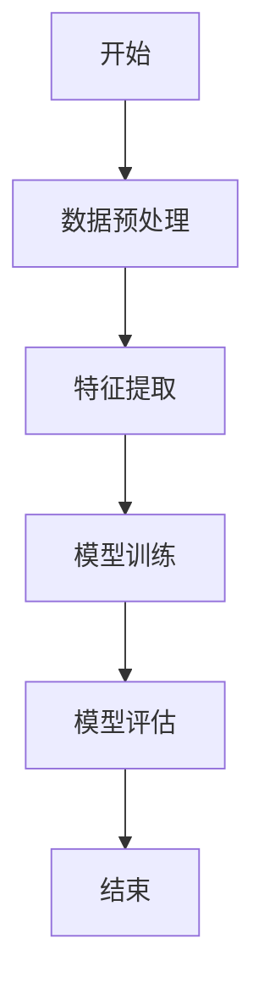
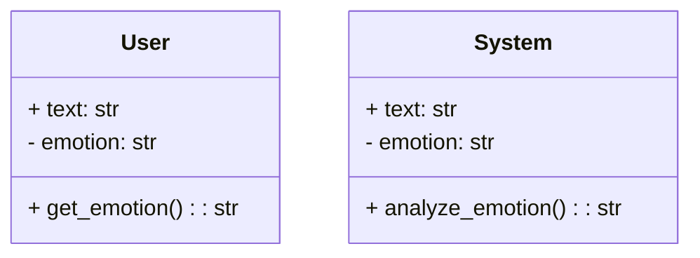
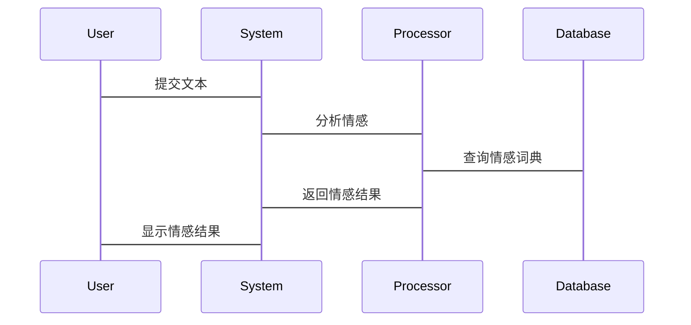

                 


# AI Agent的情感计算与应用

> 关键词：AI Agent, 情感计算, 情感模型, 人机交互, 情感分析, 情感计算算法

> 摘要：情感计算是人工智能领域的重要分支，AI Agent通过情感计算技术能够理解和模拟人类情感，从而实现更自然的人机交互。本文将从AI Agent与情感计算的基本概念出发，深入探讨情感计算的核心概念、算法原理、数学模型、系统架构设计以及实际项目应用，最后总结情感计算在AI Agent中的应用前景和未来挑战。

---

# 第一部分: AI Agent与情感计算的背景与基础

# 第1章: AI Agent与情感计算的概述

## 1.1 AI Agent的基本概念

### 1.1.1 AI Agent的定义与特点
AI Agent（人工智能代理）是一种智能体，能够感知环境、自主决策并执行任务。AI Agent的特点包括：
1. **自主性**：能够在没有外部干预的情况下独立运行。
2. **反应性**：能够实时感知环境并做出反应。
3. **目标导向**：通过设定目标来驱动行为。
4. **学习能力**：能够通过数据和经验不断优化自身的性能。

### 1.1.2 情感计算的基本概念
情感计算（Affective Computing）是研究计算机对人类情感的识别、理解和模拟的学科。情感计算的目标是使计算机能够像人类一样具备情感智能，能够理解和回应用户的情感状态。

### 1.1.3 情感计算与传统计算的区别
传统的计算主要基于逻辑和规则，而情感计算则引入了情感、情绪和心理状态等因素，使得计算机能够更贴近人类的思维方式。

## 1.2 情感计算的技术背景

### 1.2.1 情感计算的发展历程
情感计算的研究可以追溯到20世纪60年代，但真正的发展是在近年来，随着人工智能和机器学习技术的进步，情感计算逐渐成为研究热点。

### 1.2.2 当前情感计算的主要技术手段
当前，情感计算主要依赖于自然语言处理（NLP）、计算机视觉（CV）、语音识别和机器学习等技术。这些技术的结合使得情感计算在多个领域得到了广泛应用。

### 1.2.3 情感计算在AI Agent中的作用
情感计算为AI Agent提供了情感理解和情感表达的能力，使得AI Agent能够更好地与人类进行交互，提升用户体验。

## 1.3 情感计算的应用领域

### 1.3.1 情感计算在自然语言处理中的应用
情感计算可以用于情感分析、情感分类等任务，帮助计算机理解文本中的情感倾向。

### 1.3.2 情感计算在人机交互中的应用
通过情感计算，AI Agent可以更好地理解用户的情感状态，从而提供更个性化的服务。

### 1.3.3 情感计算在智能客服中的应用
情感计算可以帮助智能客服系统识别用户的情绪，从而提供更贴心的服务。

## 1.4 本章小结

### 1.4.1 核心概念回顾
- AI Agent的基本概念
- 情感计算的基本概念
- 情感计算与传统计算的区别

### 1.4.2 下一章的预览
下一章将深入探讨情感计算的核心概念与联系，包括情感模型的构建、情感特征的提取以及情感计算的数学模型。

---

# 第2章: 情感计算的核心概念与联系

## 2.1 情感计算的核心概念

### 2.1.1 情感模型的构建
情感模型是情感计算的基础，常见的模型包括基于规则的模型和基于机器学习的模型。

### 2.1.2 情感特征的提取
情感特征提取是情感计算的关键步骤，常用的特征包括文本特征、语音特征和视觉特征。

### 2.1.3 情感计算的数学模型
情感计算的数学模型包括概率模型、向量空间模型等。

## 2.2 情感计算的核心联系

### 2.2.1 情感计算与自然语言处理的关系
情感计算依赖于自然语言处理技术，而自然语言处理也从情感计算中受益。

### 2.2.2 情感计算与机器学习的关系
机器学习是情感计算的核心技术之一，情感计算推动了机器学习在情感分析领域的应用。

### 2.2.3 情感计算与AI Agent的关系
情感计算为AI Agent提供了情感智能，使得AI Agent能够更好地与人类交互。

## 2.3 情感计算的特征对比

### 2.3.1 情感特征的对比表格

| 特征类型 | 描述 | 示例 |
|----------|------|------|
| 文本特征 | 基于文本的情感特征，如情感词、句式结构 | "我非常高兴" |
| 语音特征 | 基于语音的情感特征，如音调、语速 | 高音调表示兴奋 |
| 视觉特征 | 基于图像的情感特征，如面部表情 | 微笑表示快乐 |

### 2.3.2 情感计算的ER实体关系图

```mermaid
erDiagram
    actor User
    actor System
    actor Emotion
    actor Interaction
    actor Feedback
    User <----> System
    System <----> Emotion
    System <----> Interaction
    System <----> Feedback
```

## 2.4 本章小结

### 2.4.1 核心概念回顾
- 情感模型的构建
- 情感特征的提取
- 情感计算的数学模型

### 2.4.2 下一章的预览
下一章将详细探讨情感计算的算法原理，包括各种情感计算算法的实现步骤和流程图。

---

# 第3章: 情感计算的算法原理

## 3.1 情感计算的关键算法

### 3.1.1 基于规则的情感计算算法
基于规则的情感计算算法通过预定义的情感规则来判断情感倾向。例如，如果文本中包含“高兴”这个词，则判定情感为积极。

### 3.1.2 基于机器学习的情感计算算法
基于机器学习的情感计算算法利用训练数据，学习情感分类模型。常用的算法包括支持向量机（SVM）和随机森林（Random Forest）。

### 3.1.3 基于深度学习的情感计算算法
基于深度学习的情感计算算法利用神经网络模型（如LSTM和Transformer）进行情感分析，能够捕捉到更复杂的情感特征。

## 3.2 情感计算算法的实现步骤

### 3.2.1 数据预处理
- 文本清洗：去除停用词、标点符号等。
- 分词：将文本分割成词语或短语。

### 3.2.2 特征提取
- 词袋模型：提取文本中的词语特征。
- TF-IDF：计算词语的重要性。

### 3.2.3 模型训练
- 划分训练集和测试集。
- 使用训练数据训练情感分类模型。

### 3.2.4 模型评估
- 使用测试数据评估模型的准确率、召回率和F1值。

## 3.3 情感计算算法的流程图



## 3.4 情感计算算法的Python代码实现

```python
from sklearn.feature_extraction.text import TfidfVectorizer
from sklearn.svm import SVC
from sklearn.metrics import accuracy_score

# 数据预处理
texts = ["我非常高兴", "我很难过"]
labels = [1, 0]

# 特征提取
vectorizer = TfidfVectorizer()
X = vectorizer.fit_transform(texts)

# 模型训练
model = SVC()
model.fit(X, labels)

# 模型评估
predicted = model.predict(X)
accuracy = accuracy_score(labels, predicted)
print("准确率：", accuracy)
```

## 3.5 本章小结

### 3.5.1 核心内容回顾
- 情感计算的关键算法
- 算法的实现步骤
- 算法的流程图和代码实现

### 3.5.2 下一章的预览
下一章将介绍情感计算的数学模型与公式，包括概率模型、向量空间模型等。

---

# 第4章: 情感计算的数学模型与公式

## 4.1 情感计算的数学模型

### 4.1.1 情感概率模型
情感概率模型基于概率论，计算文本属于某种情感类别的概率。例如，使用贝叶斯定理进行情感分类。

### 4.1.2 情感向量空间模型
情感向量空间模型将文本表示为向量，通过向量的相似度来判断情感倾向。例如，使用TF-IDF或词嵌入技术。

### 4.1.3 情感计算的贝叶斯模型
贝叶斯模型是一种常用的概率模型，适用于情感分类任务。

## 4.2 情感计算的数学公式

### 4.2.1 情感概率公式
$$ P(y|x) = \frac{P(x|y)P(y)}{P(x)} $$

### 4.2.2 情感向量
$$ v_i = \sum_{j=1}^{n} w_{ij} \cdot v_j $$

## 4.3 情感计算模型的优缺点对比

| 模型类型 | 优点 | 缺点 |
|---------|------|------|
| 概率模型 | 解释性强 | 对数据分布假设严格 |
| 向量空间模型 | 计算效率高 | 无法捕捉语义信息 |
| 贝叶斯模型 | 简单易实现 | 对特征独立性假设严格 |

## 4.4 本章小结

### 4.4.1 核心内容回顾
- 情感计算的数学模型
- 情感计算的数学公式
- 模型的优缺点对比

### 4.4.2 下一章的预览
下一章将探讨情感计算的系统分析与架构设计，包括系统功能设计、架构设计等内容。

---

# 第5章: 情感计算的系统分析与架构设计

## 5.1 系统分析

### 5.1.1 问题场景分析
- 用户输入一段文本，系统需要判断文本的情感倾向。

### 5.1.2 项目介绍
本项目旨在构建一个基于AI Agent的情感计算系统，能够实现情感分析和情感分类功能。

## 5.2 系统功能设计

### 5.2.1 领域模型


### 5.2.2 系统架构设计


## 5.3 系统接口设计

### 5.3.1 接口描述
- 输入接口：文本字符串
- 输出接口：情感分类结果

### 5.3.2 接口交互流程
1. 用户通过输入接口发送文本。
2. 系统通过处理器进行情感分析。
3. 系统通过输出接口返回情感分类结果。

## 5.4 系统交互设计

### 5.4.1 交互流程图


## 5.5 本章小结

### 5.5.1 核心内容回顾
- 系统分析
- 系统功能设计
- 系统架构设计
- 系统接口设计
- 系统交互设计

### 5.5.2 下一章的预览
下一章将通过项目实战，展示情感计算系统在实际中的应用。

---

# 第6章: 情感计算的项目实战

## 6.1 环境安装

### 6.1.1 安装Python
```bash
python --version
pip install --upgrade pip
```

### 6.1.2 安装依赖库
```bash
pip install numpy scikit-learn
```

## 6.2 系统核心实现源代码

### 6.2.1 数据预处理代码
```python
import pandas as pd
from sklearn.model_selection import train_test_split
from sklearn.feature_extraction.text import TfidfVectorizer
from sklearn.svm import SVC
from sklearn.metrics import accuracy_score

# 加载数据
data = pd.DataFrame({
    'text': ["我非常高兴", "我很难过"],
    'label': [1, 0]
})

# 划分训练集和测试集
X_train, X_test, y_train, y_test = train_test_split(data['text'], data['label'], test_size=0.2)
```

### 6.2.2 特征提取与模型训练代码
```python
vectorizer = TfidfVectorizer()
X_train_vec = vectorizer.fit_transform(X_train)
X_test_vec = vectorizer.transform(X_test)

model = SVC()
model.fit(X_train_vec, y_train)
```

### 6.2.3 模型评估代码
```python
predicted = model.predict(X_test_vec)
print("准确率：", accuracy_score(y_test, predicted))
```

## 6.3 代码应用解读与分析

### 6.3.1 代码实现步骤
1. 数据预处理：加载数据并划分训练集和测试集。
2. 特征提取：使用TF-IDF进行特征提取。
3. 模型训练：使用SVM算法训练情感分类模型。
4. 模型评估：计算模型的准确率。

## 6.4 实际案例分析

### 6.4.1 案例描述
用户输入文本“我非常高兴”，系统预测情感为积极。

### 6.4.2 案例分析
1. 数据预处理：文本分割和清洗。
2. 特征提取：提取文本中的关键词。
3. 模型训练：训练情感分类模型。
4. 模型预测：预测文本的情感倾向。

## 6.5 本章小结

### 6.5.1 核心内容回顾
- 环境安装
- 系统核心实现源代码
- 代码应用解读与分析
- 实际案例分析

### 6.5.2 下一章的预览
下一章将总结情感计算在AI Agent中的应用，并展望未来的发展趋势。

---

# 第7章: 情感计算的总结与展望

## 7.1 全文总结

### 7.1.1 核心内容回顾
- AI Agent的基本概念
- 情感计算的核心概念
- 情感计算的算法原理
- 情感计算的数学模型
- 情感计算的系统架构设计
- 情感计算的项目实战

## 7.2 未来趋势与挑战

### 7.2.1 情感计算的未来趋势
- 情感计算将更加智能化和个性化。
- 情感计算将与多模态数据结合，提升情感识别的准确性。

### 7.2.2 情感计算的挑战
- 如何处理复杂的情感表达。
- 如何提高情感计算的实时性和准确性。

## 7.3 最佳实践 tips

### 7.3.1 情感计算的实践建议
1. 数据预处理是情感计算的关键步骤。
2. 选择合适的算法和模型。
3. 不断优化模型的性能。

## 7.4 本章小结

### 7.4.1 核心内容回顾
- 情感计算的总结
- 情感计算的未来趋势与挑战
- 情感计算的实践建议

### 7.4.2 结语
情感计算是人工智能领域的重要方向，随着技术的进步，情感计算将在更多领域得到广泛应用。

---

# 作者：AI天才研究院/AI Genius Institute & 禅与计算机程序设计艺术 /Zen And The Art of Computer Programming

---

这篇文章详细介绍了AI Agent的情感计算与应用，涵盖了情感计算的核心概念、算法原理、数学模型、系统架构设计以及实际项目应用。通过理论与实践相结合的方式，帮助读者全面理解情感计算的技术与应用。

