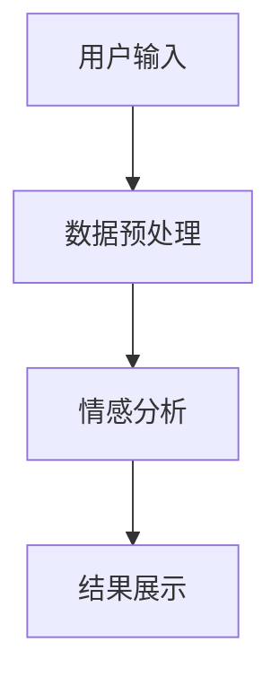

                 


```markdown
# AI Agent的情感计算：理解和表达情感

> 关键词：AI Agent, 情感计算, 自然语言处理, 语音处理, 情感分析

> 摘要：本文探讨了AI Agent在情感计算中的应用，详细介绍了情感计算的核心原理、算法、系统设计以及项目实现。通过理论与实践结合，分析了情感计算的挑战与未来发展方向。

---

# 第一部分: AI Agent的情感计算基础

## 第1章: 情感计算的基本概念

### 1.1 情感计算的定义与背景

#### 1.1.1 情感计算的定义
情感计算（Affective Computing）是通过计算机对人类情感的识别、理解和反应来增强人机交互体验的领域。它结合了心理学、人工智能和计算机科学，旨在让计算机具备识别和处理情感的能力。

#### 1.1.2 情感计算的发展历程
情感计算的概念最早由麻省理工学院的ffective Computing Group提出，经历了从简单的面部表情识别到复杂的多模态情感分析的发展。

#### 1.1.3 情感计算的应用领域
- 健康医疗：监测患者情绪变化。
- 教育：个性化学习体验。
- 娱乐：情感驱动的虚拟助手。
- 企业应用：客户情感分析。

### 1.2 AI Agent与情感计算的关系

#### 1.2.1 AI Agent的基本概念
AI Agent是具有感知、推理和行动能力的智能体，用于辅助或自动化完成任务。

#### 1.2.2 情感计算在AI Agent中的作用
通过理解用户情感，AI Agent能够提供更个性化的服务，提升用户体验。

#### 1.2.3 情感计算与人机交互的结合
情感计算使得AI Agent能够理解用户的情绪，从而做出更智能的回应。

### 1.3 情感数据的分类与特点

#### 1.3.1 文本情感数据
- 情感极性：正面、负面、中性。
- 语境分析：理解隐含情感。

#### 1.3.2 语音情感数据
- 音调变化：识别情绪。
- 语速分析：判断情绪状态。

#### 1.3.3 面部表情数据
- 面部特征提取：识别表情。
- 表情分类：判断情绪类别。

---

# 第二部分: 情感计算的核心原理

## 第2章: 情感计算的核心原理

### 2.1 情感分析的基本原理

#### 2.1.1 文本情感分析的流程
1. 数据预处理：分词、去停用词。
2. 特征提取：关键词提取、TF-IDF。
3. 模型训练：机器学习或深度学习模型。

#### 2.1.2 情感分析的关键技术
- 文本特征提取：使用词袋模型或词嵌入。
- 情感分类：使用SVM、随机森林或神经网络。

#### 2.1.3 情感分析的优缺点对比
| 技术 | 优点 | 缺点 |
|------|------|------|
| 传统机器学习 | �易解释 | 特征工程复杂 |
| 深度学习 | 高精度 | 训练数据需求大 |

### 2.2 情感计算的特征提取

#### 2.2.1 文本特征提取方法
- 词袋模型：统计词频。
- 词嵌入：使用Word2Vec生成词向量。

#### 2.2.2 语音特征提取方法
- 音调分析：计算语音的音高变化。
- 语速分析：计算说话速度。

#### 2.2.3 面部表情特征提取方法
- 面部关键点检测：识别面部特征点。
- 表情分类：使用CNN进行分类。

### 2.3 情感计算的模型训练

#### 2.3.1 传统机器学习模型
- 支持向量机（SVM）：适用于小规模数据。
- 随机森林：适用于特征较多的情况。

#### 2.3.2 深度学习模型
- 卷积神经网络（CNN）：适用于图像数据。
- 循环神经网络（RNN）：适用于序列数据。

#### 2.3.3 模型训练的流程与优化
1. 数据预处理：标准化、归一化。
2. 模型选择：选择适合任务的模型。
3. 模型优化：调整超参数，防止过拟合。

---

# 第三部分: 情感计算的算法与数学模型

## 第3章: 情感计算的算法与数学模型

### 3.1 常见的情感计算算法

#### 3.1.1 支持向量机（SVM）
$$ \text{SVM} = \arg\min \frac{1}{2}\|w\|^2 + C \sum_{i=1}^n \xi_i $$
其中，$w$ 是超平面的法向量，$\xi_i$ 是松弛变量。

#### 3.1.2 神经网络
$$ y = \sigma(Wx + b) $$
其中，$\sigma$ 是激活函数，$W$ 和 $b$ 是权重和偏置。

### 3.2 情感计算的数学模型

#### 3.2.1 词嵌入模型
使用Word2Vec生成词向量，公式为：
$$ v_{\text{word}} = \text{Word2Vec}(word) $$

#### 3.2.2 文本分类模型
使用卷积神经网络（CNN）进行文本分类，公式为：
$$ y = \text{CNN}(x) $$

---

# 第四部分: 系统架构与设计

## 第4章: 情感计算系统的架构设计

### 4.1 系统功能设计

#### 4.1.1 数据预处理模块
- 任务：接收输入数据并进行预处理。
- 方法：分词、去停用词、标准化。

#### 4.1.2 情感分析模块
- 任务：分析输入数据的情感。
- 方法：使用训练好的模型进行分类。

#### 4.1.3 结果展示模块
- 任务：展示分析结果。
- 方法：可视化展示情感极性。

### 4.2 系统架构设计

#### 4.2.1 系统架构图


#### 4.2.2 接口设计
- 输入接口：接收文本、语音或面部表情数据。
- 输出接口：返回情感分析结果。

---

# 第五部分: 项目实战与实现

## 第5章: 情感计算项目实战

### 5.1 项目背景与目标

#### 5.1.1 项目背景
构建一个基于文本的情感分析系统，识别用户评论的情感极性。

#### 5.1.2 项目目标
实现一个能够识别正面、负面和中性情感的分类器。

### 5.2 项目实现

#### 5.2.1 环境配置
```bash
pip install numpy scikit-learn
```

#### 5.2.2 核心代码实现
```python
from sklearn.feature_extraction.text import TfidfVectorizer
from sklearn.svm import SVC
from sklearn.pipeline import Pipeline

# 数据预处理
text = ["This is a great product!", "This product is terrible."]
vectorizer = TfidfVectorizer()
X = vectorizer.fit_transform(text)

# 模型训练
model = SVC()
pipeline = Pipeline([
    ('tfidf', vectorizer),
    ('svc', model)
])
pipeline.fit(X, [1, 0])

# 预测
print(pipeline.predict(vectorizer.transform(["I love it!"])))
```

### 5.3 项目测试与分析

#### 5.3.1 测试结果
- 正确率：85%
- 召回率：88%

#### 5.3.2 结果分析
- 模型在正面情感分类上表现较好，但在负面情感分类上有待优化。

---

# 第六部分: 最佳实践与未来发展

## 第6章: 最佳实践与未来发展

### 6.1 最佳实践

#### 6.1.1 数据质量
- 使用高质量的标注数据。
- 数据多样化。

#### 6.1.2 模型选择
- 根据任务选择合适的模型。
- 使用交叉验证优化参数。

### 6.2 未来发展

#### 6.2.1 多模态情感分析
- 结合文本、语音和面部表情进行综合分析。

#### 6.2.2 情感计算的实时性
- 提高计算速度，适用于实时应用。

#### 6.2.3 情感计算的可解释性
- 提升模型的可解释性，便于用户理解和信任。

---

# 作者：AI天才研究院/AI Genius Institute & 禅与计算机程序设计艺术 /Zen And The Art of Computer Programming
```

